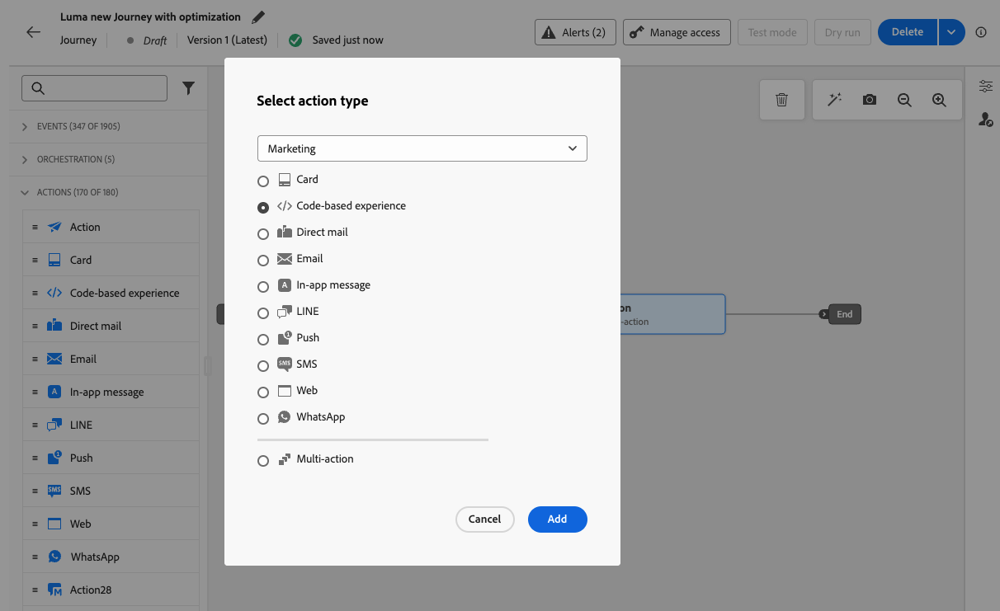
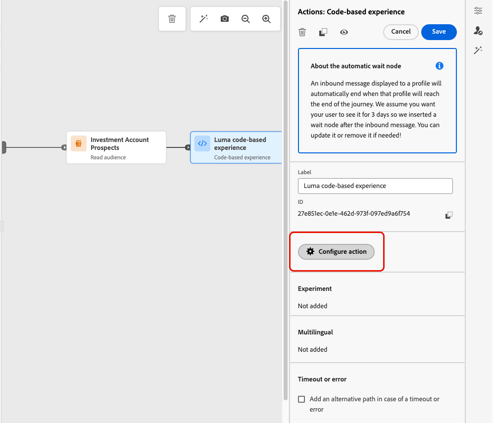
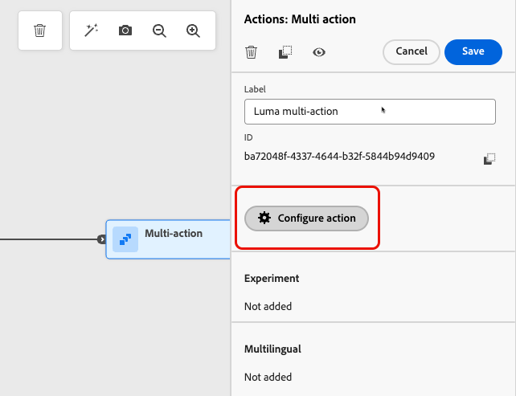
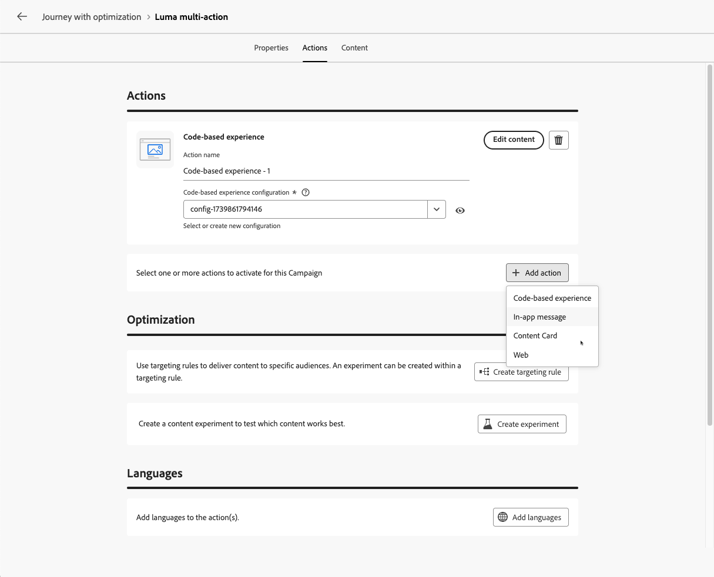

# Uso de la actividad Acción {#add-a-message-in-a-journey}

>[!CONTEXTUALHELP]
>id="ajo_action_activity"
>title="Actividad de acción"
>abstract="La actividad **Acción** le permite configurar una sola acción de canal nativo y varias actividades entrantes con la capacidad de agregar optimización a cualquier acción de canal integrada."

[!DNL Journey Optimizer] viene con una nueva actividad **Action** genérica que permite configurar una sola acción de canal integrada y también varias actividades entrantes.

La actividad Action ofrece:

* Una configuración de acción nativa simplificada dentro del lienzo de recorrido.
* La capacidad para crear grupos de acciones entrantes de varias acciones.
* Capacidad de añadir optimización a cualquier acción de canal integrada.

Para agregar una acción de canal integrada al recorrido, usa la actividad **Action**. Esta actividad unificada consolida todas las acciones de canal (correo electrónico, push, SMS, en la aplicación, web, experiencia basada en código y tarjeta de contenido) en un solo tipo de actividad, sustituyendo a las actividades de canal individuales anteriores.

>[!IMPORTANT]
>
>Dado que ahora se puede acceder a todos los canales nativos a través de la actividad de acción, las actividades de canal nativo heredadas quedarán obsoletas con la versión de marzo. Los recorridos existentes que incluyen acciones heredadas seguirán funcionando tal cual; no se requiere ninguna migración.

También puede configurar acciones personalizadas para enviar los mensajes en [!DNL Journey Optimizer]. [Más información](#recommendation)

## Añadir una acción de canal integrada a un recorrido  {#add-action}

Para agregar una acción de canal integrada al recorrido mediante la actividad **[!UICONTROL Action]**, siga los pasos a continuación.

Para obtener más información sobre los canales disponibles en recorrido, consulte la tabla de esta sección: [Canales en recorridos y campañas](../channels/gs-channels.md#channels).

1. Inicie el recorrido con una actividad [Event](general-events.md) o [Read Audience](read-audience.md).

1. En la sección **[!UICONTROL Acciones]** de la paleta, arrastre y suelte una actividad **[!UICONTROL Acción]** en el lienzo.

1. Seleccione la actividad de canal integrada que desee aprovechar en el recorrido.

   

1. Agregue una etiqueta a su acción y seleccione **[!UICONTROL Configurar acción]**.

   {width="80%"}

1. Se le dirigirá a la ficha **[!UICONTROL Acciones]** de la pantalla de configuración de acciones de recorrido.

   Seleccione la configuración que desea utilizar para el canal seleccionado.

   

1. Si ha seleccionado un canal entrante, puede añadir varias acciones. [Más información](#multi-action)

1. Configure la actividad según el canal seleccionado. Encontrará instrucciones de configuración detalladas en los vínculos siguientes.

   * Conozca los pasos detallados para crear su acción saliente de la siguiente manera:

     <table style="table-layout:fixed">
      <tr style="border: 0;">
      <td>
      
      
<a href="../email/create-email.md"><strong>Creación de correos electrónicos</strong>
      

      

      </td>
      <td>
      
      

      <a href="../push/create-push.md"><strong>Creación de notificaciones push<strong></a>
      

      

      </td>
      <td>
      
      

      <a href="../sms/create-sms.md"><strong>Crear mensajes de texto (SMS/MMS)</strong></a>
      

      

      </td>
      </tr>
      </table>

   * Conozca los pasos detallados para crear su acción entrante de la siguiente manera:

     <table style="table-layout:fixed">
      <tr style="border: 0;">
      <td>
      
      
<a href="../in-app/create-in-app.md"><strong>Crear mensajes en la aplicación</strong>
      

      

      </td>
      <td>
      
      
<a href="../web/create-web.md"><strong>Crear experiencias web</strong>
      

      

      </td>
      <td>
      
      
<a href="../content-card/create-content-card.md"><strong>Creación de tarjetas de contenido</strong>
      

      

      </td>
      <td>
      
      

      <a href="../code-based/create-code-based.md"><strong>Crear experiencias basadas en código<strong></a>
      

      

      </td>
      </tr>
      </table>

   >[!NOTE]
   >
   >* Cada acción de experiencia entrante viene con una actividad de **Espera** de 3 días. [Más información](wait-activity.md#auto-wait-node)
   >
   >* Para los correos electrónicos y las notificaciones push, puede activar la Optimización del tiempo de envío. [Más información](send-time-optimization.md)

1. Según la actividad, puede mostrar parámetros avanzados específicos del canal seleccionado y anular algunos valores predeterminados como la dirección de ejecución. [Más información](about-journey-activities.md#advanced-parameters)

   >[!NOTE]
   >
   >Si los parámetros avanzados están ocultos, haga clic en el botón **[!UICONTROL Mostrar campos de solo lectura]** situado en la parte superior del panel derecho.

1. Use la sección **[!UICONTROL Optimización]** para ejecutar experimentos de contenido, aprovechar reglas de segmentación o usar combinaciones avanzadas de experimentación y segmentación.

   Estas diferentes opciones y los pasos a seguir se detallan en [esta sección](../content-management/gs-message-optimization.md).

1. Utilice la sección **[!UICONTROL Idiomas]** para crear contenido en varios idiomas dentro de la acción de recorrido. Para ello, haga clic en el botón **[!UICONTROL Agregar idiomas]** y seleccione la **[!UICONTROL configuración de idioma]** que desee.

   Encontrará información detallada sobre cómo configurar y utilizar las capacidades multilingües en [esta sección](../content-management/multilingual-gs.md).

Hay disponibles ajustes adicionales en función del canal de comunicación seleccionado. Expanda las secciones siguientes para obtener más información.

+++**Aplicar reglas de límite** (correo electrónico, push, SMS)

En la lista desplegable **[!UICONTROL Reglas de negocio]**, seleccione un conjunto de reglas para aplicar reglas de límite a la acción de recorrido.

El uso de conjuntos de reglas de canal le permite establecer límites de frecuencia por tipo de comunicación para evitar sobrecargar a los clientes con mensajes similares.

[Aprenda a trabajar con conjuntos de reglas](../conflict-prioritization/rule-sets.md)

+++

+++**Rastrear participación** (correo electrónico, SMS).

Utilice la sección **[!UICONTROL Seguimiento de acciones]** para rastrear cómo reaccionan sus destinatarios a sus envíos de correo electrónico o SMS.

Se puede acceder a los resultados de seguimiento desde el informe de recorrido una vez que se ha ejecutado el recorrido.

[Más información sobre los informes de recorrido](../reports/journey-global-report-cja.md)

+++

+++**Habilitar modo de envío rápido** (push).

El modo de envío rápido es un complemento de [!DNL Journey Optimizer] que permite el envío muy rápido de mensajes push en grandes volúmenes a través de campañas.

La entrega rápida se utiliza cuando el retraso en la entrega de mensajes es crítico para la empresa, cuando desea enviar una alerta push urgente en teléfonos móviles, por ejemplo, una noticia de última hora a los usuarios que han instalado su aplicación de canal de noticias.

Aprenda a habilitar el modo de envío rápido para las notificaciones push [en esta página](../push/create-push.md#rapid-delivery).

Para obtener más información sobre el rendimiento al usar el modo de envío rápido, consulte [[!DNL Adobe Journey Optimizer] descripción del producto](https://helpx.adobe.com/es/legal/product-descriptions/adobe-journey-optimizer.html){target="_blank"}.

+++

+++**Asignar puntuaciones de prioridad** (web, en la aplicación, basado en código)

En la sección **[!UICONTROL Administración de conflictos]**, puede asignar una puntuación de prioridad a la acción de recorrido, lo que le permite priorizar una acción entrante cuando hay varias acciones de recorrido o campañas que utilizan la misma configuración de canal.

De forma predeterminada, la puntuación de prioridad de la acción se hereda de la puntuación de prioridad general del recorrido.

[Aprenda a asignar puntuaciones de prioridad a las acciones del canal](../conflict-prioritization/priority-scores.md#priority-action)

+++

+++**Establecer reglas de envío adicionales** (Tarjetas de contenido)

En el caso de los recorridos de tarjetas de contenido, puede habilitar reglas de entrega adicionales para elegir los eventos y criterios que almacenan el mensaje en déclencheur.

[Aprenda a crear tarjetas de contenido](../content-card/create-content-card.md)

+++

+++**Definir déclencheur** (en la aplicación)

Para los mensajes en la aplicación, puedes usar el botón **[!UICONTROL Editar déclencheur]** para elegir los eventos y los criterios que almacenan el mensaje en déclencheur.

[Obtenga información sobre cómo crear un mensaje en la aplicación](../in-app/create-in-app.md)

+++

## Añadir varias acciones entrantes {#multi-action}

>[!CONTEXTUALHELP]
>id="ajo_multi_action_journey"
>title="Añadir varias acciones entrantes"
>abstract="Puede seleccionar varias acciones entrantes dentro de un solo recorrido. Esta función le permite enviar varias experiencias basadas en código, mensajes en la aplicación, tarjetas de contenido o acciones web a diferentes ubicaciones al mismo tiempo, y cada acción con un contenido específico."

Para simplificar la orquestación de recorrido, puede definir varias acciones entrantes dentro de una sola acción de recorrido.

>[!NOTE]
>
>Esta capacidad solo está disponible para canales entrantes. Actualmente, no se admiten canales salientes como correo electrónico.

Esta capacidad le permite enviar varias experiencias basadas en código, mensajes en la aplicación, tarjetas de contenido o acciones web a diferentes ubicaciones al mismo tiempo, sin necesidad de crear varias acciones de recorrido. Facilita la implementación del recorrido y ofrece una creación de informes más fluida, con todos los datos consolidados en un solo recorrido.

Por ejemplo, puede enviar una experiencia basada en código a varios extremos con contenido ligeramente diferente. Para ello, cree varias acciones basadas en código dentro de la misma acción de recorrido, cada una con una configuración de extremo diferente.

Para definir varias acciones entrantes en un solo nodo de acción de recorrido, siga los pasos a continuación.

1. Inicie el recorrido con una actividad [Event](general-events.md) o [Read Audience](read-audience.md).

1. En la sección **[!UICONTROL Acciones]** de la paleta, arrastre y suelte una actividad **[!UICONTROL Acción]** en el lienzo.

1. Seleccione **[!UICONTROL Acción múltiple]** como tipo de acción.

   

1. Agregue una etiqueta si es necesario y seleccione **[!UICONTROL Configurar acción]**.

   {width="60%"}

1. Se le dirigirá a la ficha **[!UICONTROL Acciones]** de la pantalla de configuración de acciones de recorrido.

   {width="70%"}

1. Seleccione una acción entrante (**Experiencia basada en código**, **Mensaje en la aplicación**, **Tarjeta de contenido** o **Web**) de la sección **[!UICONTROL Acciones]**.

1. Seleccione la configuración de canal y defina un contenido específico para esa acción.

1. Utilice el botón **[!UICONTROL Agregar acción]** para seleccionar otra acción de entrada de la lista desplegable.

   {width="80%"}

1. Continúe de la misma manera para agregar más acciones. Puede añadir hasta 10 acciones entrantes en un grupo de acciones de recorrido.

Una vez que el recorrido esté [activo](publish-journey.md), todas las acciones se activarán simultáneamente.

## Actualización de contenido en directo {#update-live-content}

Puede actualizar el contenido de una acción de canal integrada en un recorrido en directo.

Los cambios realizados en el contenido no se reflejarán en el recorrido hasta que guarde las propiedades de la acción. [Más información](about-journey-activities.md#advanced-parameters)

Para ello, abre el recorrido en vivo, selecciona la actividad del canal y haz clic en **Editar contenido**.

Sin embargo, no se pueden cambiar los atributos utilizados en la personalización, ya sean atributos de perfil o datos contextuales (de propiedades de evento o recorrido).

* Si ha modificado datos contextuales, se mostrará el siguiente mensaje de error: `ERR_AUTHORING_JOURNEYVERSION_201`

* Si ha modificado los atributos de perfil, se mostrará el siguiente mensaje de error: `ERR_AUTHORING_JOURNEYVERSION_202`

Tenga en cuenta que para la actividad en la aplicación, cualquier cambio se puede realizar en el contenido mientras el recorrido está activo, pero los déclencheur en la aplicación no se pueden modificar.

## Enviar con acciones personalizadas {#recommendation}

En lugar de utilizar las funciones de mensajes integradas, puede utilizar acciones personalizadas para configurar la conexión de un sistema de terceros para enviar mensajes o llamadas API.

* Si utiliza un sistema de terceros para enviar mensajes, puede crear una acción personalizada. [Más información](../action/action.md)

* Si está trabajando con Adobe Campaign, consulte estas secciones:

   * [[!DNL Journey Optimizer] y Campaign v7/v8](../action/acc-action.md)
   * [[!DNL Journey Optimizer] y Campaign Standard](../action/acs-action.md)
