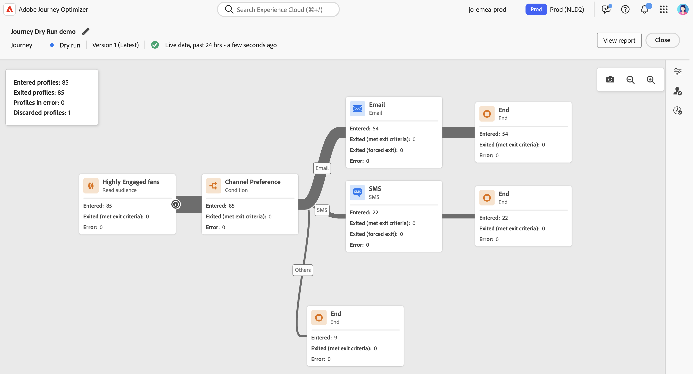

# Recorrido Dry run {#journey-dry-run}

>[!CONTEXTUALHELP]
>id="ajo_journey_dry_run"
>title="Probar el recorrido"
>abstract="Una vez que haya diseñado su recorrido, pruébelo para confirmar que es funcional y asegurarse de que los pasos sean correctos. Este modo de publicación le permite probar un recorrido sin enviar comunicaciones a los perfiles."

Recorrido Dry run es un modo especial de publicación de recorrido en Adobe Journey Optimizer que permite a los especialistas en marketing probar un recorrido utilizando datos de producción reales sin ponerse en contacto con clientes reales ni actualizar información de perfil.  Esta función ayuda a los especialistas en marketing a confiar en el diseño del recorrido y en la segmentación de audiencias antes de publicarla en directo.

>[!AVAILABILITY]
>
>Esta versión solo está disponible para un conjunto de organizaciones (disponibilidad limitada). Para obtener acceso, póngase en contacto con su representante de Adobe.

## Ventajas principales {#journey-dry-run-benefits}

Recorrido La ejecución en seco aumenta la confianza del profesional y el éxito del recorrido al permitir pruebas seguras y basadas en datos de los recorridos del cliente utilizando datos de producción reales, sin el riesgo de ponerse en contacto con los clientes o alterar la información del perfil. Esta función permite a los especialistas en marketing validar el alcance de la audiencia y la lógica de rama antes de lanzarse, lo que garantiza que los recorridos se alineen con los objetivos comerciales deseados.

Con la ejecución en seco de Recorrido, obtiene la capacidad de identificar problemas de forma temprana, optimizar las estrategias de segmentación y mejorar el diseño del recorrido en función de datos reales, no de suposiciones. Integrado directamente en el lienzo del recorrido, Dry run ofrece informes intuitivos y visibilidad sobre los indicadores de rendimiento clave, lo que permite a los equipos iterar con confianza y optimizar los flujos de trabajo de aprobación. Esto mejora la eficacia operativa, reduce el riesgo de inicio y mejora los resultados de participación del cliente.

En última instancia, esta función mejora el tiempo de respuesta al valor, reduce los errores de recorrido y fortalece la posición de Adobe como plataforma de confianza para organizar recorridos personalizados y de alto impacto.

Recorrido Dry run trae:

1. **Entorno de prueba seguro**: no se establece contacto con los perfiles en modo de ejecución en seco, lo que garantiza que no haya riesgo de enviar comunicaciones ni de afectar a los datos activos.
1. **Información sobre la audiencia**: los especialistas en marketing pueden predecir la accesibilidad de la audiencia en varios nodos de recorrido, como exclusiones, exclusiones y otras condiciones.
1. **Comentarios en tiempo real**: las métricas se muestran directamente en el lienzo del recorrido, de forma similar a los informes en directo, lo que permite a los especialistas en marketing refinar el diseño del recorrido.

## Iniciar una ejecución en seco {#journey-dry-run-start}

Puede utilizar la capacidad de ejecución en seco en cualquier recorrido de borrador sin errores.

Para activar la ejecución en seco, siga estos pasos:

1. Abra el recorrido que desee probar.
1. Haz clic en el botón **Ejecutar en seco**.

   

1. Confirmar la publicación

   Aparece un mensaje de estado, **Activando la ejecución en seco**, mientras se produce la transición.

1. Una vez activado, el recorrido entra en el modo de ejecución en seco.

Durante la ejecución en seco, el recorrido se ejecuta con las siguientes especificidades:

* **Los nodos de acción del canal** con notificaciones push, SMS o por correo electrónico no se ejecutan.
* **Las acciones personalizadas** se deshabilitaron durante la ejecución en seco y sus respuestas se establecieron en null.
* **Los nodos de espera** se omiten durante la ejecución en seco.
  <!--You can override the wait block timeouts, then if you have wait blocks duration longer than allowed dry run journey duration, then that branch will not execute completely.-->
* **Las fuentes de datos externas** se ejecutan de forma predeterminada.

>[!NOTE]
>
> * Los perfiles en el modo de ejecución en seco se cuentan como perfiles atractivos.
> * Los recorridos de ejecución en seco no afectan a las reglas empresariales. Por ejemplo, un perfil de un recorrido de ejecución en seco no se excluirá de otros recorridos debido a reglas como `1 journey per day`.

## Monitorización de una ejecución en seco {#journey-dry-monitor}

Una vez iniciada la publicación en modo seco, puede visualizar la ejecución del recorrido y cómo progresan los perfiles a través de las ramas y nodos del recorrido.

Las métricas se muestran directamente en el lienzo del recorrido.

Para cada actividad, puede comprobar lo siguiente:

* **[!UICONTROL Ingresado]**: Cantidad total de personas que ingresaron a esta actividad.
* **[!UICONTROL Salidas (se cumplen los criterios de salida)]**: Número total de personas que salieron del recorrido de esa actividad debido a un criterio de salida.
* **[!UICONTROL Salida forzada]**: Número total de personas que salieron cuando se detuvo el recorrido.
* **[!UICONTROL Error]**: Número total de personas que tuvieron un error en esa actividad.

En el nivel de recorrido, puede comprobar lo siguiente:

* Número total de **perfiles ingresados**
* Número total de **perfiles abandonados**
* Número total de **perfiles con error**
* Número total de **perfiles descartados** en el recorrido

También puede acceder a los **informes de las últimas 24 horas** y a los **informes permanentes** de la ejecución en seco. Para acceder a estos informes, haga clic en el botón **Ver informe** en la esquina superior derecha del lienzo de recorrido.

>[!CAUTION]
>
> Los datos de informes solo están disponibles cuando la ejecución en seco está **activa**.  Una vez que se detenga, ya no se podrá acceder a los datos de informes. Utilice el botón **Exportar** situado encima de los informes para descargarlos si es necesario.

## Detener una carrera en seco {#journey-dry-run-stop}

Los recorridos de ejecución en seco deben detenerse manualmente. Haga clic en el botón **Cerrar** para finalizar la prueba y confirmar.

Después de 14 días, los recorridos de ejecución en seco pasan automáticamente al estado Borrador.
