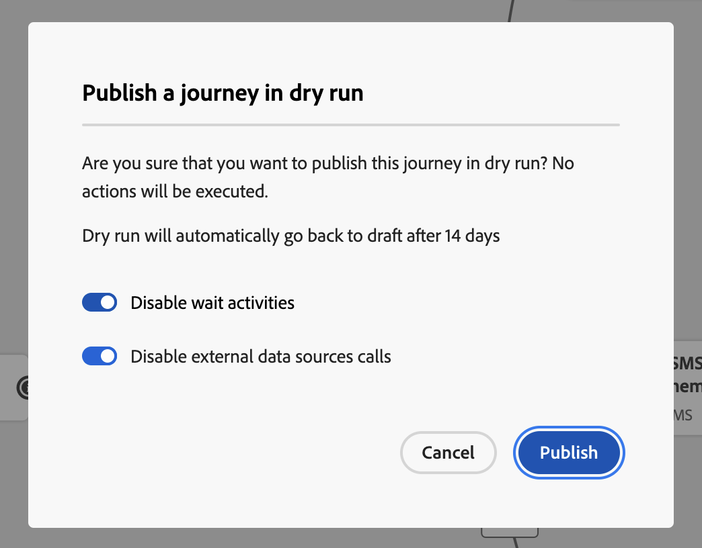

# Ensayo del recorrido {#journey-dry-run}

>[!CONTEXTUALHELP]
>id="ajo_journey_dry_run"
>title="Modo de ensayo"
>abstract="Este recorrido está en modo de ensayo. El ensayo del recorrido es un modo especial de publicación de recorrido de Adobe Journey Optimizer que permite a los profesionales de recorridos probar un recorrido utilizando datos de producción reales sin ponerse en contacto con clientes reales ni actualizar la información de perfil.  Esta función ayuda a los profesionales de recorridos a confiar en el diseño del recorrido y en la segmentación del público antes de publicarlo en vivo."

>[!CONTEXTUALHELP]
>id="ajo_journey_dry_run_start"
>title="Publicación de un recorrido en modo de ensayo"
>abstract="El ensayo del recorrido es un modo especial de publicación de recorrido de Adobe Journey Optimizer que permite a los profesionales de recorridos probar un recorrido utilizando datos de producción reales. Una vez que haya diseñado su recorrido, ejecute un ensayo para confirmar que es funcional y asegurarse de que los pasos sean correctos. Este modo de publicación le permite realizar una prueba preliminar de un recorrido sin enviar comunicaciones a los perfiles."

El ensayo del recorrido es un modo especial de publicación de recorrido de Adobe Journey Optimizer que permite a los profesionales de recorridos probar un recorrido utilizando datos de producción reales sin ponerse en contacto con clientes reales ni actualizar la información de perfil.  Esta función ayuda a los profesionales de recorridos a confiar en el diseño del recorrido y en la segmentación del público antes de publicarlo en vivo.

➡️ [Obtenga más información acerca de la ejecución sin recorrido en este vídeo](#dry-run-video)

## Ventajas principales {#journey-dry-run-benefits}

Recorrido La ejecución en seco aumenta la confianza del profesional y el éxito del recorrido al permitir pruebas seguras y basadas en datos de los recorridos del cliente utilizando datos de producción reales, sin el riesgo de ponerse en contacto con los clientes o alterar la información del perfil. Esta función permite a los profesionales del recorrido validar el alcance de la audiencia y la lógica de rama antes de lanzarse, lo que garantiza que los recorridos se alineen con los objetivos empresariales deseados.

Con la ejecución en seco de Recorrido, obtiene la capacidad de identificar problemas de forma temprana, optimizar las estrategias de segmentación y mejorar el diseño del recorrido en función de datos reales, no de suposiciones. Integrado directamente en el lienzo del recorrido, Dry run ofrece informes intuitivos y visibilidad sobre los indicadores de rendimiento clave, lo que permite a los equipos iterar con confianza y optimizar los flujos de trabajo de aprobación. Esto mejora la eficacia operativa, reduce el riesgo de inicio y mejora los resultados de participación del cliente.

En última instancia, esta función mejora el tiempo de respuesta al valor y reduce los errores de recorrido.

Recorrido Dry run trae:

1. **Entorno de prueba seguro**: no se establece contacto con los perfiles en modo de ejecución en seco, lo que garantiza que no haya riesgo de enviar comunicaciones ni de afectar a los datos activos.
1. **Perspectivas de audiencias**: los profesionales del Recorrido pueden predecir la accesibilidad de la audiencia en varios nodos de recorrido, incluidas las exclusiones y las exclusiones basadas en condiciones de Recorrido.
1. **Comentarios en tiempo real**: las métricas se muestran directamente en el lienzo del recorrido, de forma similar a los informes en vivo, lo que permite a los profesionales del recorrido refinar su diseño de recorrido.

## Lógica de ejecución de ejecución en seco {#journey-dry-run-exec}

Durante la ejecución en seco, el recorrido se ejecuta en modo de simulación, aplicando los siguientes comportamientos específicos a cada actividad de recorrido sin activar acciones reales:

* **Los nodos de acción del canal**, incluidas las notificaciones por correo electrónico, SMS o push, no se ejecutan.
* **Las acciones personalizadas** se deshabilitaron durante la ejecución en seco y sus respuestas se establecieron en null.

  Para mejorar la legibilidad, las acciones personalizadas y las actividades de canal aparecen atenuadas durante la ejecución de una ejecución en seco.

  {width="80%" align="left"}

* Las **fuentes de datos**, incluidas las fuentes de datos externas, y las actividades **Espera** están deshabilitadas de manera predeterminada durante la ejecución en seco. Sin embargo, puede cambiar este comportamiento [al activar el modo de ejecución en seco](#journey-dry-run-start).

* Los nodos **Reaction** no se han ejecutado: todos los perfiles que entren en ellos se cerrarán correctamente. Sin embargo, se aplican las siguientes reglas de prioridad:
   * Si se usa un nodo **Reaction** con uno o varios nodos **unitary event** en paralelo, los perfiles siempre pasarán por el evento de reacción.
   * Si se usa un nodo **Reaction** con uno o varios nodos **reaction event** en paralelo, los perfiles siempre pasarán por el primero del lienzo (el de arriba).

>[!CAUTION]
>
>* Los permisos para iniciar una ejecución en seco están restringidos a los usuarios con el permiso de alto nivel **[!DNL Publish journeys]**. Los permisos para detener una ejecución en seco están restringidos a los usuarios con el permiso de alto nivel **[!DNL Manage journeys]**. Obtenga más información acerca de la administración de los derechos de acceso de los usuarios de [!DNL Journey Optimizer] en [esta sección](../administration/permissions-overview.md).
>
>* Antes de empezar a usar la capacidad de ejecución en seco, [lea las protecciones y limitaciones](#journey-dry-run-limitations).

## Iniciar una ejecución en seco {#journey-dry-run-start}

Puede utilizar la capacidad de ejecución en seco en cualquier recorrido de borrador sin errores.

Para activar la ejecución en seco, siga estos pasos:

1. Abra el recorrido que desee probar.
1. Seleccione el botón **[!UICONTROL Ejecutar en seco]**.

   

1. Seleccione si desea habilitar o deshabilitar las actividades **Wait** y las llamadas de **External data sources**, y confirme la publicación Dry run.

   {width="50%" align="left"}

   Aparece un mensaje de estado, **[!UICONTROL Activando la ejecución en seco]**, mientras se produce la transición.

1. Una vez activado, el recorrido entra en modo **[!UICONTROL Ejecución en seco]**.

## Monitorización de una ejecución en seco {#journey-dry-monitor}

Una vez iniciada la publicación en modo seco, puede visualizar la ejecución del recorrido y cómo progresan los perfiles a través de las ramas y nodos del recorrido.

Las métricas se muestran directamente en el lienzo del recorrido. Obtenga más información acerca de las métricas y los informes en directo de recorrido en [Informe en vivo en el lienzo de recorrido](report-journey.md).

También puede acceder a los **informes de las últimas 24 horas** y a los **informes permanentes** de la ejecución en seco. Para acceder a estos informes, haga clic en el botón **Ver informe** en la esquina superior derecha del lienzo de recorrido.

>[!CAUTION]
>
> Los datos de informes solo están disponibles cuando la ejecución en seco está **activa**.  Una vez que se detenga, ya no se podrá acceder a los datos de informes. Utilice el botón **Exportar** situado encima de los informes para descargarlos si es necesario.

## Detener una carrera en seco {#journey-dry-run-stop}

Después de 14 días, los recorridos de ejecución en seco pasan automáticamente al estado **[!UICONTROL Borrador]**.

Los recorridos de ejecución en seco también se pueden detener manualmente. Para desactivar el modo de ejecución en seco, siga estos pasos:

1. Abra el recorrido de ejecución en seco que desee detener.
1. Seleccione el botón **[!UICONTROL Cerrar]** para finalizar la prueba.
Los vínculos a las últimas 24 horas y todos los informes de tiempo están disponibles en la pantalla de confirmación.

   {width="50%" align="left"}

1. Haga clic en **[!UICONTROL Volver al borrador]** para confirmar.

## Mecanismos de protección y limitaciones {#journey-dry-run-limitations}

* Los perfiles en el modo de ejecución en seco se contabilizan como perfiles atractivos
* Los recorridos en el modo de ejecución en seco se cuentan hacia la cuota de recorrido en directo
* Los recorridos de ejecución en seco no afectan a las reglas empresariales
  <!--* When creating a new journey version, if a previous journey version is **Live**, then the Dry run activation is not allowed on the new version.-->
* **Las acciones Jump** no están habilitadas en la ejecución en seco.
Cuando un recorrido de origen déclencheur un evento **Jump** a uno de destino, ese evento de salto no sería aplicable a una versión de recorrido de ejecución en seco. Por ejemplo, si la última versión de un recorrido está en ejecución en seco y la anterior es **Live**, el evento de salto ignoraría la versión de ejecución en seco y solo sería aplicable a la versión **Live**.

## Eventos de paso de recorrido y ejecución en seco {#journey-step-events}

Recorrido La ejecución en seco genera **stepEvents**. Estos stepEvents tienen un indicador específico y un ID de ejecución en seco: `inDryRun` y `dryRunID`.

* `_experience.journeyOrchestration.stepEvents.inDryRun` devuelve `true` si la ejecución en seco está activada y `false` en caso contrario
* `_experience.journeyOrchestration.stepEvents.dryRunID` devuelve el ID de una instancia de ejecución en seco

Si exporta datos stepEvent a **sistemas externos**, puede filtrar las ejecuciones en seco utilizando el indicador `inDryRun`.

Al analizar **métricas de informes de recorrido** mediante el servicio Adobe Experience Platform Query, se deben excluir los eventos de paso generados por la ejecución en seco. Para ello, establezca el indicador `inDryRun` en `false`.

## Vídeo práctico {#dry-run-video}

Aprenda a secar los recorridos en este vídeo.

>[!VIDEO](https://video.tv.adobe.com/v/3464685/?captions=spa&learn=on&enablevpops)
