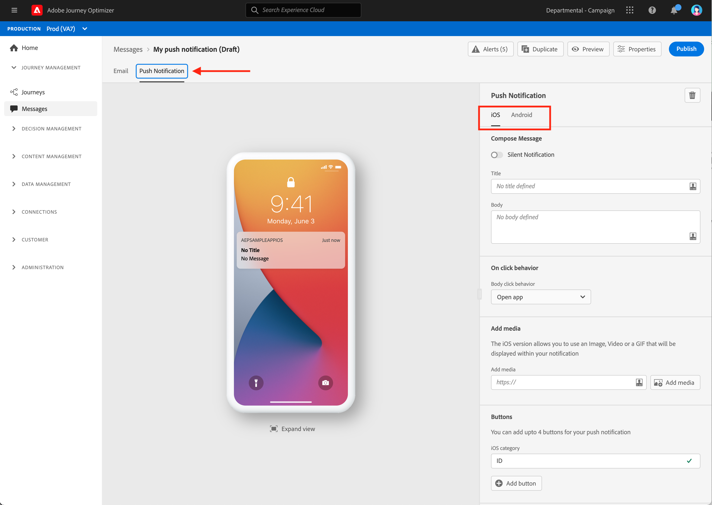

# Introducción a recorrido{#jo-quick-start}

## Requisitos previos

Para enviar mensajes con recorridos, se requiere la siguiente configuración:

1. **Configurar un evento**: si desea configurar los recorridos de forma unitaria cuando se reciba un evento, debe configurar un evento. Puede definir la información esperada y cómo procesarla. Este paso lo realiza un **usuario técnico**. [Más información](../event/about-events.md).

   

1. **Crear un segmento**: el recorrido también puede escuchar segmentos de Adobe Experience Platform para enviar mensajes en lote a un conjunto específico de perfiles. Para ello, debe crear segmentos. [Más información](../segment/about-segments.md).

   

1. **Configure la fuente** de datos: puede definir una conexión con un sistema para recuperar información adicional que se utilizará en los recorridos, por ejemplo en las condiciones. También se configura una fuente de datos integrada de Adobe Experience Platform en el momento del aprovisionamiento. Este paso no es necesario si solo se aprovechan los datos de los eventos durante el recorrido. Este paso lo realiza un **usuario técnico**. [Más información](../datasource/about-data-sources.md)

   

1. **Configurar una acción**: Las funciones de mensajes de Journey Optimizer están integradas, solo tiene que diseñar el contenido y publicar el mensaje. Consulte [esta sección](../get-started-content.md). Si utiliza un sistema de terceros para enviar mensajes, puede crear una acción personalizada. Obtenga más información en esta [sección](../action/action.md). Este paso lo realiza un **usuario técnico**.

   

## Creación del recorrido{#jo-build}

Este paso lo realiza el **usuario empresarial**. Aquí es donde crea sus recorridos. Combine las distintas actividades de evento, orquestación y acción para crear sus escenarios de canal cruzado de varios pasos.

Estos son los pasos principales para enviar mensajes a través de recorridos:

1. En la sección ADMINISTRACIÓN DE RECORRIDOS , haga clic en **[!UICONTROL Journeys]**. Se muestra la lista de recorridos.

   

1. Haga clic en **[!UICONTROL Create]** para crear un nuevo recorrido.

1. Edite las propiedades del recorrido en el panel de configuración que se muestra en el lado derecho. Obtenga más información en esta [sección](journey-gs.md#change-properties).

   

1. Para empezar, arrastre y suelte un evento o una actividad **Read segment** de la paleta en el lienzo. Para obtener más información sobre el diseño de recorrido, consulte [esta sección](using-the-journey-designer.md).

   

1. Arrastre y suelte los siguientes pasos que el individuo debe seguir. Por ejemplo, puede añadir una condición seguida de un mensaje. Para obtener más información sobre las actividades, consulte [esta sección](using-the-journey-designer.md).

1. Pruebe el recorrido con perfiles de prueba. Obtenga más información en esta [sección](testing-the-journey.md)

1. Publique el recorrido para activarlo. Obtenga más información en esta [sección](publishing-the-journey.md).

   

1. Monitorice el recorrido con las herramientas de sistema de informes dedicadas para medir la efectividad de su recorrido. Obtenga más información en esta [sección](../reports/live-report.md).

   

## Cambio de las propiedades {#change-properties}

Haga clic en el icono de lápiz, en la parte superior derecha para acceder a las propiedades del recorrido.

Puede cambiar el nombre del recorrido, añadir una descripción, permitir la reentrada, elegir las fechas de inicio y finalización y definir una **[!UICONTROL Timeout and error]** duración si es administrador.

El **Copy technical details** permite copiar información técnica sobre el recorrido que el equipo de asistencia puede utilizar para solucionar problemas. Se copia la siguiente información: UID de JourneyVersion, OrgID, orgName, sandboxName.

### Entrada{#entrance}

De forma predeterminada, los nuevos recorridos permiten volver a entrar. Puede desmarcar la opción de recorridos de &quot;una toma&quot;, por ejemplo, si desea ofrecer un regalo único cuando una persona entra en una tienda. En ese caso, no desea que el cliente pueda volver a entrar en el recorrido y recibir la oferta de nuevo.

Cuando un recorrido &quot;termina&quot;, tendrá el estado **[!UICONTROL Closed (no entrance)]**. El recorrido dejará de permitir la entrada al recorrido de nuevos individuos. Las personas que ya están en el recorrido terminarán normalmente el recorrido.

Después del tiempo de espera global predeterminado de 30 días, el recorrido cambiará al estado **Finalizado**. Consulte esta [sección](../building-journeys/journey-gs.md#global_timeout).

### Tiempo de espera y error en actividades de recorrido {#timeout_and_error}

Al editar una acción o actividad de condición, puede definir una ruta alternativa en caso de error o de tiempo de espera. Si el procesamiento de la actividad que interroga a un sistema de terceros supera la duración de tiempo de espera definida en las propiedades del recorrido (campo **[!UICONTROL Timeout and  error]**), se elegirá la segunda ruta para realizar una posible acción de reserva.

Los valores autorizados están entre 1 y 30 segundos.

Se recomienda definir un valor **[!UICONTROL Timeout and error]** muy corto si el recorrido distingue entre tiempo (por ejemplo: reaccionar a la ubicación en tiempo real de una persona) porque no puede retrasar la acción durante más de unos segundos. Si el recorrido es menos sensible al tiempo, puede utilizar un valor más largo para dar más tiempo al sistema llamado para enviar una respuesta válida.

Recorrido también utiliza un tiempo de espera global. Consulte la [siguiente sección](#global_timeout).

### Tiempo de espera de recorrido global {#global_timeout}

Además del [timeout](#timeout_and_error) utilizado en las actividades de recorrido, también existe un tiempo de espera de recorrido global que no se muestra en la interfaz y que no se puede cambiar. Este tiempo de espera detendrá el progreso de las personas en el recorrido 30 días después de su entrada. Esto significa que el recorrido de una persona no puede durar más de 30 días. Después del tiempo de espera de 30 días, se eliminan los datos del individuo. Las personas que sigan fluyendo en el recorrido al final del tiempo de espera se detendrán y se tendrán en cuenta como errores en los informes.

>[!NOTE]
>
>Los recorridos no reaccionan directamente a las solicitudes de exclusión, acceso o eliminación de privacidad. Sin embargo, el tiempo de espera global garantiza que las personas nunca permanezcan más de 30 días en ningún recorrido.

Debido al tiempo de espera de recorrido de 30 días, cuando no se permite la reentrada del recorrido, no podemos asegurarnos de que el bloqueo de reentrada funcione más de 30 días. De hecho, como eliminamos toda la información sobre las personas que entraron en el recorrido 30 días después de su entrada, no podemos conocer a la persona ingresada anteriormente, hace más de 30 días.

### Zona horaria y zona horaria del perfil {#timezone}

La zona horaria se define en el nivel de recorrido.

Puede introducir una zona horaria fija o utilizar perfiles de Adobe Experience Platform para definir la zona horaria del recorrido.

Para obtener más información sobre la administración de huso horario, consulte [esta página](../building-journeys/timezone-management.md).

## Finalización de un recorrido

Un recorrido puede finalizar para un individuo por dos razones:

* La persona llega a la última actividad de una ruta. Esta última actividad puede ser una actividad final u otra actividad. No hay obligación de finalizar una ruta con una actividad final. Consulte [esta página](../building-journeys/end-activity.md).
* La persona llega a una actividad de condición (o a una actividad de espera con una condición ) y no coincide con ninguna de las condiciones.

La persona puede volver a entrar en el recorrido si se permite la reentrada. Consulte [esta página](../building-journeys/journey-gs.md#change-properties)

Un recorrido puede cerrarse por los siguientes motivos:

* El recorrido se cierra manualmente mediante el botón **[!UICONTROL Close to new entrances]**.
* Un recorrido basado en segmentos de una toma que ha terminado de ejecutarse.
* Después de la última aparición de un recorrido basado en segmentos recurrentes.

Cuando se cierra un recorrido (por cualquiera de los motivos anteriores), aparece el estado **[!UICONTROL Closed (no entrance)]**. El recorrido dejará de permitir la entrada al recorrido de nuevos individuos. Las personas que ya están en el recorrido terminarán normalmente el recorrido. Después del tiempo de espera global predeterminado de 30 días, el recorrido cambiará al estado **Finalizado**. Consulte esta [sección](../building-journeys/journey-gs.md#global_timeout).

En caso de que necesite detener el progreso de todas las personas en el recorrido, puede detenerlo. Al detener el recorrido, se agotará el tiempo de espera de todas las personas del recorrido.

Así se cierra o se detiene un recorrido manualmente:

Las opciones **[!UICONTROL Stop]** y **[!UICONTROL Close to new entrances]** permiten finalizar los recorridos **live**. Cerrar un recorrido implica **que la llegada de nuevos clientes al recorrido está bloqueada** y que los clientes que ya ingresaron al recorrido pueden experimentarla hasta el final. Esta es la forma más recomendada de poner fin a un recorrido, ya que ofrece la mejor experiencia para los clientes. Detener un recorrido implica que a las personas que ya entraron en un recorrido se les detiene en su progreso. Básicamente el recorrido está apagado.

>[!NOTE]
>
>Tenga en cuenta que no puede reanudar un recorrido cerrado o detenido.

### Cierre de un recorrido

Puede cerrar un recorrido manualmente para asegurarse de que los clientes que ya han entrado en el recorrido puedan finalizar su ruta, pero que los nuevos usuarios no puedan entrar en el recorrido.

Cuando se cierra, un recorrido tendrá el estado **[!UICONTROL Closed (no entrance)]**. Después del tiempo de espera global predeterminado de 30 días, el recorrido cambiará al estado **Finalizado**. Consulte esta [sección](../building-journeys/journey-gs.md#global_timeout).

No se puede reiniciar ni eliminar una versión de recorrido cerrada. Puede crear una nueva versión o duplicarla. Solo se pueden eliminar los recorridos finalizados.

Puede cerrar un recorrido haciendo clic en **[!UICONTROL Close to new entrances]** mientras pasa el ratón por encima de un recorrido en la lista de recorridos.

También puede:

1. En la lista **[!UICONTROL Journeys]**, haga clic en el recorrido que desee cerrar.
1. En la parte superior derecha, haga clic en la flecha abajo.

   

1. Haga clic en **[!UICONTROL Close to new entrances]**. Aparecerá un cuadro de diálogo.
1. Haga clic en **[!UICONTROL Close to new entrances]** para confirmar.

### Detención de un recorrido

Puede detener un recorrido cuando se produzca una emergencia y todo el procesamiento debe finalizar inmediatamente en un recorrido.

No se puede reiniciar una versión de recorrido detenida.

Cuando se detiene, un recorrido tendrá el estado **[!UICONTROL Stopped]**.

Puede detener un recorrido (por ejemplo, si un especialista en marketing se da cuenta de que el recorrido está dirigido a una audiencia incorrecta o si una acción personalizada que supuestamente debe enviar mensajes no funciona correctamente...) haciendo clic en **[!UICONTROL Stop]** mientras pasa el ratón por encima de un recorrido en la lista de recorridos.

También puede:

1. En la lista **[!UICONTROL Journeys]**, haga clic en el recorrido que desee detener.
1. En la parte superior derecha, haga clic en la flecha abajo.

1. Haga clic en **[!UICONTROL Stop]**. Aparecerá un cuadro de diálogo.
1. Haga clic en **[!UICONTROL Stop]** para confirmar.
