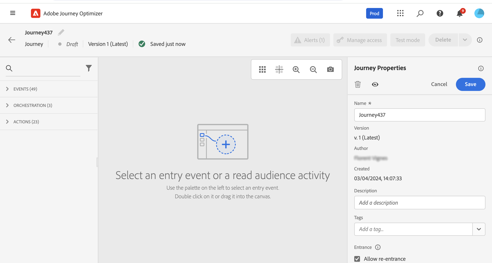

# Creación de su primer recorrido {#jo-quick-start}

>[!CONTEXTUALHELP]
>id="ajo_homepage_card2"
>title="Creación de recorridos"
>abstract="Utilice **[!DNL Adobe Journey Optimizer]** para crear casos de uso de orquestación en tiempo real aprovechando los datos contextuales almacenados en eventos o fuentes de datos."

>[!CONTEXTUALHELP]
>id="ajo_journey_create"
>title="Recorridos"
>abstract="Diseñar recorridos de clientes para ofrecer experiencias personalizadas y contextuales. Journey Optimizer permite crear casos prácticos de orquestación en tiempo real con información contextual almacenada en eventos o fuentes de datos. La pestaña **Información general** muestra un panel de control con métricas clave relacionadas con los recorridos. La pestaña **Examinar** muestra la lista de recorridos existentes."

[!DNL Adobe Journey Optimizer] incluye un lienzo de orquestación omnicanal que permite a los especialistas en marketing armonizar el alcance de marketing con la participación individual del cliente. La interfaz de usuario de le permite arrastrar y soltar fácilmente actividades de la paleta en el lienzo para crear su recorrido. La interfaz de usuario de recorrido se detalla en [esta página](journey-ui.md).

Los pasos principales para crear un recorrido se detallan en esta página. Se racionalizan de la siguiente manera:

Cree recorridos de cliente de varios pasos para iniciar una secuencia de interacciones, ofertas y mensajes en varios canales en tiempo real. Este enfoque garantiza que los clientes se involucren en los momentos óptimos en función de sus acciones y señales comerciales relevantes. Las audiencias de destino se definen en función del comportamiento, los datos contextuales y los eventos empresariales. Los requisitos previos dependen de su caso de uso y del [tipo de recorrido](entry-management.md#types-of-journeys) que esté generando.

Obtenga más información acerca de cómo fluyen los perfiles entre los recorridos y las tasas de procesamiento de recorridos en [esta sección](entry-management.md#journey-processing-rate).

Antes de empezar a crear el recorrido, asegúrese de que se han completado los pasos de configuración relevantes:

* Si desea almacenar en déclencheur las recorridos individualmente cuando se reciba un evento, **configure un evento**. Defina la información esperada y cómo procesarla. [Más información](../event/about-events.md).

<!--     -->

* El recorrido también puede escuchar a las audiencias de Adobe Experience Platform para enviar mensajes por lotes a un conjunto específico de perfiles. Para esto, **cree audiencias**. [Más información](../audience/about-audiences.md).

<!--     -->

* Defina una conexión a un sistema para recuperar información adicional que se utilizará en los recorridos, por ejemplo, en las condiciones. Esta conexión se basa en un **origen de datos**. [Más información](../datasource/about-data-sources.md).

<!--     -->

* Journey Optimizer viene con [funciones integradas de mensajes](../building-journeys/journey-action.md). Si usa un sistema de terceros para enviar mensajes, puede **crear una acción personalizada**. Obtenga más información en esta [sección](../action/action.md).

<!--      -->

Como ingeniero de datos, los pasos para configurar sus recorridos, incluidas las fuentes de datos, los eventos y las acciones, se detallan en [esta sección](../configuration/about-data-sources-events-actions.md).

>[!NOTE]
>
>En [esta página](../start/guardrails.md) se detallan los mecanismos de protección y limitaciones de los recorridos

## Crear un recorrido {#jo-build}

Para crear un recorrido de varios pasos, siga estos pasos:

1. En la sección de menú ADMINISTRACIÓN DE RECORRIDO, haga clic en **[!UICONTROL Recorridos]**.

1. Haga clic en el botón **[!UICONTROL Crear Recorrido]** para crear un recorrido nuevo.

1. Edite el panel de configuración del recorrido para definir el nombre del recorrido y sus propiedades. Aprenda a establecer las propiedades de su recorrido en [esta página](journey-properties.md).

   

A continuación, puede empezar a diseñar el recorrido.

## Diseño del recorrido {#jo-design}

El diseñador de recorridos omnicanal le ayuda a crear recorridos de varios pasos con públicos destinatarios, actualizaciones basadas en interacciones comerciales o de clientes en tiempo real y mensajes omnicanal mediante una interfaz intuitiva de arrastrar y soltar.

1. Para empezar, arrastre y suelte un evento o una actividad **Leer audiencia** de la paleta en el lienzo. Para obtener más información sobre el diseño de recorrido, consulte [esta sección](using-the-journey-designer.md).

   

1. Arrastre y suelte un evento o una actividad **Leer audiencia** de la paleta en el lienzo. Para obtener más información sobre el diseño de recorrido, consulte [esta sección](using-the-journey-designer.md).

## Prueba del recorrido {#jo-test}

Una vez creado el recorrido, pruébelo antes de publicarlo. Journey Optimizer ofrece **Modo de prueba** como una forma de ver los perfiles de prueba a medida que se mueven por el recorrido, detectando posibles errores antes de la activación. La ejecución de pruebas rápidas garantiza que los recorridos funcionen correctamente para que pueda publicarlos con confianza. Aprenda a probar su recorrido [en esta sección](testing-the-journey.md)

También puede ejecutar su recorrido en **Ejecución en seco**. El ensayo del recorrido es un modo especial de publicación de recorrido de Adobe Journey Optimizer que permite a los profesionales de recorridos probar un recorrido utilizando datos de producción reales sin ponerse en contacto con clientes reales ni actualizar la información de perfil. Esta función ayuda a los profesionales del recorrido a confiar en el diseño del recorrido y la segmentación de audiencia antes de publicarla en directo. Obtenga información sobre cómo publicar un recorrido en el modo de ejecución en seco [en esta sección](journey-dry-run.md).

## Publicación del recorrido {#jo-pub}

Debe publicar un recorrido para activarlo y hacer que esté disponible para que los nuevos perfiles lo introduzcan. Antes de publicar el recorrido, compruebe que es válido y que no hay errores. No se puede publicar un recorrido con errores. Obtenga más información acerca de la publicación de recorrido en esta [sección](publish-journey.md).

Una vez publicado, puede monitorizar su recorrido mediante las herramientas de sistema de informes específicas para medir la efectividad de su recorrido.

Obtenga más información acerca de los informes de recorrido en esta [sección](../reports/live-report.md).

## Recursos adicionales

* **[Descripción general del diseñador de Recorridos](using-the-journey-designer.md)**: domine la interfaz de lienzo de recorrido para diseñar y organizar los recorridos de los clientes.
* **[actividades de Recorrido](about-journey-activities.md)**: descubra todas las actividades disponibles, incluidos eventos, acciones y componentes de orquestación.
* **[recorridos de prueba](testing-the-journey.md)**: aprenda a probar las recorridos mediante el modo de prueba antes de publicarlas en producción.
* **[recorridos de publicación](publish-journey.md)**: comprenda el proceso de publicación de recorridos y cómo administrar recorridos activos.
* **[Informes de Recorridos](report-journey.md)** - Rastree y analice el rendimiento de los recorridos con métricas y perspectivas detalladas.
* **[recorridos para solucionar problemas](troubleshooting.md)**: encuentre soluciones a problemas comunes de recorridos y prácticas recomendadas para la depuración.
* **[Tutoriales de Recorrido](https://experienceleague.adobe.com/es/docs/journey-optimizer-learn/tutorials/journeys/introduction-to-building-a-journey){target="_blank"}**: Explore tutoriales de vídeo paso a paso sobre la creación de recorridos y las prácticas recomendadas.

>[!NOTE]
>
>Si necesita modificar un recorrido de **live**, [cree una nueva versión](journey-ui.md#journey-filter) de su recorrido.
