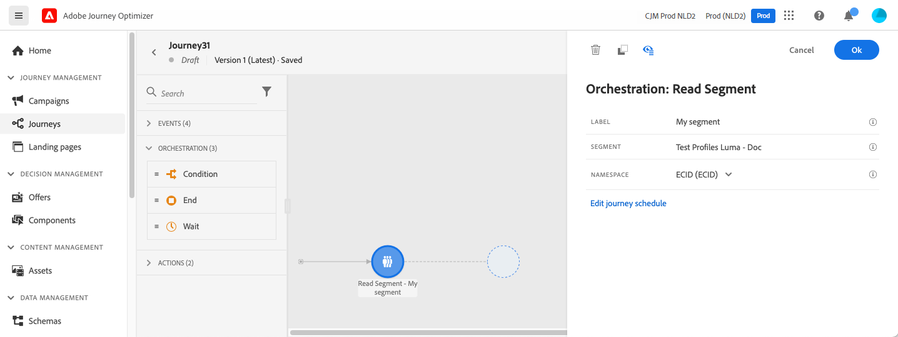

# Creación de su primer recorrido {#jo-quick-start}

>[!CONTEXTUALHELP]
>id="ajo_homepage_card2"
>title="Creación de recorridos"
>abstract="Utilice **[!DNL Adobe Journey Optimizer]** para crear casos de uso de orquestación en tiempo real aprovechando los datos contextuales almacenados en eventos o fuentes de datos."

>[!CONTEXTUALHELP]
>id="ajo_journey_create"
>title="Recorridos"
>abstract="Diseñar recorridos de clientes para ofrecer experiencias personalizadas y contextuales. Journey Optimizer permite crear casos prácticos de orquestación en tiempo real con información contextual almacenada en eventos o fuentes de datos. La pestaña **Información general** muestra un panel de control con métricas clave relacionadas con los recorridos. La pestaña **Examinar** muestra la lista de recorridos existentes."

[!DNL Adobe Journey Optimizer] incluye un lienzo de orquestación omnicanal que permite a los especialistas en marketing armonizar el alcance de marketing con la participación individual del cliente. La interfaz de usuario de le permite arrastrar y soltar fácilmente actividades de la paleta en el lienzo para crear su recorrido. La interfaz de usuario de recorrido se detalla en [esta página](journey-ui.md).

Los pasos principales para crear un recorrido se detallan en esta página. Se racionalizan de la siguiente manera:

En esta guía debe hacer lo siguiente:

* Definir un punto de entrada de recorrido: un segmento de audiencia o un evento en tiempo real
* Añada acciones de mensaje en todos los canales: correo electrónico, push, SMS, en la aplicación, web, experiencia basada en código, tarjeta de contenido y mucho más. [Ver canales admitidos](journey-action.md)
* Pruebe el recorrido con perfiles de prueba antes de la activación
* Publique el recorrido y monitorice su rendimiento

Cree recorridos de cliente de varios pasos para iniciar una secuencia de interacciones, ofertas y mensajes en varios canales en tiempo real. Este enfoque garantiza que los clientes se involucren en los momentos óptimos en función de sus acciones y señales comerciales relevantes.

<!--
>[!TIP]
>
>Not sure whether to use a journey or a campaign? [Learn how to choose the right approach](../start/journeys-vs-campaigns.md).
-->

## Antes de comenzar {#prerequisites}

Lo que debe configurar antes de crear depende de cómo se active el recorrido. La mayoría de los recorridos comienzan desde uno de estos dos puntos de entrada:

* **Entrada basada en audiencias**: el recorrido se ejecuta para un conjunto definido de perfiles a una hora programada. [Cree una audiencia](../audience/about-audiences.md) en Adobe Experience Platform antes de generar su recorrido. Este es el punto de partida recomendado si es su primera vez en Journey Optimizer.

* **Entrada basada en eventos**: el recorrido se activa en tiempo real cuando un individuo realiza una acción, como una compra o un registro. [Configura un evento](../event/about-events.md) para definir el déclencheur y los datos que lleva.

Los siguientes elementos son opcionales, pero pueden ser necesarios según el caso de uso:

* **Fuente de datos**: para enriquecer las condiciones del recorrido o la personalización con datos de un sistema externo, configure una [fuente de datos](../datasource/about-data-sources.md).

* **Acción personalizada**: si envía mensajes a través de un sistema de terceros en lugar de los canales integrados, configure una [acción personalizada](../action/action.md).

>[!NOTE]
>
>* Si usted es un ingeniero de datos responsable de la configuración técnica (eventos, fuentes de datos y acciones), consulte [esta sección](../configuration/about-data-sources-events-actions.md).
>
>* Las limitaciones y protecciones de recorrido se detallan en [esta página](../start/guardrails.md).

## Crear un recorrido {#jo-build}

Para crear un recorrido de varios pasos, siga estos pasos:

1. En la sección de menú ADMINISTRACIÓN DE RECORRIDO, haga clic en **[!UICONTROL Recorridos]**.

1. Haga clic en el botón **[!UICONTROL Crear Recorrido]** para crear un recorrido nuevo.

1. Edite el panel de configuración del recorrido para definir el nombre del recorrido y sus propiedades. Aprenda a establecer las propiedades de su recorrido en [esta página](journey-properties.md).

   >[!TIP]
   >
   >**¿Qué tipo de recorrido debo elegir?** Si es nuevo en Journey Optimizer, empiece con un recorrido basado en audiencias usando una actividad de **[!UICONTROL Leer audiencia]**; no requiere ninguna configuración de evento anterior y es la manera más sencilla de familiarizarse con el lienzo. Para experiencias en tiempo real activadas por eventos (por ejemplo, reaccionar ante una compra o un envío de formulario), configure primero un evento y utilice una entrada basada en eventos. ¿Listo para profundizar? [Descubra todos los tipos de recorrido y sus reglas de entrada](entry-management.md#types-of-journeys).

   

A continuación, puede empezar a diseñar el recorrido.

## Diseño del recorrido {#jo-design}

El diseñador de recorridos le permite crear recorridos de varios pasos con una interfaz intuitiva de arrastrar y soltar. Las actividades de la paleta izquierda están organizadas en tres categorías: **Eventos**, **Orquestación** y **Acciones**. Para obtener una descripción general completa del lienzo y sus controles, consulte [esta página](using-the-journey-designer.md).

Siga estos pasos para diseñar el recorrido:

1. **Agregar un punto de entrada** — Arrastre un evento o una actividad de **[!UICONTROL Leer audiencia]** desde la paleta al lienzo. Define la forma en la que los perfiles entran en el recorrido: individualmente en tiempo real (basado en eventos) o todos a la vez desde una audiencia definida (basado en audiencias).

   

1. **Agregar acciones de mensaje**: en la sección **[!UICONTROL Acciones]** de la paleta, arrastre una acción de canal al lienzo para enviar mensajes a los perfiles que fluyen por el recorrido. Las acciones están disponibles para correo electrónico, notificaciones push, SMS y más.

1. **Agregar actividades de orquestación**: use una actividad **[!UICONTROL Condición]** para bifurcar el recorrido en varias rutas de acceso según el comportamiento o los atributos del perfil. Use una actividad **[!UICONTROL Wait]** para establecer un tiempo de espera entre pasos.

>[!TIP]
>
>Para los recorridos con varias fases o varios puntos de contacto, considere la posibilidad de dividir el flujo de extremo a extremo en subrecorridos más pequeños conectados con la actividad **[!UICONTROL Jump]**. Esto reduce la complejidad y facilita las pruebas independientes de cada recorrido secundario. Más información en [Estrategia de diseño: recorridos secundarios](jump.md#jump-strategy).

## Prueba del recorrido {#jo-test}

Una vez creado el recorrido, pruébelo antes de publicarlo. Journey Optimizer ofrece **Modo de prueba** como una forma de ver los perfiles de prueba a medida que se mueven por el recorrido, detectando posibles errores antes de la activación. La ejecución de pruebas rápidas garantiza que los recorridos funcionen correctamente para que pueda publicarlos con confianza. Aprenda a probar su recorrido [en esta sección](testing-the-journey.md)

También puede ejecutar su recorrido en **Ejecución en seco**. El ensayo del recorrido es un modo especial de publicación de recorrido de Adobe Journey Optimizer que permite a los profesionales de recorridos probar un recorrido utilizando datos de producción reales sin ponerse en contacto con clientes reales ni actualizar la información de perfil. Esta función ayuda a los profesionales del recorrido a confiar en el diseño del recorrido y la segmentación de audiencia antes de publicarla en directo. Obtenga información sobre cómo publicar un recorrido en el modo de ejecución en seco [en esta sección](journey-dry-run.md).

## Publicación del recorrido {#jo-pub}

Debe publicar un recorrido para activarlo y hacer que esté disponible para que los nuevos perfiles lo introduzcan. Antes de publicar el recorrido, compruebe que es válido y que no hay errores. No se puede publicar un recorrido con errores. Obtenga más información acerca de la publicación de recorrido en esta [sección](publish-journey.md).

Una vez publicado, puede monitorizar su recorrido mediante las herramientas de sistema de informes específicas para medir la efectividad de su recorrido.

Obtenga más información acerca de los informes de recorrido en esta [sección](../reports/live-report.md).

## Casos de uso comunes {#use-cases}

¿No estás seguro de por dónde empezar? Estos son tres escenarios típicos en los que los recorridos proporcionan el mayor valor:

<table style="table-layout:fixed">
  <tr style="border: 0;">
    <td>
      
      
<strong>Serie de bienvenida</strong> Incorpore automáticamente nuevos usuarios con una secuencia de mensajes después de registrarse, guiándolos a través de su producto o servicio.

    </td>
    <td>
      
      
<strong>Abandono del carro de compras</strong> Vuelva a atraer a los clientes que se fueron sin completar una compra y envíenos un recordatorio oportuno con contenido personalizado.

    </td>
    <td>
      
      
<strong>Reparticipación</strong> Recupere usuarios inactivos con ofertas o actualizaciones segmentadas basadas en su último comportamiento conocido.

    </td>
  </tr>
  <tr style="border: 0;">
    <td align="center"></td>
    <td align="center"></td>
    <td align="center"></td>
  </tr>
</table>

## Recursos adicionales

* **[tipos de Recorrido y entrada de perfil](entry-management.md)**: comprenda todos los tipos de recorrido (evento unitario, evento empresarial, audiencia de lectura, calificación de audiencia) y cómo los perfiles entran, vuelven a entrar y fluyen por los recorridos.
* **[Descripción general del diseñador de Recorridos](using-the-journey-designer.md)**: domine la interfaz de lienzo de recorrido para diseñar y organizar los recorridos de los clientes.
* **[actividades de Recorrido](about-journey-activities.md)**: descubra todas las actividades disponibles, incluidos eventos, acciones y componentes de orquestación.
* **[recorridos de prueba](testing-the-journey.md)**: aprenda a probar las recorridos mediante el modo de prueba antes de publicarlas en producción.
* **[recorridos de publicación](publish-journey.md)**: comprenda el proceso de publicación de recorridos y cómo administrar recorridos activos.
* **[Informes de Recorridos](report-journey.md)** - Rastree y analice el rendimiento de los recorridos con métricas y perspectivas detalladas.
* **[recorridos para solucionar problemas](troubleshooting.md)**: encuentre soluciones a problemas comunes de recorridos y prácticas recomendadas para la depuración.
* **[Tutoriales de Recorrido](https://experienceleague.adobe.com/es/docs/journey-optimizer-learn/tutorials/journeys/introduction-to-building-a-journey){target="_blank"}**: Explore tutoriales de vídeo paso a paso sobre la creación de recorridos y las prácticas recomendadas.

