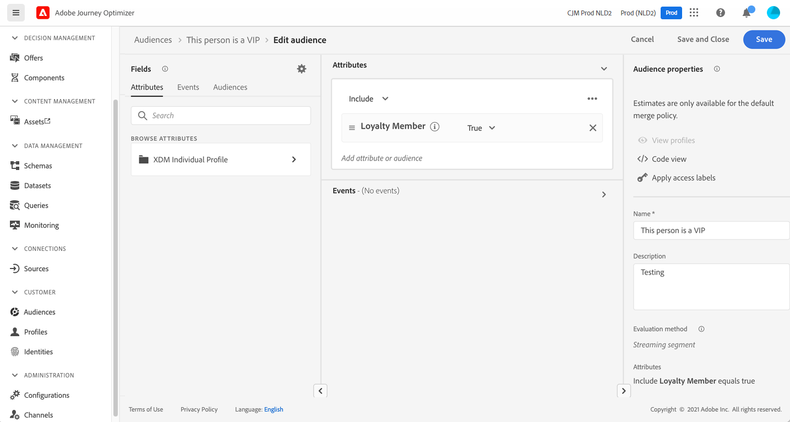

# Creación de su primer recorrido{#jo-quick-start}

## Requisitos previos{#start-prerequisites}

Para enviar mensajes con recorridos, se requieren las siguientes configuraciones:

1. **Configuración de un evento**: si desea almacenar en déclencheur las recorridos de forma unitaria cuando se recibe un evento, debe configurar un evento. Usted define la información esperada y cómo procesarla. Este paso lo realiza un **usuario técnico**. [Más información](../event/about-events.md).

   

1. **Crear un segmento**: el recorrido también puede escuchar segmentos de Adobe Experience Platform para enviar mensajes en lote a un conjunto especificado de perfiles. Para ello, debe crear segmentos. [Más información](../segment/about-segments.md).

   

1. **Configuración de la fuente de datos**: puede definir una conexión a un sistema para recuperar información adicional que se utilizará en los recorridos, por ejemplo, en las condiciones. También se configura una fuente de datos integrada de Adobe Experience Platform en el momento del aprovisionamiento. Este paso no es necesario si solo se aprovechan los datos de los eventos durante el recorrido. Este paso lo realiza un **usuario técnico**. [Más información](../datasource/about-data-sources.md)

   

1. **Configuración de una acción**: Si utiliza un sistema de terceros para enviar mensajes, puede crear una acción personalizada. Obtenga más información en esta [sección](../action/action.md). Este paso lo realiza un **usuario técnico**. Si utiliza las funciones de mensajes integradas de Journey Optimizer, solo necesita añadir una acción de canal al recorrido y diseñar el contenido.

   

## Recorridos de acceso {#journey-access}

En la sección del menú ADMINISTRACIÓN DE RECORRIDO, haga clic en **[!UICONTROL Recorridos]**. Hay dos pestañas disponibles:

**Información general**: esta pestaña muestra un panel con métricas clave relacionadas con los recorridos:

* **Perfiles procesados**: número total de perfiles procesados en las últimas 24 horas
* **Recorridos en directo**: número total de recorridos en directo con tráfico durante las últimas 24 horas. Los recorridos activos incluyen **Recorridos unitarios** (basado en eventos) y **Recorridos por lotes** (leer segmento).
* **Tasa de error**: proporción de todos los perfiles con error comparada con el número total de perfiles introducidos durante las últimas 24 horas.
* **Tasa de descarte**: proporción de todos los perfiles descartados en comparación con el número total de perfiles introducidos durante las últimas 24 horas. Un perfil descartado representa a alguien que no cumple los requisitos para entrar en el recorrido, por ejemplo, debido a un área de nombres incorrecta o a reglas de reentrada.

>[!NOTE]
>
>Este tablero tiene en cuenta los recorridos con tráfico de las últimas 24 horas. Solo se muestran los recorridos a los que tiene acceso.

**Examinar**: esta pestaña muestra la lista de recorridos existentes. Puede buscar recorridos, utilizarlos y realizar acciones básicas en cada elemento. Por ejemplo, puede duplicar o eliminar un elemento. Para obtener más información, consulte [esta sección](../start/user-interface.md#filter-lists).

En la lista de recorridos, puede filtrarlos según su estado, tipo y versión en **[!UICONTROL Estado y versión de filtros]**. El tipo puede ser: **[!UICONTROL Evento unitario]**, **[!UICONTROL Clasificación del segmento]**, **[!UICONTROL Leer segmento]**, **[!UICONTROL Evento empresarial]** o **[!UICONTROL Ráfaga]**.

Puede elegir mostrar solo los recorridos que utilizan un evento, un grupo de campos o una acción en **[!UICONTROL Filtros de actividad]** y **[!UICONTROL Filtros de datos]**. Además, la variable **[!UICONTROL Filtros de publicación]** permite seleccionar una fecha de publicación o un usuario. Puede elegir, por ejemplo, mostrar las versiones más recientes de recorridos en directo que se publicaron ayer. [Más información](../building-journeys/using-the-journey-designer.md).

Utilice las columnas **[!UICONTROL Última actualización]** y **[!UICONTROL Última actualización hecha por]** para comprobar cuándo se produjo la última actualización de los recorridos y quién los guardó.

En los paneles Evento, Fuente de datos y Configuración de acciones, el campo **[!UICONTROL Utilizado en]** muestra el número de recorridos que utilizan ese evento, grupo de campos o acción en particular. Puede hacer clic en el botón **[!UICONTROL Ver recorridos]** para mostrar la lista de los recorridos correspondientes.

## Cree su recorrido{#jo-build}

>[!CONTEXTUALHELP]
>id="ajo_journey_create"
>title="Cree su recorrido"
>abstract="Esta pantalla muestra la lista de recorridos existentes. Abra un recorrido o haga clic en “Crear recorrido” y combine las diferentes actividades de evento, orquestación y acción para crear sus escenarios multicanal de varios pasos."

Este paso lo realiza el **usuario empresarial**. Aquí es donde se crean los recorridos. Combine las distintas actividades de evento, orquestación y acción para crear sus escenarios de canal cruzado de varios pasos.

Estos son los pasos principales para enviar mensajes a través de recorridos:

1. Desde el **Examinar** pestaña, haga clic en **[!UICONTROL Crear Recorrido]** para crear un nuevo recorrido.

1. Edite las propiedades del recorrido en el panel de configuración que se muestra en el lado derecho. Obtenga más información en esta [sección](journey-gs.md#change-properties).

   

1. Comience arrastrando y soltando un evento o una **Leer segmento** actividad desde la paleta al lienzo. Para obtener más información sobre el diseño de recorridos, consulte [esta sección](using-the-journey-designer.md).

   

1. Arrastre y suelte los siguientes pasos que seguirá el individuo. Por ejemplo, puede agregar una condición seguida de una acción del canal. Para obtener más información sobre las actividades, consulte [esta sección](using-the-journey-designer.md).

1. Pruebe el recorrido con perfiles de prueba. Obtenga más información en esta [sección](testing-the-journey.md)

1. Publique el recorrido para activarlo. Obtenga más información en esta [sección](publishing-the-journey.md).

   

1. Monitorice su recorrido con las herramientas de sistema de informes específicas para medir la efectividad de su recorrido. Obtenga más información en esta [sección](../reports/live-report.md).

   

## Definición de las propiedades del recorrido {#change-properties}

>[!CONTEXTUALHELP]
>id="ajo_journey_properties"
>title="Propiedades del recorrido"
>abstract="Esta sección muestra las propiedades del recorrido. De forma predeterminada, los parámetros de solo lectura están ocultos. La configuración disponible depende del estado del recorrido, de los permisos y de la configuración del producto."

Haga clic en el icono de lápiz, en la parte superior derecha para acceder a las propiedades del recorrido.

Puede cambiar el nombre del recorrido, añadir una descripción, permitir la reentrada, elegir las fechas de inicio y finalización y, como usuario administrador, definir una **[!UICONTROL Tiempo de espera y error]** duración. También puede asignar etiquetas unificadas de Adobe Experience Platform al recorrido. Esto le permite clasificarlos fácilmente y mejorar la búsqueda desde la lista de campañas. [Descubra cómo trabajar con campañas](../start/search-filter-categorize.md#tags)

En el caso de los recorridos activos, esta pantalla muestra la fecha de publicación y el nombre del usuario que publicó el recorrido.

El **Copiar detalles técnicos** permite copiar información técnica sobre el recorrido que el equipo de asistencia puede utilizar para solucionar problemas. Se copia la siguiente información: JourneyVersion UID, OrgID, orgName, sandboxName, lastDeployedBy, lastDeployedAt.

### Entrada{#entrance}

De forma predeterminada, los nuevos recorridos permiten la reentrada. Puede desmarcar las **Permitir la reentrada** opción para recorridos de &quot;una sola toma&quot;, por ejemplo, si desea ofrecer un regalo de una sola vez cuando una persona entra en una tienda.

Si la variable **Permitir la reentrada** está activada, la opción **Período de espera de reentrada** se muestra el campo. Este campo permite definir el tiempo de espera antes de permitir que un perfil vuelva a entrar en el recorrido en recorridos unitarios (empezando por un evento o una calificación de segmentos). Esto evita que los recorridos se activen varias veces por error para el mismo evento. De forma predeterminada, el campo se establece en 5 minutos.

Obtenga más información sobre la administración de entradas de perfil, en [esta sección](entry-management.md).

### Administrar acceso {#access}

Para asignar etiquetas de uso de datos personalizadas o principales al recorrido, haga clic en **[!UICONTROL Administrar acceso]** botón. [Más información sobre el Control de acceso de nivel de objeto (OLA)](../administration/object-based-access.md)

### Zona horaria y zona horaria del perfil {#timezone}

La zona horaria se define en el nivel de recorrido.

Puede introducir una zona horaria fija o utilizar perfiles de Adobe Experience Platform para definir la zona horaria de recorrido.

Si se define una zona horaria en el perfil de Adobe Experience Platform, se puede recuperar en la recorrido.

Para obtener más información sobre la administración de huso horario, consulte [esta página](../building-journeys/timezone-management.md).

### Fechas de inicio y finalización {#dates}

Puede definir un **Fecha de inicio**. Si no ha especificado ninguna, se definirá automáticamente en el momento de la publicación.

También puede agregar un **Fecha de finalización**. Esto permite que los perfiles salgan automáticamente cuando se alcanza la fecha. Si no especifica una fecha de finalización, los perfiles pueden permanecer hasta el tiempo de espera de recorrido predeterminado (generalmente 30 días, 7 días con la oferta de complementos de Healthcare Shield). La única excepción son los recorridos de segmentos de lectura recurrentes con **Forzar reentrada en repetición** activado, que finalizan en la fecha de inicio de la siguiente incidencia.

### Tiempo de espera y error en actividades de recorrido {#timeout_and_error}

Al editar una actividad de acción o condición, tiene la opción de especificar una ruta alternativa en caso de error o tiempo de espera. Si el procesamiento de la actividad, que implica consultar un sistema de terceros, supera la duración especificada en las propiedades del recorrido para el tiempo de espera y la administración de errores (**[!UICONTROL Tiempo de espera y error]** ), se seleccionará la segunda ruta para ejecutar una acción de reserva si es necesario.

Los valores autorizados están entre 1 y 30 segundos.

Le recomendamos que defina una variable muy corta **[!UICONTROL Tiempo de espera y error]** valor si el recorrido distingue entre tiempo y minúsculas (por ejemplo: reacción a la ubicación en tiempo real de una persona) porque no puede retrasar la acción más de unos segundos. Si el recorrido distingue menos del tiempo, puede utilizar un valor más largo para dar más tiempo al sistema llamado para enviar una respuesta válida.

Recorrido también utiliza un tiempo de espera global. Consulte la [sección siguiente](#global_timeout).

### Tiempo de espera de recorrido global {#global_timeout}

Además de las [timeout](#timeout_and_error) cuando se utiliza en actividades de recorrido, también se agota el tiempo de espera de recorrido global, que no se muestra en la interfaz y no se puede cambiar. Este tiempo de espera detiene el progreso de las personas en el recorrido 30 días después de su entrada. Esto significa que el recorrido de una persona no puede durar más de 30 días. Después del periodo de espera de 30 días, se eliminan los datos del individuo. Las personas que sigan fluyendo en el recorrido al final del periodo de tiempo de espera se detendrán y se tendrán en cuenta como errores en la creación de informes.

>[!NOTE]
>
>Los recorridos no reaccionan directamente a las solicitudes de exclusión, acceso o eliminación de privacidad. Sin embargo, el tiempo de espera global garantiza que las personas nunca permanezcan más de 30 días en ningún recorrido.

Debido al tiempo de espera de recorrido de 30 días, cuando no se permite la reentrada al recorrido, no podemos asegurarnos de que el bloqueo de reentrada funcione durante más de 30 días. De hecho, al eliminar toda la información sobre las personas que ingresaron al recorrido 30 días después de su entrada, no podemos saber la persona ingresada anteriormente, hace más de 30 días.

