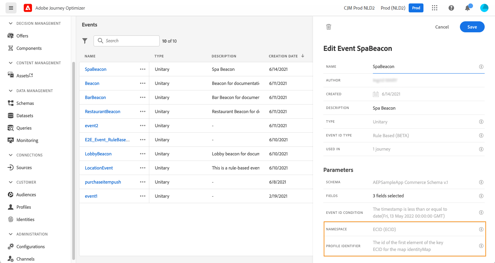

# Creación de su primer recorrido{#jo-quick-start}

>[!CONTEXTUALHELP]
>id="ajo_homepage_card2"
>title="Creación de recorridos"
>abstract="Utilice **Adobe Journey Optimizer** para crear casos de uso de orquestación en tiempo real aprovechando los datos contextuales almacenados en eventos o fuentes de datos."

## Requisitos previos{#start-prerequisites}

Para enviar mensajes con recorridos, se requieren las siguientes configuraciones:

1. **Configuración de un evento**: si desea almacenar en déclencheur las recorridos de forma unitaria cuando se recibe un evento, debe configurar un evento. Usted define la información esperada y cómo procesarla. Este paso lo realiza un **usuario técnico**. [Más información](../event/about-events.md).

   

1. **Crear una audiencia**: el recorrido también puede escuchar a las audiencias de Adobe Experience Platform para enviar mensajes en lote a un conjunto especificado de perfiles. Para ello, debe crear audiencias. [Más información](../audience/about-audiences.md).

   

1. **Configuración de la fuente de datos**: puede definir una conexión a un sistema para recuperar información adicional que se utilizará en los recorridos, por ejemplo, en las condiciones. También se configura una fuente de datos integrada de Adobe Experience Platform en el momento del aprovisionamiento. Este paso no es necesario si solo se aprovechan los datos de los eventos durante el recorrido. Este paso lo realiza un **usuario técnico**. [Más información](../datasource/about-data-sources.md)

   

1. **Configuración de una acción**: Si utiliza un sistema de terceros para enviar mensajes, puede crear una acción personalizada. Obtenga más información en esta [sección](../action/action.md). Este paso lo realiza un **usuario técnico**. Si utiliza las funciones de mensajes integradas de Journey Optimizer, solo necesita añadir una acción de canal al recorrido y diseñar el contenido.

   

## Acceso a recorridos {#journey-access}

>[!CONTEXTUALHELP]
>id="ajo_journey_create"
>title="Recorridos"
>abstract="Diseñar recorridos de clientes para ofrecer experiencias personalizadas y contextuales. Journey Optimizer permite crear casos prácticos de orquestación en tiempo real con información contextual almacenada en eventos o fuentes de datos. La pestaña **Información general** muestra un panel con métricas clave relacionadas con los recorridos. La pestaña **Examinar** muestra la lista de recorridos existentes."

### Métricas clave y lista de recorridos {#access-metrics}

En la sección del menú ADMINISTRACIÓN DE RECORRIDO, haga clic en **[!UICONTROL Recorridos]**. Hay dos pestañas disponibles:

**Información general**: esta pestaña muestra un panel con métricas clave relacionadas con los recorridos:

* **Perfiles procesados**: número total de perfiles procesados en las últimas 24 horas
* **Recorridos en directo**: número total de recorridos en directo con tráfico durante las últimas 24 horas. Los recorridos activos incluyen **Recorridos unitarios** (basado en eventos) y **Recorridos por lotes** (leer audiencia).
* **Tasa de error**: proporción de todos los perfiles con error comparada con el número total de perfiles introducidos durante las últimas 24 horas.
* **Tasa de descarte**: proporción de todos los perfiles descartados en comparación con el número total de perfiles introducidos durante las últimas 24 horas. Un perfil descartado representa a alguien que no cumple los requisitos para entrar en el recorrido, por ejemplo, debido a un área de nombres incorrecta o a reglas de reentrada.

>[!NOTE]
>
>Este tablero tiene en cuenta los recorridos con tráfico de las últimas 24 horas. Solo se muestran los recorridos a los que tiene acceso. Las métricas se actualizan cada 30 minutos y solo cuando hay nuevos datos disponibles.

**Examinar**: esta pestaña muestra la lista de recorridos existentes. Puede buscar recorridos, utilizarlos y realizar acciones básicas en cada elemento. Por ejemplo, puede duplicar o eliminar un elemento. Para obtener más información, consulte [esta sección](../start/user-interface.md#filter-lists).

### Filtrar recorridos {#filter}

En la lista de recorridos, puede aprovechar varios filtros para restringir la lista de recorridos y mejorar la legibilidad.

Estas son las distintas operaciones de filtrado que puede realizar:

Filtre los recorridos según su estado, tipo, versión y etiquetas asignadas en **[!UICONTROL Filtros de estado y versión]**.

El tipo puede ser: **[!UICONTROL Evento unitario]**, **[!UICONTROL Calificación de audiencia]**, **[!UICONTROL Leer audiencia]** o **[!UICONTROL Evento empresarial]**.

El estado puede ser el siguiente:

* **Cerrado**: el recorrido se ha cerrado utilizando el **Cerca de nuevas entradas** botón. El recorrido deja de permitir que nuevas personas entren en el recorrido. Las personas que ya están en el recorrido pueden terminar el recorrido normalmente.
* **Borrador**: el recorrido se encuentra en su primera fase. Aún no se ha publicado.
* **Borrador (Pruebas)**: el modo de prueba se ha activado utilizando la variable **Modo de prueba** botón.
* **Finalizado**: el recorrido cambia automáticamente a este estado después del tiempo de espera global predeterminado de 30 días. Los perfiles que ya están en el recorrido finalizan el recorrido normalmente. Los nuevos perfiles ya no pueden entrar en el recorrido.
* **Activo**: el recorrido se ha publicado utilizando la variable **Publish** botón.
* **Detenido**: el recorrido se ha apagado usando el **Detener** botón. Todos los individuos abandonan el recorrido al instante.

>[!NOTE]
>
>El ciclo de vida de creación de Recorridos también incluye un conjunto de estados intermedios que no están disponibles para el filtrado: &quot;Publicación&quot; (entre &quot;Borrador&quot; y &quot;Activo&quot;), &quot;Activación del modo de prueba&quot; o &quot;Desactivación del modo de prueba&quot; (entre &quot;Borrador&quot; y &quot;Borrador (prueba)&quot;) y &quot;Detención&quot; entre &quot;Activo&quot; y &quot;Detenido&quot;). Cuando un recorrido está en un estado intermedio, es de solo lectura.

Utilice el **[!UICONTROL Filtros de creación]** para filtrar los recorridos según su fecha de creación o el usuario que los ha creado.

Mostrar recorridos que utilizan un evento, un grupo de campos o una acción específicos del **[!UICONTROL Filtros de actividad]** y **[!UICONTROL Filtros de datos]**.

Utilice el **[!UICONTROL Filtros de publicación]** para seleccionar una fecha de publicación o un usuario. Puede elegir, por ejemplo, mostrar las versiones más recientes de recorridos en directo que se publicaron ayer.

Para filtrar recorridos basados en un intervalo de fechas específico, seleccione **[!UICONTROL Personalizado]** desde el **[!UICONTROL Publicado]** lista desplegable.

Además, en los paneles Evento, Fuente de datos y Configuración de acciones, la variable **[!UICONTROL Utilizado en]** El campo muestra el número de recorridos que utilizan ese evento, grupo de campos o acción en particular. Puede hacer clic en el botón **[!UICONTROL Ver recorridos]** para mostrar la lista de los recorridos correspondientes.

## Cree su recorrido{#jo-build}

Este paso lo realiza el **usuario empresarial**. Aquí es donde se crean los recorridos. Combine las distintas actividades de evento, orquestación y acción para crear sus escenarios de canales cruzados de varios pasos.

➡️ [Descubra esta función en vídeo](journey.md#video)

Estos son los pasos principales para enviar mensajes a través de recorridos:

1. Desde el **Examinar** pestaña, haga clic en **[!UICONTROL Crear Recorrido]** para crear un nuevo recorrido.

1. Edite las propiedades del recorrido en el panel de configuración que se muestra en el lado derecho. Obtenga más información en esta [sección](journey-gs.md#change-properties).

   

1. Comience arrastrando y soltando un evento o una **Leer audiencia** actividad desde la paleta al lienzo. Para obtener más información sobre el diseño de recorridos, consulte [esta sección](using-the-journey-designer.md).

   

1. Arrastre y suelte los siguientes pasos que seguirá el individuo. Por ejemplo, puede agregar una condición seguida de una acción del canal. Para obtener más información sobre las actividades, consulte [esta sección](using-the-journey-designer.md).

1. Pruebe el recorrido con perfiles de prueba. Obtenga más información en esta [sección](testing-the-journey.md)

1. Publique el recorrido para activarlo. Obtenga más información en esta [sección](publishing-the-journey.md).

   

1. Monitorice su recorrido con las herramientas de sistema de informes específicas para medir la efectividad de su recorrido. Obtenga más información en esta [sección](../reports/live-report.md).

   

## Definición de las propiedades del recorrido {#change-properties}

>[!CONTEXTUALHELP]
>id="ajo_journey_properties"
>title="Propiedades del recorrido"
>abstract="Esta sección muestra las propiedades del recorrido. De forma predeterminada, los parámetros de solo lectura están ocultos. La configuración disponible depende del estado del recorrido, de los permisos y de la configuración del producto."

>[!CONTEXTUALHELP]
>id="ajo_journey_exit_criterias"
>title="Criterios de salida del recorrido"
>abstract="En esta sección se muestran las opciones de criterios de salida. Puede crear una o varias reglas de criterios de salida para el recorrido."

Haga clic en el recorrido de lápiz, junto al nombre, para acceder a sus propiedades.

Puede cambiar el nombre del recorrido, añadir una descripción, permitir la reentrada, elegir las fechas de inicio y finalización y, como usuario administrador, definir una **[!UICONTROL Tiempo de espera y error]** duración. También puede asignar etiquetas unificadas de Adobe Experience Platform al recorrido. Esto le permite clasificarlos fácilmente y mejorar la búsqueda desde la lista de campañas. [Descubra cómo trabajar con campañas](../start/search-filter-categorize.md#tags)

En el caso de los recorridos activos, esta pantalla muestra la fecha de publicación y el nombre del usuario que publicó el recorrido.

El **Copiar detalles técnicos** permite copiar información técnica sobre el recorrido que el equipo de asistencia puede utilizar para solucionar problemas. Se copia la siguiente información: JourneyVersion UID, OrgID, orgName, sandboxName, lastDeployedBy, lastDeployedAt.

### Entrada y reentrada {#entrance}

De forma predeterminada, los nuevos recorridos permiten la reentrada. Puede desmarcar las **Permitir la reentrada** opción para recorridos de &quot;una sola toma&quot;, por ejemplo, si desea ofrecer un regalo de una sola vez cuando una persona entra en una tienda.

Si la variable **Permitir la reentrada** está activada, la opción **Período de espera de reentrada** se muestra el campo. Este campo permite definir el tiempo de espera antes de permitir que un perfil vuelva a entrar en el recorrido en el caso de recorridos unitarios (empezando con un evento o una calificación de público). Esto evita que los recorridos se activen varias veces por error para el mismo evento. De forma predeterminada, el campo se establece en 5 minutos. La duración máxima es de 29 días.

Obtenga más información acerca de la administración de entrada y reentrada de perfiles, en [esta sección](entry-management.md).

### Administrar acceso {#manage-access}

Para asignar etiquetas de uso de datos personalizadas o principales al recorrido, haga clic en **[!UICONTROL Administrar acceso]** botón. [Más información sobre el Control de acceso de nivel de objeto (OLA)](../administration/object-based-access.md)

### Zonas horarias de recorrido y perfil {#timezone}

La zona horaria se define en el nivel de recorrido. Puede introducir una zona horaria fija o utilizar perfiles de Adobe Experience Platform para definir la zona horaria de recorrido. Si se define una zona horaria en el perfil de Adobe Experience Platform, se puede recuperar en la recorrido.

Para obtener más información sobre la administración de huso horario, consulte [esta página](../building-journeys/timezone-management.md).

### Fechas de inicio y finalización {#dates}

Puede definir un **Fecha de inicio**. Si no ha especificado ninguna, se definirá automáticamente en el momento de la publicación.

También puede agregar un **Fecha de finalización**. Esto permite que los perfiles salgan automáticamente cuando se alcanza la fecha. Si no se especifica una fecha de finalización, los perfiles pueden permanecer hasta la [tiempo de espera de recorrido global](#global_timeout) (que generalmente es de 30 días y se reduce a 7 días con la oferta complementaria Escudo de atención sanitaria). La única excepción son los recorridos de audiencia de lectura recurrentes con **Forzar reentrada en repetición** activado, que finalizan en la fecha de inicio de la siguiente incidencia.

### Tiempo de espera y error en actividades de recorrido {#timeout_and_error}

Al editar una actividad de acción o condición, puede definir una ruta alternativa en caso de error o tiempo de espera. Si el procesamiento de la actividad que busca un sistema de terceros supera el tiempo de espera definido en las propiedades del recorrido (**[!UICONTROL Tiempo de espera y error]** ), se elegirá la segunda ruta para realizar una posible acción de reserva.

Los valores autorizados están entre 1 y 30 segundos.

Le recomendamos que defina una variable muy corta **[!UICONTROL Tiempo de espera y error]** valor si el recorrido distingue entre tiempo y minúsculas (por ejemplo: reacción a la ubicación en tiempo real de una persona) porque no puede retrasar la acción más de unos segundos. Si el recorrido distingue menos del tiempo, puede utilizar un valor más largo para dar más tiempo al sistema llamado para enviar una respuesta válida.

Recorrido también utiliza un tiempo de espera global. Consulte la [sección siguiente](#global_timeout).

### Tiempo de espera de recorrido global {#global_timeout}

Además de las [timeout](#timeout_and_error) cuando se utiliza en actividades de recorrido, también se agota el tiempo de espera de recorrido global, que no se muestra en la interfaz y no se puede cambiar.

Este tiempo de espera global detiene el progreso de los individuos en el recorrido **30 días** después de que entren. Este tiempo de espera se reduce a **7 días** con la oferta complementaria Escudo de atención sanitaria. Esto significa que el recorrido de una persona no puede durar más de 30 días (o 7 días). Después de este período de tiempo de espera, se eliminan los datos del individuo. Las personas que sigan fluyendo en el recorrido al final del periodo de tiempo de espera se detendrán y no se tendrán en cuenta en los informes. Por lo tanto, podría ver más personas entrando en el recorrido que saliendo.

>[!NOTE]
>
>Los recorridos no reaccionan directamente a las solicitudes de exclusión, acceso o eliminación de privacidad. Sin embargo, el tiempo de espera global garantiza que las personas nunca permanezcan más de 30 días en ningún recorrido.

Debido al tiempo de espera de recorrido de 30 días, cuando no se permite la reentrada al recorrido, no podemos asegurarnos de que el bloqueo de reentrada funcione durante más de 30 días. De hecho, al eliminar toda la información sobre las personas que ingresaron al recorrido 30 días después de su entrada, no podemos saber la persona ingresada anteriormente, hace más de 30 días.

Un individuo solo puede entrar a una actividad de espera si le queda tiempo suficiente en el recorrido recorrido para completar la duración de la espera antes del tiempo de espera de 30 días. Consulte [esta página](../building-journeys/wait-activity.md).

## Duplicación de un recorrido {#duplicate-a-journey}

Puede duplicar un recorrido existente desde el **Examinar** pestaña. Todos los objetos y configuraciones se duplican en la copia de recorrido.

Para ello, siga los pasos a continuación:

1. Vaya al recorrido que desee copiar y haga clic en **Más acciones** (los tres puntos junto al nombre del recorrido).
1. Seleccione **Duplicar**.

   

1. Introduzca el nombre del recorrido y confírmelo. También puede cambiar el nombre en la pantalla de propiedades del recorrido. De forma predeterminada, el nombre se establece de la siguiente manera: `[JOURNEY-NAME]_copy`

   

1. El nuevo recorrido se crea y está disponible en la lista de recorridos.
