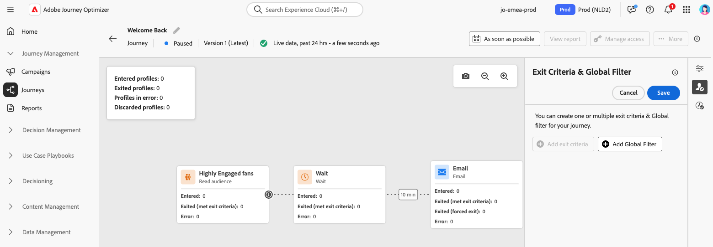

# Pausar un recorrido {#journey-pause}

>[!CONTEXTUALHELP]
>id="ajo_journey_pause"
>title="Pausar el recorrido"
>abstract="Pausar un recorrido activo para evitar que entren nuevos perfiles. Elija si desea descartar los perfiles que están actualmente en la recorrido o mantenerlos en su lugar. Si se retienen, se reanudará la ejecución en la siguiente actividad de acción una vez que se reinicie el recorrido. Perfecto para actualizaciones o paradas de emergencia sin perder progreso."

Puede pausar los recorridos activos, realizar todos los cambios necesarios y reanudarlos de nuevo en cualquier momento.<!--You can choose whether the journey is resumed at the end of the pause period, or whether it stops completely. --> Durante la pausa, puede [aplicar filtros globales](#journey-global-filters) para excluir perfiles en función de sus atributos. El recorrido se reanuda automáticamente al final del período de pausa. También puede [reanudarlo manualmente](#journey-resume-steps).

>[!AVAILABILITY]
>
>Esta versión solo está disponible para un conjunto de organizaciones (disponibilidad limitada). Para obtener acceso, póngase en contacto con su representante de Adobe.

## Ventajas principales {#journey-dry-run-benefits}

Los recorridos de pausa y reanudación proporcionan a los profesionales del recorrido un mayor control y flexibilidad al permitir que los recorridos en directo se suspendan temporalmente sin interrumpir la experiencia del cliente. Cuando está en pausa, no se envían comunicaciones y los perfiles permanecen en estado suspendido hasta que se reanuda la recorrido.

Esta capacidad reduce el riesgo de enviar mensajes no deseados durante errores o actualizaciones (p. ej.: cambio en el contenido del mensaje), admite una administración más segura del recorrido y aumenta la confianza del profesional. La visibilidad de los recorridos en pausa y su estado directamente en la IU mejora aún más la transparencia y la agilidad operativa.

>[!CAUTION]
>
>Los permisos para pausar y reanudar recorridos están restringidos a los usuarios con el permiso de alto nivel **[!DNL Publish journeys]**. Obtenga más información acerca de la administración de los derechos de acceso de los usuarios de [!DNL Journey Optimizer] en [esta sección](../administration/permissions-overview.md).

## Mecanismos de protección y recomendaciones

* Una versión de recorrido se puede pausar durante un máximo de 14 días.
* Los recorridos en pausa se consideran en todas las reglas de negocio, del mismo modo que si estuvieran activos.
* Los perfiles se &quot;descartan&quot; en un recorrido pausado cuando llegan a una actividad de acción. Si permanecen en espera durante el tiempo en que se pausa un recorrido y salen después de que se haya reanudado, continuarán con el recorrido y no se descartarán.
* Incluso después de la pausa, a medida que los eventos se siguen procesando, estos eventos se contarán hacia el número de Eventos de Recorrido por segundo de cuota, después de lo cual la restricción se obtiene por unitaria.
* Los perfiles que habían entrado en el recorrido pero que se descartaron durante la pausa se contarían como perfiles atractivos.
* Cuando los perfiles se mantienen en un recorrido pausado, en el momento de la reanudación se actualizan los atributos del perfil
* Las condiciones se siguen ejecutando en recorridos pausados, por lo que si un recorrido se ha pausado debido a problemas de calidad de datos, cualquier condición anterior a un nodo de acción se puede evaluar con datos incorrectos.
* Para el recorrido de audiencia de lectura incremental basado en audiencias, se tiene en cuenta la duración de la pausa. Por ejemplo, para un recorrido diario, si se pausó el 2 y se reanudó el 5 del mes, la ejecución del 6 tomará todos los perfiles que se hayan clasificado del 1 al 6. Este no es el caso de la calificación de audiencias o de los recorridos basados en eventos (si se recibe una calificación de audiencia o un evento durante una pausa, esos eventos se descartan).
* Los recorridos en pausa se cuentan hacia la cuota de recorridos activos.
* El tiempo de espera global de recorrido sigue aplicándose a los recorridos en pausa. Por ejemplo, si un perfil estuvo en un recorrido durante 90 días y el recorrido está en pausa, este perfil seguirá saliendo del recorrido el día 91.
* Si los perfiles se mantienen en un recorrido y este recorrido se reanuda automáticamente pasados unos días, los perfiles continúan con el recorrido y no se pierden. Si desea soltarlos, debe detener el recorrido.
  <!--* There is a guardrail (at an org level) on the max number of profiles that can be held in paused journeys. This guardrail is per org, and is visible in the journey inventory on a new bar (only visible when there are paused journeys).-->

## Pausa de un recorrido {#journey-pause-steps}

Puede pausar cualquier recorrido de **Live**.

Para pausar el recorrido, siga estos pasos:

1. Abra el recorrido en el que desee hacer una pausa.
1. Haga clic en el botón **...Más** de la sección superior derecha del lienzo de recorrido y seleccione **Pausar**.

   {width="80%" align="left"}

1. Seleccione cómo administrar los perfiles que están actualmente en el recorrido.

   {width="50%" align="left"}

   Puede hacer lo siguiente:

   * **Retener** perfiles: los perfiles esperarán a que se reanude el recorrido
   * **Descartar** perfiles: los perfiles se excluirán del recorrido en el siguiente nodo de acción

1. Haga clic en el botón **Pausar** para confirmar.

Desde la lista de recorridos, puede pausar uno o varios recorridos **Live**. Para pausar un grupo de recorridos (_pausa masiva_), selecciónelos en la lista y haga clic en el botón **Pausar** de la barra azul en la parte inferior de la pantalla. El botón **Pausar** solo está disponible cuando se seleccionan **recorridos en vivo**.

{width="80%" align="left"}

## Cómo reanudar un recorrido pausado {#journey-resume-steps}

>[!CONTEXTUALHELP]
>id="ajo_journey_pause"
>title="Reanudar el recorrido"
>abstract="Reanude un recorrido pausado para permitir que los nuevos perfiles vuelvan a entrar. Si los perfiles estaban esperando durante la pausa, continuarán con su recorrido. Ideal para reiniciar los recorridos de forma segura después de actualizaciones o pausas."

Los recorridos en pausa se reanudan automáticamente al final del período máximo de pausa de 14 días. Se pueden reanudar manualmente en cualquier momento. Reanudar un recorrido pausado permite que los nuevos perfiles vuelvan a entrar. Si los perfiles estaban esperando durante la pausa, continuarán con su recorrido. Ideal para reiniciar los recorridos de forma segura después de actualizaciones o pausas.

Para reanudar un recorrido en pausa y comenzar a escuchar eventos de recorrido de nuevo, siga estos pasos:

1. Abra el recorrido que desea reanudar.
1. Haga clic en el botón **...Más** de la sección superior derecha del lienzo de recorrido y seleccione **Reanudar**.

   El recorrido cambia al estado **Reanudando**. La transición del estado **Reanudando** a **Activo** puede tardar un poco: todos los perfiles deben reanudarse para que el recorrido vuelva a estar **Activo**.

1. Haga clic en el botón **Reanudar** para confirmar.

Desde la lista de sus recorridos, puede reanudar uno o varios **recorridos pausados**. Para reanudar un grupo de recorridos (_reanudación masiva_), selecciónelos y haga clic en el botón **Reanudar** ubicado en la barra azul en la parte inferior de la pantalla. Tenga en cuenta que el botón **Reanudar** solo estará disponible cuando se seleccionen **recorridos en pausa**.

## Aplicación de un filtro global a perfiles en un recorrido pausado  {#journey-global-filters}

Cuando un recorrido está en pausa, puede aplicar un filtro global basado en atributos de perfil. Este filtro habilita la exclusión de perfiles que coinciden con la expresión definida en el momento de la reanudación. Los perfiles que coincidan con los criterios que están actualmente en la recorrido lo cerrarán y se bloquearán los nuevos perfiles que intenten entrar.

Por ejemplo, para excluir a todos los clientes franceses de las comunicaciones de marketing con Francia, siga estos pasos:

1. Desplácese hasta el recorrido en pausa que desee modificar.

1. Haga clic en el icono **Criterios de salida y filtro global**.

   {width="50%" align="left"}

1. En la configuración de **Criterios de salida y filtro global**, defina un filtro basado en atributos de perfil.

1. Establezca la expresión para excluir perfiles donde el atributo de país sea igual a Francia.

   {width="50%" align="left"}

1. Guarde el filtro y haga clic en el botón **Actualizar recorrido** para aplicar los cambios.

1. [Reanudar el recorrido](#journey-resume-steps).

   En el momento de la reanudación, todos los perfiles con el atributo de país establecido en Francia se excluirán automáticamente del recorrido. Se bloqueará cualquier nuevo perfil con el atributo de país establecido en Francia que intente entrar en el recorrido.

Tenga en cuenta que las exclusiones de perfiles para perfiles que se encuentran actualmente en la recorrido y para perfiles nuevos solo se producirán cuando lleguen a un nodo de acción.

>[!CAUTION]
>
>* Solo puede establecer **un** filtro global por recorrido.
>
>* Solo puede crear, actualizar o eliminar un filtro global en **recorridos pausados**.