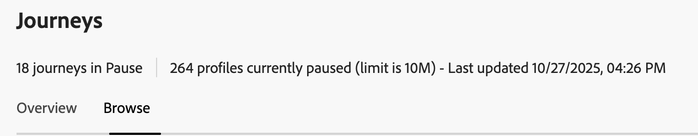
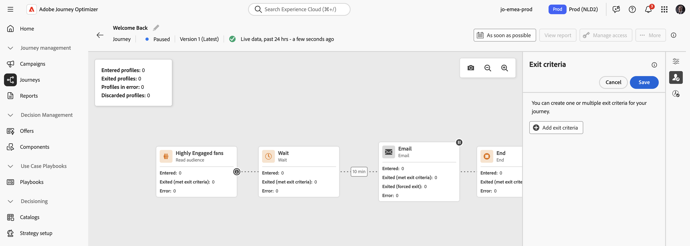

# Pausa de un recorrido {#journey-pause}

>[!CONTEXTUALHELP]
>id="ajo_journey_pause"
>title="Pause su recorrido"
>abstract="Pause un recorrido activo para evitar que entren nuevos perfiles. Pause un recorrido activo para evitar que entren nuevos perfiles. Si se conservan, se reanudará su ejecución en la siguiente actividad de acción una vez que se reinicie el recorrido. Es perfecto para actualizaciones o paradas de emergencia sin perder progreso."

Puede pausar los recorridos activos, realizar todos los cambios necesarios y reanudarlos de nuevo en cualquier momento.<!--You can choose whether the journey is resumed at the end of the pause period, or whether it stops completely. --> Durante la pausa, puede [aplicar criterios de salida de atributo de perfil](#journey-exit-criteria) para excluir perfiles en función de sus atributos. El recorrido se reanuda automáticamente al final del período de pausa. También puede [reanudarlo manualmente](#journey-resume-steps).

## Ventajas principales {#journey-pause-benefits}

Los recorridos de pausa y reanudación proporcionan a los profesionales del recorrido un mayor control y flexibilidad al permitir que los recorridos en directo se suspendan temporalmente sin interrumpir la experiencia del cliente. Cuando están en pausa, no se envían comunicaciones y los perfiles permanecen en estado suspendido hasta que se reanuda el recorrido.

Esta capacidad reduce el riesgo de enviar mensajes no deseados durante errores o actualizaciones (p. ej.: cambio en el contenido del mensaje), admite una administración más segura del recorrido y aumenta la confianza del profesional. La visibilidad de los recorridos en pausa y su estado directamente en la IU mejora aún más la transparencia y la agilidad operativa.

>[!CAUTION]
>
>* Los permisos para pausar y reanudar recorridos están restringidos a los usuarios con el permiso de alto nivel **[!DNL Publish journeys]**. Obtenga más información acerca de la administración de los derechos de acceso de los usuarios de [!DNL Journey Optimizer] en [esta sección](../administration/permissions-overview.md).
>
>* Antes de empezar a usar la capacidad de pausa/reanudación, [lea las protecciones y limitaciones](#journey-pause-guardrails).


## Pausa de un recorrido {#journey-pause-steps}

Puede pausar cualquier recorrido de **Live**.

Para pausar el recorrido, siga estos pasos:

1. Abra el recorrido en el que desee hacer una pausa.
1. Haga clic en el botón **...Más** de la sección superior derecha del lienzo de recorrido y seleccione **Pausar**.

   

1. Seleccione cómo administrar los perfiles que están actualmente en el recorrido.

   {width="50%" align="left"}

   Puede hacer lo siguiente:

   * **Retener** perfiles: los perfiles esperarán al siguiente nodo **Acción** para que se reanude el recorrido
   * **Descartar** perfiles: los perfiles se excluirán del recorrido en el siguiente nodo **Acción**

1. Haga clic en el botón **Pausar** para confirmar.

El número máximo de perfiles que se pueden mantener en recorridos pausados para la organización es visible en el inventario de recorridos. Solo está visible cuando hay al menos un recorrido en pausa. Este indicador también muestra el número total de recorridos en pausa. Se actualiza cada 30 minutos. Obtenga más información en [Protecciones y limitaciones](#guardrails-and-limitations).

{width="50%" align="left"}

Desde la lista de recorridos, puede pausar uno o varios recorridos **Live**. Para pausar un grupo de recorridos (_pausa masiva_), selecciónelos en la lista y haga clic en el botón **Pausar** de la barra azul en la parte inferior de la pantalla. El botón **Pausar** solo está disponible cuando se seleccionan **recorridos en vivo**.


## Lógica de ejecución de recorridos en pausa {#journey-pause-exec}

Cuando un recorrido está en pausa, las entradas nuevas siempre se descartan, independientemente del modo Mantener/Descartar.

Cuando un recorrido está en pausa, la administración de perfiles y la ejecución de actividades dependen de la actividad. Los comportamientos se detallan a continuación. Para obtener información completa, vea también esta [muestra de extremo a extremo](#journey-pause-sample).


| Actividad de recorrido | Cuando el recorrido está en pausa |
|-------------------------|--------------------------------------------------|
| [Calificación de audiencias](audience-qualification-events.md) | <ul> <li>En el primer nodo del lienzo: se descarta cualquier calificación de perfil para la audiencia </li><li>En otros nodos: igual comportamiento que en un recorrido activo; sin embargo, si la calificación de audiencia es después de una actividad de <strong>Acción</strong> y el usuario está en pausa en esa acción, la calificación de audiencia se descarta. </li></ul> |
| [Evento unitario](general-events.md) | <ul> <li>En el primer nodo del lienzo: el evento se descarta</li><li>En otros nodos: El mismo comportamiento que en un recorrido activo. Sin embargo, si el evento es después de una actividad <strong>Action</strong> y el usuario está en pausa en esa acción, el evento se descarta. </li></ul> |
| [Leer audiencia](read-audience.md) | Igual que en un recorrido en directo, con algunas características específicas: <ol> <li> Si se presionó <strong>Pausa</strong> después de que se iniciara la actividad de <strong>Leer audiencia</strong>, los perfiles que hayan entrado en el recorrido continuarán (hasta la siguiente actividad de <strong>Acción</strong>). A medida que el recorrido lee audiencias a una velocidad determinada, si la audiencia completa aún no ha entrado, los perfiles restantes en la cola se descartarán.</li><li> Para ejecuciones únicas: no se muestra ningún error en el momento de la reanudación si la fecha programada era anterior a la fecha de reanudación. Ese horario sería ignorado.</li><li>Para recorridos incrementales: <ul><li>Si la pausa se produce antes de la primera aparición, al reanudar la audiencia completa se reproduce. </li><li>Si se produce una pausa, por ejemplo, en el cuarto día de una periodicidad diaria y el recorrido permanece en pausa hasta el noveno día, se incluirán en la reanudación todos los perfiles que hayan entrado del cuarto al noveno  </li></ul></ol> |
| [Reacción](reaction-events.md) | Igual que en un recorrido activo. Sin embargo, si se produce después de una actividad de <strong>Action</strong> y el usuario está en pausa durante esa acción, el evento de reacción se descarta. |
| [Espera](wait-activity.md) | Mismo comportamiento que en un recorrido activo |
| [Condición](condition-activity.md) | Mismo comportamiento que en un recorrido activo |
| [Decisión de contenido](content-decision.md) | Los perfiles se aparcan o descartan en función de lo que el usuario haya elegido cuando el recorrido se ha pausado |
| [Acción de canal](journeys-message.md) | Los perfiles se aparcan o descartan en función de lo que el usuario haya elegido cuando el recorrido se ha pausado |
| [Acción personalizada](../action/action.md) | Los perfiles se aparcan o descartan en función de lo que el usuario haya elegido cuando el recorrido se ha pausado |
| [Actualizar perfil](update-profiles.md) y [Saltar](jump.md) | Los perfiles se aparcan o descartan en función de lo que el usuario haya elegido cuando el recorrido se ha pausado |
| [Source de datos externos](../datasource/external-data-sources.md) | Mismo comportamiento que en un recorrido activo |
| [Criterios de salida](journey-properties.md#exit-criteria) | Mismo comportamiento que en un recorrido activo |


Aprenda a solucionar problemas de descartes en [esta sección](#discards-troubleshoot).

## Cómo reanudar un recorrido en pausa {#journey-resume-steps}

>[!CONTEXTUALHELP]
>id="ajo_journey_resume"
>title="Reanude su recorrido"
>abstract="Reanude un recorrido en pausa para permitir que los nuevos perfiles vuelvan a entrar. Si los perfiles estaban esperando durante la pausa, continuarán con su recorrido. Es ideal para reiniciar los recorridos de forma segura después de actualizaciones o pausas."

Los recorridos en pausa se reanudan automáticamente al final del período máximo de pausa de 14 días. Se pueden reanudar manualmente en cualquier momento. Reanudar un recorrido pausado permite que los nuevos perfiles vuelvan a entrar. Si los perfiles estaban esperando durante la pausa, continuarán con su recorrido. Es ideal para reiniciar los recorridos de forma segura después de actualizaciones o pausas.

Para reanudar un recorrido en pausa y comenzar a escuchar eventos de recorrido de nuevo, siga estos pasos:

1. Abra el recorrido que desea reanudar.
1. Seleccione el botón **...Más** en la sección superior derecha del lienzo de recorrido y luego **Reanudar**.

   El recorrido cambia al estado **Reanudando**. Cuando el recorrido se reanuda, las nuevas entradas comienzan en un minuto. La reanudación de los perfiles que se mantuvieron puede llevar algún tiempo: los perfiles se reanudan a una velocidad de 5 K tps.  Ya que todos los perfiles deben reanudarse para que el recorrido vuelva a estar **Activo**, la transición del estado **Reanudando** al **Activo** puede tomar algún tiempo.

1. Haga clic en el botón **Reanudar** para confirmar.


Desde la lista de sus recorridos, puede reanudar uno o varios **recorridos pausados**. Para reanudar un grupo de recorridos (_reanudación masiva_), selecciónelos y haga clic en el botón **Reanudar** ubicado en la barra azul en la parte inferior de la pantalla. Tenga en cuenta que el botón **Reanudar** solo estará disponible cuando se seleccionen **recorridos en pausa**.


## Aplicar criterios de salida en un recorrido pausado {#journey-exit-criteria}

Cuando un recorrido está en pausa, se puede aplicar un criterio de salida basado en atributos de perfil. Este filtro habilita la exclusión de perfiles que coinciden con la expresión definida en el momento de la reanudación. Una vez definidos los criterios de salida basados en atributos de perfil, se aplicarán en los nodos de acción, incluso para la entrada de nuevos perfiles. Los perfiles existentes que coincidan con los criterios y los nuevos perfiles que entren en la recorrido se excluirán de la recorrido **en el siguiente nodo de acción** que encuentren.

Por ejemplo, para excluir todos los clientes franceses de un recorrido en pausa, siga estos pasos:

1. Desplácese hasta el recorrido en pausa que desee modificar.

1. Seleccione el icono **Criterios de salida**.

   

1. En la configuración de **Criterios de salida**, haga clic en **Agregar criterios de salida** para definir un filtro basado en atributos de perfil.

1. Establezca la expresión para excluir perfiles donde el atributo de país sea igual a Francia.

   

1. Guarde el filtro y haga clic en el botón **Actualizar recorrido** para aplicar los cambios.

1. [Reanudar el recorrido](#journey-resume-steps).

   En el momento de la reanudación, todos los perfiles con el atributo de país establecido en Francia se excluirán automáticamente del recorrido en el siguiente nodo de acción. Cualquier nuevo perfil con el atributo de país establecido en Francia que intente entrar en el recorrido también se bloqueará en el siguiente nodo de acción.

Tenga en cuenta que las exclusiones de perfiles para perfiles que se encuentran actualmente en la recorrido y para perfiles nuevos solo se producirán **cuando lleguen a un nodo de acción**.

>[!CAUTION]
>
>* Solo puede establecer **un** criterio de salida basado en atributos de perfil por recorrido.
>
>* Solo puede crear, actualizar o eliminar criterios de salida basados en atributos de perfil en **recorridos pausados**.
>
>* Obtenga más información acerca de los criterios de salida basados en atributos de perfil [en esta sección](journey-properties.md#profile-exit-criteria).

## Protecciones y limitaciones {#journey-pause-guardrails}

* Una versión de recorrido se puede pausar por un máximo de **14 días**, con un máximo de **10 millones de perfiles** permitidos en recorridos pausados en toda la organización.
Este límite se comprueba cada 30 minutos. Esto significa que puede superar temporalmente el umbral de 10 millones, pero una vez que el sistema lo detecte, los perfiles adicionales se descartarán automáticamente.

  Si reanuda los recorridos para volver a colocar el número de perfiles retenidos por debajo del límite, el recorrido se reanuda inmediatamente, pero el recuento de perfiles puede tardar hasta 30 minutos en actualizarse. Durante ese tiempo, el sistema puede seguir considerando esos perfiles como en pausa.

* En el caso de los recorridos que incluyen [actividades entrantes](../channels/gs-channels.md#mobile-app-and-web-experiences) (por ejemplo, en la aplicación, web, etc.), la pausa del recorrido no interrumpe las comunicaciones que ya se hayan activado. Si un perfil se ha clasificado para una actividad entrante antes de la pausa, se envía el mensaje correspondiente. Para detener completamente todas las comunicaciones entrantes, debe detener el recorrido.
* Los recorridos en pausa se cuentan hacia la cuota de recorridos activos
* Los perfiles que habían entrado en el recorrido pero que se descartaron durante la pausa se contarían como perfiles atractivos
* Los recorridos en pausa se consideran en todas las reglas de negocio, de la misma manera que si estuvieran activos
* El tiempo de espera global de recorrido sigue aplicándose a los recorridos en pausa. Por ejemplo, si un perfil estuvo en un recorrido durante 90 días y el recorrido está en pausa, este perfil seguirá saliendo del recorrido el día 91
* Los perfiles se **descartan** en un recorrido pausado cuando llegan a una actividad de acción. Si permanecen en espera durante el tiempo en que se pausa un recorrido y salen después de que se haya reanudado, continuarán con el recorrido y no se descartarán. [Ver la muestra de extremo a extremo](#journey-pause-sample)
* Incluso después de la pausa, a medida que los eventos se siguen procesando, estos eventos se contarán hacia el número de Eventos de Recorrido por segundo de cuota, después de lo cual la restricción se obtiene por unitaria
* Cuando los perfiles se mantienen en un recorrido pausado, en el momento de la reanudación se actualizan los atributos del perfil
* Las condiciones se siguen ejecutando en recorridos en pausa, por lo que si un recorrido se ha pausado debido a problemas de calidad de datos, cualquier condición anterior a un nodo de acción se puede evaluar con datos incorrectos
* Para recorridos de **audiencia de lectura** basados en audiencias incrementales, se tiene en cuenta la duración de la pausa. Este no es el caso de la calificación de audiencias o de los recorridos basados en eventos (si se recibe una calificación de audiencia o un evento durante una pausa y son la primera actividad del recorrido, esos eventos se descartan)
* Si los perfiles se mantienen en un recorrido y este recorrido se reanuda automáticamente pasados unos días, los perfiles continúan con el recorrido y no se pierden. Si desea soltarlos, debe detener el recorrido
* En los recorridos en pausa, las alertas no se activan para [alertas de segmentos por lotes](../reports/alerts.md#alert-read-audiences)
* No hay registros de auditoría en el sistema cuando después de 14 días de pausa se finaliza el estado de la recorrido
* Algunos perfiles descartados pueden ser visibles en el Evento de paso de Recorrido, pero no en los informes. Por ejemplo:
   * Descartar eventos empresariales de **Leer audiencia**
   * Se han eliminado **leer audiencia** trabajos debido a un recorrido pausado
   * Se descartaron eventos cuando la actividad **Event** era posterior a una acción en la que el perfil estaba esperando


## Muestra de extremo a extremo {#journey-pause-sample}

Veamos el ejemplo del recorrido siguiente:

{zoomable="yes"}

Al pausar este recorrido, selecciona si los perfiles son **Descartados** o **Retenidos**, y luego la administración de perfiles es la siguiente:

1. Actividad **AddToCart**: todas las entradas de perfiles nuevos están bloqueadas. Si un perfil ya ha entrado en el recorrido antes de una pausa, continúa hasta el siguiente nodo de acción.
1. Actividad **Wait**: los perfiles siguen esperando normalmente en el nodo y lo cerrarán, incluso si el recorrido está en pausa.
1. **Condición**: los perfiles siguen atravesando condiciones y se mueven a la rama derecha, según la expresión definida en la condición.
1. Actividades **Push**/**Email**: durante un recorrido en pausa, los perfiles comienzan a esperar o se descartan (según la elección hecha por el usuario en el momento de la pausa) en el siguiente nodo de acción. Por lo tanto, los perfiles empezarán a esperar o se descartarán allí.
1. **Eventos** después de **nodos de acción**: si un perfil está esperando en un nodo **Acción** y hay una actividad **Evento** después de él, si ese evento se activa, el evento se descarta.

Según este comportamiento, puede ver que los números de perfiles aumentan cuando se pausa el recorrido, sobre todo en las actividades anteriores a **Action**. Por ejemplo, en ese ejemplo, la actividad **Wait** sigue habilitada, lo que aumenta el número de perfiles que pasan por la actividad **Condition**, a medida que salen de ella.

Cuando reanude este recorrido:

1. Las nuevas entradas al recorrido comienzan en un minuto.
1. Los perfiles que estaban esperando en el recorrido en las actividades **Action** se reanudan a una velocidad de 5.000 tps. Luego pueden ingresar la **Acción** que estaban esperando y continuar con el recorrido.

## Solución de problemas de descartes de perfiles en recorridos pausados  {#discards-troubleshoot}

Puede usar el [Servicio de consultas de Adobe Experience Platform](https://experienceleague.adobe.com/docs/experience-platform/query/api/getting-started.html){target="_blank"} para consultar los eventos de paso, que pueden proporcionar más información sobre los descartes de perfiles, según el momento en que se produjeron.

* Para los descartes que se producen antes de que el perfil entre en la recorrido, utilice el siguiente código:

  ```sql
  SELECT
  TIMESTAMP,
  _experience.journeyOrchestration.profile.ID,
  to_json(_experience.journeyOrchestration)
  FROM
  journey_step_events
  WHERE
  _experience.journeyOrchestration.serviceEvents.dispatcher.eventType = 'PAUSED_JOURNEY_VERSION'
  AND _experience.journeyOrchestration.journey.versionID=<jvId>  
  ```

  Esto enumerará los descartes que se produjeron en el punto de entrada del recorrido:

   1. Cuando se está ejecutando un recorrido de audiencia y el primer nodo aún se está procesando, si el recorrido está en pausa, se descartan todos los perfiles no procesados.

   1. Cuando llega un nuevo evento unitario para el nodo de inicio (para almacenar en déclencheur una entrada) mientras el recorrido está en pausa, el evento se descarta.

* Para los descartes que se producen cuando el perfil ya está en la recorrido, utilice el siguiente código:

  ```sql
  SELECT
  TIMESTAMP,
  _experience.journeyOrchestration.profile.ID,
  to_json(_experience.journeyOrchestration)
  FROM
  journey_step_events
  WHERE
  _experience.journeyOrchestration.serviceEvents.stateMachine.eventType = 'JOURNEY_IN_PAUSED_STATE'
  AND _experience.journeyOrchestration.journey.versionID=<jvId> 
  ```

  Este comando enumera los descartes que se producen cuando los perfiles están en un recorrido:

   1. Si el recorrido está en pausa con la opción de descarte activada y ya se ha introducido un perfil antes de la pausa, ese perfil se descarta cuando llega al siguiente nodo de acción.

   1. Si el recorrido se ha pausado con la opción de retención seleccionada, pero los perfiles se descartaron debido a que se superó la cuota de 10 millones, esos perfiles se descartarán cuando lleguen al siguiente nodo de acción.


