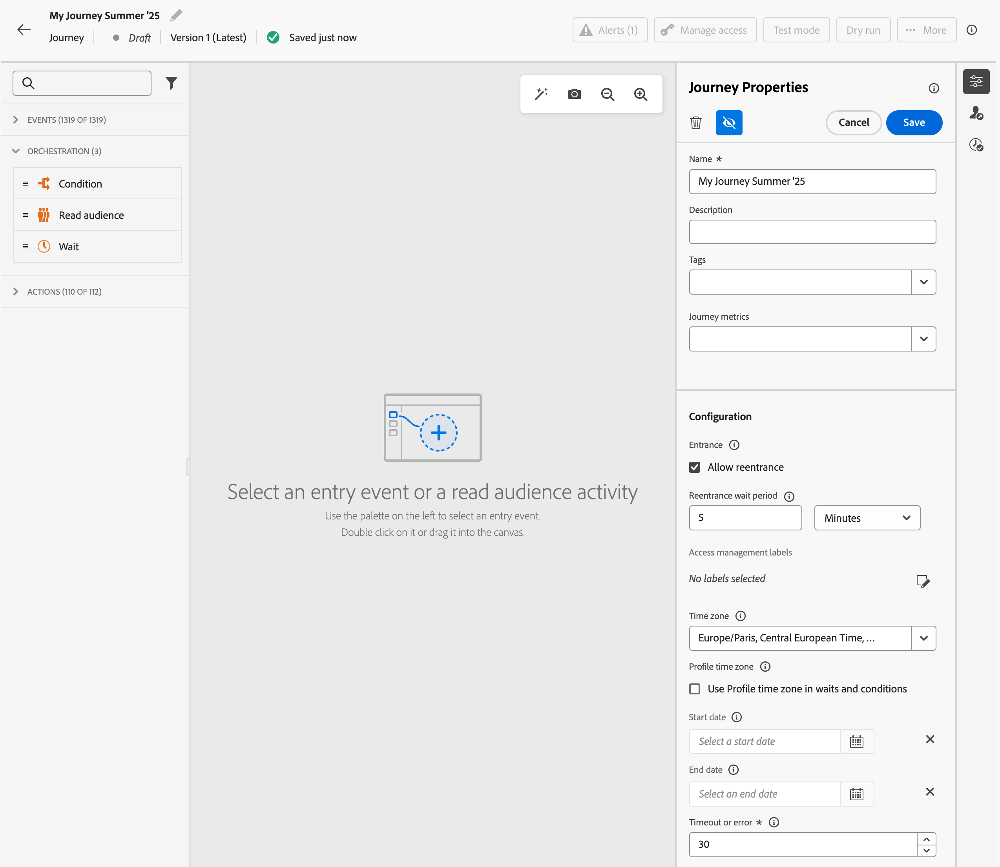

# Establecimiento de las propiedades del recorrido {#jo-properties}

>[!CONTEXTUALHELP]
>id="ajo_journey_properties"
>title="Propiedades del recorrido"
>abstract="Esta sección muestra las propiedades del recorrido. De forma predeterminada, los parámetros de solo lectura están ocultos. La configuración disponible depende del estado del recorrido, de los permisos y de la configuración del producto."

## Acceso a las propiedades de un recorrido {#access-properties}

Las propiedades de un recorrido están centralizadas en el carril derecho. Esta sección se muestra de forma predeterminada al crear un nuevo recorrido. Para los recorridos existentes, haga clic en el icono de lápiz situado junto al nombre del recorrido para abrirlo.

En esta sección, defina el nombre del recorrido, añada una descripción y defina las propiedades globales del recorrido.

Puede hacer lo siguiente:

* Asigne etiquetas unificadas de Adobe Experience Platform a su recorrido para clasificarlas fácilmente y mejorar la búsqueda desde la lista de campañas. [Descubra cómo trabajar con campañas](../start/search-filter-categorize.md#tags)
* Seleccione las métricas de recorridos. [Aprenda a configurar y rastrear sus métricas de recorridos](success-metrics.md)
* Administrar [entrada y reentrada](#entrance). La administración de la entrada del perfil depende del tipo de recorrido. Los detalles están disponibles en [esta página](entry-management.md)
* Administrar [acceso a datos](#manage-access)
* Seleccione el recorrido y el perfil [husos horarios](#timezone)
* Elija [fechas de inicio y finalización](#dates) personalizadas
* Defina un tiempo de espera de [timeout duration](#timeout) en las actividades de recorrido (solo para usuarios administradores)
* Supervise los conflictos y dé prioridad a sus recorridos con [herramientas de administración de conflictos](#conflict)

{width="80%"}{zoomable="yes"}

>[!NOTE]
>
>Para los recorridos activos, esta pantalla muestra solo la fecha de publicación y el nombre del usuario que publicó el recorrido.

La opción **Copiar detalles técnicos** le permite copiar información técnica sobre el recorrido que el equipo de soporte técnico puede usar para solucionar problemas. Se copia la siguiente información: `JourneyVersion UID`, `OrgID`, `orgName`, `sandboxName`, `lastDeployedBy`, `lastDeployedAt`.

Obtenga más información acerca de los campos técnicos relacionados con un recorrido para un perfil determinado y cómo usarlos [en esta página](expression/journey-properties.md).

## Entrada y reentrada {#entrance}

El modo de entrada de perfil se define en el nivel de recorrido, en el panel de configuración derecho. A continuación se describe la configuración.

La administración de la entrada del perfil depende del tipo de recorrido. Obtenga más información acerca de la administración de entrada y reentrada de perfiles en [esta página](entry-management.md).

### Permitir la reentrada  {#allow-reentrance}

>[!CONTEXTUALHELP]
>id="ajo_journey_properties_entrance"
>title="Permitir la reentrada"
>abstract="De forma predeterminada, los nuevos recorridos permiten la reentrada. Puede desmarcar la opción **Permitir reentrada**, por ejemplo, si quiere ofrecer un regalo único cuando una persona entre en una tienda."
>additional-url="https://experienceleague.adobe.com/es/docs/journey-optimizer/using/orchestrate-journeys/manage-journey/entry-management" text="Administración de la entrada del perfil"

De forma predeterminada, los nuevos recorridos permiten la reentrada. Puede desmarcar la opción **Permitir la reentrada** para recorridos de &quot;una sola vez&quot;, por ejemplo, si desea ofrecer un regalo de una sola vez cuando una persona entra a una tienda.

### Período de espera de reentrada  {#reentrance-wait}

>[!CONTEXTUALHELP]
>id="ajo_journey_properties_re-entrance_wait"
>title="Período de espera de reentrada"
>abstract="Establezca el tiempo de espera antes de permitir que un perfil vuelva a entrar en el recorrido en recorridos unitarios. Esto evita que los usuarios vuelvan a entrar en el recorrido durante un tiempo determinado. Duración máxima: 90 días."
>additional-url="https://experienceleague.adobe.com/es/docs/journey-optimizer/using/orchestrate-journeys/manage-journey/entry-management" text="Administración de la entrada del perfil"

Cuando se activa la opción **Permitir la reentrada**, se muestra el campo **Período de espera de reentrada**. Este campo permite definir el tiempo de espera antes de permitir que un perfil vuelva a entrar en el recorrido en el caso de recorridos unitarios (empezando con un evento o una calificación de público). Esto evita que los recorridos se activen varias veces por error para el mismo evento. De forma predeterminada, el campo se establece en 5 minutos. La duración máxima es de 90 días.

## Administrar acceso {#manage-access}

Puede limitar el acceso a un recorrido en función de las etiquetas de acceso.

Para asignar al recorrido etiquetas de uso de datos personalizadas, haga clic en el icono **[!UICONTROL Administrar etiquetas de acceso]** y seleccione una o varias etiquetas.

[Más información sobre el Control de acceso de nivel de objeto (OLAC)](../administration/object-based-access.md)

## Zonas horarias de recorrido y perfil {#timezone}

La zona horaria se define en el nivel de recorrido. Puede introducir una zona horaria fija o utilizar perfiles de Adobe Experience Platform para definir la zona horaria de recorrido. Si se define una zona horaria en el perfil de Adobe Experience Platform, se puede recuperar en la recorrido.

[Más información sobre la administración de huso horario](../building-journeys/timezone-management.md)

## Fecha de inicio y de finalización {#dates}

>[!CONTEXTUALHELP]
>id="ajo_journey_properties_start_date"
>title="Fecha de inicio"
>abstract="Seleccione la fecha en la que los perfiles pueden empezar a entrar en el recorrido. Si no se establece ninguna fecha de inicio, la predeterminada es la fecha de publicación del recorrido."

>[!CONTEXTUALHELP]
>id="ajo_journey_properties_end_date"
>title="Fecha de finalización"
>abstract="Establezca la fecha en la que termina el recorrido. En esta fecha, los perfiles activos saldrán automáticamente del recorrido y no se permitirán nuevas entradas."

De forma predeterminada, los perfiles pueden entrar en el recorrido en cuanto se publique y pueden permanecer hasta que se alcance el [tiempo de espera de recorrido global](#global_timeout). La única excepción son los recorridos de lectura recurrentes con **Forzar reentrada en repetición** activada, que terminan en la fecha de inicio de la siguiente ocurrencia.

Si es necesario, puede definir **fecha de inicio** y **fecha de finalización** personalizadas. Esto permite a los perfiles introducir el recorrido en una fecha específica y salir automáticamente cuando se llega a la fecha de finalización.

## Tiempo de espera {#timeout}

### Tiempo de espera en actividades de recorrido {#timeout_and_error}

>[!CONTEXTUALHELP]
>id="ajo_journey_properties_timeout"
>title="Tiempo de espera o error"
>abstract="Especifique cuánto tiempo debe intentar el recorrido realizar una acción o evaluar una condición antes de tratarla como con tiempo de espera agotado. Los valores recomendados están entre 1 y 30 segundos."

Al editar una actividad de acción o condición, puede definir una ruta alternativa en caso de error o tiempo de espera. Si el procesamiento de la actividad que busca un sistema de terceros supera el tiempo de espera definido en el campo **[!UICONTROL Tiempo de espera o error]** de las propiedades del recorrido, se elegirá la segunda ruta para realizar una posible acción de reserva.

Los valores recomendados están entre 1 y 30 segundos.

Le recomendamos que defina un valor muy corto de **[!UICONTROL Tiempo de espera o error]** si su recorrido distingue entre tiempo y minúsculas (por ejemplo: reacción a la ubicación en tiempo real de una persona) porque no puede retrasar su acción más de unos segundos. Si el recorrido distingue menos del tiempo, puede utilizar un valor más largo para dar más tiempo al sistema llamado para enviar una respuesta válida.

Recorrido también utiliza un tiempo de espera global como se detalla a continuación.

### Tiempo de espera de recorrido global {#global_timeout}

Además del tiempo de espera [timeout](#timeout_and_error) utilizado en las actividades de recorrido, se aplica un tiempo de espera de recorrido global. No se muestra en la interfaz y no se puede cambiar.

Este tiempo de espera global detiene el progreso de los individuos en el recorrido **91 días** después de que ingresan. Esto significa que el recorrido de una persona no puede durar más de 91 días. Después de este período de tiempo de espera, se eliminan los datos del individuo. Las personas que sigan fluyendo en el recorrido al final del periodo de tiempo de espera se detendrán y no se tendrán en cuenta en los informes. Por lo tanto, podría ver más personas entrando en el recorrido que saliendo.

Debido al tiempo de espera de recorrido de 91 días, cuando no se permite la reentrada al recorrido, no podemos asegurarnos de que el bloqueo de reentrada funcione más de 91 días. De hecho, al eliminar toda la información sobre las personas que ingresaron al recorrido 91 días después de su entrada, no podemos saber la persona ingresada anteriormente, hace más de 91 días.

Una persona solo puede entrar en una actividad de espera si le queda tiempo suficiente en el recorrido recorrido para completar la duración de la espera antes del tiempo de espera de 91 días. Consulte [esta página](../building-journeys/wait-activity.md).

#### Preguntas frecuentes sobre el tiempo de vida (TTL) y la retención de datos {#timeout-faq}

A partir de la versión de junio de 2024 de Adobe Journey Optimizer, el tiempo de espera global de recorrido ha pasado de 30 a 91 días. Los impactos se enumeran en las preguntas frecuentes a continuación:

**Para Recorridos Unitarios**

<table style="table-layout:auto">
  <tr style="border: 1;">
    <td>
      
¿Qué sucede con los recorridos publicados después de que se implemente la extensión TTL?

    </td>
    <td>
      
Los perfiles que entren en el nuevo recorrido tendrán automáticamente un TTL de 91 días.

    </td>
  </tr>
  <tr style="border: 1;">
    <td>
      
¿Qué sucede con un perfil que introduce un recorrido publicado antes del lanzamiento de la extensión TTL?

    </td>
    <td>
      
El perfil tendrá un TTL de 30 días (7 días para HIPAA), coherente con el momento en que se publicó originalmente el recorrido.

    </td>
  </tr>
  <tr style="border: 1;">
    <td>
      
¿Qué les sucede a los perfiles que ya han entrado en un recorrido cuando se inicia la extensión TTL?

    </td>
    <td>
      
El perfil conservará un TTL de 30 días (7 días para HIPAA), según la hora de publicación original del recorrido.

    </td>
  </tr>
  <tr style="border: 1;">
    <td>
      
¿Qué sucede con un perfil de una versión de recorrido anterior que se vuelve a publicar después del lanzamiento de la extensión TTL?

    </td>
    <td>
      
El perfil mantendrá un TTL de 30 días (7 días para HIPAA), alineado con el tiempo de publicación de la versión del recorrido original.

    </td>
  </tr>
  <tr style="border: 1;">
    <td>
      
¿Qué sucede si un nuevo perfil introduce una versión de recorrido republicada después del inicio de la extensión TTL?

    </td>
    <td>
      
El perfil tendrá un TTL de 91 días, que coincide con el TTL de la versión del recorrido recién publicada.

    </td>
  </tr>
</table>

**Para Recorridos de Déclencheur de segmentos**

<table style="table-layout:auto">
  <tr style="border: 1;">
    <td>
      
¿Qué sucede con los nuevos recorridos únicos publicados después de la extensión TTL?

    </td>
    <td>
      
Los perfiles que entren en el nuevo recorrido tendrán un TTL de 91 días automáticamente.

    </td>
  </tr>
  <tr style="border: 1;">
    <td>
      
¿Qué sucede con los nuevos recorridos recurrentes sin reentrada forzada publicados después de la extensión TTL?

    </td>
    <td>
      
Los perfiles que entren en el nuevo recorrido tendrán un TTL de 91 días automáticamente.

    </td>
  </tr>
  <tr style="border: 1;">
    <td>
      
¿Qué sucede con los nuevos recorridos recurrentes con reentrada forzada publicados después de la extensión TTL?

    </td>
    <td>
      
Los perfiles que entren en el nuevo recorrido tendrán un TTL igual al periodo de periodicidad. Por ejemplo, si el recorrido se ejecuta a diario, el TTL será de 1 día.

    </td>
  </tr>
  <tr style="border: 1;">
    <td>
      
¿Qué sucede con un perfil que introduce un recorrido publicado antes del lanzamiento de la extensión TTL?

    </td>
    <td>
      
El perfil tendrá un TTL de 30 días (7 días para HIPAA), coherente con el tiempo de publicación original. Para los recorridos recurrentes con reentrada forzada, el TTL coincidirá con el período de periodicidad.

    </td>
  </tr>
  <tr style="border: 1;">
    <td>
      
¿Qué sucede con un perfil que se ejecuta a través de un recorrido cuando se inicia la extensión TTL?

    </td>
    <td>
      
El perfil conservará un TTL de 30 días (7 días para HIPAA), según la hora de publicación original del recorrido. Para los recorridos recurrentes con reentrada forzada, el TTL coincidirá con el período de periodicidad.

    </td>
  </tr>
  <tr style="border: 1;">
    <td>
      
¿Qué sucede con un perfil en ejecución en una versión de recorrido anterior que se vuelve a publicar después del lanzamiento de la extensión TTL?

    </td>
    <td>
      
El perfil mantendrá un TTL de 30 días (7 días para HIPPA), alineado con el tiempo de publicación de la versión original del recorrido. Para los recorridos recurrentes con reentrada forzada, el TTL coincidirá con el período de periodicidad.

    </td>
  </tr>
  <tr style="border: 1;">
    <td>
      
¿Qué sucede si un nuevo perfil introduce una versión de recorrido republicada después del inicio de la extensión TTL?

    </td>
    <td>
      
El perfil tendrá un TTL de 91 días, que coincide con el TTL de la versión del recorrido recién publicada. Para los recorridos recurrentes con reentrada forzada, el TTL coincidirá con el período de periodicidad.

    </td>
  </tr>
</table>

## Combinar políticas {#merge-policies}

Adobe Journey Optimizer utiliza políticas de combinación al recuperar datos de perfil de Adobe Experience Platform. Según el tipo de recorrido, se utilizan distintas políticas de combinación:

* En Leer recorridos de cualificación de audiencias o audiencias: se utiliza la política de combinación de la audiencia
* En recorridos de eventos unitarios: se utiliza la política de combinación predeterminada
* En recorridos de eventos empresariales: se utiliza la política de combinación de la audiencia de destino en la siguiente actividad Leer audiencia

Adobe Journey Optimizer aplica la política de combinación utilizada en todo el recorrido. Por lo tanto, si se usan varias audiencias en un recorrido (por ejemplo, usando en [`inAudience` funciones](functions/functioninaudience.md)), se crean incoherencias con la política de combinación utilizada por el recorrido, se genera un error y se bloquea la publicación. Sin embargo, si se utiliza una audiencia incoherente en la personalización de mensajes, no se genera una alerta, a pesar de la incoherencia. Por este motivo, es muy recomendable comprobar la política de combinación asociada a su audiencia cuando esta audiencia se utiliza en la personalización de mensajes.

Para obtener más información sobre las políticas de combinación, consulte [Documentación de Adobe Experience Platform](https://experienceleague.adobe.com/es/docs/experience-platform/profile/merge-policies/overview){target="_blank"}.

>[!NOTE]
>
>Cuando se actualiza una política de combinación de audiencias, cualquier recorrido activo que haga referencia a esa audiencia debe volver a publicarse (o duplicarse). Cambiar la política de combinación crea de forma efectiva una audiencia &quot;nueva&quot; a la que el recorrido en curso no puede acceder, lo que garantiza la coherencia de los datos.

## Criterios de salida {#exit-criteria}

>[!CONTEXTUALHELP]
>id="ajo_journey_exit_criterias"
>title="Criterios de salida"
>abstract="En esta sección se muestran las opciones de criterios de salida. Puede crear una o varias reglas y filtros de criterios de salida para el recorrido."

### Recorrido Criterios de salida {#exit-criteria-desc}

Al añadir criterios de salida, hace que los perfiles salgan del recorrido en cuanto se produce un evento (p. ej.: compra) o cumplen los requisitos para un público. Esto evitará que el usuario reciba más comunicaciones del recorrido.

Es posible que desee eliminar perfiles de un recorrido cuando ya no cumplan el propósito del recorrido. Esto se puede lograr mediante **criterios de salida globales**, que están estrechamente asociados con la administración de objetivos.

**Caso de uso de ejemplo**

Un experto en marketing tiene un recorrido promocional que tiene una serie de comunicaciones. Cada una de estas comunicaciones tiene como objetivo impulsar al cliente a realizar una compra. Tan pronto como se realice la compra, el cliente no debe recibir el resto de los mensajes de la serie. Al definir un criterio de salida, los perfiles que hayan realizado una compra se eliminan de la recorrido.

#### Configuración y uso {#exit-criteria-config}

Los criterios de salida se establecen en el nivel de recorrido. Un recorrido puede tener varios criterios de salida. Si ha establecido varios criterios de salida, la evaluación se realizará de arriba abajo con una lógica de `OR`. Por lo tanto, si tiene los criterios de salida A y B, se evaluará como A **O** B. Los criterios se evalúan en cada paso del recorrido.

Para **crear** un criterio de salida, siga estos pasos:

1. Abra el recorrido.

1. Haga clic en el icono  **[!UICONTROL Mostrar criterios de salida]** ubicado en la sección superior derecha del lienzo de recorrido.

1. Seleccione **[!UICONTROL Agregar criterios de salida]**.

1. Escriba una **Etiqueta** y seleccione si los criterios de salida se basan en un **Evento** o en una **Audiencia**.

   * Para los criterios de Salida basados en un evento, como descargar una aplicación o agregar un producto al carro de compras, elija solo evento unitario.
   * Para los criterios de Salida basados en una audiencia, como una audiencia que comprueba si un cliente ha realizado compras en las últimas 24 horas, seleccione una audiencia. Nota: Los criterios de salida que utilizan una audiencia pueden tardar hasta 10 minutos en ser efectivos.

Puede agregar varios criterios de salida.

{width="40%" align="left"}

### Criterios de salida basados en atributos de perfil {#profile-exit-criteria}

Los criterios de salida basados en atributos de perfil le proporcionan un mayor control sobre los recorridos en pausa, ya que le permiten definir reglas que quitan automáticamente perfiles específicos antes de que se reanude el recorrido. Puede establecer condiciones de salida basadas en atributos de perfil (como ubicación, estado o preferencias) para garantizar que solo los perfiles relevantes continúen en el recorrido después de reanudarlo.

Por ejemplo, puede [pausar un recorrido](journey-pause.md), agregar una condición de salida para quitar todos los perfiles ubicados en Francia y reanudar el recorrido sabiendo que esos perfiles se excluirán en el siguiente paso de acción. Esta lógica se aplica tanto a los perfiles que ya están en la recorrido como a cualquier perfil nuevo que se califique después de que se reanude la recorrido.

Esta función funciona junto con la funcionalidad Pausa/Reanudar, lo que le ayuda a administrar recorridos de forma más segura y flexible. Minimice la intervención manual, reduzca el riesgo de enviar comunicaciones irrelevantes o no conformes y mantenga la lógica de recorrido alineada con los requisitos comerciales actuales.

Consulte esta sección para aprender a [usar criterios de salida de atributos de perfil en recorridos en pausa](journey-pause.md#apply-a-global-filter-to-profiles-in-a-paused-journey).

### Protecciones y limitaciones {#exit-criteria-guardrails}

Las siguientes limitaciones y protecciones se aplican a la capacidad [Criterios de salida de Recorrido](#exit-criteria-desc):

* Los criterios de salida solo se definen en estado de borrador
* Recorrido de coherencia de área de nombres entre eventos y criterios de salida basados en eventos

Se aplican las siguientes limitaciones al usar la capacidad [Criterios de salida basados en atributos de perfil](#profile-exit-criteria):

* **Se aplican criterios de salida en el nivel de acción**\
  Los criterios de salida de &quot;Atributo de perfil&quot; solo se evalúan en pasos de acción. A diferencia de otros tipos de criterios de salida, no se aplican globalmente en todo el recorrido.\
  Si reanuda un recorrido y algunos perfiles cumplen la condición de salida, esos perfiles se excluyen en el siguiente nodo de acción.\
  Los nuevos perfiles que entren en el recorrido después de reanudarlo también se evaluarán y excluirán en su primer nodo de acción, si cumplen la condición.

* **Una regla de salida basada en perfiles por recorrido**\
  Solo puede definir un criterio de salida de &quot;Atributo de perfil&quot; por recorrido. Esta limitación ayuda a mantener la claridad y evita conflictos en la lógica de recorrido.

* **Solo disponible en recorridos pausados**\
  Solo puede agregar o editar los criterios de salida del &quot;Atributo de perfil&quot; cuando el recorrido está en pausa.

   * En un **recorrido de borrador**, la opción *Atributo de perfil* aparece deshabilitada (solo lectura), mientras que las opciones *Evento* y *Audiencia* permanecen activas.
   * En un **recorrido pausado**, la opción *Atributo de perfil* se vuelve editable, y las opciones *Evento* y *Audiencia* se vuelven de solo lectura.

## programación de recorrido {#schedule}

La sección **[!UICONTROL Programar]** solo está disponible cuando se ha quitado una actividad **[!UICONTROL Leer audiencia]** en el lienzo. Permite definir una fecha/hora y una frecuencia específicas en las que se debe ejecutar el recorrido. [Aprenda a programar un recorrido de lectura-audiencia](../building-journeys/read-audience.md)

## Administración de conflictos {#conflict}

La sección **[!UICONTROL Administración de conflictos]** de las propiedades del recorrido le permite supervisar los conflictos y priorizar los recorridos. Puede hacer lo siguiente:

* Aplique un **conjunto de reglas** para excluir este recorrido a parte de su audiencia según las reglas de límite. [Descubra cómo trabajar con conjuntos de reglas](../conflict-prioritization/rule-sets.md)

* Asigne una **puntuación de prioridad** al recorrido, de 0 a 100. Un número mayor indica una prioridad mayor. El valor de prioridad insertado aquí lo heredan las acciones entrantes (como in-app) contenidas en este recorrido. [aprenda a trabajar con puntuaciones de prioridad](../conflict-prioritization/priority-scores.md)

  En el caso de situaciones en las que esta misma configuración de canal entrante se utiliza en otras campañas o recorridos, se muestra al destinatario la acción entrante con la puntuación de prioridad más alta. Si varios recorridos o campañas tienen la misma puntuación, se elige el elemento que se ha modificado más recientemente.

* **Ver conflictos** con otros recorridos, campañas o configuraciones de canal. Si desea identificar la superposición en la audiencia, la fecha de inicio y finalización, la configuración del canal, el canal o el conjunto de reglas, puede ver posibles conflictos aquí. [Aprenda a identificar posibles conflictos en el recorrido](../conflict-prioritization/conflicts.md)
