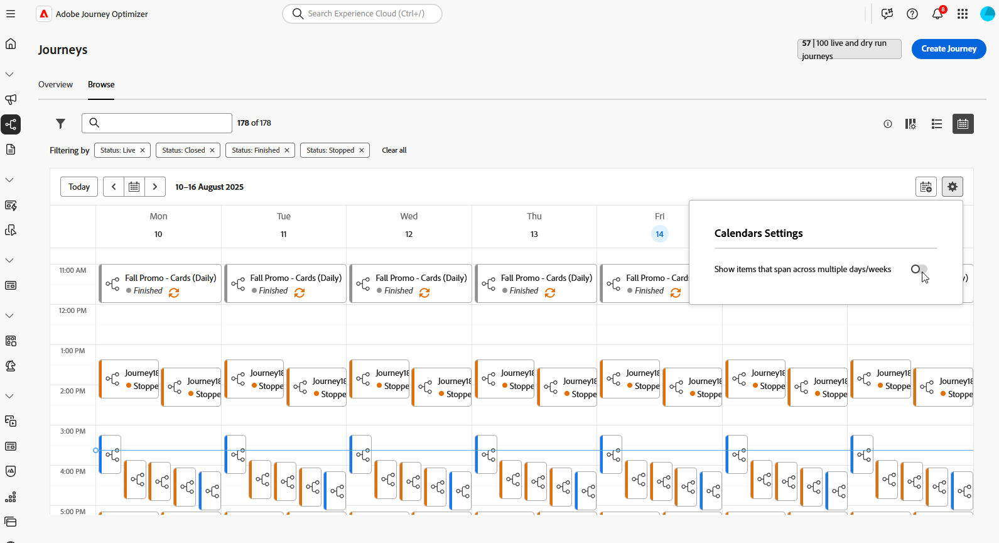
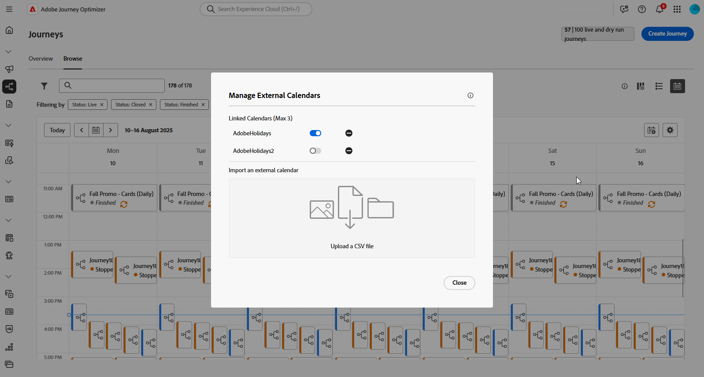

# Examinar y filtrar sus recorridos {#browse-journeys}

>[!CONTEXTUALHELP]
>id="ajo_journey_view"
>title="Vistas de lista y calendario de recorridos"
>abstract="Además de la lista de recorridos, [!DNL Journey Optimizer] proporciona una vista de calendario de sus recorridos, lo que ofrece una representación visual clara de sus programaciones. Puede cambiar entre las vistas de lista y calendario en cualquier momento con estos botones."

## Panel del recorrido {#dashboard-jo}

En la sección de menú ADMINISTRACIÓN DE RECORRIDO, haga clic en **[!UICONTROL Recorridos]**. Hay dos fichas disponibles: **[!UICONTROL Información general]** y **[!UICONTROL Examinar]**.

### Información general sobre Recorrido

La pestaña **[!UICONTROL Información general]** muestra un panel con métricas clave relacionadas con tus recorridos.

* **Perfiles procesados**: número total de perfiles procesados en las últimas 24 horas.
* **recorridos activos**: número total de recorridos activos con tráfico durante las últimas 24 horas. Los recorridos activos incluyen **recorridos unitarios** (basados en eventos) y **recorridos por lotes** (lectura de audiencia).
* **Tasa de error**: proporción de todos los perfiles en error comparada con la cantidad total de perfiles que ingresaron en las últimas 24 horas.
* **Tasa de descarte**: proporción de todos los perfiles descartados en comparación con la cantidad total de perfiles que ingresaron en las últimas 24 horas. Un perfil descartado representa a alguien que no cumple los requisitos para entrar en el recorrido, por ejemplo, debido a un área de nombres incorrecta o a reglas de reentrada.

>[!NOTE]
>
>Este tablero tiene en cuenta los recorridos con tráfico de las últimas 24 horas. Solo se muestran los recorridos a los que tiene acceso. Las métricas se actualizan cada 30 minutos y solo cuando hay nuevos datos disponibles.

### lista de recorridos

La ficha **[!UICONTROL Examinar]** muestra la lista de recorridos existentes. Puede buscar recorridos, utilizarlos y realizar acciones básicas en cada elemento. Por ejemplo, puede duplicar o eliminar un elemento.

En la lista de recorridos, todas las versiones del recorrido se muestran con el número de versión. Cuando busca un recorrido, las versiones más recientes aparecen en la parte superior de la lista la primera vez que se abre la aplicación. A continuación, puede definir la clasificación que desee y la aplicación la mantendrá como preferencia del usuario. La versión del recorrido también se muestra en la parte superior de la interfaz de la edición de recorrido, encima del lienzo. Más información acerca de [administración de versiones de recorrido](publishing-the-journey.md#journey-versions-journey-versions).

### calendario de Recorrido {#calendar}

Además de la lista de recorridos, [!DNL Journey Optimizer] proporciona una vista de calendario de sus recorridos, lo que ofrece una representación visual clara de sus programaciones.

Representación de los recorridos:

* De forma predeterminada, la cuadrícula muestra todos los recorridos activos y programados de la semana seleccionada. Las opciones de filtro adicionales pueden mostrar activaciones o activaciones completadas, detenidas y finalizadas.
* No se muestran los recorridos de borrador ni los recorridos en el modo de prueba.
* Los recorridos que abarcan varios días aparecen en la parte superior de la cuadrícula del calendario.
* Si no se especifica ninguna hora de inicio, se utiliza la hora de activación manual más cercana para colocarla en el calendario.
* Los recorridos se muestran como intervalos de tiempo de 1 hora, pero esto no refleja la hora real de envío o finalización.

Para desplazarse por el calendario de recorridos:

1. Para acceder a la vista de calendario, abre la lista de recorridos y haz clic en el icono .

1. Utilice los botones de flecha o el selector de fecha situado encima del calendario para desplazarse entre semanas.

   El calendario muestra todos los recorridos programados para la semana actual.

   

1. Haga clic en el icono  para alternar la visualización de elementos que abarcan varios días o semanas.

   

1. Haga clic en el icono  para administrar y agregar hasta tres calendarios externos.

   

1. Arrastre y suelte sus archivos CSV que contienen nombres de eventos, fechas de inicio y fechas de finalización.

   Los eventos cargados aparecen para todos los usuarios de la organización y se muestran en los calendarios de Recorrido y de campaña.

   +++El formato CSV debe ser el siguiente:

   | Columna1 | Columna2 | Columna3 |
   |-|-|-|
   | Nombre del evento | Fecha de inicio en formato mm/dd/aa | Fecha de finalización en formato mm/dd/aa |

   +++

1. Si es necesario, puede ocultar, mostrar o quitar los calendarios externos agregados.

   

1. Para obtener más información sobre un recorrido, haga clic en su bloque visual para abrir y explorar sus detalles.

   

## Filtrar sus recorridos {#journey-filter}

En la lista de recorridos, utilice varios filtros para restringir la lista de recorridos.

Puede filtrar recorridos según su [estado](#journey-statuses), [tipo](#journey-types), [versión](publishing-the-journey.md#journey-versions-journey-versions) y [etiquetas](../start/search-filter-categorize.md#tags) asignadas desde **[!UICONTROL filtros de estado y versión]**.

Use **[!UICONTROL filtros de creación]** para filtrar recorridos según su fecha de creación o el usuario que los creó.

Mostrar recorridos que utilizan un evento, un grupo de campos o una acción en particular de **[!UICONTROL Activity Filters]** y **[!UICONTROL Data Filters]**.

Use **[!UICONTROL Filtros de publicación]** para seleccionar una fecha de publicación o un usuario. Puede elegir, por ejemplo, mostrar las versiones más recientes de recorridos en directo que se publicaron ayer.

Para filtrar recorridos según un intervalo de fechas específico, seleccione **[!UICONTROL Personalizado]** de la lista desplegable **[!UICONTROL Publicado]**.

Además, en los paneles Evento, Fuente de datos y Configuración de acciones, el campo **[!UICONTROL Utilizado en]** muestra el número de recorridos que utilizan ese evento, grupo de campos o acción en particular. Puede hacer clic en el botón **[!UICONTROL Ver recorridos]** para mostrar la lista de los recorridos correspondientes.

## tipos de recorrido {#journey-types}

El tipo de recorrido depende de las actividades utilizadas en dicho recorrido. Puede ser:

* **[!UICONTROL Evento unitario]**: los recorridos de eventos unitarios están vinculados a un perfil específico. Los eventos están relacionados con el comportamiento de una persona o con algo que sucede vinculado a una persona (por ejemplo, una persona alcanzó 10 000 puntos de lealtad). [Más información](../event/about-events.md).
* **[!UICONTROL Evento empresarial]**. El recorrido de los eventos empresariales comienza con un evento no relacionado con el perfil. La configuración de evento la realiza un usuario técnico y no se puede editar. [Más información](../event/about-events.md).
* **[!UICONTROL Calificación de audiencias]**: los recorridos de calificación de audiencias escuchan las entradas y salidas de perfiles en audiencias de Adobe Experience Platform para hacer que los individuos entren o avancen en un recorrido. [Más información](audience-qualification-events.md).
* **[!UICONTROL Leer audiencia]**: en Leer recorridos de audiencia, todas las personas de la audiencia entran al recorrido y reciben los mensajes incluidos en el recorrido.  [Más información](read-audience.md).

Obtenga más información acerca de los tipos de recorrido y la administración de entradas asociada en [esta página](entry-management.md).

## estados de recorrido {#journey-statuses}

El estado del recorrido depende de su ciclo de vida. Puede ser:

* **Cerrado**: el recorrido se ha cerrado con el botón **Cerca de nuevas entradas**. El recorrido deja de permitir que nuevas personas entren en el recorrido. Las personas que ya están en el recorrido pueden terminar el recorrido normalmente.
* **Borrador**: el recorrido se encuentra en su primera fase. Aún no se ha publicado.
* **Borrador (prueba)**: el modo de prueba se ha activado con el botón **Modo de prueba**.
* **Finalizado**: el recorrido cambia automáticamente a este estado después del tiempo de espera global de [91 días](journey-properties.md#global_timeout). Los perfiles que ya están en el recorrido finalizan el recorrido normalmente. Los nuevos perfiles ya no pueden entrar en el recorrido.
* **Activo**: el recorrido se ha publicado con el botón **Publicar**.
* **Detenido**: el recorrido se ha desactivado con el botón **Detener**. Todos los individuos abandonan el recorrido al instante.

>[!NOTE]
>
>* El ciclo de vida de creación de Recorridos también incluye un conjunto de estados intermedios que no están disponibles para el filtrado: &quot;Publicación&quot; (entre &quot;Borrador&quot; y &quot;Activo&quot;), &quot;Activación del modo de prueba&quot; o &quot;Desactivación del modo de prueba&quot; (entre &quot;Borrador&quot; y &quot;Borrador (prueba)&quot;) y &quot;Detención&quot; (entre &quot;Activo&quot; y &quot;Detenido&quot;). Cuando un recorrido está en un estado intermedio, es de solo lectura.
>
>* Si necesita modificarlo a un recorrido **live**, [cree una nueva versión](#journey-versions) de su recorrido.

## Duplicación de un recorrido {#duplicate-a-journey}

Puede duplicar un recorrido existente de la ficha **Examinar**. Todos los objetos y configuraciones se duplican en la copia de recorrido.

Para ello, siga los pasos a continuación:

1. Vaya al recorrido que desee copiar y haga clic en el icono **Más acciones** (los tres puntos junto al nombre del recorrido).
1. Seleccione **Duplicar**.

   

1. Introduzca el nombre del recorrido y confírmelo. También puede cambiar el nombre en la pantalla de propiedades del recorrido. De manera predeterminada, el nombre se establece de la siguiente manera: `[JOURNEY-NAME]_copy`

   

1. El nuevo recorrido se crea y está disponible en la lista de recorridos.

## Operaciones masivas {#bulk-operations}

Desde la lista de recorridos, puede pausar varios recorridos **Live**. Para pausar un grupo de recorridos (_pausa masiva_), selecciónelos en la lista y haga clic en el botón **Pausar** de la barra azul en la parte inferior de la pantalla. El botón **Pausar** solo está disponible cuando se seleccionan **recorridos en vivo**.

También puede reanudar uno o varios **recorridos pausados**. Para reanudar un grupo de recorridos (_reanudación masiva_), selecciónelos y haga clic en el botón **Reanudar** ubicado en la barra azul en la parte inferior de la pantalla. Tenga en cuenta que el botón **Reanudar** solo estará disponible cuando se seleccionen **recorridos en pausa**.

[Más información sobre las recorridos de pausa/reanudación](journey-pause.md).

>[!NOTE]
>
>Puede pausar/reanudar hasta 10 recorridos por operación.

