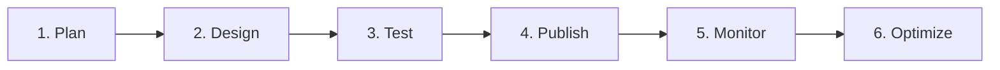

# Introducción a los recorridos{#jo-general-principle}

Adobe Journey Optimizer le permite crear recorridos de cliente personalizados y de varios pasos que se adaptan en tiempo real al comportamiento y las necesidades de su audiencia. Con un lienzo intuitivo de arrastrar y soltar, puede orquestar mensajes y acciones en varios canales, aprovechando los datos contextuales y la segmentación de audiencia para lograr el máximo impacto.

Esta guía proporciona una hoja de ruta clara para ayudarle a comprender los aspectos básicos del recorrido, elegir el tipo de recorrido adecuado para su caso de uso y diseñar recorridos con confianza que proporcionen experiencias del cliente significativas y oportunas.

## ¿Qué son los recorridos?

Los **Recorridos** son experiencias de cliente automatizadas y de varios pasos que organizan interacciones personalizadas entre canales en respuesta a la conducta del cliente, eventos comerciales o campañas programadas.

Use [!DNL Journey Optimizer] para:

* Cree **casos de uso de orquestación en tiempo real** usando datos contextuales almacenados en eventos o fuentes de datos
* Diseñe **escenarios avanzados de varios pasos** que respondan dinámicamente al comportamiento de los clientes y a los eventos empresariales
* Entregar **1:1 experiencias personalizadas** a escala en correo electrónico, push, SMS, en la aplicación, web y más

➡️ **¿Listo para empezar a crear?** [Crea tu primer recorrido](journey-gs.md) en 5 minutos.

## Elija su tipo de recorrido {#journey-types}

**Antes de empezar a crear**, es importante que entienda qué tipo de recorrido se ajusta a su caso de uso. Adobe Journey Optimizer admite cuatro tipos de recorridos, cada uno diseñado para diferentes mecanismos de entrada y escenarios empresariales:

>[!BEGINTABS]

>[!TAB recorridos unitarios]

 **Cuándo usar:** Experiencias activadas por eventos en tiempo real

**Los recorridos unitarios** se activan individualmente cuando se produce una acción específica (compra, inicio de sesión en la aplicación, envío de formularios). Los perfiles se introducen de uno en uno en tiempo real, lo que los hace ideales para obtener respuestas inmediatas basadas en el comportamiento.

**Perfecto para:**

* Confirmaciones de pedidos tras la compra
* Correos electrónicos de bienvenida cuando alguien se suscribe
* Abandono del carro de compras activado por navegación
* Notificaciones de restablecimiento de contraseña

➡️ [Más información sobre los eventos](../event/about-events.md) | [Mensaje para el caso de uso de los suscriptores](message-to-subscribers-uc.md)

>[!TAB Leer recorridos de audiencia]

 **Cuándo usar:** Campañas programadas para segmentos de audiencia

**Leer recorridos de audiencia** comienza con una audiencia de Adobe Experience Platform y envía mensajes en lote a todos los perfiles simultáneamente. Este tipo de recorrido es ideal para comunicaciones programadas a gran escala.

**Perfecto para:**

* Boletines mensuales
* Campañas promocionales para segmentos de destinatario
* Anuncios del producto
* Campañas de marketing de temporada

➡️ [Más información sobre la audiencia de lectura](read-audience.md) | [Introducción a las audiencias](../audience/about-audiences.md)

>[!TAB recorridos de calificación de audiencia]

 **Cuándo usar:** Respuestas en tiempo real a cambios de miembros de audiencia

Los **recorridos de calificación de audiencias** dan déclencheur cuando los perfiles cumplen los requisitos para una audiencia específica (o salen de ella). Los perfiles se introducen de forma individual según cumplen los criterios en tiempo real, lo que permite una participación inmediata cuando cambia el comportamiento de los clientes.

**Perfecto para:**

* Notificaciones de actualización de nivel VIP
* Nueva participación cuando los clientes se vuelvan inactivos
* Mensajes de celebración de la primera compra
* Segmentación geográfica cuando los clientes se mueven

➡️ [Más información acerca de la calificación de audiencias](audience-qualification-events.md) | [Creación de audiencias](../audience/creating-a-segment-definition.md)

>[!TAB recorridos de eventos empresariales]

 **Cuándo usar:** Condiciones de negocio que afectan a varios clientes

Los **recorridos de eventos empresariales** se desencadenan por eventos de nivel empresarial (actualizaciones de existencias, avisos meteorológicos, cambios de precios) que afectan a varios perfiles simultáneamente. Estos responden a condiciones empresariales más amplias que a acciones individuales.

**Perfecto para:**

* Alertas de inventario bajas para clientes interesados
* Anuncios de venta Flash
* Promociones basadas en el tiempo
* Notificaciones de bajada de precios
* Alertas de productos que vuelven a estar en stock

➡️ [Más información acerca de los eventos empresariales](../event/about-creating-business.md) | [Administración de entradas](entry-management.md)

>[!ENDTABS]

>[!NOTE]
>
>¿No está seguro de qué tipo elegir? Comience con **recorridos unitarios** para experiencias basadas en eventos o **recorridos de audiencia de lectura** para campañas programadas, que cubren los casos de uso más comunes.

## Compilar con el diseñador de recorrido {#journey-designer}

El **[diseñador de recorridos](using-the-journey-designer.md)** es el lienzo visual para crear experiencias de cliente. Con una intuitiva interfaz de arrastrar y soltar, puede organizar cada paso del recorrido sin necesidad de escribir código.

### Lo que puede hacer en el diseñador:

:::: landing-cards-container

:::

**Definir puntos de entrada**

Elija cómo introducen los clientes: a través de un evento, segmento de audiencia o calificación de audiencia.

[Más información sobre la administración de entradas](entry-management.md)
:::

:::

**Envío de mensajes**

Utilice acciones de canal integradas para correo electrónico, push, SMS/MMS, en la aplicación, web y mucho más, todas diseñadas en Journey Optimizer.

[Envío de mensajes en recorridos](journeys-message.md)
:::

:::

**Agregar lógica y condiciones**

Ramifique su recorrido en función de atributos de perfil, pertenencia a audiencias o eventos en tiempo real.

[Condiciones de uso](condition-activity.md)
:::

:::

**Aprovechar datos**

Utilice datos contextuales de eventos, Adobe Experience Platform o servicios API de terceros.

[Trabajo con fuentes de datos](../datasource/about-data-sources.md)
:::

:::

**Conectar sistemas externos**

Cree acciones personalizadas para integrar sistemas de terceros para enviar mensajes o activar flujos de trabajo.

[Configurar acciones personalizadas](../action/about-custom-action-configuration.md)
:::

:::

**Agregar actividades de orquestación**

Utilice tiempos de espera, saltos, actualizaciones de perfiles y gestión de público para crear flujos sofisticados.

[Explorar todas las actividades](about-journey-activities.md)
:::

::::

➡️ **Aprendizaje práctico:** [Vea el vídeo del diseñador de recorridos](#video) o [explore casos de uso de extremo a extremo](jo-use-cases.md)

## Flujo de trabajo de creación de recorridos {#workflow}

La creación de recorridos exitosos sigue un proceso claro y repetible. Este es su flujo de trabajo paso a paso:

### &#x200B;1. **Planifique su recorrido** {#plan}

Antes de abrir el diseñador, aclare sus objetivos:

* **¿Cuál es el objetivo?** (por ejemplo, incorporar nuevos clientes, volver a atraer usuarios inactivos)
* **¿Quién es la audiencia?** (segmento específico, individuos impulsados por evento)
* **¿Qué tipo de recorrido encaja?** (ver [tipos de recorrido](#journey-types) más arriba)
* **¿Qué canales usará?** (correo electrónico, push, SMS, etc.)

### &#x200B;2. **Diseño en el lienzo** {#design}

Utilice el diseñador de recorridos para crear el flujo:

1. **Establecer condiciones de entrada** - Definir cómo entran los perfiles (evento, audiencia, calificación)
2. **Agregar lógica de orquestación**: incluya tiempos de espera, condiciones y puntos de decisión
3. **Configurar mensajes**: diseñe sus comunicaciones o aproveche las plantillas existentes
4. **Configurar acciones** - Configurar acciones integradas o personalizadas para ejecutar
5. **Definir criterios de salida**: especifique cuándo y cómo completan el recorrido los perfiles

[Aprenda a utilizar la → de diseñador de recorrido](using-the-journey-designer.md)

### &#x200B;3. **Realizar prueba antes de empezar** {#test}

Pruebe siempre el recorrido para detectar problemas antes de que los clientes los experimenten:

* Usar **modo de prueba** para simular el recorrido con perfiles de prueba
* Utilice **ejecución en seco** para obtener una vista previa de la ejecución del recorrido sin afectar a los datos reales ni enviar mensajes
* Compruebe que todas las condiciones, mensajes y acciones funcionan según lo esperado
* Compruebe el tiempo, los flujos de datos y la personalización

[Prueba tu recorrido →](testing-the-journey.md) | [Más información sobre la ejecución en seco →](journey-dry-run.md)

### &#x200B;4. **Publicar su recorrido** {#publish}

Una vez finalizada la prueba, publique para que el recorrido esté activo:

* Revisar la configuración y las propiedades finales
* Publicación para activarla para clientes reales
* Nota: Los recorridos activos se pueden detener, pero no editar (debe crear una nueva versión)

[Publicación del → de recorrido](publish-journey.md)

### &#x200B;5. **Supervisar el rendimiento** {#monitor}

Realice un seguimiento del rendimiento de su recorrido en el mundo real:

* Ver informes y análisis de recorrido
* Monitorizar las tasas de entrada, finalización y error
* Configurar alertas para problemas críticos

[Supervisar e informar →](report-journey.md) | [Configurar alertas →](../reports/alerts.md)

### &#x200B;6. **Optimizar e iterar** {#optimize}

Use perspectivas para mejorar:

* Analizar métricas de participación y tasas de conversión
* Probar la optimización del tiempo de envío
* Creación de nuevas versiones de recorrido con mejoras
* Uso de recomendaciones con tecnología de IA

[Optimizar los recorridos →](optimize.md) | [→ de optimización del tiempo de envío](send-time-optimization.md)

➡️ **¿Listo para comenzar?** [Cree su primer recorrido ahora →](journey-gs.md)

## Casos de uso reales {#use-cases}

Aprenda con ejemplos prácticos que muestran cómo aplicar conceptos de recorrido para solucionar desafíos de marketing comunes:

:::: landing-cards-container

:::

**Bienvenido/a a nuevos suscriptores**

Cuando un cliente se suscriba a su servicio, déclencheur un recorrido de bienvenida que le anime a completar los pasos de incorporación.

[Ver → de casos de uso](message-to-subscribers-uc.md)
:::

:::

**Optimización del tiempo de envío**

Utilice la IA para enviar correos electrónicos cuando sea más probable que cada cliente interactúe, lo que maximiza las tasas de apertura y de clics.

[Ver → de casos de uso](send-time-optimization.md)
:::

:::

**Aumento de envíos**

Aumente gradualmente el volumen del mensaje para aumentar la reputación de su envío y evitar problemas de envío.

[Ver → de casos de uso](ramp-up-deliveries-uc.md)
:::

:::

**Segmentar por día laborable**

Envíe contenido diferente en función del día de la semana en el que los clientes escriban su recorrido para mejorar la relevancia.

[Ver → de casos de uso](weekday-email-uc.md)
:::

:::

**Campañas multicanal**

Orqueste experiencias sin problemas en canales de correo electrónico, push, SMS y web en un solo recorrido.

[Ver → de casos de uso](journeys-uc.md)
:::

:::

**Todos los casos de uso**

Explore la biblioteca completa de casos de uso de recorrido con implementaciones paso a paso.

[Examinar todos los →](jo-use-cases.md) | [Biblioteca de casos de uso →](/help/rp_landing_pages/journey-use-cases-landing-page.md)
:::

::::

## Explorar las funcionalidades de recorrido {#capabilities}

A medida que se sienta más cómodo con la creación de recorridos, explore estas potentes funciones para crear experiencias de cliente sofisticadas:

:::: landing-cards-container

:::

**Expresiones avanzadas**

Cree condiciones dinámicas y personalización mediante el editor de expresiones para la manipulación de datos y la lógica compleja.

[Más información sobre expresiones](/help/rp_landing_pages/building-advanced-conditions-journeys-landing-page.md)
:::

:::

**Administración de husos horarios**

Gestionar audiencias globales con ajustes automáticos de zona horaria y tiempos de envío óptimos.

[Administrar zonas horarias](timezone-management.md)
:::

:::

**Modo de prueba y ejecución en seco**

Valide los recorridos con perfiles de prueba antes de activarlos y previsualice la ejecución sin afectar a los datos reales.

[Utilizar simulacro](journey-dry-run.md)
:::

:::

**Copiar a zona protegida**

Duplique los recorridos en los entornos limitados para optimizar los flujos de trabajo de prueba e implementación.

[Copiar recorridos](copy-to-sandbox.md)
:::

:::

**Etiquetas y organización**

Utilice etiquetas para categorizar y filtrar recorridos para una mejor administración a escala.

[Organización con etiquetas](tags.md)
:::

:::

**Control de rendimiento**

Limite el rendimiento del mensaje para administrar la reputación de envío y evitar sistemas abrumadores.

[Control del rendimiento](limit-throughput.md)
:::

::::

[Ver todas las funcionalidades de recorrido →](/help/rp_landing_pages/manage-journey-landing-page.md)

## Aprenda mirando {#video}

Obtenga una introducción visual a los componentes de recorrido y aprenda los conceptos básicos de la creación de recorridos en el lienzo:

>[!VIDEO](https://video.tv.adobe.com/v/3424996?quality=12)

➡️ **Quiere más vídeos?** [Explorar tutoriales de vídeo de recorrido](https://experienceleague.adobe.com/es/docs/journey-optimizer-learn/tutorials/journeys/journey-designer-overview){target="_blank"}

## ¿Necesita ayuda? {#help}

### Vínculos rápidos para tareas comunes

* **[Crea tu primer recorrido](journey-gs.md)** - Guía paso a paso para principiantes
* **[Preguntas frecuentes sobre el Recorrido](journey-faq.md)** - Preguntas frecuentes respondidas
* **[Solución de problemas](/help/rp_landing_pages/troubleshoot-journey-landing-page.md)** - Diagnosticar y corregir problemas
* **[Referencia de códigos de error](error-codes-reference.md)** - Comprender los mensajes de error
* **[Protecciones y limitaciones](../start/guardrails.md)**: límites técnicos y prácticas recomendadas

### Recibir notificaciones sobre problemas

Configura **[recorridos](../reports/alerts.md)** para recibir notificaciones en tiempo real cuando los recorridos encuentren errores o patrones inusuales.

### Recursos adicionales

* **[hub de administración de Recorrido](/help/rp_landing_pages/manage-journey-landing-page.md)**: herramientas para filtrado, optimización y administración de perfiles
* **[Referencia de actividades de Recorrido](/help/rp_landing_pages/about-journey-building-landing-page.md)**: guía completa para todos los tipos de actividades
* **[Solucionar problemas de ejecución](troubleshooting-execution.md)** - Problemas de ejecución del recorrido de depuración
* **[Solución de problemas de actividades entrantes](troubleshooting-inbound.md)** - Corregir problemas de entrada y calificación

**¿Listo para compilar su primer recorrido?** [Empiece ahora →](journey-gs.md)
