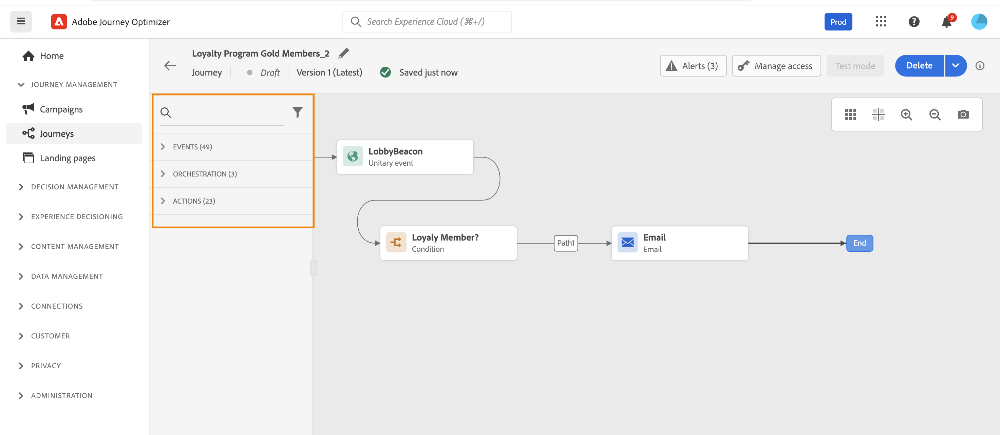

# Introducción a los recorridos{#jo-general-principle}

Adobe Journey Optimizer le permite crear recorridos para el cliente personalizados que constan de varios pasos y que se adaptan en tiempo real al comportamiento y las necesidades de su público. Con un lienzo intuitivo de tipo arrastrar y soltar, puede orquestar mensajes y acciones en varios canales, aprovechando los datos contextuales y la segmentación del público para lograr el máximo impacto.

Esta guía proporciona una hoja de ruta clara para ayudarle a comprender los aspectos básicos del recorrido, elegir el tipo de recorrido adecuado para su caso de uso y diseñar recorridos con confianza que proporcionen experiencias del cliente significativas y oportunas.

## ¿Qué son los recorridos?

Los **recorridos** son experiencias de cliente automatizadas y de varios pasos que organizan interacciones personalizadas entre canales en respuesta a la conducta del cliente, eventos empresariales o campañas programadas.

Use [!DNL Journey Optimizer] para:

* Crear casos de uso de **orquestación en tiempo real** aprovechando los datos contextuales almacenados en eventos o fuentes de datos
* Diseñar **casos avanzados de varios pasos** que respondan dinámicamente al comportamiento de los clientes y a los eventos empresariales
* Ofrecer **1:1 experiencias personalizadas** a escala en correo electrónico, push, SMS, en la aplicación, web y más

➡️ **¿Todo listo para comenzar a crear?** [Cree su primer recorrido](journey-gs.md) en 5 minutos.

### Recorridos vs. Campañas: cuándo usar cada uno {#journeys-vs-campaigns-intro}

Adobe Journey Optimizer ofrece tres métodos para llegar a los clientes: **Recorridos** (1:1 orquestación en tiempo real), **Campañas** (envío simple por lotes o desencadenado por API) y **Campañas orquestadas** (flujos de trabajo por lotes de lienzo con datos de varias entidades).

**Decisión rápida:**

* Use **Recorridos** para experiencias de varios pasos impulsadas por el comportamiento en las que cada cliente progresa a su propio ritmo
* Use **Campañas de acción/API** para enviar mensajes simples, programados o activados a los públicos
* Use **Campañas orquestadas** para flujos de trabajo por lotes complejos que requieren segmentación de varias entidades y recuentos exactos de preenvío

<!-- waiting for DOCAC-13912
➡️ **[View detailed comparison: Journeys vs Campaigns](../start/journeys-vs-campaigns.md)** - Includes decision guide, use cases, and feature availability-->

## Elija su tipo de recorrido {#journey-types}

Adobe Journey Optimizer admite cuatro tipos de recorridos, cada uno diseñado para diferentes mecanismos de entrada y casos empresariales:

* **Recorridos unitarios**: experiencias activadas por eventos en tiempo real (confirmaciones de pedidos, correos electrónicos de bienvenida)
* **Leer recorridos de públicos**: Comunicaciones por lotes programadas para segmentos de público (boletines informativos, campañas promocionales)
* **Recorridos de calificación de públicos**: respuestas en tiempo real a cambios de pertenencia a públicos (actualizaciones de VIP, renovación de participación)
* **Recorridos de eventos empresariales**: condiciones empresariales que afectan a varios clientes (alertas de inventario, ventas flash)

<!-- waiting for DOCAC-13912 
➡️ **[Journey types and selection guide](journey-types-selection.md)** - Detailed comparison, decision tree, and feature compatibility matrix -->

## Crear con el diseñador de recorridos {#journey-designer}

El **[diseñador de recorridos](using-the-journey-designer.md)** es el lienzo visual para crear experiencias de cliente. Con una interfaz intuitiva de arrastrar y soltar, puede organizar cada paso del recorrido sin necesidad de escribir código.

### Lo que puede hacer en el diseñador:

:::: landing-cards-container

:::

**Definir puntos de entrada**

Elegir cómo entran los clientes: a través de un evento, segmento de público o calificación de público.

[Conozca la gestión de entrada](entry-management.md)
:::

:::

**Envío de mensajes**

Utilice acciones de canal integradas para correo electrónico, push, SMS/MMS, en la aplicación, web y mucho más, todas diseñadas en Journey Optimizer.

[Envío de mensajes en recorridos](journeys-message.md)
:::

:::

**Añadir lógica y condiciones**

Ramifique su recorrido en función de atributos de perfil, pertenencia a públicos o eventos en tiempo real.

[Condiciones de uso](condition-activity.md)
:::

:::

**Aprovechamiento de datos**

Utilice datos contextuales de eventos, Adobe Experience Platform o servicios API de terceros.

[Trabajo con paquetes de datos](../datasource/about-data-sources.md)
:::

:::

**Conectar sistemas externos**

Cree acciones personalizadas para integrar sistemas de terceros para enviar mensajes o activar flujos de trabajo.

[Configurar acciones personalizadas](../action/about-custom-action-configuration.md)
:::

:::

**Añada actividades de orquestación**

Utilice tiempos de espera, saltos, actualizaciones de perfiles y gestión de público para crear flujos sofisticados.

[Explorar todas las actividades](about-journey-activities.md)
:::

::::

➡️ **Aprendizaje práctico:** [Vea el vídeo del diseñador de recorridos](#video) o [explore casos de uso de extremo a extremo](jo-use-cases.md)

## Su flujo de trabajo de creación de recorridos {#workflow}

La creación de recorridos exitosos sigue un proceso claro y repetible. Este es su flujo de trabajo paso a paso:

**1. Planificación** → **2. Diseño** → **3. Prueba** → **4. Publicación** → **5. Supervisión** → **6. Optimización**

### &#x200B;1. Planifique su recorrido {#plan}

Antes de abrir el diseñador, tenga claros sus objetivos:

* **¿Cuál es el objetivo?** (por ejemplo, incorporar nuevos clientes, volver a atraer usuarios inactivos)
* **¿Quién es el público?** (segmento específico, individuos impulsados por evento)
* **¿Qué tipo de recorrido encaja?** (Ver [tipos de recorrido](#journey-types) más arriba)
* **¿Qué canales usará?** (correo electrónico, push, SMS, etc.)

### &#x200B;2. Diseñe en el lienzo {#design}

Utilice el diseñador de recorridos para crear el flujo:

* **Establezca condiciones de entrada**: defina cómo entran los perfiles (evento, público, calificación)
* **Añada una lógica de orquestación**: incluya tiempos de espera, condiciones y puntos de decisión
* **Configure mensajes**: diseñe sus comunicaciones o utilice las plantillas existentes
* **Configure acciones**: configure acciones integradas o personalizadas para ejecutar
* **Defina criterios de salida**: especifique cuándo y cómo completan el recorrido los perfiles

[Aprenda a utilizar el diseñador de recorrido →](using-the-journey-designer.md)

### &#x200B;3. Pruebe antes de activarlos {#test}

Pruebe siempre el recorrido para detectar problemas antes de que los clientes lo experimenten:

* Use **modo de prueba** para simular el recorrido con perfiles de prueba
* Utilice la **ejecución en seco** para obtener una vista previa de la ejecución del recorrido sin afectar a los datos reales ni enviar mensajes
* Compruebe que todas las condiciones, mensajes y acciones funcionan según lo esperado
* Compruebe la sincronización, los flujos de datos y la personalización

[Pruebe su recorrido →](testing-the-journey.md) | [Más información sobre el ensayo de recorrido →](journey-dry-run.md)

### &#x200B;4. Publique su recorrido {#publish}

Una vez finalizada la prueba, publique para que el recorrido esté activo:

* Revisar la configuración y las propiedades finales
* Publique para activarlo para clientes reales
* Nota: Los recorridos activos se pueden detener, pero no editar (debe crear una nueva versión)

[Publique su recorrido →](publish-journey.md)

### &#x200B;5. Supervise el rendimiento {#monitor}

Realice un seguimiento del rendimiento de su recorrido en el mundo real:

* Vea informes y análisis del recorrido
* Monitorice las tasas de entrada, finalización y error
* Configure alertas para problemas críticos

[Supervise e informe →](report-journey.md) | [Configure alertas →](../reports/alerts.md)

### &#x200B;9. Optimice e itere {#optimize}

Use perspectivas para mejorar:

* Analice métricas de participación y tasas de conversión
* Pruebe la optimización del tiempo de envío
* Cree nuevas versiones de recorrido con mejoras
* Use recomendaciones con tecnología de IA

[Optimice los recorridos →](optimize.md) | [→ Optimización del tiempo de envío](send-time-optimization.md)

➡️ **¿Todo listo para comenzar?** [Cree su primer recorrido ahora →](journey-gs.md)

## Casos de uso reales {#use-cases}

Aprenda con ejemplos prácticos que muestran cómo aplicar conceptos de recorrido para solucionar retos de marketing comunes:

:::: landing-cards-container

:::

**Dé la bienvenida a nuevos suscriptores**

Cuando un cliente se suscriba a su servicio, active un recorrido de bienvenida que le anime a completar los pasos de incorporación.

[Ver caso de uso →](message-to-subscribers-uc.md)
:::

:::

**Optimización del tiempo de envío**

Utilice la IA para enviar correos electrónicos cuando sea más probable que cada cliente interactúe, lo que maximiza las tasas de apertura y de clics.

[Ver caso de uso →](send-time-optimization.md)
:::

:::

**Aumento de envíos**

Aumente gradualmente el volumen del mensaje para aumentar la reputación de su envío y evitar problemas de entregabilidad.

[Ver caso de uso →](ramp-up-deliveries-uc.md)
:::

:::

**Segmente por día laborable**

Envíe contenido diferente en función del día de la semana en el que los clientes entren en su recorrido para mejorar la relevancia.

[Ver caso de uso →](weekday-email-uc.md)
:::

:::

**Campañas multicanal**

Orqueste experiencias optimizadas en canales de correo electrónico, push, SMS y web en un solo recorrido.

[Ver caso de uso →](journeys-uc.md)
:::

:::

**Todos los casos de uso**

Explore la biblioteca completa de casos de uso de recorrido con implementaciones paso a paso.

[Ver todo →](jo-use-cases.md) | [Biblioteca de casos de uso →](/help/rp_landing_pages/journey-use-cases-landing-page.md)
:::

::::

## Explorar las funciones del recorrido {#capabilities}

A medida que se vaya familiarizando con la creación de recorridos, explore estas potentes funciones para crear experiencias de cliente sofisticadas:

:::: landing-cards-container

:::

**Expresiones avanzadas**

Cree condiciones dinámicas y personalización mediante el editor de expresiones para la manipulación de datos y la lógica compleja.

[Más información sobre expresiones](/help/rp_landing_pages/building-advanced-conditions-journeys-landing-page.md)
:::

:::

**Administración de husos horarios**

Gestione públicos globales con ajustes automáticos de zona horaria y tiempos de envío óptimos.

[Administrar zonas horarias](timezone-management.md)
:::

:::

**Modo de prueba y ensayo**

Valide los recorridos con perfiles de prueba antes de activarlos y previsualice la ejecución sin afectar a los datos reales.

[Utilice el ensayo](journey-dry-run.md)
:::

:::

**Copie a la zona protegida**

Duplique los recorridos en las zonas protegidas para optimizar los flujos de trabajo de prueba e implementación.

[Copie los recorridos](copy-to-sandbox.md)
:::

:::

**Etiquetas y organización**

Utilice etiquetas para categorizar y filtrar recorridos para una mejor administración a escala.

[Organización con etiquetas](tags.md)
:::

:::

**Control de rendimiento**

Limite el rendimiento del mensaje para administrar la reputación de envío y evitar sistemas abrumadores.

[Control del rendimiento](limit-throughput.md)
:::

::::

[Vea todas las funcionalidades de recorrido →](/help/rp_landing_pages/manage-journey-landing-page.md)

## Aprenda mirando {#video}

Obtenga una introducción visual a los componentes del recorrido y aprenda los conceptos básicos de la creación de recorridos en el lienzo:

>[!VIDEO](https://video.tv.adobe.com/v/3424996?quality=12)

➡️ **¿Quiere más vídeos?** [Explorar tutoriales de vídeo de recorrido](https://experienceleague.adobe.com/es/docs/journey-optimizer-learn/tutorials/journeys/journey-designer-overview){target="_blank"}

## Preguntas frecuentes {#common-questions}

+++ ¿Cuál es la diferencia entre un recorrido y una campaña?

Adobe Journey Optimizer ofrece tres métodos:

* **Recorridos**: 1:1 orquestación en tiempo real en la que cada perfil recorre los pasos a su propio ritmo. Ideal para experiencias de varios pasos y basadas en el comportamiento con lógica condicional (por ejemplo, incorporación, abandono del carro de compras).

* **Campañas (activadas por acción y API)**: envío de mensaje simple a los públicos, que se ejecuta simultáneamente en todos los perfiles según lo programado o mediante el activador de API. Ideal para campañas promocionales, boletines informativos y mensajes transaccionales.

* **Campañas orquestadas**: flujos de trabajo por lotes de varios pasos con segmentación compleja que utiliza datos relacionales (perfiles + productos/tiendas/reservas). Todos los perfiles procesados junto con los recuentos exactos de preenvío. Ideal para promociones de temporada, lanzamientos de productos y campañas que requieren datos de varias entidades.

**Diferencia clave**: los recorridos mantienen el estado de cliente individual para acciones en tiempo real; las campañas de acción/API entregan mensajes simples en lote; las campañas orquestadas proporcionan lienzo de flujo de trabajo en lote con capacidades de segmentación de varias entidades.

<!-- waiting for DOCAC-13912 - [See detailed comparison](#journeys-vs-campaigns) -->
[Más información sobre las campañas orquestadas](../orchestrated/gs-orchestrated-campaigns.md)

+++

<!-- Waiting for DOCAC-13912
+++ Which journey type should I use?

Use the [decision guide](#decision-guide) or [comparison table](#journey-types-comparison) to choose between Unitary, Read Audience, Audience Qualification, and Business Event journeys based on your trigger mechanism and use case.

+++
-->

+++ ¿Puedo editar un recorrido en directo?

Puede editar elementos limitados (nombre, contenido del mensaje), pero los cambios estructurales requieren la creación de una nueva versión. [Más información sobre las versiones de un recorrido](publish-journey.md#journey-versions)

+++

➡️ **¿Más preguntas?** [Vea la lista completa de preguntas frecuentes sobre el recorrido](journey-faq.md) con más de 40 respuestas detalladas

## ¿Necesita ayuda? {#help}

### Vínculos rápidos para tareas comunes

* **[Cree su primer recorrido](journey-gs.md)**: guía paso a paso para principiantes
* **[Preguntas frecuentes sobre el recorrido](journey-faq.md)**: preguntas comunes respondidas
* **[Solución de problemas](/help/rp_landing_pages/troubleshoot-journey-landing-page.md)**: diagnóstico y corrección de problemas
* **[Referencia de códigos de error](error-codes-reference.md)**: explicación de los mensajes de error
* **[Protecciones y limitaciones](../start/guardrails.md)**: límites técnicos y prácticas recomendadas

### Recibir notificaciones sobre problemas

Configure **[alertas de recorridos](../reports/alerts.md)** para recibir notificaciones en tiempo real cuando los recorridos encuentren errores o patrones inusuales.

### Recursos adicionales

* **[Hub de administración de Recorrido](/help/rp_landing_pages/manage-journey-landing-page.md)**: herramientas para filtrado, optimización y administración de perfiles
* **[Referencia de actividades de recorrido](/help/rp_landing_pages/about-journey-building-landing-page.md)**: guía completa para todos los tipos de actividades
* **[Solucionar problemas de ejecución](troubleshooting-execution.md)**: problemas de ejecución del recorrido de depuración
* **[Solución de problemas de actividades entrantes](troubleshooting-inbound.md)**: corrija problemas de entrada y calificación

**¿Todo listo para crear su primer recorrido?** [Empiece ahora →](journey-gs.md)
