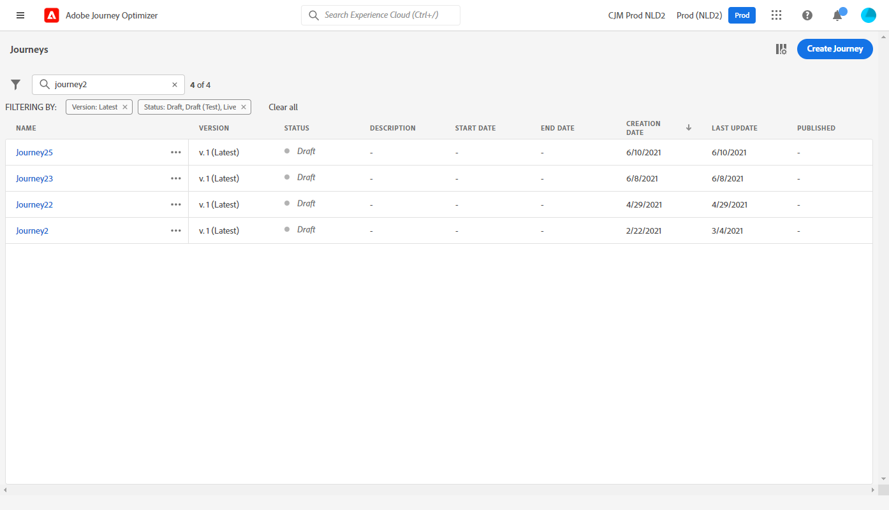

# Introducción a los recorridos{#jo-general-principle}

Uso [!DNL Journey Optimizer] para crear casos de uso de orquestación en tiempo real utilizando datos contextuales almacenados en eventos o fuentes de datos.

Diseñe escenarios avanzados de varios pasos con las siguientes capacidades:

* Enviar en tiempo real **envío unitario** se activa cuando se recibe un evento, o **en lote** uso de segmentos de Adobe Experience Platform.

* Aprovechar **datos contextuales** desde eventos, información de Adobe Experience Platform o datos de servicios API de terceros.

* Utilice la variable **acciones integradas** para enviar mensajes diseñados en [!DNL Journey Optimizer] o crear **acciones personalizadas** si utiliza un sistema de terceros para enviar mensajes.

* Con la variable **diseñador de recorridos**, cree sus casos de uso de varios pasos: arrastre y suelte fácilmente un evento de entrada o una actividad de segmento de lectura, añada condiciones y envíe mensajes personalizados.

## Pasos para crear un recorrido{#steps-journey}

Utilice Adobe Journey Optimizer para diseñar y organizar recorridos personalizados desde un solo lienzo.

Adobe Journey Optimizer incluye un lienzo de organización omnicanal que permite a los especialistas en marketing armonizar el alcance de marketing con la participación de los clientes uno a uno. La interfaz de usuario le permite arrastrar y soltar fácilmente actividades de la paleta en el lienzo para crear su recorrido.

Aprenda a iniciar y crear su primer recorrido en [esta página](journey-gs.md).

El diseñador de recorridos omnicanal le ayuda a crear recorridos de varios pasos con audiencias de destino, actualizaciones basadas en interacciones empresariales o de clientes en tiempo real y mensajes omnicanal mediante una interfaz intuitiva de arrastrar y soltar.

Más información en [esta sección](using-the-journey-designer.md).

Como ingeniero de datos, los pasos para configurar los recorridos, incluidas las fuentes de datos, los eventos y las acciones, se detallan en [esta sección](../configuration/about-data-sources-events-actions.md).

## Casos de uso{#uc-journey}

Aprenda a construir recorridos en los siguientes casos de uso integral.

Casos de uso empresarial:

* [Envío de mensajes multicanal](journeys-uc.md)
* [Envío de un mensaje mediante Campaign v7/v8](ajo-ac.md)
* [Enviar un mensaje a los suscriptores](message-to-subscribers-uc.md)

Casos de uso técnico:

* [Transmitir colecciones de forma dinámica mediante acciones personalizadas](collections.md)
* [Aumento de envíos](ramp-up-deliveries-uc.md)
* [Limitar el rendimiento con fuentes de datos externas y acciones personalizadas](limit-throughput.md)

## Versiones de Journey{#journey-versions}

En la lista de recorridos, todas las versiones del recorrido se muestran con el número de versión. Consulte [esta página](../building-journeys/using-the-journey-designer.md).

Al buscar un recorrido, las versiones más recientes aparecen en la parte superior de la lista la primera vez que se abre la aplicación. A continuación, puede definir la clasificación que desee y la aplicación la mantendrá como una preferencia de usuario. La versión del recorrido también se muestra en la parte superior de la interfaz de edición del recorrido, encima del lienzo.

>[!NOTE]
>
>Normalmente, un perfil no puede estar presente varias veces en el mismo recorrido, al mismo tiempo. Si la reentrada está habilitada, un perfil puede volver a entrar en un recorrido, pero no puede hacerlo hasta que haya salido completamente de la instancia anterior del recorrido. [Más información](end-journey.md).

Si necesita modificar a un recorrido en directo, cree una nueva versión del recorrido.

1. Abra la última versión de su recorrido en directo y haga clic en **[!UICONTROL Create a new version]** y confirme.

   

   >[!NOTE]
   >
   >Solo puede crear una nueva versión a partir de la última versión de un recorrido.

1. Realice las modificaciones necesarias, haga clic en **[!UICONTROL Publish]** y confirme.

   

Desde el momento en que se publique el recorrido, las personas empezarán a fluir a la última versión del recorrido. Las personas que ya han introducido una versión anterior permanecen en ella hasta que finalizan el recorrido. Si más adelante vuelven a entrar en el mismo recorrido, pasarán a la última versión.

Las versiones de recorrido se pueden detener de forma individual. Todas las versiones de recorridos tienen el mismo nombre.

Cuando publica una nueva versión de un recorrido, la versión anterior finaliza automáticamente y cambia a la función **Cerrado** estado. No puede ocurrir ninguna entrada en el recorrido. Aunque detenga la última versión, la versión anterior permanecerá cerrada.

>[!NOTE]
>
>Obtenga más información sobre las versiones del recorrido, las barreras y limitaciones, en [esta página](../start/guardrails.md#journey-versions-limitations)