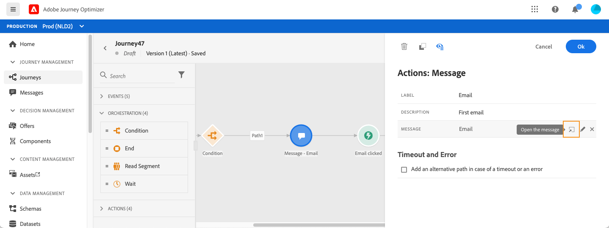
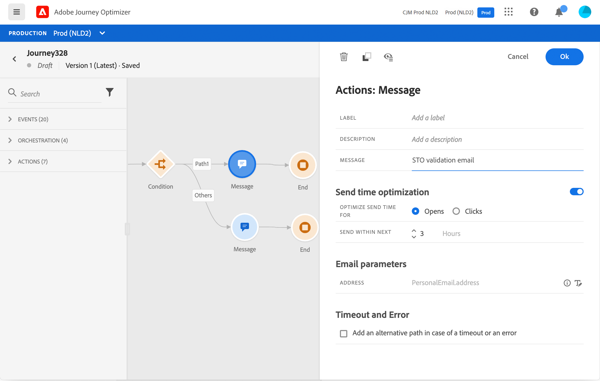

# Adición de un mensaje en un recorrido{#add-a-message-in-a-journey}

[!DNL Journey Optimizer] las funciones de mensajes están integradas, solo tiene que diseñar el contenido y publicar el mensaje. Consulte [esta sección](../messages/get-started-content.md). A continuación, simplemente agregue, en su recorrido, un mensaje push o de correo electrónico diseñado con Journey Optimizer.

Si utiliza un sistema de terceros para enviar mensajes, puede crear una acción personalizada. Obtenga más información en esta [sección](../action/action.md).

## Añadir una actividad Message

1. Como siempre, inicie su recorrido con un evento o un **Leer segmento** actividad.

   

1. En el **Acciones** de la paleta, arrastre y suelte una **Mensaje** actividad en el lienzo.

   

1. Añada una etiqueta y una descripción.

   

1. Haga clic dentro del **Mensaje** campo . Se muestra la lista de mensajes disponibles diseñados en Journey Optimizer. Puede filtrar la lista por estado.

   

1. Seleccione un mensaje y haga clic en **Select**. También puede crear un nuevo mensaje directamente desde esta pantalla haciendo clic en **Crear mensaje**.

   

   Si desea comprobar el mensaje, puede hacer clic en el botón **Abrir el mensaje** en el **Mensaje** campo . El mensaje se abre en una pestaña nueva.

   

1. Añada los siguientes pasos a su recorrido.

## Parámetros de correo electrónico y parámetros push

La variable **[!UICONTROL Email parameters]** y **[!UICONTROL Push parameters]** las secciones muestran campos de solo lectura. Normalmente, se realiza esta configuración al crear el mensaje. Consulte [esta sección](../messages/get-started-content.md).

Para forzar un valor específico, puede usar la variable **Habilitar anulación de parámetros** a la derecha del campo . Esta opción puede resultar útil para varios fines:

* Por ejemplo, para probar un correo electrónico, puede añadir su dirección de correo electrónico. Después de publicar el recorrido, se le enviará el correo electrónico.
* Puede consultar la dirección de correo electrónico de los suscriptores de una lista. Consulte esta [caso de uso](message-to-subscribers-uc.md).

## Optimización del tiempo de envío{#send-time-optimization}

>[!CONTEXTUALHELP]
>id="jo_bestsendtime_disabled"
>title="Acerca de la optimización del tiempo de envío"
>abstract="La función de optimización del tiempo de envío de Adobe Journey Optimizer, con tecnología de los servicios de IA de Adobe, puede predecir el mejor momento para enviar un mensaje push o de correo electrónico para maximizar la participación en función de las tasas de apertura y clics históricas."

La función de optimización del tiempo de envío de Adobe Journey Optimizer, con tecnología de los servicios de IA de Adobe, puede predecir el mejor momento para enviar un mensaje push o de correo electrónico para maximizar la participación en función de las tasas de apertura y clics históricas. Utilice nuestro modelo de aprendizaje automático para programar tiempos de envío personalizados para que cada usuario aumente las tasas de apertura y clics de sus mensajes.

>[!NOTE]
>
>Actualmente, esta función está en versión beta y solo está disponible para los clientes de la versión beta. Para unirse al programa beta, póngase en contacto con el Servicio de atención al cliente de Adobe.

El modelo de optimización del tiempo de envío incorpora los datos de Adobe Journey Optimizer y observa las tasas de apertura a nivel de usuario (para correo electrónico y push) y de clics (para correo electrónico) para determinar cuándo es más probable que sus clientes interactúen con sus mensajes. La optimización del tiempo de envío requiere un mínimo de un mes de datos de seguimiento de mensajes para realizar recomendaciones informadas. Para cada usuario, el sistema selecciona automáticamente el mejor momento utilizando las siguientes puntuaciones:

* La mejor hora de cada día de la semana para maximizar la participación
* El mejor día de la semana para maximizar la participación
* La mejor hora del mejor día de la semana para maximizar la participación

El modelo varía si se habla de puntuación o de entrenamiento. La formación se imparte semanalmente y posteriormente trimestralmente. La puntuación es semanal inicialmente y, a continuación, mensual.

* Formación: el desarrollo del algoritmo utilizado para obtener la puntuación.
* Puntuación: la aplicación de una puntuación a perfiles individuales en función del modelo entrenado

Esta información se almacena con el perfil del usuario y se hace referencia a ella en la ejecución del recorrido para indicar a Adobe Journey Optimizer cuándo enviar el mensaje.

>[!CAUTION]
>
>* Esta función solo está disponible para mensajes multicanal en correos electrónicos y mensajes push con seguimiento habilitado.
>* El mensaje debe publicarse.
>* Esta función no es compatible con el modo de ráfaga.

### Activación de la optimización del tiempo de envío{#activate-send-time-optimization}

>[!CONTEXTUALHELP]
>id="jo_bestsendtime_email"
>title="Activación de la optimización del tiempo de envío"
>abstract="Seleccione si desea optimizar las aperturas de correo electrónico o las pulsaciones de correo electrónico seleccionando el botón de radio adecuado. También puede optar por cortejar los tiempos de envío utilizados por el sistema introduciendo un valor para la opción Send in the next ."

>[!CONTEXTUALHELP]
>id="jo_bestsendtime_push"
>title="Activación de la optimización del tiempo de envío"
>abstract="Los mensajes push toman el valor predeterminado de la opción de aperturas, ya que los clics no son aplicables a la mensajería push. También puede optar por cortejar los tiempos de envío utilizados por el sistema introduciendo un valor para la opción Send in the next ."

Habilite la optimización del tiempo de envío en un mensaje push o de correo electrónico seleccionando la opción **Optimización del tiempo de envío** desde los parámetros de actividad Message .

En el caso de los mensajes de correo electrónico, seleccione si desea optimizar las aperturas de correo electrónico o las pulsaciones de correo electrónico seleccionando el botón de opción adecuado. Los mensajes push toman el valor predeterminado de la opción de aperturas, ya que los clics no son aplicables a la mensajería push.

También puede optar por cortejar los tiempos de envío utilizados por el sistema introduciendo un valor para la variable **Envíe dentro del siguiente** . Si elige &quot;seis horas&quot; como valor, [!DNL Journey Optimizer] comprobará cada perfil de usuario y elegirá el tiempo de envío óptimo dentro de las seis horas siguientes al tiempo de ejecución del recorrido.
