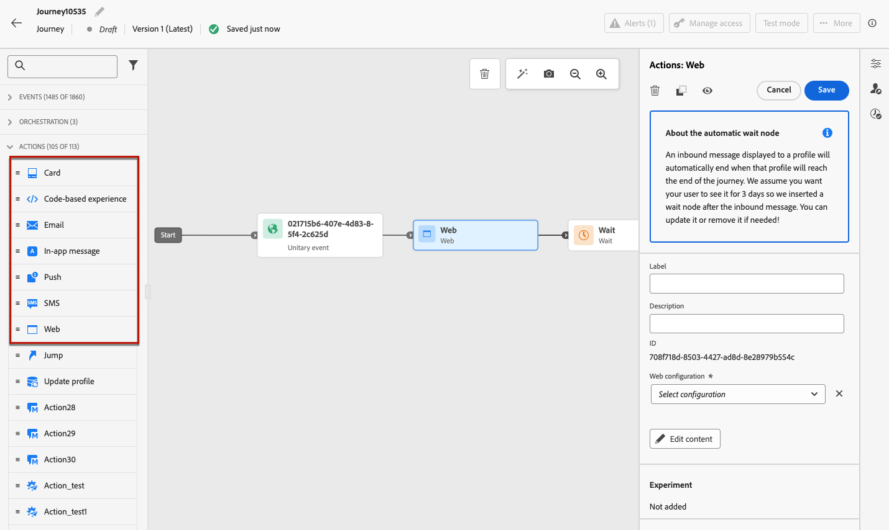

# Uso de acciones de canal integradas {#add-a-message-in-a-journey}

>[!CONTEXTUALHELP]
>id="ajo_message_activity"
>title="Acción de canal integrada"
>abstract="Journey Optimizer incluye funcionalidades de acción de canal integradas. Basta con añadir a su recorrido una actividad saliente (correo electrónico, mensaje de texto SMS/MMS, push) o entrante (aplicación, web, experiencia basada en código, tarjeta de contenido) y definir la configuración y el contenido. A continuación, se ejecuta y envía en el contexto del recorrido."

[!DNL Journey Optimizer] viene con funcionalidades de acción de canal integradas. Basta con añadir a su recorrido una actividad saliente (correo electrónico, mensaje de texto SMS/MMS, push) o entrante (aplicación, web, experiencia basada en código, tarjeta de contenido) y definir la configuración y el contenido. A continuación, se ejecuta y envía en el contexto del recorrido.

>[!NOTE]
>
>También puede configurar acciones específicas para enviarle mensajes. [Más información](#recommendation)

Para añadir una acción de canal integrada a un recorrido, siga los pasos a continuación.

1. Inicie el recorrido con una actividad [Event](general-events.md) o [Read Audience](read-audience.md).

1. En la sección **Acciones** de la paleta, arrastre y suelte una actividad de salida (**correo electrónico**, **push**, **SMS**) o de entrada (**en la aplicación**, **web**, **experiencia basada en código**, **tarjeta de contenido**) en el lienzo.

   

1. Configure su actividad.

   * Conozca los pasos detallados para crear el contenido del mensaje de la siguiente manera:

     <table style="table-layout:fixed">
      <tr style="border: 0;">
      <td>
      
      
<a href="../email/create-email.md"><strong>Creación de correos electrónicos</strong>
      

      

      </td>
      <td>
      
      

      <a href="../push/create-push.md"><strong>Creación de notificaciones push<strong></a>
      

      

      </td>
      <td>
      
      

      <a href="../sms/create-sms.md"><strong>Crear mensajes de texto (SMS/MMS)</strong></a>
      

      

      </td>
      </tr>
      </table>

   * Conozca los pasos detallados para crear su acción entrante de la siguiente manera:

     <table style="table-layout:fixed">
      <tr style="border: 0;">
      <td>
      
      
<a href="../in-app/create-in-app.md"><strong>Crear mensajes en la aplicación</strong>
      

      

      </td>
      <td>
      
      
<a href="../web/create-web.md"><strong>Crear experiencias web</strong>
      

      

      </td>
      <td>
      
      
<a href="../content-card/create-content-card.md"><strong>Crear tarjetas de contenido</strong>
      

      

      </td>
      <td>
      
      

      <a href="../code-based/create-code-based.md"><strong>Crear experiencias basadas en código<strong></a>
      

      

      </td>
      </tr>
      </table>

     >[!NOTE]
     >
     >Cada actividad de mensaje entrante viene con una actividad de **Wait** de 3 días. [Más información](../building-journeys/wait-activity.md#auto-wait-node)

## Recomendación {#recommendation}

[!DNL Journey Optimizer] viene con capacidad de envío de mensajes integrada. Sin embargo, las acciones personalizadas le permiten configurar la conexión de un sistema de terceros para enviar mensajes o llamadas API.

* Si utiliza un sistema de terceros para enviar mensajes, puede crear una acción personalizada. [Más información](../action/action.md)

* Si está trabajando con Campaign y Journey Optimizer, consulte estas secciones:

   * [[!DNL Journey Optimizer] y Campaign v7/v8](../action/acc-action.md)
   * [[!DNL Journey Optimizer] y Campaign Standard](../action/acs-action.md)

## Actualización de contenido en directo{#update-live-content}

Puede actualizar el contenido de una acción de canal integrada en un recorrido en directo.

Para ello, abre el recorrido en vivo, selecciona la actividad del canal y haz clic en **Editar contenido**.

Sin embargo, no se pueden cambiar los atributos utilizados en la personalización, ya sean atributos de perfil o datos contextuales (de propiedades de evento o recorrido).

Si ha modificado datos contextuales, aparecerá el siguiente mensaje de error: ERR_AUTHORING_JOURNEYVERSION_201

Si ha modificado los atributos de perfil, aparecerá el siguiente mensaje de error: ERR_AUTHORING_JOURNEYVERSION_202

Tenga en cuenta que para la actividad en la aplicación, cualquier cambio se puede realizar en el contenido mientras el recorrido está activo, pero los déclencheur en la aplicación no se pueden modificar.

## Optimización del tiempo de envío{#send-time-optimization}

>[!CONTEXTUALHELP]
>id="jo_bestsendtime_disabled"
>title="Acerca de la optimización del tiempo de envío"
>abstract="La función de optimización del tiempo de envío de Adobe Journey Optimizer, con tecnología de los servicios de IA de Adobe, puede predecir el mejor momento para enviar un mensaje push o de correo electrónico para maximizar la participación en función de las tasas históricas de apertura y clics."

>[!NOTE]
>
>Esta función no está activada de forma predeterminada. Póngase en contacto con el representante del Adobe para activarlo.
>
>La función Optimización del tiempo de envío solo se aplica a los canales de correo electrónico y push.

### Acerca de la optimización del tiempo de envío {#about-send-time}

La función de optimización del tiempo de envío de Adobe Journey Optimizer, con tecnología de los servicios de IA de Adobe, puede predecir el mejor momento para enviar un **correo electrónico** o **mensaje push** para maximizar la participación en función de la apertura histórica y las tasas de clics. Utilice nuestro modelo de aprendizaje automático para programar tiempos de envío personalizados para cada usuario y, así, aumentar las tasas de apertura y de clics de sus mensajes.

El modelo de optimización del tiempo de envío ingiere los datos de Adobe Journey Optimizer y observa las tasas de apertura a nivel de usuario (para correo electrónico y push) y clics (para correo electrónico) para determinar cuándo es más probable que los clientes interactúen con los mensajes. La optimización del tiempo de envío requiere un mínimo de un mes de datos de seguimiento de mensajes para hacer recomendaciones informadas. Para cada usuario, el sistema seleccionará automáticamente el mejor momento con las siguientes puntuaciones:

* La mejor hora de cada día de la semana para maximizar la participación
* El mejor día de la semana para maximizar la participación
* La mejor hora del mejor día de la semana para maximizar la participación

El modelo varía si se habla de puntuación o de formación. La capacitación se imparte semanalmente inicialmente y luego trimestralmente. La puntuación inicial es semanal y, a continuación, mensual.

* Formación: el desarrollo del algoritmo utilizado para obtener la puntuación
* Puntuación: la aplicación de una puntuación a perfiles individuales en función del modelo entrenado

Esta información se almacena con el perfil del usuario y se hace referencia a ella en la ejecución del recorrido para indicar a Adobe Journey Optimizer cuándo enviar el mensaje.

### Preguntas más frecuentes {#faq-send-time}

+++ ¿Qué puede hacer la optimización del tiempo de envío? ¿Cómo gestiona los nuevos perfiles? ¿Distribuye el envío en un periodo de 6/12/24 horas?

La optimización del tiempo de envío intenta predecir el mejor momento para interactuar con los clientes y optimizar las tasas de apertura y clics de los correos electrónicos. La puntuación está en un formato de `3*7*24` atributos para cada perfil. Los atributos `7*24` describen la clasificación del mejor momento previsto para enviar correos electrónicos al destinatario y 3 es para optimizar la tasa de apertura de los correos electrónicos, la tasa de clics en los correos electrónicos y la tasa de apertura de las notificaciones push.

+++

+++¿Dónde puedo ver el tiempo de envío esperado para cada perfil?

Puede ver la puntuación general en la interfaz **Perfiles**. Para cada uno de los tres conjuntos de 168 puntuaciones, los rangos van de -83 a 84. Cuanto mayor sea la clasificación, mejor será el momento de interactuar con el destinatario. Dado que puede definir el inicio y la duración de un recorrido, es posible que la mejor clasificación (84) no caiga en esa ventana de tiempo. En este caso, se recomienda elegir una hora con el valor de clasificación más alto.

+++

+++¿Qué informes están disponibles?

Accede a tu recorrido, haz clic en el botón **Ver informe** en la parte superior derecha y selecciona la pestaña **Recorrido** a la izquierda. [Más información](../reports/journey-global-report-cja.md)

+++

+++¿Cómo afectan los datos de optimización del tiempo de envío a la riqueza de perfiles?

La optimización del tiempo de envío agrega la puntuación/atributos a cada perfil, pero no se crea ningún perfil nuevo.

+++

### Activación de la optimización del tiempo de envío{#activate-send-time-optimization}

>[!CONTEXTUALHELP]
>id="jo_bestsendtime_email"
>title="Activación de la optimización del tiempo de envío"
>abstract="Elija si desea optimizar las aperturas de correo electrónico o los clics de correo electrónico seleccionando el botón de radio adecuado. También puede optar por poner entre paréntesis los tiempos de envío utilizados por el sistema introduciendo un valor para la opción Enviar dentro de los próximos."

>[!CONTEXTUALHELP]
>id="jo_bestsendtime_push"
>title="Activación de la optimización del tiempo de envío"
>abstract="Los mensajes push tienen por defecto la opción de apertura, ya que los clics no se aplican a la mensajería push. También puede optar por poner entre paréntesis los tiempos de envío utilizados por el sistema introduciendo un valor para la opción Enviar dentro de los próximos."

Habilite la optimización del tiempo de envío en un mensaje push o de correo electrónico seleccionando el conmutador **Optimización del tiempo de envío** entre los parámetros de actividad.

Para los mensajes de correo electrónico, seleccione si desea optimizar las aperturas de correo electrónico o las pulsaciones de correo electrónico seleccionando el botón de opción adecuado. Los mensajes push usan de forma predeterminada la opción de aperturas, ya que los clics no son aplicables a los mensajes push.

También puede optar por poner entre corchetes los tiempos de envío que utiliza el sistema al escribir un valor para la opción **Send en la siguiente**. Si elige &quot;seis horas&quot; como valor, [!DNL Journey Optimizer] comprobará cada perfil de usuario y elegirá el tiempo de envío óptimo en un plazo de seis horas a partir del momento de ejecución del recorrido.

**¿Qué sucede si el tiempo óptimo está fuera de la ventana?**

Veamos un ejemplo con la siguiente configuración:

* Optimización en clics
* La acción debe comenzar a las 10 de la mañana
* La ventana es de 3 horas

Un perfil puede tener un tiempo de apertura óptimo que está fuera de la ventana. Por ejemplo, la apertura óptima de John al hacer clic es a las 17:00.

En el nivel de perfil, hay puntuaciones por cada hora de la semana. En este ejemplo, el correo electrónico siempre se envía dentro de la ventana. En tiempo de ejecución, el sistema comprueba la lista de puntuaciones dentro de ese intervalo (intervalo de 3 horas a partir de las 10 de la mañana). A continuación, el sistema compara las puntuaciones de 10, 11 y mediodía y selecciona la más alta. El correo electrónico se envía en ese momento.
