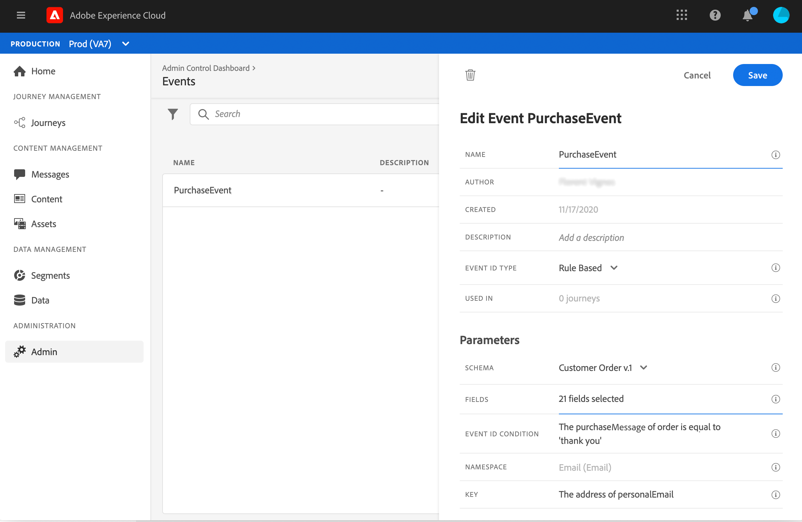

# Caso de uso: enviar mensajes multicanal{#send-multi-channel-messages}

Esta sección presenta un caso de uso que combina un segmento de lectura, un evento, eventos de reacción y mensajes de correo electrónico/push.

## Descripción del caso de uso

En este caso de uso, queremos enviar un primer mensaje (correo electrónico y push) a todos los clientes que pertenecen a un segmento específico.

En función de su reacción al primer mensaje, queremos enviar mensajes específicos.

Después del primer mensaje, esperamos un día para que los clientes abran el mensaje push o el correo electrónico. Si no hay reacción, les enviamos un correo electrónico de seguimiento.

A continuación, esperamos una compra y enviamos un mensaje push para agradecer al cliente.

## Requisitos previos

Para que este caso de uso funcione, debe configurar lo siguiente:

* un segmento para todos los clientes que viven en Atlanta, San Francisco o Seattle y que nacieron después de 1980.
* un evento purchase
* tres mensajes

### Creación del segmento

En nuestro recorrido, queremos aprovechar un segmento específico de clientes. Todas las personas que pertenecen al segmento entran en el recorrido y siguen los diferentes pasos. En nuestro ejemplo, necesitamos un segmento dirigido a todos los clientes que viven en Atlanta, San Francisco o Seattle y que nacieron después de 1980.

Para obtener más información sobre los segmentos, consulte esta [página](../segment/about-segments.md).

1. En la sección de menú CLIENTE , seleccione **[!UICONTROL Segments]**.

1. Haga clic en el **[!UICONTROL Create segment]** que se encuentra en la parte superior derecha de la lista de segmentos.

1. En el **[!UICONTROL Segment properties]** , escriba un nombre para el segmento.

1. Arrastre y suelte los campos deseados del panel izquierdo al espacio de trabajo central y, a continuación, configúrelos según sus necesidades. En este ejemplo, utilizamos la variable **Ciudad** y **Año de nacimiento** campos de atributos.

1. Haga clic en **[!UICONTROL Save]**.

   

El segmento se ha creado y está listo para utilizarse en el recorrido. Uso de un **Leer segmento** , puede hacer que todas las personas que pertenecen al segmento entren en el recorrido.

### Configuración del evento

Debe configurar un evento que se envíe a su recorrido cuando un cliente realice una compra. Cuando el recorrido recibe el evento, déclencheur el mensaje de agradecimiento.

Para ello, se utiliza un evento basado en reglas. Para obtener más información sobre los eventos, consulte esta [página](../event/about-events.md).

1. En la sección del menú ADMINISTRACIÓN , seleccione **[!UICONTROL Configurations]** y haga clic en **[!UICONTROL Events]**. Haga clic en **[!UICONTROL Create event]** para crear un nuevo evento.

1. Introduzca el nombre del evento.

1. En el campo **[!UICONTROL Event ID type]**, seleccione **[!UICONTROL Rule Based]**.

1. Defina el **[!UICONTROL Schema]** y carga útil **[!UICONTROL Fields]**. Puede utilizar varios campos, por ejemplo, el producto comprado, la fecha de compra y el ID de compra.

1. En el **[!UICONTROL Event ID condition]** , defina la condición utilizada por el sistema para identificar los eventos que producen el déclencheur del recorrido. Por ejemplo, puede agregar un `purchaseMessage` y defina la siguiente regla: `purchaseMessage="thank you"`

1. Defina el **[!UICONTROL Namespace]** y **[!UICONTROL Profile Identifier]**.

1. Haga clic en **[!UICONTROL Save]**.

   

El evento está configurado y listo para utilizarse en el recorrido. Con la actividad de evento correspondiente, puede almacenar en déclencheur una acción cada vez que un cliente realiza una compra.

### Creación de los mensajes

Para este caso de uso, se deben crear tres mensajes:

* un mensaje push y de correo electrónico de primer mensaje
* un mensaje push de agradecimiento
* un mensaje de seguimiento por correo electrónico

Consulte esta [sección](../segment/about-segments.md) para aprender a diseñar y publicar estos mensajes.

## Diseño del recorrido

1. Inicie el recorrido con un **Leer segmento** actividad. Seleccione el segmento creado anteriormente. Todas las personas que pertenecen al segmento entran en el recorrido.

   

1. Colocar una **Mensaje** y seleccione el mensaje push y el mensaje de correo electrónico primero. Este mensaje se envía a todas las personas del recorrido.

   

1. Coloque el cursor en la actividad del mensaje y haga clic en el símbolo &quot;+&quot; para crear una nueva ruta.

1. En la primera ruta, agregue una **Reacción** y seleccione **Push opened**. El evento se activa cuando una persona que pertenece al segmento abre la versión push del primer mensaje.

1. En la segunda ruta, agregue una **Reacción** y seleccione **Correo electrónico abierto**. El evento se activa cuando el individuo abre el correo electrónico.

1. En una de las actividades de reacción, compruebe el **Definir el tiempo de espera del evento** , defina una duración (1 día en nuestro ejemplo) y marque **Establecer una ruta de tiempo de espera**. Esto crea otra ruta para las personas que no abren el mensaje push o de correo electrónico primero.

   >[!NOTE]
   >
   >Al configurar un tiempo de espera en varios eventos (las dos reacciones en este caso), solo es necesario configurar el tiempo de espera en uno de estos eventos.

1. En la ruta de tiempo de espera, suelte una **Mensaje** y seleccione el mensaje de seguimiento de correo electrónico. Este mensaje se envía a las personas que no abren el correo electrónico ni insertan el primer mensaje al día siguiente.

1. Conecte las tres rutas al evento purchase creado anteriormente. El evento se activa cuando un individuo realiza una compra.

1. Después del evento, suelte una **Mensaje** actividad y seleccione el mensaje de correo electrónico &quot;gracias&quot;.

1. Agregue un **Fin** actividad.

## Prueba y publicación del recorrido

1. Antes de probar el recorrido, compruebe que sea válido y que no haya ningún error.

1. Haga clic en el **Prueba** para activar el modo de prueba, situado en la esquina superior derecha. Defina cómo desea que los perfiles de prueba entren en la prueba: un perfil único o hasta 100 a la vez. Consulte esta [sección](testing-the-journey.md) para aprender a utilizar el modo de prueba.

1. Cuando el recorrido esté listo, publíquelo usando la variable **Publicación** , situado en la esquina superior derecha.
