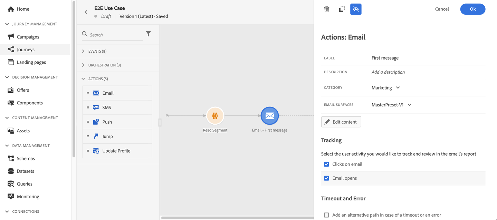

# Envío de mensajes multicanal {#send-multi-channel-messages}

>[!BEGINSHADEBOX]

**En esta página:** Aprenda a crear un recorrido multicanal que combine una audiencia de lectura, eventos, eventos de reacción y mensajes push y de correo electrónico con una lógica de seguimiento.

>[!ENDSHADEBOX]

Esta sección presenta un caso de uso que combina una audiencia de lectura, un evento, eventos de reacción y mensajes de correo electrónico/push.

## Descripción del caso de uso

En este caso de uso, el objetivo es enviar un primer mensaje de correo electrónico a todos los clientes que pertenecen a una audiencia específica.

En función de su reacción al primer mensaje, se envían mensajes de seguimiento específicos.

Si el cliente abre el correo electrónico, el sistema espera una compra y envía un mensaje push para darle las gracias al cliente.

Si no hay reacción, se envía un correo electrónico de seguimiento.

## Requisitos previos

Para que este caso de uso funcione, configure lo siguiente:

* Una audiencia para todos los clientes que viven en Atlanta, San Francisco o Seattle y que nacieron después de 1980
* Un evento de compra

### Creación de la audiencia

En este recorrido, se aprovecha una audiencia específica de clientes. Todos los individuos que pertenecen a la audiencia entran en el recorrido y siguen los diferentes pasos. En este ejemplo, la audiencia se dirige a todos los clientes que viven en Atlanta, San Francisco o Seattle y que nacieron después de 1980.

Para obtener más información sobre las audiencias, [consulte esta página](../audience/about-audiences.md).

1. En la sección de menú CLIENTE, seleccione **[!UICONTROL Audiencias]**.
1. Haga clic en el botón **[!UICONTROL Crear audiencia]** ubicado en la parte superior derecha de la lista de audiencias.
1. En el panel **[!UICONTROL Propiedades de audiencia]**, escriba un nombre para la audiencia.
1. Arrastre y suelte los campos deseados del panel izquierdo al espacio de trabajo central y configúrelos según sus necesidades. En este ejemplo, utilice los campos de atributo **City** y **Birth year**.
1. Haga clic en **[!UICONTROL Guardar]**.

   

La audiencia se crea y está lista para utilizarse en el recorrido. Con una actividad **Leer audiencia**, todas las personas que pertenezcan a la audiencia podrán entrar al recorrido.

### Configuración del evento

Configure un evento que se envíe al recorrido cuando un cliente realice una compra. Cuando el recorrido recibe el evento, envía en déclencheur el mensaje de &quot;gracias&quot;.

Para ello, usa un [evento basado en reglas](../event/about-events.md).

1. En la sección del menú ADMINISTRACIÓN, seleccione **[!UICONTROL Configuraciones]** y, a continuación, haga clic en **[!UICONTROL Eventos]**. Haga clic en **[!UICONTROL Crear evento]** para crear un nuevo evento.

1. Introduzca el nombre del evento.

1. En el campo **[!UICONTROL Tipo de ID de evento]**, seleccione **[!UICONTROL Basado en reglas]**.

1. Defina el **[!UICONTROL Esquema]** y la carga **[!UICONTROL Campos]**. Utilice varios campos, por ejemplo, el producto comprado, la fecha de compra y el ID de compra.

1. En el campo **[!UICONTROL Condición de ID de evento]**, defina la condición utilizada por el sistema para identificar los eventos que almacenan en déclencheur el recorrido. Por ejemplo, agregue un campo `purchaseMessage` y defina la siguiente regla: `purchaseMessage="thank you"`

1. Defina el **[!UICONTROL espacio de nombres]** y el **[!UICONTROL identificador de perfil]**.

1. Haga clic en **[!UICONTROL Guardar]**.

   

El evento está ahora configurado y listo para utilizarse en el recorrido. Con la actividad de evento correspondiente, se puede activar una acción cada vez que un cliente realiza una compra.

## Diseño del recorrido

1. Inicie el recorrido con una actividad **Leer audiencia**. Seleccione la audiencia creada anteriormente. Todas las personas que pertenecen a la audiencia entran en el recorrido.

   

1. Suelte una actividad de acción **Email** y defina el contenido del &quot;primer mensaje&quot;. Este mensaje se envía a todas las personas del recorrido. Consulte esta [sección](../email/create-email.md) para obtener información sobre cómo configurar y diseñar un mensaje de correo electrónico.

   

1. Agregue un evento **Reaction** y seleccione **Email opened**. El evento se activa cuando un individuo que pertenece a la audiencia abre el correo electrónico.

1. Marque la casilla **Definir el tiempo de espera del evento**, defina una duración (1 día en este ejemplo) y marque **Establecer una ruta de espera**. Esto crea otra ruta para las personas que no abren el primer mensaje push o de correo electrónico.

1. En la ruta de tiempo de espera, suelte una actividad de acción **Correo electrónico** y defina el contenido del mensaje de &quot;seguimiento&quot;. Este mensaje se envía a las personas que no abren el correo electrónico ni insertan el primer mensaje en el día siguiente. [Aprenda a configurar y diseñar un correo electrónico](../email/create-email.md).

1. En la primera ruta, añada el evento de compra creado anteriormente. El evento se activa cuando un individuo realiza una compra.

1. Después del evento, suelta una actividad de acción **Push** y define el contenido del mensaje &quot;gracias&quot;. Consulte esta [sección](../push/create-push.md) para obtener información sobre cómo configurar y diseñar una notificación push.

## Prueba y publicación del recorrido

1. Antes de probar el recorrido, compruebe que es válido y que no hay error.

1. Utilice la opción **Test**, que se encuentra en la esquina superior derecha, para activar el modo de prueba. Consulte esta [sección](testing-the-journey.md) para aprender a utilizar el modo de prueba.

1. Cuando el recorrido esté listo, publíquelo con el botón **Publicar**, ubicado en la esquina superior derecha.

## Recorrido de fidelización multifase {#multi-phase-loyalty}

Este ejemplo ilustra un patrón de arquitectura de recorrido clave: la descomposición de un recorrido complejo de varias fases en recorridos secundarios más pequeños y centrados conectados con la actividad [**[!UICONTROL Jump]**](jump.md). Un programa de fidelización sirve como escenario, pero este patrón se aplica a cualquier recorrido que abarque varios hitos o fases comerciales.

Los recorridos complejos multifásicos generan rápidamente un gran número de rutas de cliente únicas. Descomponerlos en un subrecorrido por fase mantiene cada recorrido manejable, comprobable y mantenible de forma independiente.

### Situación

Considere un programa de fidelidad que guíe a los clientes a través de tres hitos mediante dos canales de marketing ([correo electrónico](../email/create-email.md) y [push](../push/create-push.md)):

1. **Fase 1 — Descargue la aplicación móvil:** Las comunicaciones iniciales animan a los nuevos miembros fieles a descargar la aplicación. Se envía un recordatorio de seguimiento si el cliente no ha actuado en un plazo determinado.
1. **Fase 2: realice una primera transacción:** Una vez descargada la aplicación, los mensajes dirigidos guiarán a los clientes hacia la finalización de su primera transacción de fidelidad.
1. **Fase 3 — Realice una segunda transacción:** Después de la primera transacción, un conjunto final de comunicaciones genera una segunda transacción para profundizar la participación de lealtad.

Incluso con esta estrategia directa, este recorrido expone más de 20 rutas únicas que un cliente puede seguir. La complejidad crece exponencialmente con cada punto de contacto o canal adicional.

### Descomposición del subrecorrido

Divida el recorrido de extremo a extremo en tres recorridos secundarios conectados más pequeños:

| Recorrido Secundario | Condición de entrada | Objetivo de negocio |
|---|---|---|
| Fase 1: Descarga de la aplicación | El cliente se une al programa de fidelidad | Descarga de aplicación móvil de Drive |
| Fase 2 - Primera transacción | El cliente descarga la aplicación | Impulsar la primera transacción de fidelización |
| Fase 3 — Segunda transacción | El cliente completa la primera transacción | Impulsar la segunda transacción de fidelización |

Conecte los subrecorridos mediante la actividad [**[!UICONTROL Jump]**](jump.md) para que los perfiles pasen sin problemas de una fase a otra. Cada recorrido secundario es sencillo, legible y se puede mantener de forma independiente.

<!--
>[!NOTE]
>
>If your goal is to build a gamified loyalty program with challenges, tasks, and built-in reward tracking, Journey Optimizer also offers a dedicated **Loyalty Challenges** capability.
-->

+++ Referencia de conocimientos de AI

Esta sección contiene conocimientos estructurados destinados a apoyar la interpretación, la recuperación y la respuesta a preguntas relacionadas con este tema.

Para una comprensión completa, esta información debe combinarse con la documentación de esta página. Ninguna de las fuentes pretende ser independiente; la página describe la función, mientras que esta sección proporciona contexto adicional que ayuda a desambiguar la terminología, la intención, la aplicabilidad y las restricciones.

* **TL;DR:** Esta página presenta dos casos prácticos de uso de recorrido: un flujo de mensajes multicanal que combina la audiencia de lectura, eventos de reacción, correo electrónico y push; y un patrón de recorrido de lealtad multifase que utiliza la actividad de salto para descomponer recorridos complejos en recorridos secundarios manejables.

**Intenciones:**

* Cree un recorrido multicanal que envíe un correo electrónico de seguimiento o una notificación push en función de si un cliente abre un correo electrónico inicial
* Configuración de un evento de compra para almacenar en déclencheur una notificación push de agradecimiento dentro de un recorrido
* Utilice eventos de reacción para bifurcar un recorrido en función del comportamiento de apertura de correo electrónico
* Descomponer un recorrido complejo multifase en subrecorridos más pequeños conectados mediante actividades Jump
* Creación y configuración de un evento basado en reglas para utilizarlo como déclencheur de recorrido
* Defina una audiencia basada en los atributos de ciudad y año de nacimiento para la entrada de recorrido objetivo

**Glosario:**

* **Evento de reacción**: un evento de recorrido que entra en déclencheur cuando un perfil interactúa con un mensaje (por ejemplo, abre un correo electrónico o hace clic en un vínculo), lo que habilita la bifurcación basada en el comportamiento. *(específico del producto)*
* **Leer actividad de audiencia**: La actividad de entrada de recorrido que carga todos los perfiles de una audiencia de Adobe Experience Platform especificada para iniciar la recorrido. *(específico del producto)*
* **Actividad de salto**: Actividad de acción que inserta un perfil de un recorrido (origen) a otro (destino), lo que habilita la arquitectura modular de recorridos secundarios. *(específico del producto)*
* **Evento basado en reglas**: Tipo de evento en el que la condición de déclencheur se define mediante una expresión de regla en lugar de un ID de orquestación, lo cual resulta útil para los déclencheur de compra o de comportamiento. *(específico del producto)*

**Protecciones:**

* Se debe configurar una ruta de tiempo de espera de evento de reacción para controlar los perfiles que no interactúan con el mensaje dentro de la duración definida
* La audiencia utilizada en el caso de uso debe crearse antes de crear el recorrido
* Se debe configurar el evento de compra para poder utilizarlo en el recorrido
* Los subrecorridos conectados mediante Jump deben utilizar el mismo área de nombres que el recorrido de origen
* La anulación de direcciones de correo electrónico (anulación de parámetros) solo debe utilizarse para casos de uso específicos, no como reemplazo general de la dirección principal

**Terminología:**

* Nombre canónico: Evento de reacción — Acrónimo: none — variantes: actividad de reacción, reacción de mensaje
* Sinónimos: &quot;recorrido de origen&quot; = &quot;recorrido de origen&quot;; &quot;recorrido de destino&quot; = &quot;recorrido de destino&quot;
* No confunda: &quot;Leer actividad de audiencia&quot; ≠ &quot;Actividad de calificación de audiencia&quot;: la lectura de audiencia carga todos los miembros de la audiencia en lote a la vez; los déclencheur de calificación de audiencia por perfil en tiempo real a medida que cambia la pertenencia

**PREGUNTAS MÁS FRECUENTES:**

* **Q: ¿Cómo envío un mensaje de seguimiento solamente a los clientes que no abrieron un correo electrónico?** — Añadir un evento de reacción (correo electrónico abierto) con una ruta de tiempo de espera; los perfiles que no se abren dentro de la duración de tiempo de espera fluyen por la ruta de tiempo de espera en la que se coloca el correo electrónico de seguimiento.
* **Q: ¿Cómo se configura el evento de compra en el caso de uso de varios canales?** — Como evento basado en reglas con una condición como `purchaseMessage="thank you"`, configurado con un esquema, campos de carga útil (producto, fecha, ID de compra), área de nombres e identificador de perfil.
* **Q: ¿Por qué descomponer un recorrido complejo en recorridos secundarios?** — Los recorridos complejos pueden exponer 20 o más rutas de cliente únicas, y la complejidad aumenta exponencialmente con cada punto de contacto. Los subrecorridos mantienen cada fase legible, comprobable y mantenible de forma independiente.
* **Q: ¿Puede un perfil estar en el recorrido de origen y de destino al mismo tiempo después de un salto?** — Sí; cuando un perfil llega a un paso de salto, continúa progresando en el recorrido de origen mientras introduce simultáneamente el recorrido de destino.
* **Q: ¿Cuántos recorridos secundarios se usan en el ejemplo de fidelidad de varias fases?** — Tres recorridos secundarios: Fase 1 (descarga de la aplicación), Fase 2 (primera operación) y Fase 3 (segunda operación), conectados secuencialmente utilizando actividades Jump.

+++

