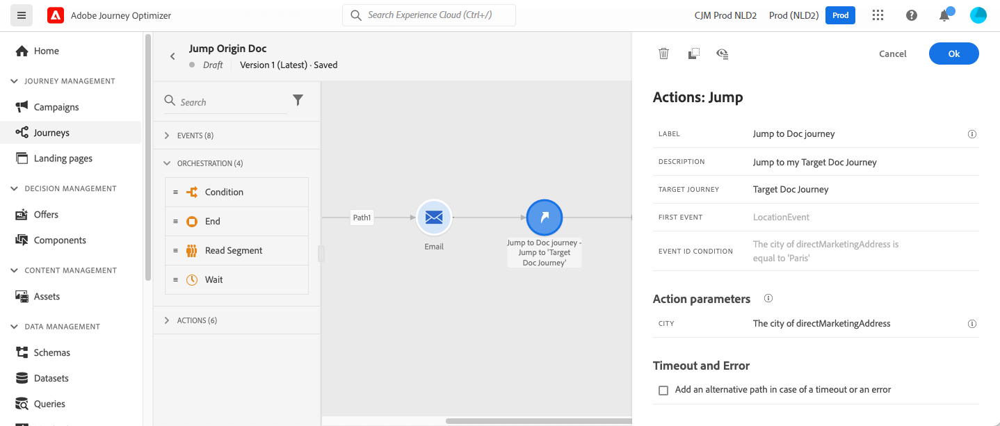

# Saltar de un recorrido a otro {#jump}

>[!CONTEXTUALHELP]
>id="ajo_journey_jump"
>title="Actividad de salto"
>abstract="La actividad de la acción de salto permite insertar particulares de un recorrido a otro. Esta función permite simplificar el diseño de recorridos muy complejos y crear recorridos basados en patrones de recorrido comunes y reutilizables."

La actividad de acción **[!UICONTROL Jump]** le permite insertar particulares de un recorrido a otro. Esta función le permite:

* simplificar el diseño de recorridos muy complejos dividiéndolos en varios
* generar recorridos basados en patrones de recorrido comunes y reutilizables

En el recorrido de origen, agregue una actividad **[!UICONTROL Jump]** y seleccione un recorrido de destino. Cuando el individuo entra al paso **[!UICONTROL Jump]**, se envía un evento interno al primer evento del recorrido de destino. Si la acción **[!UICONTROL Jump]** se realiza correctamente, el usuario continúa avanzando en el recorrido. El comportamiento es similar a otras acciones.

En el recorrido de destino, el primer evento activado internamente por la actividad **[!UICONTROL Jump]** hace que el individuo fluya en el recorrido.

## Ciclo de vida {#jump-lifecycle}

Supongamos que ha agregado una actividad **[!UICONTROL Jump]** en el recorrido A al recorrido B. El Recorrido A es el **recorrido de origen** y el recorrido B es el **recorrido de destino**.

Estos son los diferentes pasos del proceso de ejecución:

**El Recorrido A** se ha activado a partir de un evento externo:

1. El recorrido A recibe un evento externo relacionado con un individuo.
1. El individuo alcanza el paso **[!UICONTROL Jump]**.
1. El individuo se inserta en el recorrido B y pasa a los pasos siguientes del recorrido A, después del paso **[!UICONTROL Jump]**.

En el recorrido B, el primer evento se activa internamente a través de la actividad **[!UICONTROL Jump]** desde el recorrido A:

1. El recorrido B recibe un evento interno del recorrido A.
1. El individuo comienza a fluir en el recorrido B.

>[!NOTE]
>
>El recorrido B también se puede activar mediante un evento externo.

### Comportamiento del perfil durante un salto {#jump-profile-behavior}

Cuando un perfil alcanza el paso **[!UICONTROL Jump]**, continúa progresando en el recorrido de origen (Recorrido A) mientras introduce simultáneamente el recorrido de destino (Recorrido B). Por lo tanto, el perfil está activo en ambos recorridos al mismo tiempo.

Esto significa que:

* El perfil completa los pasos restantes del Recorrido A después de la actividad de salto (por ejemplo, una acción de espera o cierre de seguimiento).
* El perfil también empieza a pasar por el Recorrido B desde su primer evento, independientemente del Recorrido A.
* Si el perfil **ya está activo** en el Recorrido B cuando se ejecute el salto, **no** volverá a entrar en el Recorrido B. El recorrido A continúa con normalidad; no se informa de ningún error.

>[!NOTE]
>
>El caso anterior (perfil que ya está activo en el Recorrido B) genera **omisión silenciosa**: no se genera ningún error y el Recorrido A continúa de forma normal. En otras situaciones, el salto puede **fail** y el Recorrido A aplica su tratamiento estándar de acción-error. Consulte [Errores en tiempo de ejecución](#jump-troubleshoot) para obtener una lista completa de los casos.

## Prácticas recomendadas y limitaciones {#jump-limitations}

Utilice estas directrices para mantener el comportamiento de la actividad de salto predecible y seguro.

### Creación {#jump-limitations-authoring}

* La actividad **[!UICONTROL Jump]** solo está disponible en recorridos que usan un área de nombres.
* Solo puede saltar a un recorrido que utilice el mismo área de nombres que el recorrido de origen.
* No puede saltar a un recorrido que comience con un evento de **Calificación de audiencias** o **Leer audiencia**.
* No puede tener una actividad **[!UICONTROL Jump]** y un evento **Audience Qualification** o **Read Audience** en el mismo recorrido.
* Puede incluir tantas actividades **[!UICONTROL Jump]** como sea necesario en un recorrido. Después de **[!UICONTROL saltar]**, puedes agregar cualquier actividad que necesites.
* Puede tener tantos niveles de salto como sea necesario. Por ejemplo, el recorrido A salta al recorrido B, que salta al recorrido C, etc.
* El recorrido de destino también puede incluir tantas actividades **[!UICONTROL Jump]** como sea necesario.
* No se admiten patrones de bucle. No hay forma de vincular dos o más recorridos, lo que crearía un bucle infinito. La pantalla de configuración de actividad **[!UICONTROL Jump]** impide que lo hagas.

### Ejecución {#jump-limitations-exec}

* Cuando se ejecuta la actividad **[!UICONTROL Jump]**, se activa la última versión del recorrido de destino.
* Un individuo único solo puede estar presente una vez en el mismo recorrido. Como resultado, si el individuo insertado desde el recorrido de origen ya está en el recorrido de destino, el individuo no entrará en el recorrido de destino. No se notificará ningún error en la actividad **[!UICONTROL Jump]** porque se trata de un comportamiento normal.

## Estrategia de diseño: subrecorridos de tamaño pequeño {#jump-strategy}

Los recorridos complejos del cliente pueden resultar difíciles de crear y mantener rápidamente, especialmente a medida que se introducen canales o puntos de contacto adicionales. Incluso un recorrido con un puñado de hitos puede exponer 20 o más rutas únicas que un cliente puede seguir, y esa complejidad aumenta exponencialmente con cada adición.

Un enfoque práctico para administrar esto es dividir los recorridos grandes en recorridos secundarios más pequeños y enfocados, uno por fase comercial o hito, y conectarlos usando la actividad **[!UICONTROL Jump]**. Esto mantiene cada recorrido legible, comprobable y mantenible de forma independiente.

**Paso 1: Visualice el recorrido de extremo a extremo**

Asigne el recorrido completo del cliente e identifique sus fases de alto nivel. Por ejemplo, un recorrido de incorporación de fidelidad puede incluir tres fases distintas: descargar la aplicación móvil, realizar una primera transacción y realizar una segunda.

**Paso 2 — Anotar fases y definir subrecorridos**

Marque el límite de cada fase y defina su objetivo empresarial. Cada fase se convierte en un recorrido secundario candidato con una condición de entrada y un objetivo claros.

**Paso 3: generación y conexión de subrecorridos**

Cree cada fase como un recorrido independiente en Journey Optimizer y, a continuación, utilice las actividades **[!UICONTROL Jump]** para pasar perfiles de un recorrido secundario al siguiente. El resultado es un conjunto de recorridos más simples y reutilizables que se combinan para producir la experiencia completa de extremo a extremo, con menos riesgo de introducir errores.

>[!TIP]
>
>Para ver un ejemplo trabajado con un programa de fidelización multifase, consulte [recorrido de fidelidad multifase](journeys-uc.md#multi-phase-loyalty).

## Configuración de la actividad de salto {#jump-configure}

1. Diseña tu **recorrido de origen**.

   

1. En cualquier paso del recorrido, agrega una actividad **[!UICONTROL Jump]**, desde la categoría **[!UICONTROL ACTIONS]**. Añada una etiqueta y una descripción.

   

1. Haga clic dentro del campo **recorrido de destino**.
La lista muestra todas las versiones de recorrido que son borradores, activos o en modo de prueba. Los recorridos que usan un área de nombres diferente o que comienzan con un evento **Calificación de audiencias** no están disponibles. Los recorridos de destino que crearían un patrón de bucle también se filtran.

   

   >[!NOTE]
   >
   >Puede hacer clic en el recorrido **Abrir recorrido de destino**, en el lado derecho, para abrir el icono de destino en una pestaña nueva.

1. Seleccione el recorrido de destino al que desee saltar.
El campo **Primer evento** está rellenado previamente con el nombre del primer evento del recorrido de destino. Si el recorrido de destino incluye varios eventos, el **[!UICONTROL salto]** solo se permite en el primer evento.

   

1. La sección **Parámetros de acción** muestra todos los campos del evento de destino. Al igual que con otros tipos de acciones, asigne cada campo con campos del evento de origen o de la fuente de datos. Esta información se pasa al recorrido de destino durante la ejecución.
1. Añada las siguientes actividades para finalizar el recorrido de origen.

   

   >[!NOTE]
   >
   >La identidad de la persona se asigna automáticamente. Esta información no es visible en la interfaz de.

Se ha configurado su actividad **[!UICONTROL Jump]**. Tan pronto como el recorrido esté activo o en modo de prueba, las personas que alcancen el paso **[!UICONTROL Jump]** se insertarán en el recorrido de destino.

Cuando se configura una actividad **[!UICONTROL Jump]** en un recorrido, se agrega automáticamente un icono de entrada **[!UICONTROL Jump]** al principio del recorrido de destino. Esto le ayuda a identificar que el recorrido se puede activar externamente, pero también internamente, desde una actividad **[!UICONTROL Jump]**.

## Resolución de problemas {#jump-troubleshoot}

### Errores de configuración

Los siguientes problemas impiden que el salto funcione correctamente y aparecen como errores en el lienzo del recorrido:

* El recorrido de destino ya no existe.
* El recorrido de destino es borrador, está cerrado o detenido.
* El primer evento del recorrido de destino ha cambiado y la asignación está dañada.

### Errores de tiempo de ejecución

En los casos siguientes, el paso de salto se trata como una **acción fallida** en el Recorrido A. El Recorrido A aplica la administración estándar de acción-error y continúa:

* La instancia de recorrido de destino existente se ha terminado y el recorrido de destino no es de reentrada.
* Se configura un período de reentrada en el recorrido de destino. Incluso cuando, en principio, se permite la reentrada, el perfil no puede volver a entrar hasta que transcurra el periodo (el salto falla con el estado &quot;no reentrante para el periodo&quot;).
* La versión del recorrido de destino no se puede encontrar, se ha eliminado, está en estado terminado o se ha detenido.
