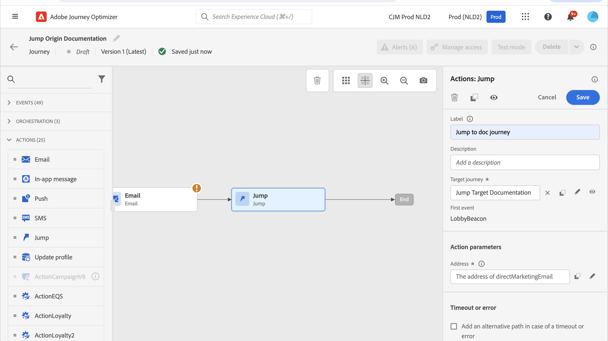

# Saltar de un recorrido a otro {#jump}

>[!CONTEXTUALHELP]
>id="ajo_journey_jump"
>title="Actividad de salto"
>abstract="La actividad de la acción de salto permite insertar particulares de un recorrido a otro. Esta función permite simplificar el diseño de recorridos muy complejos y crear recorridos basados en patrones de recorrido comunes y reutilizables."

La actividad de acción **[!UICONTROL Jump]** le permite insertar particulares de un recorrido a otro. Esta función le permite:

* simplificar el diseño de recorridos muy complejos dividiéndolos en varios
* generar recorridos basados en patrones de recorrido comunes y reutilizables

En el recorrido de origen, agregue una actividad **[!UICONTROL Jump]** y seleccione un recorrido de destino. Cuando el individuo entra al paso **[!UICONTROL Jump]**, se envía un evento interno al primer evento del recorrido de destino. Si la acción **[!UICONTROL Jump]** se realiza correctamente, el usuario continúa avanzando en el recorrido. El comportamiento es similar a otras acciones.

En el recorrido de destino, el primer evento activado internamente por la actividad **[!UICONTROL Jump]** hace que el individuo fluya en el recorrido.

## Ciclo de vida {#jump-lifecycle}

Supongamos que ha agregado una actividad **[!UICONTROL Jump]** en el recorrido A al recorrido B. El Recorrido A es el **recorrido de origen** y el recorrido B es el **recorrido de destino**.

Estos son los diferentes pasos del proceso de ejecución:

**El Recorrido A** se ha activado a partir de un evento externo:

1. El recorrido A recibe un evento externo relacionado con un individuo.
1. El individuo alcanza el paso **[!UICONTROL Jump]**.
1. El individuo se inserta en el recorrido B y pasa a los pasos siguientes del recorrido A, después del paso **[!UICONTROL Jump]**.

En el recorrido B, el primer evento se activa internamente a través de la actividad **[!UICONTROL Jump]** desde el recorrido A:

1. El recorrido B recibe un evento interno del recorrido A.
1. El individuo comienza a fluir en el recorrido B.

>[!NOTE]
>
>El recorrido B también se puede activar mediante un evento externo.

## Prácticas recomendadas y limitaciones {#jump-limitations}

### Creación {#jump-limitations-authoring}

* La actividad **[!UICONTROL Jump]** solo está disponible en recorridos que usan un área de nombres.
* Solo puede saltar a un recorrido que utilice el mismo área de nombres que el recorrido de origen.
* No puede saltar a un recorrido que comience con un evento de **Calificación de audiencias** o **Leer audiencia**.
* No puede tener una actividad **[!UICONTROL Jump]** y un evento **Audience Qualification** o **Read Audience** en el mismo recorrido.
* Puede incluir tantas actividades **[!UICONTROL Jump]** como sea necesario en un recorrido. Después de **[!UICONTROL saltar]**, puedes agregar cualquier actividad que necesites.
* Puede tener tantos niveles de salto como sea necesario. Por ejemplo, el recorrido A salta al recorrido B, que salta al recorrido C, etc.
* El recorrido de destino también puede incluir tantas actividades **[!UICONTROL Jump]** como sea necesario.
* No se admiten patrones de bucle. No hay forma de vincular dos o más recorridos, lo que crearía un bucle infinito. La pantalla de configuración de actividad **[!UICONTROL Jump]** impide que lo hagas.

### Ejecución {#jump-limitations-exec}

* Cuando se ejecuta la actividad **[!UICONTROL Jump]**, se activa la última versión del recorrido de destino.
* Un individuo único solo puede estar presente una vez en el mismo recorrido. Como resultado, si el individuo insertado desde el recorrido de origen ya está en el recorrido de destino, el individuo no entrará en el recorrido de destino. No se notificará ningún error en la actividad **[!UICONTROL Jump]** porque se trata de un comportamiento normal.

## Configuración de la actividad de salto {#jump-configure}

1. Diseña tu **recorrido de origen**.

   

1. En cualquier paso del recorrido, agrega una actividad **[!UICONTROL Jump]**, desde la categoría **[!UICONTROL ACTIONS]**. Añada una etiqueta y una descripción.

   

1. Haga clic dentro del campo **recorrido de destino**.
La lista muestra todas las versiones de recorrido que son borradores, activos o en modo de prueba. Los recorridos que usan un área de nombres diferente o que comienzan con un evento **Calificación de audiencias** no están disponibles. Los recorridos de destino que crearían un patrón de bucle también se filtran.

   

   >[!NOTE]
   >
   >Puede hacer clic en el recorrido **Abrir recorrido de destino**, en el lado derecho, para abrir el icono de destino en una pestaña nueva.

1. Seleccione el recorrido de destino al que desee saltar.
El campo **Primer evento** está rellenado previamente con el nombre del primer evento del recorrido de destino. Si el recorrido de destino incluye varios eventos, el **[!UICONTROL salto]** solo se permite en el primer evento.

   

1. La sección **Parámetros de acción** muestra todos los campos del evento de destino. Al igual que con otros tipos de acciones, asigne cada campo con campos del evento de origen o de la fuente de datos. Esta información se pasa al recorrido de destino durante la ejecución.
1. Añada las siguientes actividades para finalizar el recorrido de origen.

   

   >[!NOTE]
   >
   >La identidad de la persona se asigna automáticamente. Esta información no es visible en la interfaz de.

Se ha configurado su actividad **[!UICONTROL Jump]**. Tan pronto como el recorrido esté activo o en modo de prueba, las personas que alcancen el paso **[!UICONTROL Jump]** se insertarán en el recorrido de destino.

Cuando se configura una actividad **[!UICONTROL Jump]** en un recorrido, se agrega automáticamente un icono de entrada **[!UICONTROL Jump]** al principio del recorrido de destino. Esto le ayuda a identificar que el recorrido se puede activar externamente, pero también internamente, desde una actividad **[!UICONTROL Jump]**.

## Resolución de problemas {#jump-troubleshoot}

Se producen errores si:

* El recorrido de destino ya no existe
* El recorrido de destino es borrador, está cerrado o detenido
* El primer evento del recorrido de destino cambia y la asignación se interrumpe

