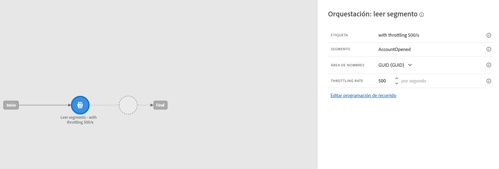
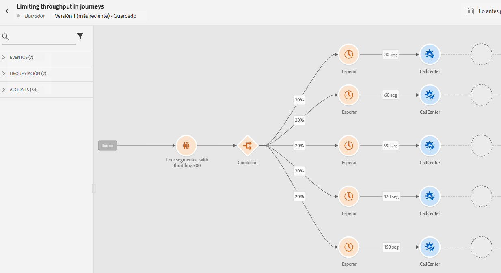

# Caso de uso: limitar el rendimiento con fuentes de datos externas y acciones personalizadas{#limit-throughput}

>[!BEGINSHADEBOX]

**En esta página:** Aprenda a acelerar el procesamiento del recorrido con acciones personalizadas y fuentes de datos externas para que los sistemas externos no se vean desbordados más allá del número de solicitudes admitidas por segundo.

>[!ENDSHADEBOX]

Utilice este caso de uso para acelerar el procesamiento del recorrido cuando los sistemas externos deban gestionar un número limitado de solicitudes por segundo.

## Descripción del caso de uso

[!DNL Adobe Journey Optimizer] permite a los profesionales enviar llamadas de API a sistemas externos mediante el uso de acciones personalizadas y fuentes de datos.

Esto se puede hacer con:

* **Fuentes de datos**: para recopilar información de sistemas externos y usarla en el contexto del recorrido, por ejemplo, para obtener información meteorológica sobre la ciudad del perfil y tener un flujo de recorrido específico basado en eso.

* **Acciones personalizadas**: para enviar información a sistemas externos, por ejemplo para enviar correos electrónicos a través de una solución externa utilizando las capacidades de orquestación de Journey Optimizer junto con información de perfil, datos de audiencia y contexto de recorrido.

>[!NOTE]
>
>Como las respuestas ahora son compatibles, debe utilizar acciones personalizadas en lugar de fuentes de datos para casos de uso de fuentes de datos externas. Para obtener más información sobre las respuestas, consulte esta [sección](../action/action-response.md)

Si está trabajando con fuentes de datos externas o acciones personalizadas, es posible que desee proteger los sistemas externos limitando el rendimiento de recorrido: hasta 5000 instancias/segundo para recorridos unitarios y hasta 20 000 instancias/segundo para los activados por audiencia. Obtenga más información acerca de las tasas de procesamiento de recorrido y el rendimiento en [esta sección](entry-management.md#journey-processing-rate).

Para las acciones personalizadas, las funcionalidades de restricción están disponibles en el nivel de producto. Consulte [esta página](../configuration/external-systems.md#capping).

Para las fuentes de datos externas, puede definir límites de límite en el nivel de extremo para evitar saturar esos sistemas externos a través de las API de límite de Journey Optimizer. Sin embargo, se eliminarán todas las solicitudes restantes después de alcanzar el límite. En esta sección, encontrará soluciones que puede utilizar para optimizar el rendimiento.

Para obtener más información sobre cómo integrar con sistemas externos, consulte esta [página](../configuration/external-systems.md).

## Implementación

Para **recorridos activados por la audiencia**, puede definir la tasa de lectura de su actividad Leer audiencia que afectará el rendimiento de los recorridos. [Más información](../building-journeys/read-audience.md)

>[!NOTE]
>
> Es el número máximo de perfiles que pueden entrar en el recorrido por segundo. Esta tasa se aplica solamente a esta actividad y a ninguna otra en el recorrido. [Más información](../building-journeys/read-audience.md)

Puede modificar este valor de 500 a 20 000 instancias por segundo. Si necesita ir a menos de 500/s, también puede agregar condiciones de &quot;división porcentual&quot; con actividades de espera para dividir el recorrido en varias ramas y hacer que se ejecuten a un tiempo específico.

Veamos un ejemplo de **recorridos activados por la audiencia** que trabajan con una población de **10 000 perfiles** y envían datos a un sistema externo que admite **100 solicitudes/segundo**.

1. Puede definir la audiencia de lectura para que lea perfiles con un rendimiento de 500 perfiles/segundo, lo que significa que tardará 20 segundos en leer todos los perfiles. En el segundo 1, leerás 500, en el segundo 2 500 más, etc.

1. A continuación, puede añadir una actividad de condición &quot;división porcentual&quot; con una división del 20 % para tener cada segundo 100 perfiles en cada rama.

1. Después, agregue actividades de Espera con un temporizador específico en cada rama. Aquí hemos configurado una espera de 30 segundos para cada uno. A cada segundo, fluirán 100 perfiles a cada rama.

   * En la rama 1, esperarán 30 segundos, lo que significa que:
      * el segundo 1, 100 perfiles esperarán el segundo 31
      * el segundo 2, 100 perfiles esperarán el segundo 32, etc.

   * En la rama 2, esperarán 60 segundos, lo que significa que:
      * En el segundo 1, 100 perfiles esperarán el segundo 61 (1&#39;01&#39;&#39;)
      * En el segundo 2, 100 perfiles esperarán el segundo 62 (1&#39;02&#39;&#39;), etc.

   * Sabiendo que esperamos un máximo de 20 segundos para leer todos los perfiles, no habrá superposición entre cada rama, siendo la segunda 20 la última en la que los perfiles fluirán a la condición. Entre el segundo 31 y el segundo 51, se procesarán todos los perfiles de la rama 1. Entre el segundo 61 (1&#39;01&#39;&#39;) y el segundo 81 (1&#39;21&#39;&#39;), se procesarán todos los perfiles de la rama 2, etc.

   * Como protección, también puede añadir una sexta rama para tener menos de 100 perfiles por rama, especialmente si el sistema externo solo admite 100 solicitudes/segundo.

>[!IMPORTANT]
>
>Como con cualquier solución alternativa, pruebe esa solución a fondo antes de entrar en producción para asegurarse de que hace lo que desea.

Como protección adicional, también puede utilizar las funcionalidades de límite.

>[!NOTE]
>
>A diferencia de las capacidades de límite, que protegen un extremo al ser global para todos los recorridos de una zona protegida, esta solución solo funciona en el nivel de recorrido. Esto significa que si se ejecutan varios recorridos en paralelo y están dirigidos al mismo punto de conexión, deberá tenerlo en cuenta al diseñar el recorrido. Por lo tanto, esta solución no es adecuada para cada caso de uso.

+++ Referencia de conocimientos de AI

Esta sección contiene conocimientos estructurados destinados a apoyar la interpretación, la recuperación y la respuesta a preguntas relacionadas con este tema.

Para una comprensión completa, esta información debe combinarse con la documentación de esta página. Ninguna de las fuentes pretende ser independiente; la página describe la función, mientras que esta sección proporciona contexto adicional que ayuda a desambiguar la terminología, la intención, la aplicabilidad y las restricciones.

* **TL;DR:** En esta página se explica cómo limitar el rendimiento del recorrido cuando los orígenes de datos externos o las acciones personalizadas tienen un número limitado de solicitudes por segundo, mediante la configuración de tasa de lectura de audiencia, las divisiones de porcentaje y las actividades de espera.

**Intenciones:**

* Limite el rendimiento de un recorrido activado por audiencia para proteger un sistema externo de sobrecargas
* Configure la tasa de lectura de una actividad Leer audiencia para controlar cuántos perfiles introducen por segundo
* Combine condiciones de división porcentual y actividades de espera para propagar el procesamiento de perfiles a lo largo del tiempo
* Comprenda la diferencia entre las soluciones de rendimiento de nivel de recorrido y las capacidades de límite de nivel de zona protegida
* Aplicar capacidades de límite a las acciones personalizadas en el nivel de producto

**Glosario:**

* **Límite de restricción/rendimiento**: controla la velocidad a la que los perfiles fluyen a través de un recorrido para evitar exceder la capacidad de solicitud de un sistema externo. *(específico del producto)*
* **Tasa de lectura de la audiencia de lectura**: Parámetro configurable de la actividad Leer audiencia que establece el número máximo de perfiles que entran en el recorrido por segundo (intervalo: 500-20 000 instancias/segundo). *(específico del producto)*
* **API de límite**: una API de Journey Optimizer que define un límite máximo de solicitudes por extremo para orígenes de datos externos; se eliminan las solicitudes que exceden el límite. *(específico del producto)*
* **Condición de división porcentual**: una actividad de condición que divide el flujo de perfil en ramas por porcentaje, que se usa aquí para distribuir perfiles en rutas de espera escalonadas en el tiempo. *(específico del producto)*

**Protecciones:**

* Leer La tasa de lectura de la audiencia se puede establecer entre 500 y 20 000 instancias por segundo; los valores por debajo de 500/s requieren una solución alternativa mediante divisiones de porcentaje y actividades de espera
* Los recorridos unitarios admiten hasta 5000 instancias/segundo; los recorridos activados por audiencia admiten hasta 20 000 instancias/segundo
* La solución de porcentaje dividido + espera solo funciona en el nivel de recorrido, no en todos los recorridos de la zona protegida
* Cuando varios recorridos se dirigen al mismo extremo externo en paralelo, esta solución no tiene en cuenta la carga combinada: en su lugar, se deben utilizar capacidades de límite
* Las solicitudes restantes que exceden el límite en orígenes de datos externos se pierden, no se ponen en cola
* La solución debe probarse a fondo antes de pasar a producción

**Terminología:**

* Nombre canónico: Limitación de rendimiento — Acrónimo: none — variantes: regulación, limitación de velocidad, control de rendimiento de recorrido
* Sinónimos: &quot;Límite&quot; = &quot;Aceleración&quot; en el contexto de la protección de extremo externo
* No confunda: &quot;API de límite (nivel de extremo)&quot; ≠ &quot;tasa de lectura (nivel de recorrido)&quot;. La API de límite se aplica globalmente a todos los recorridos de una zona protegida segmentada por un extremo; la tasa de lectura y la solución de división/espera solo se aplican al recorrido individual

**PREGUNTAS MÁS FRECUENTES:**

* **Q: ¿Cuál es la tasa de lectura máxima que puedo establecer en una actividad Leer audiencia?** — Entre 500 y 20 000 perfiles por segundo; para bajar de 500/s, utilice una división porcentual con actividades de espera.
* **Q: ¿Cómo ayudan las divisiones de porcentaje y las actividades de espera a limitar el rendimiento?** — Al dividir los perfiles en ramas (por ejemplo, 20 % cada una) y agregar temporizadores de espera escalonados por rama, se garantiza que solo un número controlado de perfiles llegue al sistema externo por segundo.
* **Q: ¿Protege la solución alternativa de división porcentual todos los recorridos dirigidos al mismo extremo?** — No; sólo funciona a nivel de recorrido individual. Si varios recorridos se ejecutan en paralelo con el mismo extremo, utilice capacidades de límite de nivel de zona protegida en su lugar.
* **Q: ¿Qué sucede con las solicitudes que exceden el límite de una fuente de datos externa?** — Se pierden; la API de límite no pone en cola las solicitudes sobrantes.
* **Q: ¿Debo usar acciones personalizadas o fuentes de datos para casos de uso de datos externos?** — Se prefieren las acciones personalizadas porque admiten la administración de respuestas; las fuentes de datos solo deben utilizarse cuando el caso de uso las requiera específicamente.

+++
