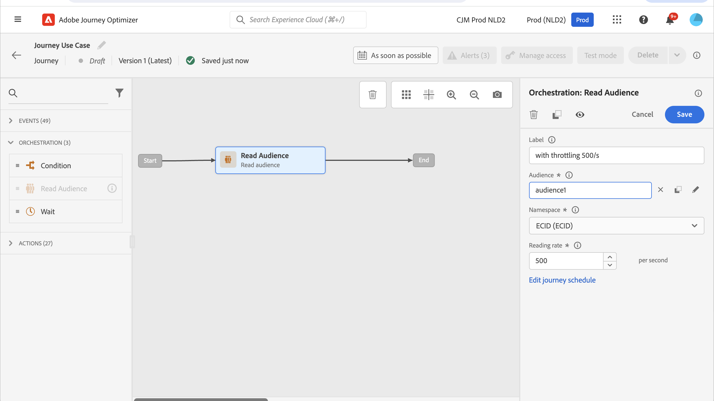

# Caso de uso: Limitación del rendimiento con fuentes de datos externas y acciones personalizadas{#limit-throughput}

## Descripción del caso de uso

Adobe Journey Optimizer permite a los profesionales enviar llamadas de API a sistemas externos mediante el uso de acciones personalizadas y fuentes de datos.

Esto se puede hacer con:

* **Fuentes de datos**: para recopilar información de sistemas externos y usarla en el contexto del recorrido, por ejemplo, para obtener información meteorológica sobre la ciudad del perfil y tener un flujo de recorrido específico basado en eso.

* **Acciones personalizadas**: para enviar información a sistemas externos, por ejemplo para enviar correos electrónicos a través de una solución externa utilizando las capacidades de orquestación de Journey Optimizer junto con información de perfil, datos de audiencia y contexto de recorrido.

>[!NOTE]
>
>Como las respuestas ahora son compatibles, debe utilizar acciones personalizadas en lugar de fuentes de datos para casos de uso de fuentes de datos externas. Para obtener más información sobre las respuestas, consulte esta [sección](../action/action-response.md)

Si está trabajando con fuentes de datos externas o acciones personalizadas, es posible que desee proteger los sistemas externos limitando el rendimiento de recorrido: hasta 5000 instancias/segundo para recorridos unitarios y hasta 20 000 instancias/segundo para los activados por audiencia.

Para las acciones personalizadas, las funcionalidades de restricción están disponibles en el nivel de producto. Consulte [esta página](../configuration/external-systems.md#capping).

Para las fuentes de datos externas, puede definir límites de límite en el nivel de extremo para evitar saturar esos sistemas externos a través de las API de límite de Journey Optimizer. Sin embargo, se eliminarán todas las solicitudes restantes después de alcanzar el límite. En esta sección, encontrará soluciones que puede utilizar para optimizar el rendimiento.

Para obtener más información sobre cómo integrar con sistemas externos, consulte esta [página](../configuration/external-systems.md).

## Implementación

Para **recorridos activados por la audiencia**, puede definir la tasa de lectura de su actividad Leer audiencia que afectará el rendimiento de los recorridos. [Más información](../building-journeys/read-audience.md)

>[!NOTE]
>
> Es el número máximo de perfiles que pueden entrar en el recorrido por segundo. Esta tasa se aplica solamente a esta actividad y a ninguna otra en el recorrido. [Más información](../building-journeys/read-audience.md)

Puede modificar este valor de 500 a 20 000 instancias por segundo. Si necesita ir a menos de 500/s, también puede agregar condiciones de &quot;división porcentual&quot; con actividades de espera para dividir el recorrido en varias ramas y hacer que se ejecuten a un tiempo específico.

Veamos un ejemplo de **recorridos activados por la audiencia** que trabajan con una población de **10 000 perfiles** y envían datos a un sistema externo que admite **100 solicitudes/segundo**.

1. Puede definir la audiencia de lectura para que lea perfiles con un rendimiento de 500 perfiles/segundo, lo que significa que tardará 20 segundos en leer todos los perfiles. En el segundo 1, leerás 500, en el segundo 2 500 más, etc.

1. A continuación, puede añadir una actividad de condición &quot;división porcentual&quot; con una división del 20 % para tener cada segundo 100 perfiles en cada rama.

1. Después, agregue actividades de Espera con un temporizador específico en cada rama. Aquí hemos configurado una espera de 30 segundos para cada uno. A cada segundo, fluirán 100 perfiles a cada rama.

   * En la rama 1, esperarán 30 segundos, lo que significa que:
      * el segundo 1, 100 perfiles esperarán el segundo 31
      * el segundo 2, 100 perfiles esperarán el segundo 32, etc.

   * En la rama 2, esperarán 60 segundos, lo que significa que:
      * En el segundo 1, 100 perfiles esperarán el segundo 61 (1&#39;01&#39;&#39;)
      * En el segundo 2, 100 perfiles esperarán el segundo 62 (1&#39;02&#39;&#39;), etc.

   * Sabiendo que esperamos un máximo de 20 segundos para leer todos los perfiles, no habrá superposición entre cada rama, siendo la segunda 20 la última en la que los perfiles fluirán a la condición. Entre el segundo 31 y el segundo 51, se procesarán todos los perfiles de la rama 1. Entre el segundo 61 (1&#39;01&#39;&#39;) y el segundo 81 (1&#39;21&#39;&#39;), se procesarán todos los perfiles de la rama 2, etc.

   * Como protección, también puede añadir una sexta rama para tener menos de 100 perfiles por rama, especialmente si el sistema externo solo admite 100 solicitudes/segundo.

>[!IMPORTANT]
>
>Como con cualquier solución alternativa, pruebe esa solución a fondo antes de entrar en producción para asegurarse de que hace lo que desea.

Como protección adicional, también puede utilizar las funcionalidades de límite.

>[!NOTE]
>
>A diferencia de las capacidades de límite, que protegen un extremo al ser global para todos los recorridos de una zona protegida, esta solución solo funciona en el nivel de recorrido. Esto significa que si se ejecutan varios recorridos en paralelo y están dirigidos al mismo punto de conexión, deberá tenerlo en cuenta al diseñar el recorrido. Por lo tanto, esta solución no es adecuada para cada caso de uso.
