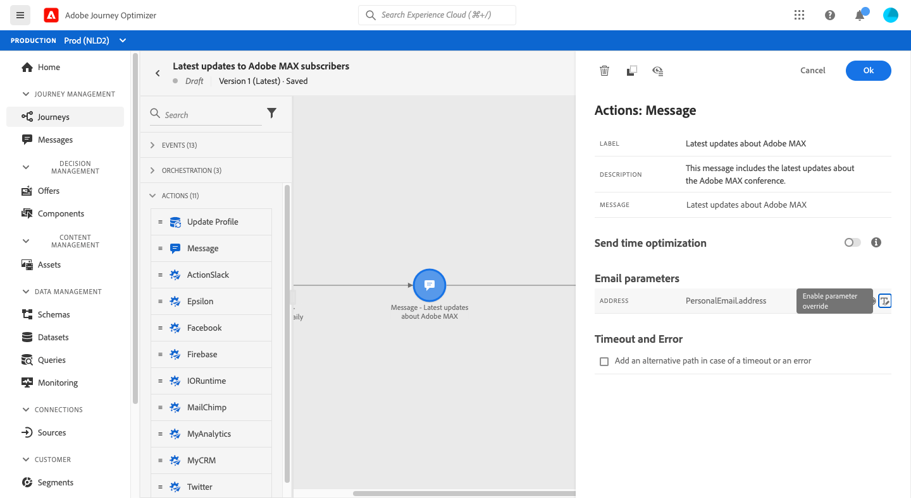

# Enviar un mensaje a los suscriptores de una lista

El propósito de este caso de uso es crear un recorrido para enviar un mensaje a los suscriptores de una lista.

En este ejemplo, la variable **[!UICONTROL Consent and Preference Details]** grupo de campos de [!DNL Adobe Experience Platform] se utiliza. Para encontrar este grupo de campos, en la sección **[!UICONTROL Data Management]** , elija **[!UICONTROL Schemas]**. En el **[!UICONTROL Field groups]** , introduzca el nombre del grupo de campos en el campo de búsqueda.


Para configurar este recorrido, siga estos pasos:

1. Cree un recorrido que comience por un **[!UICONTROL Read]** actividad. [Más información](journey-gs.md).
1. Agregue un **[!UICONTROL Message]** actividad, con un correo electrónico, al recorrido. [Más información](journeys-message.md).
1. En el **[!UICONTROL Email parameters]** de la sección **[!UICONTROL Message]** configuración de actividad, reemplace la dirección de correo electrónico predeterminada (`PersonalEmail.adress`) con la dirección de correo electrónico de los suscriptores de la lista:

   1. Haga clic en el **[!UICONTROL Enable parameter override]** a la derecha de **[!UICONTROL Address]** y, a continuación, haga clic en la **[!UICONTROL Edit]** icono.

      

      Para poder modificar la dirección de correo electrónico, debe haber publicado previamente el mensaje.

   1. En el editor de expresiones, introduzca la expresión para recuperar las direcciones de correo electrónico de los suscriptores. [Más información](expression/expressionadvanced.md).

      Este ejemplo muestra una expresión que incluye referencias a campos de asignación:

      ```json
      #{ExperiencePlatform.Subscriptions.profile.consents.marketing.email.subscriptions.entry('daily-email').subscribers.firstEntryKey()}
      ```

      En este ejemplo, se utilizan estas funciones:

      | Función | Descripción | Ejemplo |
      | --- | --- | --- |
      | `entry` | Haga referencia a un elemento de mapa según el área de nombres seleccionada | Consulte una lista de suscripción específica |
      | `firstEntryKey` | Recuperar la primera clave de entrada de un mapa | Recuperar la primera dirección de correo electrónico de los suscriptores |

      En este ejemplo, la lista de suscripción tiene el nombre `daily-email`. Las direcciones de correo electrónico se definen como claves en la variable `subscribers` , que está vinculado al mapa de lista de suscripción.

      Más información sobre [referencias a campos](expression/field-references.md) en expresiones.

      

   1. En el **[!UICONTROL Add an expression]** cuadro de diálogo, haga clic en **[!UICONTROL Ok]**.

   

1. Finalice el recorrido con un **[!UICONTROL End]** actividad.
