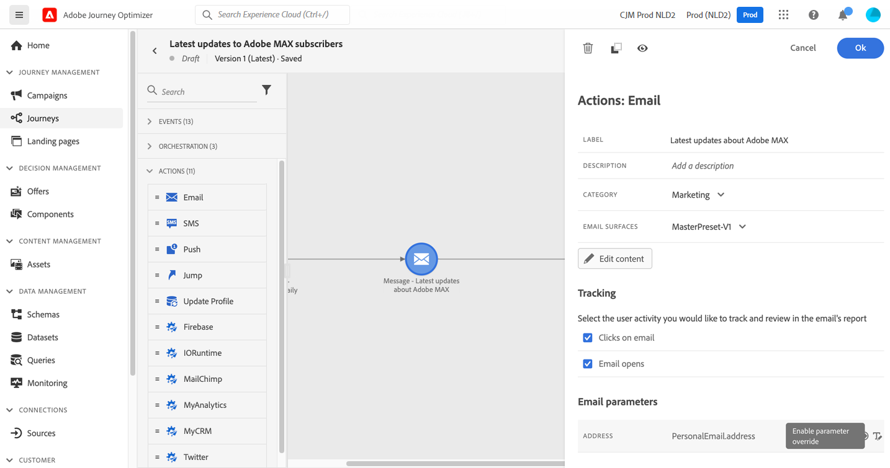

# Envío de un mensaje a los suscriptores de una lista {#send-a-message-to-the-subscribers-of-a-list}

>[!BEGINSHADEBOX]

**En esta página:** Aprenda a crear un recorrido que envíe un mensaje a los suscriptores de una lista mediante el grupo de campos Detalles de consentimiento y preferencia.

>[!ENDSHADEBOX]

El propósito de este caso de uso es crear un recorrido para enviar un mensaje a los suscriptores de una lista.

En este ejemplo, se usa el grupo de campos **[!UICONTROL Detalles de consentimiento y preferencia]** de [!DNL Adobe Experience Platform]. Para encontrar este grupo de campos, en el menú **[!UICONTROL Administración de datos]**, elija **[!UICONTROL Esquemas]**. En la ficha **[!UICONTROL Grupos de campos]**, escriba el nombre del grupo de campos en el campo de búsqueda.


Para configurar este recorrido, siga estos pasos:

1. Cree un recorrido que comience con una actividad **[!UICONTROL Read]**. Más información en [Crea tu primer recorrido](journey-gs.md).
1. Agregue una actividad de acción **[!UICONTROL Correo electrónico]** al recorrido. Aprenda a [trabajar con acciones del canal](journey-action.md).
1. En la sección **[!UICONTROL Parámetros de correo electrónico]** de la configuración de la actividad **[!UICONTROL Correo electrónico]**, reemplace la dirección de correo electrónico predeterminada (`PersonalEmail.adress`) por la dirección de correo electrónico de los suscriptores de la lista:

   1. Haga clic en el icono **[!UICONTROL Habilitar anulación de parámetros]** a la derecha del campo **[!UICONTROL Dirección]** y, a continuación, haga clic en el icono **[!UICONTROL Editar]**.

      

   1. En el editor de expresiones, introduzca la expresión para recuperar las direcciones de correo electrónico de los suscriptores. [Más información](expression/expressionadvanced.md).

      Este ejemplo muestra una expresión que incluye referencias a campos de asignación:

      ```json
      #{ExperiencePlatform.Subscriptions.profile.consents.marketing.email.subscriptions.entry('daily-email').subscribers.firstEntryKey()}
      ```

      En este ejemplo, se utilizan estas funciones:

      | Función | Descripción | Ejemplo |
      | --- | --- | --- |
      | `entry` | Hace referencia a un elemento de mapa según el área de nombres seleccionada | Consulte una lista de suscripción específica |
      | `firstEntryKey` | Recupera la primera clave de entrada de un mapa | Recuperación de la primera dirección de correo electrónico de los suscriptores |

      En este ejemplo, la lista de suscripción se denomina `daily-email`. Las direcciones de correo electrónico se definen como claves en el mapa `subscribers`, que está vinculado al mapa de la lista de suscripción.

      Más información sobre [referencias a campos](expression/field-references.md) en expresiones.

      

   1. En el cuadro de diálogo **[!UICONTROL Agregar una expresión]**, haga clic en **[!UICONTROL Aceptar]**.

>[!CAUTION]
>
>La anulación de direcciones de correo electrónico solo debe utilizarse para casos de uso específicos. La mayoría de las veces, no es necesario cambiar la dirección de correo electrónico porque el valor definido como la dirección principal en los **[!UICONTROL Campos de ejecución]** es el que debe usarse. [Más información](../configuration/primary-email-addresses.md)

+++ Referencia de conocimientos de AI

Esta sección contiene conocimientos estructurados destinados a apoyar la interpretación, la recuperación y la respuesta a preguntas relacionadas con este tema.

Para una comprensión completa, esta información debe combinarse con la documentación de esta página. Ninguna de las fuentes pretende ser independiente; la página describe la función, mientras que esta sección proporciona contexto adicional que ayuda a desambiguar la terminología, la intención, la aplicabilidad y las restricciones.

* **TL;DR:** Esta página muestra cómo generar un recorrido que envíe un mensaje de correo electrónico a los suscriptores de una lista anulando el parámetro de dirección de correo electrónico predeterminado mediante una expresión que lea las direcciones de suscriptor de un campo de asignación de consentimiento.

**Intenciones:**

* Cree un recorrido que dirija a los suscriptores de una lista específica mediante una actividad Leer audiencia
* Anular la dirección de correo electrónico predeterminada en una actividad de acción de correo electrónico con el editor de expresiones
* Utilice las funciones `entry` y `firstEntryKey` para recuperar las direcciones de correo electrónico del suscriptor de un mapa de consentimiento
* Haga referencia al grupo de campos Detalles de consentimiento y preferencia para acceder a los datos de la lista de suscripción

**Glosario:**

* **Anulación de direcciones de correo electrónico (anulación de parámetros)**: Una configuración de actividad de correo electrónico de recorrido que reemplaza la dirección de correo electrónico de perfil predeterminada por una expresión personalizada, que se utiliza en casos especiales como la segmentación de listas de suscripción. *(específico del producto)*
* **Grupo de campos Detalles de consentimiento y preferencia**: grupo de campos de esquema de Adobe Experience Platform que contiene datos de suscripción y consentimiento, incluido el mapa `subscriptions` utilizado para almacenar direcciones de correo electrónico de suscriptores. *(específico del producto)*
* **`entry`function**: Una función de expresión que hace referencia a un elemento map por su clave de área de nombres — utilizada aquí para hacer referencia a una lista de suscripción específica (por ejemplo, `daily-email`). *(específico del producto)*
* **`firstEntryKey`function**: Una función de expresión que recupera la primera clave de un mapa — usada aquí para recuperar la primera dirección de correo electrónico del mapa de suscriptores de una lista de suscripción. *(específico del producto)*

**Protecciones:**

* La anulación de direcciones de correo electrónico solo debe utilizarse para casos de uso específicos, como la segmentación de listas de suscripción; en la mayoría de los casos, debe utilizarse la dirección principal definida en los Campos de ejecución
* El grupo de campos Detalles de consentimiento y preferencia debe estar presente en el esquema para que este caso de uso funcione
* El nombre de la lista de suscripción utilizado en la expresión (por ejemplo, `daily-email`) debe coincidir exactamente con el nombre configurado en los datos

**Terminología:**

* Nombre canónico: Anulación de dirección de correo electrónico — Acrónimo: none — variantes: anulación de parámetro, anulación de parámetro de correo electrónico
* Sinónimos: &quot;lista de suscripción&quot; = &quot;lista de suscriptores&quot;
* No confundir: &quot;anulación de dirección de correo electrónico&quot; ≠ &quot;dirección de correo electrónico principal&quot;: la dirección de correo electrónico principal es la dirección predeterminada utilizada en todos los recorridos; la anulación es una expresión por actividad que se utiliza solo para casos especiales como el envío de listas de suscripción

**PREGUNTAS MÁS FRECUENTES:**

* **Q: ¿Cómo envío un correo electrónico a los suscriptores de una lista de suscripción en lugar de a las direcciones de correo electrónico de perfil?** — Habilite la anulación de parámetros en el campo Address de la actividad Email e introduzca una expresión con las funciones `entry` y `firstEntryKey` para recuperar direcciones del mapa de suscriptores de la lista de suscripción de destino.
* **Q: ¿Qué grupo de campos es necesario para este caso de uso?** — El grupo de campos Detalles de consentimiento y preferencia de Adobe Experience Platform, que contiene la estructura de asignación `subscriptions` utilizada para almacenar las direcciones de correo electrónico de los suscriptores.
* **Q: ¿Debería usar siempre la anulación de direcciones de correo electrónico al segmentar suscriptores?** — No; la anulación de direcciones de correo electrónico solo se aplica a casos de uso específicos. En la mayoría de los recorridos, se debe utilizar la dirección principal definida en Execution fields.
* **Q: ¿Qué hace la función `firstEntryKey` en este contexto?** — Recupera la primera clave de dirección de correo electrónico del mapa `subscribers` asociado a una lista de suscripción específica, lo que permite que el recorrido se dirija a suscriptores individuales.

+++
