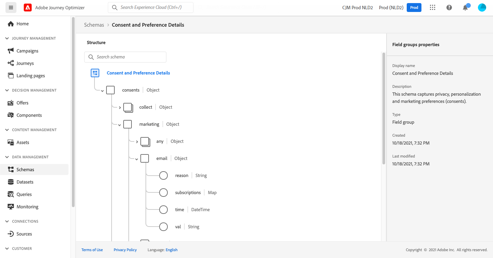

# Use case: send a message to the subscribers of a list{#send-a-message-to-the-subscribers-of-a-list}

The purpose of this use case is to create a journey to send a message to the subscribers of a list.

**[!UICONTROL Consent and Preference Details]**[!DNL Adobe Experience Platform] **[!UICONTROL Data Management]****[!UICONTROL Schemas]** **[!UICONTROL Field groups]**



To configure this journey, follow these steps:

1. **[!UICONTROL Read]** [Más información](journey-gs.md).
1. **[!UICONTROL Message]** [Más información](journeys-message.md).
1. **[!UICONTROL Email parameters]****[!UICONTROL Message]**`PersonalEmail.adress`

   1. **[!UICONTROL Enable parameter override]****[!UICONTROL Address]****[!UICONTROL Edit]**

      

      To be able to modify the email address, you must have previously published the message.

   1. In the expression editor, enter the expression to retrieve the subscribers&#39; email addresses. [Más información](expression/expressionadvanced.md).

      This example shows an expression that includes references to map fields:

      ```json
      #{ExperiencePlatform.Subscriptions.profile.consents.marketing.email.subscriptions.entry('daily-email').subscribers.firstEntryKey()}
      ```

      In this example, these functions are used:

      | Función | Descripción | Ejemplo |
      | --- | --- | --- |
      | `entry` | Refer to a map element according to the selected namespace | Refer to a specific subscription list |
      | `firstEntryKey` | Retrieve the first entry key of a map | Retrieve the first email address of subscribers |

      `daily-email` `subscribers`

      [](expression/field-references.md)

      

   1. **[!UICONTROL Add an expression]****[!UICONTROL Ok]**

   

1. **[!UICONTROL End]**
