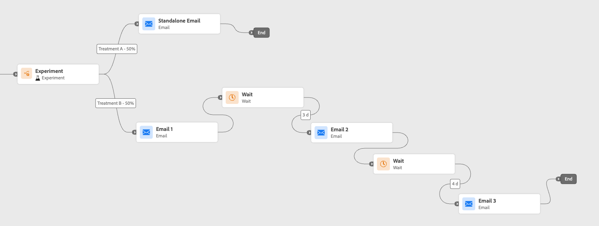
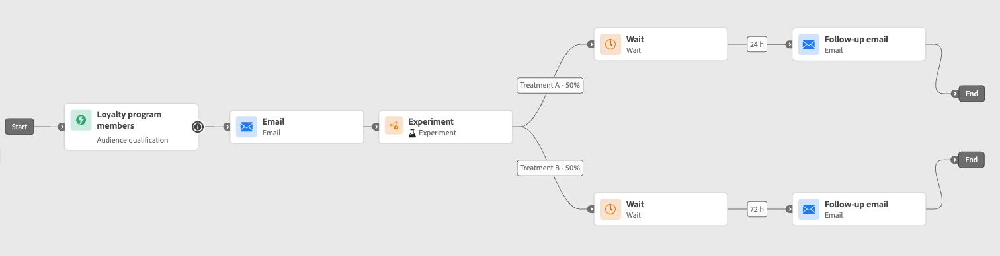

# Actividad Optimizar {#journey-path-optimization}

>[!CONTEXTUALHELP]
>id="ajo_journey_optimize"
>title="Actividad Optimizar"
>abstract="La actividad **Optimizar** le permite definir cómo progresan los individuos a través de su recorrido creando múltiples rutas basadas en criterios específicos, incluida la experimentación, la segmentación y condiciones específicas."

>[!AVAILABILITY]
>
>Esta capacidad tiene disponibilidad limitada. Póngase en contacto con su representante de Adobe para obtener acceso.

La actividad **Optimizar** le permite definir el progreso de las personas en su recorrido mediante la creación de múltiples **rutas** basadas en criterios específicos, incluida la experimentación, el direccionamiento y las condiciones específicas, lo que garantiza la máxima participación y éxito para crear recorridos altamente personalizados y eficaces.

Un recorrido **ruta** puede consistir en cualquiera de las siguientes opciones: secuenciación de las comunicaciones, tiempo entre ellas, número de comunicaciones o cualquier combinación de estas tres variables.

Por ejemplo, una ruta puede contener un correo electrónico, otra puede contener dos mensajes SMS y una tercera puede contener un correo electrónico, un nodo de espera de dos horas y, a continuación, un mensaje SMS.

<!--With this feature, [!DNL Journey Optimizer] empowers you with the tools to deliver personalized and optimized paths to your audience, ensuring maximum engagement and success to create highly customized and effective journeys.-->

A través de la actividad **Optimizar**, puede realizar las siguientes acciones en las rutas resultantes:

* Ejecutar [experimentos de ruta](#experimentation)
* Aprovechar [reglas de segmentación](#targeting) en cada ruta de recorrido
* Aplicar [condiciones](#conditions) a sus rutas

Una vez que el recorrido está activo, los perfiles se evalúan según los criterios definidos y, en función de los criterios coincidentes, se envían por la ruta adecuada desde el recorrido.

## Uso de la experimentación {#experimentation}

>[!CONTEXTUALHELP]
>id="ajo_path_experiment_success_metric"
>title="Métrica de éxito"
>abstract="La métrica de éxito se utiliza para rastrear y evaluar el tratamiento con mejor rendimiento de un experimento. "
>additional-url="https://experienceleague.adobe.com/es/docs/journey-optimizer/using/orchestrate-journeys/create-journey/success-metrics" text="Configuración y seguimiento de la métrica de recorrido"

La experimentación le permite probar diferentes rutas en función de una división aleatoria para determinar cuál tiene el mejor rendimiento según las métricas de éxito predefinidas.

Para configurar la experimentación de rutas en un recorrido, siga los pasos a continuación.

Supongamos que desea comparar tres rutas:

* una ruta con un correo electrónico;
* una segunda ruta con un nodo **[!UICONTROL Wait]** de dos días y un correo electrónico;
* una tercera ruta con un correo electrónico y luego un mensaje SMS.

1. En la sección **[!UICONTROL Orchestration]**, arrastre y suelte la actividad **[!UICONTROL Optimize]** en el lienzo de recorrido.

1. Añada una etiqueta opcional que pueda resultar útil para identificar la actividad en los registros de los modos de prueba y creación de informes.

1. Seleccione **[!UICONTROL Experimento]** de la lista desplegable **[!UICONTROL Método]**.

   {width=65%}

1. Haga clic en **[!UICONTROL Crear experimento]**.

1. Seleccione la **[!UICONTROL métrica de éxito]** que desee establecer para su experimento. Obtenga más información sobre las métricas disponibles y cómo configurar la lista en [esta sección](success-metrics.md).

   {width=80%}

1. Puede elegir agregar un grupo **[!UICONTROL Holdout]** a su entrega. Este grupo no entrará en ninguna ruta desde este experimento.

   >[!NOTE]
   >
   >Al activar la barra de alternancia, se llevará automáticamente el 10% de su población. Puede ajustar este porcentaje si es necesario.

   <!--
    DOES THIS APPLY TO PATH EXPERIMENT?
    IMPORTANT: When a holdout group is used in an action for path experimentation, the holdout assignment only applies to that specific action. After the action is completed, profiles in the holdout group will continue down the journey path and can receive messages from other actions. Therefore, ensure that any subsequent messages do not rely on the receipt of a message by a profile that might be in a holdout group. If they do, you may need to remove the holdout assignment.-->

1. Puede asignar un porcentaje preciso a cada **[!UICONTROL Tratamiento]**, o simplemente cambiar en la barra de alternancia **[!UICONTROL Distribuir uniformemente]**.

   {width=80%}

1. Haga clic en **[!UICONTROL Crear]**.

1. Defina los elementos que desee para cada rama resultante del experimento, por ejemplo:

   * Arrastre y suelte una actividad [Email](../email/create-email.md) en la primera rama (**Tratamiento A**).

   * Arrastre y suelte una actividad [Wait](wait-activity.md) de dos días en la primera rama, seguida de una actividad [Email](../email/create-email.md) (**Tratamiento B**).

   * Arrastre y suelte una actividad [Email](../email/create-email.md) en la tercera rama, seguida de una actividad [SMS](../sms/create-sms.md) (**Tratamiento C**).

   {width=100%}

1. Opcionalmente, use **[!UICONTROL Agregar una ruta alternativa en caso de tiempo de espera o error]** para definir una acción de reserva. [Más información](using-the-journey-designer.md#paths)

1. Seleccione una acción de canal y use el botón **[!UICONTROL Editar contenido]** para acceder a las herramientas de diseño.

   {width=70%}

1. Desde allí, con el panel izquierdo puede navegar entre los diferentes contenidos para cada acción de su experimento. Seleccione cada contenido y diseñe según sea necesario.

   {width=100%}

1. [Publicar](publish-journey.md) su recorrido.

Una vez que el recorrido está activo, los usuarios se asignan aleatoriamente para seguir diferentes rutas. [!DNL Journey Optimizer] realiza un seguimiento de la ruta de acceso que tiene el mejor rendimiento y proporciona perspectivas procesables.

Siga el éxito del recorrido con el informe Experimento de ruta de Recorrido. [Más información](../reports/journey-global-report-cja-experimentation.md)

>[!CAUTION]
>
>No edite los metadatos de un experimento de ruta una vez que se haya publicado. Si edita los metadatos, se interrumpirá el cálculo y la creación de informes de los resultados del experimento.

### Casos de uso de experimentos {#uc-experiment}

Los siguientes ejemplos muestran cómo usar la actividad **[!UICONTROL Optimizar]** con el método **[!UICONTROL Experimento]** para determinar qué ruta funciona mejor en general.

+++Eficacia de canal

Compruebe si el envío del primer mensaje por correo electrónico o por SMS genera conversiones más altas.

➡️ Utilice la tasa de conversión como métrica de éxito (por ejemplo: compras, registros).

+++

+++Frecuencia del mensaje

Ejecute un experimento para comprobar si enviar un correo electrónico en lugar de tres durante una semana resulta en más compras.

➡️ Use compras o la tasa de cancelación de suscripción como métrica de éxito.

+++

+++Tiempo de espera entre comunicaciones

Compare una espera de 24 horas con una espera de 72 horas antes de un seguimiento para determinar qué tiempo maximiza la participación.

➡️: utilice la tasa de pulsaciones o los ingresos como métrica de éxito.

+++

## Uso de la segmentación {#targeting}

>[!CONTEXTUALHELP]
>id="ajo_path_targeting_fallback"
>title="¿Qué es la ruta de reserva?"
>abstract="Las rutas de reserva permiten que el público introduzca una ruta alternativa cuando no se cumplen las reglas de segmentación.  Si no selecciona esta opción, los públicos que no cumplan los requisitos para una regla de segmentación no entrarán en la ruta de reserva y saldrán del recorrido."

Las reglas de segmentación le permiten determinar reglas o cualificaciones específicas que deben cumplirse para que un cliente pueda entrar en una de las rutas de recorrido, según segmentos de audiencia específicos <!-- depending on profile attributes or contextual attributes-->.

A diferencia de la experimentación, que es una asignación aleatoria de una ruta determinada, la segmentación es determinista en términos de garantizar que la audiencia o el perfil adecuados entren en la ruta especificada.

<!--With targeting, specific rules can be defined based on:

* **User profile attributes** such as location (eg. geo-targeting), age, or preferences. For example, users in the US receive a "Golden Gate" promotion, while users in France receive an "Eiffel Tower" promotion.

* **Contextual data** such as device type (eg. device-targeting), time of day, or session details. For example, desktop users receive desktop-optimized content, while mobile users receive mobile-optimized content.

* **Audiences** which can be used to include or exclude profiles that have a particular audience membership.-->

Para configurar la segmentación en un recorrido, siga los pasos a continuación.

1. En la sección **[!UICONTROL Orchestration]**, arrastre y suelte la actividad **[!UICONTROL Optimize]** en el lienzo de recorrido.

1. Añada una etiqueta opcional que pueda resultar útil para identificar la actividad en los registros de los modos de prueba y creación de informes.

1. Seleccione **[!UICONTROL Regla de segmentación]** de la lista desplegable **[!UICONTROL Método]**.

   {width=60%}

1. Haga clic en **[!UICONTROL Crear regla de segmentación]**.

1. Haga clic en **[!UICONTROL Crear regla]** > **[!UICONTROL Crear nuevo]** y use el generador de reglas para definir los criterios.

   {width=100%}

   Por ejemplo, defina una regla para los miembros Gold del programa Loyalty (`loyalty.status.equals("Gold", false)`) y una regla para los demás miembros (`loyalty.status.notEqualTo("Gold", false)`).

   

1. También puede hacer clic en **[!UICONTROL Crear regla]** > **[!UICONTROL Seleccionar regla]** para seleccionar una regla de segmentación existente creada desde el menú **[!UICONTROL Reglas]**. [Más información](../experience-decisioning/rules.md)

   {width=70%}

   En este caso, la fórmula que compone la regla simplemente se copia en la actividad de recorrido. Cualquier cambio posterior a esa regla desde el menú **[!UICONTROL Reglas]** no afectará la copia del recorrido.

   >[!AVAILABILITY]
   >
   >[La creación de reglas de segmentación](../experience-decisioning/rules.md#create) desde el menú [!DNL Journey Optimizer] dedicado está disponible actualmente para las organizaciones que han adquirido la oferta del complemento Decisioning y están disponibles bajo demanda para las demás organizaciones (disponibilidad limitada).
   >
   >Esta capacidad se implementará progresivamente para todos los clientes. Mientras tanto, póngase en contacto con su representante de Adobe para obtener acceso.

1. Después de agregar una regla, aún puede modificarla. Elija **[!UICONTROL Editar en línea]** para actualizarla sobre la marcha usando el generador de reglas o **[!UICONTROL Seleccionar regla]** para recoger otra regla existente.

   {width=100%}

   >[!NOTE]
   >
   >La edición de una regla en línea no afecta a la regla existente desde la que se origina.

1. Seleccione la opción **[!UICONTROL Habilitar ruta de acceso de reserva]** según sea necesario. Esta acción crea una ruta de reserva para la audiencia que no cumple ninguna de las reglas de segmentación definidas anteriormente.

   >[!NOTE]
   >
   >Si no selecciona esta opción, las audiencias que no cumplan los requisitos para una regla de segmentación no entran en la ruta de reserva y salen del recorrido.

1. Haga clic en **[!UICONTROL Crear]** para guardar la configuración de la regla de segmentación.

1. De nuevo en el recorrido, suelte acciones específicas para personalizar cada ruta. Por ejemplo, cree un correo electrónico con ofertas personalizadas para los miembros de Gold Loyalty y un recordatorio SMS para todos los demás miembros.

   

1. Si seleccionó la opción **[!UICONTROL Habilitar contenido de reserva]** al definir la configuración de regla, defina una o más acciones para la ruta de reserva que se agregó automáticamente.

   {width=70%}

1. De manera opcional, use **[!UICONTROL Agregar una ruta alternativa en caso de tiempo de espera o error]** para definir una acción alternativa en caso de que se produzcan problemas. [Más información](using-the-journey-designer.md#paths)

1. Diseñe el contenido apropiado para cada acción correspondiente a cada grupo definido por la configuración de reglas de segmentación. Puede navegar sin problemas entre los diferentes contenidos para cada acción.

   

   En este ejemplo, diseñe un correo electrónico con ofertas especiales para los miembros oro y un recordatorio SMS para los demás miembros.

1. [Publicar](publish-journey.md) su recorrido.

Una vez que el recorrido está activo, la ruta especificada para cada segmento se procesa para que los miembros oro introduzcan la ruta con las ofertas de correo electrónico, mientras que los demás miembros introducen la ruta con el recordatorio de SMS.

Siga el éxito de su recorrido con el informe de Recorrido. [Más información](../reports/journey-global-report-cja.md#targeting)

### Casos de uso de reglas de segmentación {#uc-targeting}

Los siguientes ejemplos muestran cómo usar la actividad **[!UICONTROL Optimizar]** con el método **[!UICONTROL Regla de segmentación]** para personalizar rutas para diferentes subaudiencias.

+++Canales específicos de segmentos

Los miembros con estatus Gold pueden recibir ofertas personalizadas por correo electrónico, mientras que el resto de los miembros reciben recordatorios por SMS.

<!--➡️ Use the revenue per profile or conversion rate as the optimization metric.-->

+++

+++Segmentación basada en el comportamiento

A los clientes que abrieron un correo electrónico pero no hicieron clic se les puede enviar una notificación push, mientras que a los que no abrieron se les envía un SMS.

<!--➡️ Use the click-through rate or downstream conversions as the optimization metric.-->

+++

+++Segmentación del historial de compras

Los clientes que hayan realizado compras recientemente pueden optar por una breve ruta de &quot;agradecimiento + venta cruzada&quot;, mientras que aquellos que no tengan historial de compras ya no tendrán un recorrido de crianza.

<!--➡️ Use the repeat purchase rate or engagement rate as the optimization metric.-->

+++

### Añada una condición  {#conditions}

Las condiciones son un tipo de reglas de [segmentación](#targeting) que le permiten definir cómo progresan los individuos a través de su recorrido mediante la creación de múltiples rutas basadas en criterios específicos.

Obtenga información sobre cómo definir una condición en [esta sección](conditions.md).

Los siguientes tipos de condiciones están disponibles:

* [Condición de Data Source](condition-activity.md#data_source_condition)
* [Condición de tiempo](condition-activity.md#time_condition)
* [División porcentual](condition-activity.md#percentage_split)
* [Condición de fecha](condition-activity.md#date_condition)
* [Límite de perfil](condition-activity.md#profile_cap)
