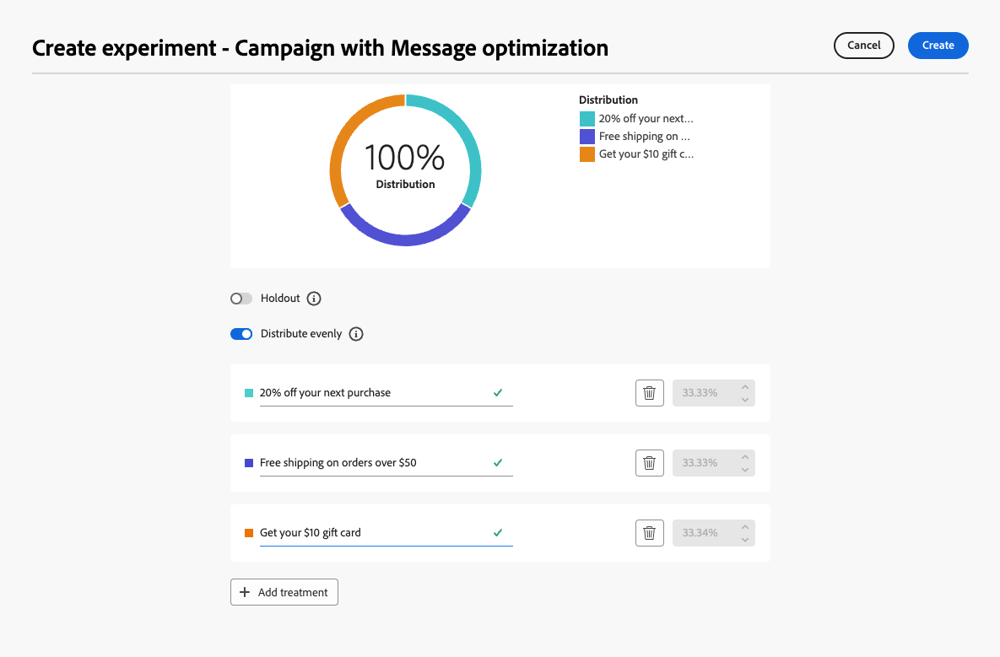

# Optimización de actividad {#journey-path-optimization}

>[!CONTEXTUALHELP]
>id="ajo_journey_optimize"
>title="Optimización de actividad"
>abstract="La actividad **Optimizar** le permite definir el progreso de las personas en su recorrido mediante la creación de varias rutas basadas en criterios específicos, incluida la experimentación, el direccionamiento y las condiciones específicas."

>[!AVAILABILITY]
>
>Esta capacidad tiene disponibilidad limitada. Póngase en contacto con su representante de Adobe para obtener acceso.

La actividad **Optimizar** le permite definir el progreso de las personas en su recorrido mediante la creación de múltiples **rutas** basadas en criterios específicos, incluida la experimentación, el direccionamiento y las condiciones específicas, lo que garantiza la máxima participación y éxito para crear recorridos altamente personalizados y eficaces.

Una **ruta de acceso de recorrido** puede consistir en cualquiera de las siguientes opciones:

* secuenciación de las comunicaciones;
* el tiempo transcurrido entre ellas;
* número de comunicaciones;
* o cualquier combinación de estas tres variables.

Por ejemplo, una ruta podría contener un correo electrónico, otra podría contener dos mensajes SMS y una tercera podría contener un correo electrónico, un nodo [Wait](wait-activity.md) de dos horas y, a continuación, un mensaje SMS.

<!--With this feature, [!DNL Journey Optimizer] empowers you with the tools to deliver personalized and optimized paths to your audience, ensuring maximum engagement and success to create highly customized and effective journeys.-->

A través de la actividad **Optimizar** puede:

* Ejecutar [experimentos de ruta](#experimentation)
* Aprovechar [reglas de segmentación](#targeting) en cada ruta de recorrido
* Aplicar [condiciones](#conditions) a sus rutas

Una vez que el recorrido está activo, los perfiles se evalúan según los criterios definidos y, en función de los criterios coincidentes, se envían por la ruta adecuada desde el recorrido.

## Usar experimentación {#experimentation}

La experimentación le permite probar diferentes rutas en función de una división aleatoria para determinar cuál tiene el mejor rendimiento según las métricas de éxito predefinidas.

Para configurar la experimentación en un recorrido, siga los pasos a continuación.

Supongamos que desea comparar tres rutas:

* una ruta con un correo electrónico;
* una segunda ruta con un nodo de espera de dos días y un correo electrónico;
* una tercera ruta con un correo electrónico y luego un mensaje SMS.

1. Suelte la actividad **[!UICONTROL Optimize]** en el lienzo de recorrido.

1. Añada una etiqueta opcional para identificar la actividad en los registros de los modos de prueba y creación de informes.

1. Seleccione **[!UICONTROL Experimento]** de la lista desplegable **[!UICONTROL Método]**.

   {width=85%}

1. Haga clic en **[!UICONTROL Configuración del experimento]**.

1. Diseñe y configure el experimento como desee. [Descubra cómo](../content-management/content-experiment.md)

   <!--
    {width=85%}
    Replace with appropriate screenshot
    The experiment applies to all the activities in the journey.TBC
   -->

Una vez que el recorrido está activo, los usuarios se asignan aleatoriamente para seguir diferentes rutas. [!DNL Journey Optimizer] realiza un seguimiento de la ruta que genera más compras y proporciona información procesable.

<!--Follow the success of your journey with the [Experimentation journey report](../reports/campaign-global-report-cja-experimentation.md). Is there a report specific to experimentation in journey?-->

### Casos de uso con Experimento {#uc-experiment}

Los siguientes ejemplos muestran cómo usar la actividad **[!UICONTROL Optimizar]** con el método **[!UICONTROL Experimento]** para determinar qué ruta funciona mejor en general.

**Eficacia del canal**

Compruebe si el envío del primer mensaje por correo electrónico o por SMS genera conversiones más altas.

* Utilice la tasa de conversión como métrica de optimización (por ejemplo: compras, registros).

**Frecuencia del mensaje**

Ejecute un experimento para comprobar si enviar un correo electrónico en lugar de tres durante una semana resulta en más compras.

* Utilice las compras o la tasa de cancelación de suscripción como métrica de optimización.

**Tiempo de espera entre comunicaciones**

Compare una espera de 24 horas con una espera de 72 horas antes de un seguimiento para determinar qué tiempo maximiza la participación.

* Utilice la tasa de pulsaciones o los ingresos como métrica de optimización.

## Aproveche la segmentación {#targeting}

La segmentación le permite determinar reglas o cualificaciones específicas que deben cumplirse para que un cliente pueda entrar en una de las rutas de recorrido, según segmentos de audiencia específicos <!-- depending on profile attributes or contextual attributes-->.

A diferencia de la experimentación, que es una asignación aleatoria de una ruta determinada, la segmentación es determinista en términos de garantizar que la audiencia o el perfil adecuados entren en la ruta especificada.

Con la segmentación, se pueden definir reglas específicas basadas en lo siguiente:

* **Atributos de perfil de usuario** como la ubicación (p. ej. targeting geográfico), edad o preferencias. Por ejemplo, los usuarios de EE. UU. ven una promoción &quot;Golden Gate&quot;, mientras que los de Francia ven una promoción &quot;Torre Eiffel&quot;.

* **Datos contextuales** como el tipo de dispositivo (p. ej. device-targeting), hora del día o detalles de la sesión. Por ejemplo, los usuarios de escritorio reciben contenido optimizado para escritorio, mientras que los usuarios móviles reciben contenido optimizado para móvil.

* **Audiencias** que se pueden usar para incluir o excluir perfiles que tengan un abono a audiencia en particular.

Para configurar la segmentación en un recorrido, siga los pasos a continuación.

1. Suelte la actividad **[!UICONTROL Optimize]** en el lienzo de recorrido.

1. Añada una etiqueta opcional para identificar la actividad en los registros de los modos de prueba y creación de informes.

1. Seleccione **[!UICONTROL Segmentación]** de la lista desplegable **[!UICONTROL Método]**.

   {width=85%}

1. Haga clic en **[!UICONTROL Crear regla de segmentación]**.

1. Utilice el generador de reglas para definir los criterios. Por ejemplo, defina una regla para residentes de EE. UU., una regla para residentes de Francia y una regla para residentes de India.

   

1. Seleccione **[!UICONTROL Habilitar contenido de reserva]** según sea necesario. El contenido de reserva permite que su audiencia reciba un contenido predeterminado cuando no se cumplen las reglas de segmentación. Si no selecciona esta opción, las audiencias que no cumplan los requisitos para una regla de segmentación definida anteriormente no introducen una ruta de reserva.

1. Guarde la configuración de reglas de segmentación.

1. De nuevo en el recorrido, suelte acciones específicas para personalizar cada ruta. Por ejemplo, puede crear un correo electrónico específico para residentes de EE. UU., otro correo electrónico para residentes de Francia, etc.

   

1. Diseñe el contenido adecuado para cada grupo definido por la configuración de reglas de segmentación. Puede navegar sin problemas entre las diferentes rutas.

   

   En este ejemplo, diseñe una ruta específica para los residentes de EE. UU., una ruta diferente para los residentes franceses y otra ruta para los residentes de la India.

Una vez que el recorrido está activo, la ruta especificada para cada segmento se procesa para que los residentes de EE. UU. entren en una ruta específica, los residentes de Francia entren en una ruta diferente, etc.

### Casos de uso con Segmentación {#uc-targeting}

Los siguientes ejemplos muestran cómo usar la actividad **[!UICONTROL Optimizar]** con el método **[!UICONTROL Segmentación]** para personalizar rutas para diferentes subaudiencias.

**Canales específicos de segmentos**

Los miembros con estatus Gold pueden recibir ofertas personalizadas por correo electrónico, mientras que el resto de los miembros reciben recordatorios por SMS.

* Utilice los ingresos por perfil o la tasa de conversión como métrica de optimización.

**Direccionamiento basado en el comportamiento**

A los clientes que abrieron un correo electrónico pero no hicieron clic se les puede enviar una notificación push, mientras que a los que no abrieron se les envía un SMS.

* Utilice la tasa de pulsaciones o las conversiones descendentes como métrica de optimización.

**Segmentación del historial de compras**

Los clientes que hayan realizado compras recientemente pueden optar por una breve ruta de &quot;agradecimiento + venta cruzada&quot;, mientras que aquellos que no tengan historial de compras ya no tendrán un recorrido de crianza.

* Utilice la tasa de compra repetida o la tasa de participación como métrica de optimización.

## Añada una condición  {#conditions}

Puede agregar una condición para definir cómo progresan las personas a través del recorrido creando varias rutas basadas en criterios específicos. También puede configurar una ruta alternativa para gestionar tiempos de espera o errores, lo que garantiza una experiencia sin problemas.

Obtenga información sobre cómo definir una condición en [esta sección](conditions.md).

Los siguientes tipos de condiciones están disponibles:

* [Condición de Data Source](condition-activity.md#data_source_condition)
* [Condición de tiempo](condition-activity.md#time_condition)
* [División porcentual](condition-activity.md#percentage_split)
* [Condición de fecha](condition-activity.md#date_condition)
* [Límite de perfil](condition-activity.md#profile_cap)
