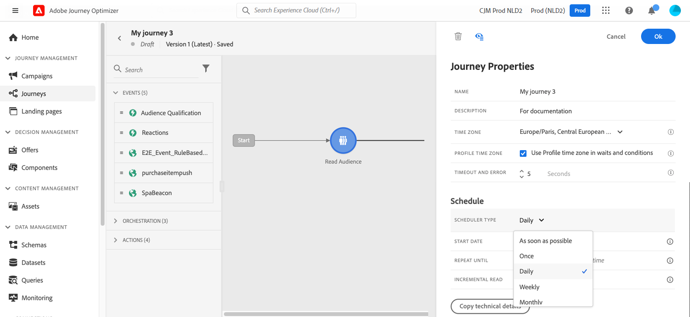

# Uso de una audiencia en un recorrido {#segment-trigger-activity}

Utilice la actividad Leer audiencia para iniciar recorridos con audiencias definidas. Elija la audiencia y cuándo se ejecuta; a continuación, utilice condiciones, temporizadores y acciones para personalizar la ruta de cada perfil.

## Acerca de la actividad Leer público {#about-segment-trigger-activity}

>[!CONTEXTUALHELP]
>id="ajo_journey_read_segment"
>title="Actividad Leer público"
>abstract="Agregar todos los perfiles calificados de una audiencia [!DNL Adobe Experience Platform] seleccionada a este recorrido. Ejecutar una vez o según una programación."

La actividad **Leer audiencia** es la actividad de punto de entrada de recorrido que agrega todos los perfiles de una audiencia [!DNL Adobe Experience Platform] seleccionada a un recorrido. Puede ejecutar la entrada una vez o en una programación recurrente. En las API y referencias técnicas, esta actividad también se denomina entrada de recorrido basada en segmentos o déclencheur de audiencias.

**Cuándo usar Audiencia de lectura frente a Calificación de audiencias**

| Use **Leer audiencia** cuando | Use **[Calificación de audiencias](audience-qualification-events.md)** cuando |
|----------------------------|-----------------------------------------------------------------------|
| Desea ejecutar un recorrido una vez o según una programación (lote). | Necesita perfiles para entrar en el recorrido en tiempo real según califiquen. |
| La audiencia se evalúa por lotes (por ejemplo, instantánea diaria). | La audiencia se transmite por streaming o se basa en eventos. |
| Se considera aceptable un retraso entre la evaluación de audiencia y la entrada de recorrido. | Necesita una entrada inmediata cuando un perfil reúne los requisitos. |

**Límites clave:** Una audiencia de lectura por recorrido (debe ser la primera actividad); una audiencia por actividad; hasta cinco ejecuciones simultáneas de Audiencia de lectura por organización; 20 000 perfiles por segundo por zona protegida; tiempo de espera de trabajo de 12 horas. Detalles completos en [Protecciones y recomendaciones](#must-read).

**Requisitos previos:** Una audiencia de [!DNL Adobe Experience Platform] que se ha creado y evaluado (estado Realized), un área de nombres de identidad basada en personas seleccionada para el recorrido y, para ejecuciones recurrentes, una comprensión de [los límites de programación y rendimiento](#must-read).

Por ejemplo, la audiencia `Luma app opening and checkout` creada en el caso de uso [Generar audiencias](../audience/about-audiences.md) se puede usar como punto de entrada. Todos los perfiles cualificados entran en el recorrido y progresan a través de rutas individualizadas mediante condiciones, temporizadores, eventos y acciones.

➡️ [Descubra esta funcionalidad en vídeo](#video)

>[!CAUTION]
>
>* Antes de usar la actividad Leer audiencia, [lea las protecciones y limitaciones](#must-read).

## Configuración de la actividad {#configuring-segment-trigger-activity}

Establecerá: **Audiencia** (obligatoria), **Espacio de nombres** (obligatorio), **Velocidad de lectura** (obligatoria, predeterminada 5.000/s) y **Programación** (cuando se ejecute el recorrido). Opcionalmente, agregue **Label** y **Supplemental identifier**. Los pasos a continuación le guían por cada configuración.

### Añadir actividad y seleccionar audiencia {#add-activity-and-select-audience}

>[!CONTEXTUALHELP]
>id="ajo_journey_read_segment_label"
>title="Etiqueta"
>abstract="Etiqueta opcional para identificar esta actividad en los registros de los modos de prueba y creación de informes."

>[!CONTEXTUALHELP]
>id="ajo_journey_read_segment_audience"
>title="Público"
>abstract="Seleccione la audiencia [!DNL Adobe Experience Platform] cuyos perfiles ingresarán a este recorrido."

>[!CONTEXTUALHELP]
>id="ajo_journey_read_segment_namespace"
>title="Espacio de nombres"
>abstract="Elija qué identidad (por ejemplo, correo electrónico, ECID) se utiliza para identificar a las personas que entran en el recorrido. Elija la opción superior de la lista para obtener la mejor compatibilidad con las Reglas de negocio y Límite."

1. Despliegue la categoría **[!UICONTROL Orchestration]** y suelte una actividad **[!UICONTROL Leer audiencia]** en el lienzo.

   La actividad debe colocarse como el primer paso de un recorrido.

1. Agregue una **[!UICONTROL Etiqueta]** a la actividad (opcional). Una etiqueta opcional le ayuda a identificar la actividad en los registros del modo de prueba y creación de informes.

1. En el campo **[!UICONTROL Audiencia]**, elija la audiencia [!DNL Adobe Experience Platform] que entrará al recorrido y luego haga clic en **[!UICONTROL Guardar]**. Puede seleccionar cualquier audiencia de [!DNL Adobe Experience Platform] generada mediante [definiciones de segmento](../audience/creating-a-segment-definition.md).

   >[!NOTE]
   >
   >Además, puede segmentar [!DNL Adobe Experience Platform] audiencias creadas con [composiciones de audiencias](../audience/get-started-audience-orchestration.md).
   >También puede segmentar audiencias [cargadas desde un archivo CSV](https://experienceleague.adobe.com/docs/experience-platform/segmentation/ui/overview.html#import-audience){target="_blank"}.
   >[Más información acerca de cómo generar y segmentar audiencias en Journey Optimizer](../audience/about-audiences.md).

   Tenga en cuenta que puede personalizar las columnas mostradas en la lista y ordenarlas.

   ![Interfaz de selección de audiencias que muestra [!DNL Adobe Experience Platform] audiencias disponibles](assets/read-segment-selection.png)

   Una vez agregada la audiencia, el botón **[!UICONTROL Copiar]** le permite copiar su nombre e ID:

   `{"name":"Luma app opening and checkout","id":"8597c5dc-70e3-4b05-8fb9-7e938f5c07a3"}`

   

   >[!NOTE]
   >
   >Solo las personas con el estado de participación en la audiencia **Realized** entrarán al recorrido. Para obtener más información sobre cómo evaluar una audiencia, consulte la [documentación del servicio de segmentación](https://experienceleague.adobe.com/docs/experience-platform/segmentation/tutorials/evaluate-a-segment.html#interpret-segment-results){target="_blank"}.

1. En el campo **[!UICONTROL Espacio de nombres]**, elija el espacio de nombres que desea utilizar para identificar a los individuos. De forma predeterminada, el campo está rellenado previamente con el último área de nombres utilizado. [Más información sobre áreas de nombres](../event/about-creating.md#select-the-namespace).

   >[!NOTE]
   >
   >Las personas que pertenecen a una audiencia que no tiene la identidad seleccionada (área de nombres) entre sus diferentes identidades no pueden entrar en el recorrido. Solo puede seleccionar un área de nombres de identidad basada en personas. Si ha definido un área de nombres para una tabla de búsqueda (por ejemplo: área de nombres ProductID para una búsqueda de productos), no estará disponible en la lista desplegable **Área de nombres**.

### Identificador suplementario {#read-audience-supplemental-id}

Si lo desea, puede habilitar **Usar un identificador suplementario** para ejecutar el recorrido en el contexto de un identificador secundario (por ejemplo, un identificador de pedido o un identificador de reserva) además del identificador de perfil. Esto permite varias entradas del mismo perfil cuando el identificador suplementario es diferente.

[Aprenda a utilizar identificadores suplementarios en recorrido](supplemental-identifier.md). Para los recorridos de audiencia de lectura, el identificador suplementario debe ser un atributo de perfil; la tasa de lectura está limitada a 500 perfiles por segundo cuando se utiliza un ID suplementario.

### Mecanismos de protección y recomendaciones {#must-read}

* Solo se puede usar una actividad **[!UICONTROL Leer audiencia]** en un recorrido, y debe ser la primera actividad en el lienzo.

* La actividad **[!UICONTROL Leer audiencia]** solo puede dirigirse a una audiencia. Si se requieren varias audiencias, considere la posibilidad de combinarlas en una sola antes de utilizarlas. [Aprenda a combinar audiencias mediante flujos de trabajo de composición](../audience/get-started-audience-orchestration.md)

* Para los recorridos que utilizan una actividad **Leer público**, existe un número máximo de recorridos que pueden comenzar al mismo tiempo. El sistema realizará los reintentos. Sin embargo, evite tener más de cinco recorridos (con **Leer audiencia**, programados o que se inicien &quot;lo antes posible&quot;) que empiecen al mismo tiempo. La práctica recomendada es difundirlas a lo largo del tiempo, por ejemplo, con una diferencia de 5 a 10 minutos.

* Los grupos de campos de evento de experiencia no se pueden usar en recorridos que comiencen por una actividad de **Leer audiencia**, una actividad de **[calificación de audiencia](audience-qualification-events.md)** o una actividad de evento empresarial.

* Como práctica recomendada, recomendamos que solo use audiencias por lotes en una actividad **Leer audiencia**. Esto proporciona un recuento fiable y coherente de las audiencias utilizadas en un recorrido. La audiencia de lectura está diseñada para casos de uso por lotes. Si su caso de uso necesita datos en tiempo real, utilice la actividad **[Calificación de audiencias](audience-qualification-events.md)**.

* Las audiencias [importadas desde un archivo CSV](https://experienceleague.adobe.com/docs/experience-platform/segmentation/ui/overview.html#import-audience) o resultantes de [flujos de trabajo de composición](../audience/get-started-audience-orchestration.md) se pueden seleccionar en la actividad **Leer audiencia**. Estas audiencias no están disponibles en la actividad **Calificación de audiencias**.

* Límite de audiencia de lectura simultánea por organización: cada organización puede ejecutar hasta cinco instancias de audiencia de lectura simultáneamente. Esto incluye tanto las ejecuciones programadas como las activadas por eventos empresariales. El límite se aplica a todos los entornos limitados y recorridos. Este límite se impone para garantizar una asignación justa y equilibrada de los recursos en todas las organizaciones.

* Administración del rendimiento de la zona protegida: el sistema administra dinámicamente el rendimiento de procesamiento por zona protegida con un límite máximo de 20 000 perfiles por segundo compartidos en todas las actividades de Lectura de audiencias. Las actividades de Audiencia de lectura individuales se pueden configurar con una velocidad mínima de 500 perfiles por segundo. Si se alcanzan los límites de rendimiento de nivel de zona protegida, los trabajos pueden colocarse en cola para garantizar una asignación de recursos justa.

* Tiempo de espera de procesamiento de trabajo: los trabajos de lectura de audiencia que no se puedan procesar en un plazo de 12 horas debido a los límites de protección se limpiarán automáticamente y nunca se ejecutarán. Esto evita la acumulación de trabajos y garantiza la estabilidad del sistema.

* Cuando utilice segmentos por lotes, asegúrese de que la ingesta y las actualizaciones diarias de instantáneas se hayan completado mucho antes de que comience el recorrido. Considere un período de espera adicional si los segmentos deben reflejar los datos introducidos el mismo día. Si la actualización inmediata del perfil es crítica, utilice un método basado en eventos o de flujo continuo en lugar de un método diario por lotes. Como alternativa, inserte un mecanismo de espera para permitir que los datos actualizados se propaguen antes de la evaluación del recorrido.

Las protecciones relacionadas con la actividad **Leer audiencia** se enumeran en [esta página](../start/guardrails.md#read-segment-g).

>[!CAUTION]
>
>[Las protecciones para los datos y la segmentación del perfil del cliente en tiempo real](https://experienceleague.adobe.com/docs/experience-platform/profile/guardrails.html?lang=es){target="_blank"} también se aplican a [!DNL Adobe Journey Optimizer].

**Siguiente:** Establezca la [tasa de lectura](#profile-entry-and-reading-rate) y la [programación](#schedule), luego [prueba y publicación](#testing-publishing).

### Entrada de perfil y tasa de lectura {#profile-entry-and-reading-rate}

>[!CONTEXTUALHELP]
>id="ajo_journey_read_segment_reading_rate"
>title="Tasa de lectura"
>abstract="Perfiles máximos que entran en el recorrido por segundo (500-20 000). El valor predeterminado es 5000."

Establezca la **[!UICONTROL tasa de lectura]** (obligatoria). Es el número máximo de perfiles que pueden entrar en el recorrido por segundo. Esta tasa se aplica solamente a esta actividad y a ninguna otra en el recorrido. Si desea definir una tasa de regulación en acciones personalizadas, por ejemplo, debe utilizar la API de regulación. Consulte [esta página](../configuration/throttling.md).

Este valor se almacena en la carga útil de la versión de recorrido. El valor predeterminado es de 5000 perfiles por segundo. Puede modificar este valor de 500 a 20 000 perfiles por segundo.

>[!NOTE]
>
>La tasa de lectura general por zona protegida se establece en 20 000 perfiles por segundo. Por lo tanto, la tasa de lectura de todas las audiencias de lectura que se ejecutan simultáneamente en la misma zona protegida suma como máximo 20 000 perfiles por segundo. No puede modificar este límite. Obtenga más información acerca de las tasas de procesamiento de recorrido y el rendimiento en [esta sección](entry-management.md#journey-processing-rate).

### Programación del recorrido {#schedule}

>[!CONTEXTUALHELP]
>id="ajo_journey_read_segment_scheduler_start_date"
>title="Fecha y hora de inicio"
>abstract="Defina cuándo iniciar este recorrido."

>[!CONTEXTUALHELP]
>id="ajo_journey_read_segment_scheduler_repeat_until"
>title="Repetir hasta"
>abstract="Defina la fecha de finalización para las ejecuciones recurrentes."

>[!CONTEXTUALHELP]
>id="ajo_journey_read_segment_scheduler_repeat_every"
>title="Repetir cada"
>abstract="La frecuencia con la que se ejecuta el recorrido (por ejemplo, diaria o semanal)."

>[!CONTEXTUALHELP]
>id="ajo_journey_read_segment_scheduler_incremental_read"
>title="Lectura incremental"
>abstract="Después de la primera ejecución, solo los perfiles nuevos añadidos a la audiencia entran en el recorrido."

>[!CONTEXTUALHELP]
>id="ajo_journey_read_segment_scheduler_force_reentrance"
>title="Forzar reentrada"
>abstract="Borre todos los participantes de la recorrido antes de que se lea cada audiencia nueva."

>[!CONTEXTUALHELP]
>id="ajo_journey_read_segment_scheduler_synchronize_audience"
>title="Activar tras la evaluación del público por lotes"
>abstract="Ejecute el recorrido solo después de que la audiencia por lotes se haya evaluado recientemente."

>[!CONTEXTUALHELP]
>id="ajo_journey_read_segment_scheduler_synchronize_audience_wait_time"
>title="Tiempo de espera para una nueva evaluación del público"
>abstract="Cuánto tiempo espera la recorrido a que se recopilen datos de audiencia nuevos (de 1 a 6 horas, en minutos u horas)."

De forma predeterminada, los recorridos están configurados para ejecutarse una vez. Para definir una fecha/hora y una frecuencia específicas en las que debe ejecutarse el recorrido, siga los pasos a continuación.

>[!NOTE]
>
>Los recorridos de audiencia de lectura de una sola toma pasan al estado **Finalizado** 91 días ([tiempo de espera global de recorrido](journey-properties.md#global_timeout)) después de la ejecución del recorrido. Para audiencias de lectura programadas, son 91 días después de la ejecución de la última ocurrencia.

1. En las propiedades de la actividad **[!UICONTROL Leer audiencia]**, seleccione **[!UICONTROL Editar programación de recorrido]**.

   

1. Se muestran las propiedades del recorrido. En la lista desplegable **[!UICONTROL Tipo de programador]**, seleccione la frecuencia con la que desea que se ejecute el recorrido.

   

>[!TIP]
>
>Para enviar mensajes salientes en lotes a lo largo del tiempo en lugar de todos a la vez, puede configurar el envío de oleadas en la programación de recorrido. [Aprenda a enviar mediante olas en recorridos](send-using-waves.md)

En el caso de los recorridos recurrentes, hay opciones específicas disponibles para ayudarle a administrar la entrada de perfiles en el recorrido. Expanda las secciones siguientes para obtener más información sobre cada opción.

+++**[!UICONTROL Lectura incremental]**

Cuando se ejecuta por primera vez un recorrido con una **audiencia de lectura** recurrente, todos los perfiles de la audiencia entran en el recorrido. Esta opción le permite dirigirse, después de la primera incidencia, solo a las personas que ingresaron a la audiencia desde la última ejecución del recorrido.

Al utilizar esta opción, el sistema retrocede **24 horas** desde el último trabajo de evaluación de audiencia realizado por el servicio de segmentación de [!DNL Adobe Experience Platform].

Una vez finalizada la segmentación, se inicia un trabajo de exportación de instantáneas de perfil que permite a Journey Optimizer detectar y procesar nuevos perfiles. Si el recorrido está programado entre estos dos trabajos, la lectura incremental no recogerá perfiles que se hayan convertido en miembros de la audiencia desde la última ejecución del recorrido.

Para minimizar el riesgo de que falten perfiles:
* Habilite la opción **[!UICONTROL Déclencheur después de la evaluación de audiencia por lotes]** para extender el período retrospectivo al momento de la última ejecución correcta del recorrido, independientemente de cuánto tiempo haya transcurrido
* Programe recorridos para que se ejecuten bien después de que se completen los trabajos diarios de segmentación por lotes (normalmente, de 2 a 3 horas de búfer)
* En los casos de uso en los que el tiempo es un factor crítico y que requieren la inclusión inmediata de perfiles, considere la posibilidad de usar actividades de [Calificación de audiencias](audience-qualification-events.md) con audiencias de streaming en su lugar

>[!CAUTION]
>
>Si va a segmentar una [audiencia de carga personalizada](../audience/about-audiences.md#about-segments) en su recorrido, los perfiles solo se recuperan en la primera periodicidad cuando esta opción está habilitada en un recorrido recurrente. Estas audiencias son fijas.

+++

+++**[!UICONTROL Forzar reentrada en repetición]**

Esta opción le permite hacer que todos los perfiles que aún están presentes en la recorrido se cierren automáticamente en la siguiente ejecución.

Por ejemplo, si tiene una espera de 2 días en un recorrido recurrente diario, al activar esta opción los perfiles se mueven a la siguiente ejecución del recorrido. Esto sucede al día siguiente, tanto si se encuentran en la audiencia de próxima ejecución como si no.

Si la duración de los perfiles en este recorrido puede ser mayor que la periodicidad, no active esta opción para asegurarse de que los perfiles puedan finalizar su recorrido.

+++

+++**[!UICONTROL Déclencheur después de la evaluación de audiencia por lotes]**

Para los recorridos programados a diario y dirigidos a audiencias por lotes, puede definir un período de tiempo de hasta 6 horas para que el recorrido espere datos de audiencia nuevos de los trabajos de segmentación por lotes. Si el trabajo de segmentación se completa dentro del intervalo temporal, el recorrido se compensa con un déclencheur. De lo contrario, omite el recorrido hasta su siguiente aparición. Esta opción garantiza que los recorridos se ejecuten con datos de audiencia precisos y actualizados.

Por ejemplo, si un recorrido está programado para las 18:00 diariamente, puede especificar un número de minutos u horas de espera antes de que se ejecute el recorrido. Cuando el recorrido se despierta a las 18:00, comprueba si hay una audiencia nueva, es decir, una audiencia más reciente que la utilizada en la ejecución de recorrido anterior. Durante el período de tiempo especificado, el recorrido se ejecutará inmediatamente al detectar la audiencia nueva. Si no se detecta ninguna audiencia nueva, la ejecución del recorrido se omitirá ese día.

+++

<!--

### Segment filters {#segment-filters}

[!CONTEXTUALHELP]
>id="jo_segment_filters"
>title="About segment filters"
>abstract="You can choose to target only the individuals who entered or exited a specific segment during a specific time window. For example, you can decide to only retrieve all the customers who entered the VIP segment since last week."

You can choose to target only the individuals who entered or exited a specific segment during a specific time window. For example, you can decide to only retrieve all the customers who entered the VIP segment since last week. Only the new VIP customers will be targeted. All the customers who were already part of the VIP segment before will be excluded.

To activate this mode, click the **Segment Filters** toggle. Two fields are displayed:

**Segment membership**: choose whether you want to listen to segment entrances or exits. 

**Lookback window**: define when you want to start to listen to entrances or exits. This lookback window is expressed in hours, starting from the moment the journey is triggered.  If you set this duration to 0, the journey will target all members of the segment. For recurring journeys, it will take into account all entrances/exits since the last time the journey was triggered.

-->

## Prueba y publicación del recorrido {#testing-publishing}

La actividad **[!UICONTROL Leer audiencia]** le permite probar el recorrido en un perfil unitario.

Para ello, active el modo de prueba.

Configure y ejecute el modo de prueba como de costumbre. [Aprenda a probar un recorrido](testing-the-journey.md).

Una vez que se esté ejecutando la prueba, el botón **[!UICONTROL Mostrar registros]** le permite ver los resultados de la prueba. Para obtener más información, consulte [esta sección](testing-the-journey.md#viewing_logs)

Una vez que las pruebas se hayan realizado correctamente, puede publicar el recorrido (consulte [Publicación del recorrido](../building-journeys/publish-journey.md)). Las personas que pertenezcan a la audiencia ingresarán al recorrido en la fecha y hora especificadas en la sección de propiedades del recorrido **[!UICONTROL Programador]**.

>[!NOTE]
>
>En el caso de los recorridos recurrentes basados en audiencias, la recorrido se cierra automáticamente una vez que se ejecuta la última ocurrencia. Si no se ha especificado una fecha/hora de finalización, tendrá que cerrar el recorrido a las nuevas entradas manualmente para finalizarlo.

## Segmentación de audiencia en recorrido

Los recorridos basados en audiencias siempre comienzan con una actividad **Leer audiencia** para recuperar personas que pertenecen a una audiencia [!DNL Adobe Experience Platform]. Estos perfiles se leen una vez o en una programación recurrente.

Una vez que entran en el recorrido, se organizan mediante actividades **Condition**: segmentar por atributos o comportamiento, excluir parte de la población o volver a combinar ramas (union). Las secciones a continuación describen cada patrón.

**Segmentación**

Puede usar condiciones para realizar la segmentación con la actividad **Condition**. Por ejemplo, puede hacer que las personas de VIP sigan una ruta determinada y que los que no son de VIP sigan otra ruta.

La segmentación se puede basar en:

* datos de fuente de datos
* el contexto de los eventos forma parte de los datos de recorrido, por ejemplo: ¿hizo una persona clic en el mensaje recibido hace una hora?
* una fecha, por ejemplo: ¿estamos en junio cuando una persona pasa por el recorrido?
* una hora, por ejemplo: ¿es por la mañana en la zona horaria de la persona?
* algoritmo que divide la audiencia que fluye en el recorrido en función de un porcentaje. Por ejemplo: 90 % - 10 % para excluir un grupo de control

>[!NOTE]
>
>Al utilizar el tipo de planificador &quot;Daily&quot; con una actividad **[!UICONTROL Read Audience]**, puede definir un intervalo de tiempo para que el recorrido espere datos de audiencia nuevos. Esto garantiza una segmentación precisa y evita problemas causados por retrasos en los trabajos de segmentación por lotes. [Aprenda a programar un recorrido](#schedule)

**Exclusión**

La misma actividad **Condition** utilizada para la segmentación (ver arriba) también le permite excluir parte de la población. Por ejemplo, puede excluir a personas de VIP convirtiéndolas en una rama con un paso final justo después.

Esta exclusión puede producirse justo después de la recuperación de la audiencia, con fines de recuento de población o a lo largo de un recorrido de varios pasos.

**Unión**

Los recorridos le permiten crear N ramas y unirlas después de una segmentación. Como resultado, puede hacer que dos audiencias vuelvan a una experiencia común.

Por ejemplo, después de seguir una experiencia diferente durante diez días en un recorrido, los clientes de VIP y no de VIP pueden volver a la misma ruta. Después de una unión, puede volver a dividir la audiencia realizando una segmentación o una exclusión.

## Solución de problemas {#audience-count-mismatch}

Esta sección le ayuda a resolver **discrepancias de recuento de público** (menos perfiles o más que los esperados), **cero perfiles procesados** (leer alerta de audiencia o ninguna entrada) y **entradas retrasadas o faltantes** (temporización y propagación de datos).

>[!NOTE]
>
>Cuando se ejecuta una actividad Read Audience, el sistema genera eventos internos (denominados `segmentExportJob` eventos) para realizar un seguimiento del ciclo de vida de la operación de exportación de audiencia. Estos eventos se registran en el nivel de actividad, no por perfil individual, y se pueden consultar para fines de monitorización y resolución de problemas. Más información sobre [consultar eventos de audiencia de lectura](../reports/query-examples.md#read-segment-queries).

**Encuentre su problema:**

| Síntoma | Ir a |
|---------|--------|
| Se han introducido menos perfiles o más que el tamaño de la audiencia | [Propagación de datos y tiempo](#timing-and-data-propagation), [Validación y supervisión de datos](#data-validation-and-monitoring) |
| Lectura de perfiles cero procesados por la audiencia; alerta activada | [Perfiles cero procesados](#zero-profiles-processed) |
| Entradas retrasadas o ausentes para audiencias por lotes | [Propagación de datos y tiempo](#timing-and-data-propagation) |
| Necesita verificar el estado del trabajo del segmento o el área de nombres | [Validación y supervisión de datos](#data-validation-and-monitoring) |

### Cero perfiles procesados {#zero-profiles-processed}

Si la actividad **Leer audiencia** no ha procesado ningún perfil (por ejemplo, ve la [alerta Leer audiencia](../reports/alerts.md#alert-read-audiences)):

1. **Comprobar si la audiencia está vacía** - En [!DNL Adobe Experience Platform], comprobar el tamaño de la audiencia y que los perfiles están en estado **Realizado**. Una audiencia vacía o aún no evaluada generará cero entradas.
2. **Comprobar área de nombres**: el área de nombres seleccionado en la actividad Leer audiencia debe estar presente en los perfiles de su audiencia. Los perfiles sin esa identidad no pueden entrar en el recorrido. [Más información sobre áreas de nombres](../event/about-creating.md#select-the-namespace).
3. **Alertas de revisión y reintentos** - Se notifican errores en **Alertas**. El sistema reintenta la creación de trabajos de exportación cada 10 minutos durante un máximo de 1 hora. [Más información sobre reintentos y alertas](#read-audience-retry).

Si el problema persiste después de estas comprobaciones, consulte [Validación y supervisión de datos](#timing-and-data-propagation) y [Validación y supervisión de datos](#data-validation-and-monitoring) para causas de configuración y lotes.

### Tiempo y propagación de datos {#timing-and-data-propagation}

* **Finalización del trabajo de segmentación por lotes**: Para las audiencias por lotes, asegúrese de que el trabajo de segmentación por lotes diario se haya completado y de que las instantáneas se actualicen antes de que se ejecute el recorrido. Las audiencias por lotes están listas para usarse aproximadamente **2 horas** después de que se complete el trabajo de segmentación. Más información sobre [métodos de evaluación de audiencia](https://experienceleague.adobe.com/docs/experience-platform/segmentation/home.html#evaluate-segments){target="_blank"}.

* **Tiempo de ingesta de datos**: compruebe que la ingesta de datos de perfil se haya completado completamente antes de la ejecución del recorrido. Si los perfiles se incorporaron poco antes de que comenzara el recorrido, es posible que aún no se reflejen en la audiencia. Más información sobre la ingesta de [datos en [!DNL Adobe Experience Platform]](https://experienceleague.adobe.com/docs/experience-platform/ingestion/home.html?lang=es){target="_blank"}.

* **Use la opción &quot;Déclencheur después de la evaluación de audiencia por lotes&quot;**: para los recorridos programados diarios que usan audiencias por lotes, considere la posibilidad de habilitar la opción **[!UICONTROL Déclencheur después de la evaluación de audiencia por lotes]**. Esto garantiza que el recorrido espere a que se produzcan nuevos datos de audiencia (hasta 6 horas) antes de ejecutarse. [Más información sobre la programación](#schedule)

* **Agregar una actividad de espera**: Para las audiencias de streaming con datos ingeridos recientemente, considere la posibilidad de agregar una actividad **Wait** al principio del recorrido para permitir tiempo para la propagación de datos y la calificación de perfiles. [Más información sobre la actividad de espera](wait-activity.md)

### Validación de datos {#data-validation-and-monitoring}

* **Comprobar el estado del trabajo de segmentación**: supervise las horas de finalización del trabajo de segmentación por lotes en el [!DNL Adobe Experience Platform] [panel de monitorización](https://experienceleague.adobe.com/docs/experience-platform/dataflows/ui/monitor-segments.html){target="_blank"}. Utilícelo para verificar cuándo están listos los datos de audiencia.

* **Verificar políticas de combinación**: Asegúrese de que la política de combinación configurada para su audiencia coincida con el comportamiento esperado para combinar datos de perfil de diferentes fuentes. Más información sobre [políticas de combinación en [!DNL Adobe Experience Platform]](https://experienceleague.adobe.com/docs/experience-platform/profile/merge-policies/overview.html){target="_blank"}.

* **Revisar definiciones de segmentos**: Confirme que las definiciones de segmentos están configuradas correctamente e incluyan todos los criterios de calificación esperados. Más información sobre [cómo generar audiencias](../audience/creating-a-segment-definition.md). Preste especial atención a:
   * Condiciones basadas en el tiempo que pueden excluir perfiles basados en marcas de tiempo de eventos
   * Cualificaciones de atributo que dependen de datos actualizados recientemente
   * Métodos de evaluación de flujo frente a lotes

* **Validar configuración del área de nombres**: Asegúrese de que el área de nombres seleccionado en la actividad **Leer audiencia** coincida con la identidad principal utilizada por los perfiles de su audiencia. Los perfiles sin el área de nombres seleccionada no entrarán en el recorrido. Más información sobre [áreas de nombres de identidad](../event/about-creating.md#select-the-namespace).

### Prácticas recomendadas

* **Programar recorridos después de la segmentación**: Para audiencias por lotes, programe la ejecución de recorridos al menos de 2 a 3 horas después del tiempo de finalización del trabajo de segmentación por lotes habitual. [Más información sobre la programación de recorridos](#schedule)

* **Use audiencias de streaming para casos de uso en tiempo real**: Si necesita calificación inmediata del perfil y entrada de recorrido, use las actividades de [Calificación de audiencias](audience-qualification-events.md) con audiencias de streaming en lugar de **Leer audiencia** con audiencias por lotes.

* **Primero realice pruebas con audiencias más pequeñas**: antes de iniciar recorridos a gran escala, realice pruebas con un subconjunto más pequeño para comprobar que los recuentos coinciden con las expectativas. [Aprenda a probar un recorrido](testing-the-journey.md)

* **Monitorizar con regularidad**: configure una monitorización regular de los tamaños de audiencia y las métricas de entrada de recorrido para detectar discrepancias de forma temprana. Obtenga más información acerca de [tasas de procesamiento de recorridos y administración de entradas](entry-management.md).

### Cuándo ponerse en contacto con el soporte

Si el recuento no coincide o el perfil cero se ejecuta después de seguir los pasos anteriores, [póngase en contacto con el soporte técnico de Adobe](../start/user-interface.md#support-ticket-guidelines). Tenga listo: nombre/ID de audiencia, nombre/ID de recorrido, tiempo(s) de ejecución programado, zona protegida y una breve descripción de la discrepancia (por ejemplo, &quot;La audiencia muestra 10 000 realizados, solo 2 000 ingresaron al recorrido el [date]&quot;).

## Reintentos {#read-audience-retry}

Los reintentos ahora se aplican de forma predeterminada en recorridos activados por públicos destinatarios (empezando con una actividad **Leer público** o **Evento empresarial**) cuando se recupera el trabajo de exportación. Si se produce un error durante la creación del trabajo de exportación, se realizarán reintentos cada 10 minutos, hasta un máximo de 1 hora. Después de esto, se considerará como un error. Por lo tanto, estos tipos de recorridos se pueden ejecutar hasta una hora después de la hora programada.

Los déclencheur de **Lectura de audiencia** que no se han realizado correctamente se capturan y se muestran en **Alertas**. La **alerta Leer audiencia** le advierte si una actividad de **Leer audiencia** no ha procesado ningún perfil 10 minutos después de la hora de ejecución programada. Este error puede deberse a problemas técnicos o a una audiencia vacía. Si el error se debe a problemas técnicos, aún pueden producirse reintentos según el tipo de problema. Por ejemplo, si la creación del trabajo de exportación falla, lo reintentamos cada 10 minutos durante un máximo de 1 hora. [Más información](../reports/alerts.md#alert-read-audiences)

## Temas relacionados

* [Generar públicos](../audience/about-audiences.md)
* [Actividad de calificación de público](audience-qualification-events.md)
* [Uso de identificadores suplementarios en recorridos](supplemental-identifier.md)
* [Propiedades y protecciones del recorrido](../start/guardrails.md#read-segment-g)
* [Recorrido de tasas de procesamiento y administración de entradas](entry-management.md)
* [Prueba de un recorrido](testing-the-journey.md)
* [Publicación de un recorrido](../building-journeys/publish-journey.md)

## Vídeo práctico {#video}

Comprenda los casos de uso pertinentes para un recorrido que se desencadena por la actividad de lectura del público. Obtenga información sobre cómo crear recorridos basados en lotes y qué prácticas recomendadas aplicar.

>[!VIDEO](https://video.tv.adobe.com/v/3424997?quality=12)
