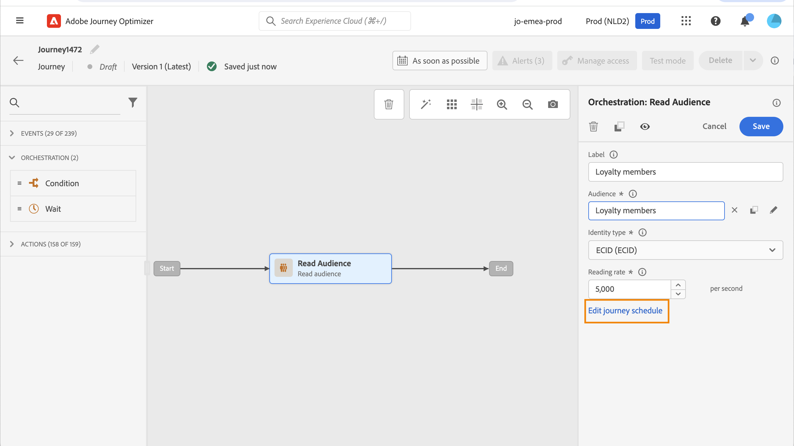
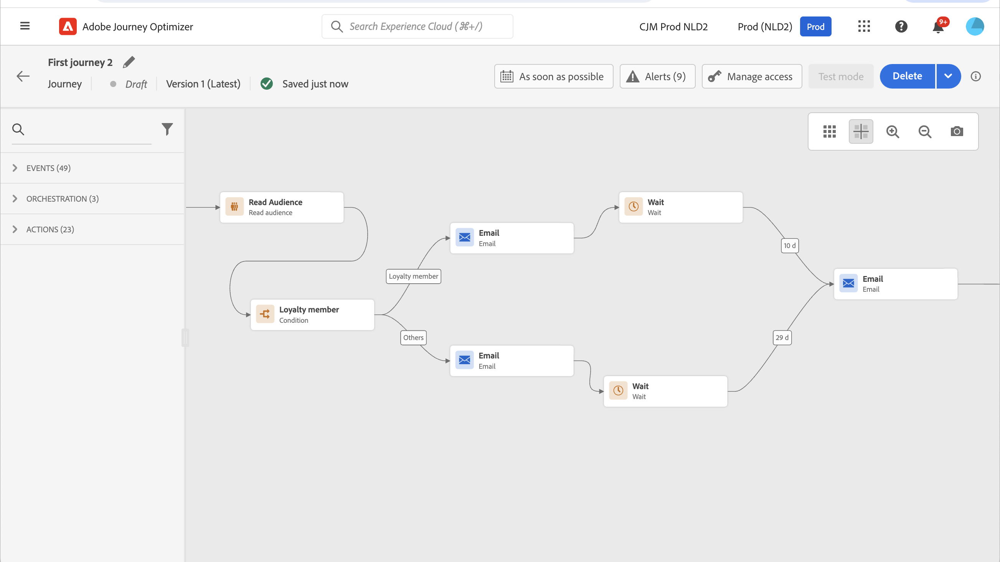

# Uso de una audiencia en un recorrido {#segment-trigger-activity}

## Añadir una actividad Generar público {#about-segment-trigger-actvitiy}

>[!CONTEXTUALHELP]
>id="ajo_journey_read_segment"
>title="Actividad Leer público"
>abstract="La actividad Leer público permite hacer que todos los particulares que pertenecen a un público de Adobe Experience Platform entren en un recorrido. La entrada en un recorrido puede realizarse una vez o de forma regular."

Utilice la actividad **Leer audiencia** para hacer que todos los individuos de una audiencia ingresen al recorrido. La entrada en un recorrido puede realizarse una vez o de forma regular.

Veamos como ejemplo la audiencia &quot;Cierre de compra y apertura de la aplicación Luma&quot; creada en el caso de uso [Crear audiencias](../audience/about-audiences.md). Con la actividad Leer audiencia, puede hacer que todas las personas que pertenecen a esta audiencia entren en un recorrido y se conviertan en recorridos individualizados que aprovecharán todas las funcionalidades del recorrido: condiciones, temporizadores, eventos y acciones.

➡️ [Descubra esta función en vídeo](#video)

## Lectura obligatoria {#must-read}

* Para los recorridos que usan una actividad **Leer audiencia**, hay un número máximo de recorridos que pueden comenzar al mismo tiempo. El sistema realizará los reintentos, pero evitará tener más de cinco recorridos (con **Leer audiencia**, programados o que se inicien &quot;lo antes posible&quot;) que empiecen al mismo tiempo. La práctica recomendada es difundirlas a lo largo del tiempo, por ejemplo, con una diferencia de 5 a 10 minutos.

* Los grupos de campos de evento de experiencia no se pueden usar en recorridos que comiencen por una actividad de **Leer audiencia**, una actividad de **[calificación de audiencia](audience-qualification-events.md)** o una actividad de evento empresarial.

* Como práctica recomendada, recomendamos que solo use audiencias por lotes en una actividad **Leer audiencia**. Esto proporciona un recuento fiable y coherente de las audiencias utilizadas en un recorrido. La audiencia de lectura está diseñada para casos de uso por lotes. Si su caso de uso necesita datos en tiempo real, utilice la actividad **[Calificación de audiencias](audience-qualification-events.md)**.

* Las audiencias [importadas desde un archivo CSV](https://experienceleague.adobe.com/docs/experience-platform/segmentation/ui/overview.html#import-audience) o resultantes de [flujos de trabajo de composición](../audience/get-started-audience-orchestration.md) se pueden seleccionar en la actividad **Leer audiencia**. Estas audiencias no están disponibles en la actividad **Calificación de audiencias**.

Las protecciones relacionadas con la actividad **Leer audiencia** se enumeran en [esta página](../start/guardrails.md#read-segment-g).

## Configuración de la actividad {#configuring-segment-trigger-activity}

Los pasos para configurar la actividad Leer audiencia son los siguientes:

1. Despliegue la categoría **[!UICONTROL Orchestration]** y suelte una actividad **[!UICONTROL Leer audiencia]** en el lienzo.

   La actividad debe colocarse como el primer paso de un recorrido.

1. Agregue una **[!UICONTROL Etiqueta]** a la actividad (opcional).

1. En el campo **[!UICONTROL Audiencia]**, elija una audiencia de Adobe Experience Platform que ingrese al recorrido y luego haga clic en **[!UICONTROL Guardar]**. Puede seleccionar cualquier audiencia de Adobe Experience Platform generada mediante [definiciones de segmento](../audience/creating-a-segment-definition.md).

   >[!NOTE]
   >
   >Además, también puede segmentar audiencias de Adobe Experience Platform creadas con [composiciones de audiencias](../audience/get-started-audience-orchestration.md) o [cargadas desde un archivo CSV](https://experienceleague.adobe.com/docs/experience-platform/segmentation/ui/overview.html#import-audience){target="_blank"}.

   Tenga en cuenta que puede personalizar las columnas mostradas en la lista y ordenarlas.

   

   Una vez agregada la audiencia, el botón **[!UICONTROL Copiar]** le permite copiar su nombre e ID:

   `{"name":"Luma app opening and checkout","id":"8597c5dc-70e3-4b05-8fb9-7e938f5c07a3"}`

   

   >[!NOTE]
   >
   >Solo las personas con los estados de participación de audiencia **Realized** y **Existing** entrarán en el recorrido. Para obtener más información sobre cómo evaluar una audiencia, consulte la [documentación del servicio de segmentación](https://experienceleague.adobe.com/docs/experience-platform/segmentation/tutorials/evaluate-a-segment.html#interpret-segment-results){target="_blank"}.

1. En el campo **[!UICONTROL Espacio de nombres]**, elija el espacio de nombres que desea utilizar para identificar a los individuos. De forma predeterminada, el campo está rellenado previamente con el último área de nombres utilizado. [Más información sobre áreas de nombres](../event/about-creating.md#select-the-namespace).

   >[!NOTE]
   >
   >Las personas que pertenecen a una audiencia que no tiene la identidad seleccionada (área de nombres) entre sus diferentes identidades no pueden entrar en el recorrido. Solo puede seleccionar un área de nombres de identidad basada en personas. Si ha definido un área de nombres para una tabla de búsqueda (por ejemplo: área de nombres ProductID para una búsqueda de productos), no estará disponible en la lista desplegable **Área de nombres**.

1. Establezca **[!UICONTROL tasa de lectura]**. Es el número máximo de perfiles que pueden entrar en el recorrido por segundo. Esta tasa se aplica solamente a esta actividad y a ninguna otra en el recorrido. Si desea definir una tasa de regulación en acciones personalizadas, por ejemplo, debe utilizar la API de regulación. Consulte [esta página](../configuration/throttling.md).

   Este valor se almacena en la carga útil de la versión de recorrido. El valor predeterminado es de 5000 perfiles por segundo. Puede modificar este valor de 500 a 20 000 perfiles por segundo.

   >[!NOTE]
   >
   >La tasa de lectura general por zona protegida se establece en 20 000 perfiles por segundo. Por lo tanto, la tasa de lectura de todas las audiencias de lectura que se ejecutan simultáneamente en la misma zona protegida suma como máximo 20 000 perfiles por segundo. No puede modificar este límite.

1. La actividad **[!UICONTROL Leer audiencia]** le permite especificar la hora a la que la audiencia ingresará al recorrido. Para ello, haga clic en el vínculo **[!UICONTROL Editar programación de recorrido]** para acceder a las propiedades del recorrido y, a continuación, configure el campo **[!UICONTROL Tipo de programador]**.

   

   De manera predeterminada, las audiencias ingresan al recorrido **[!UICONTROL Lo antes posible]**. Si desea que la audiencia introduzca el recorrido en una fecha/hora específica o de forma recurrente, seleccione el valor deseado en la lista.

   >[!NOTE]
   >
   >Tenga en cuenta que la sección **[!UICONTROL Programar]** solo está disponible cuando se ha colocado una actividad **[!UICONTROL Leer audiencia]** en el lienzo.

   

   Opción **Lectura incremental**: cuando se ejecuta por primera vez un recorrido con una **Audiencia de lectura** recurrente, todos los perfiles de la audiencia entran en el recorrido. Esta opción le permite dirigirse, después de la primera aparición, solo a las personas que ingresaron a la audiencia desde la última ejecución del recorrido.

       >[!NOTA]
       >
       >Si va a segmentar una [audiencia de carga personalizada](../audience/about-audiences.md#segments-in-recorrido-optimizer) en su recorrido, los perfiles solo se recuperan en la primera periodicidad si esta opción está habilitada en un recorrido recurrente, ya que estas audiencias están fijas.
   
   **Forzar reentrada en repetición**: esta opción le permite hacer que todos los perfiles que aún están presentes en el recorrido se cierren automáticamente en la siguiente ejecución. Por ejemplo, si tiene una espera de 2 días en un recorrido diario recurrente, al activar esta opción, los perfiles siempre se moverán en la siguiente ejecución de recorrido (por lo que al día siguiente), estén o no en la siguiente audiencia de ejecución. Si la duración de los perfiles en este recorrido puede ser mayor que la periodicidad, no active esta opción para asegurarse de que los perfiles puedan finalizar su recorrido.

<!--

### Segment filters {#segment-filters}

[!CONTEXTUALHELP]
>id="jo_segment_filters"
>title="About segment filters"
>abstract="You can choose to target only the individuals who entered or exited a specific segment during a specific time window. For example, you can decide to only retrieve all the customers who entered the VIP segment since last week."

You can choose to target only the individuals who entered or exited a specific segment during a specific time window. For example, you can decide to only retrieve all the customers who entered the VIP segment since last week. Only the new VIP customers will be targeted. All the customers who were already part of the VIP segment before will be excluded.

To activate this mode, click the **Segment Filters** toggle. Two fields are displayed:

**Segment membership**: choose whether you want to listen to segment entrances or exits. 

**Lookback window**: define when you want to start to listen to entrances or exits. This lookback window is expressed in hours, starting from the moment the journey is triggered.  If you set this duration to 0, the journey will target all members of the segment. For recurring journeys, it will take into account all entrances/exits since the last time the journey was triggered.

-->

>[!NOTE]
>
>Los recorridos de audiencia de lectura de una sola toma pasan al estado **Finalizado** 91 días ([tiempo de espera global de recorrido](journey-properties.md#global_timeout)) después de la ejecución del recorrido. Para audiencias de lectura programadas, son 91 días después de la ejecución de la última ocurrencia.

## Prueba y publicación del recorrido {#testing-publishing}

La actividad **[!UICONTROL Leer audiencia]** le permite probar el recorrido en un perfil unitario.

Para ello, active el modo de prueba.

Configure y ejecute el modo de prueba como de costumbre. [Aprenda a probar un recorrido](testing-the-journey.md).

Una vez que se esté ejecutando la prueba, el botón **[!UICONTROL Mostrar registros]** le permite ver los resultados de la prueba. Para obtener más información, consulte [esta sección](testing-the-journey.md#viewing_logs)

Una vez que las pruebas se hayan realizado correctamente, puede publicar el recorrido (consulte [Publicación del recorrido](publishing-the-journey.md)). Las personas que pertenezcan a la audiencia ingresarán al recorrido en la fecha y hora especificadas en la sección de propiedades del recorrido **[!UICONTROL Programador]**.

>[!NOTE]
>
>En el caso de los recorridos recurrentes basados en audiencias, la recorrido se cierra automáticamente una vez que se ejecuta la última ocurrencia. Si no se ha especificado una fecha/hora de finalización, tendrá que cerrar el recorrido a las nuevas entradas manualmente para finalizarlo.

## Segmentación de audiencias en recorridos basados en audiencias

Los recorridos basados en audiencias siempre comienzan con una actividad **Leer audiencia** para recuperar personas que pertenecen a una audiencia de Adobe Experience Platform.

La audiencia que pertenece a la audiencia se recupera una vez o de forma regular.

Después de entrar en el recorrido, puede crear casos de uso de orquestación de audiencia, lo que permite que las personas de la audiencia inicial fluyan a diferentes ramas del recorrido.

**Segmentación**

Puede usar condiciones para realizar la segmentación con la actividad **Condition**. VIP VIP Por ejemplo, puede hacer que las personas de la zona de trabajo tomen una ruta en particular y que no tengan un flujo de trabajo de la zona de trabajo de otra ruta de acceso que no sea de la zona de trabajo.

La segmentación se puede basar en:

* datos de fuente de datos
* el contexto de los eventos forma parte de los datos de recorrido, por ejemplo: ¿hizo una persona clic en el mensaje recibido hace una hora?
* una fecha, por ejemplo: ¿estamos en junio cuando una persona pasa por el recorrido?
* una hora, por ejemplo: ¿es por la mañana en la zona horaria de la persona?
* algoritmo que divide la audiencia que fluye en el recorrido en función de un porcentaje. Por ejemplo: 90 % - 10 % para excluir un grupo de control

**Exclusión**

La misma actividad **Condition** utilizada para la segmentación (ver arriba) también le permite excluir parte de la población. VIP Por ejemplo, puede excluir a las personas en cuestión haciendo que fluyan a una rama con un paso final justo después de la exclusión.

Esta exclusión puede producirse justo después de la recuperación de la audiencia, con fines de recuento de población o a lo largo de un recorrido de varios pasos.

**Unión**

Los recorridos le permiten crear N ramas y unirlas después de una segmentación.

Como resultado, puede hacer que dos audiencias vuelvan a una experiencia común.

Por ejemplo, después de seguir una experiencia diferente durante diez días en un recorrido VIP VIP, los clientes que no sean de la categoría de cliente y los de la categoría de cliente, pueden volver a la misma ruta de acceso que los demás clientes.

Después de una unión, puede volver a dividir la audiencia realizando una segmentación o una exclusión.

## Vídeo explicativo {#video}

Comprenda los casos de uso pertinentes para un recorrido que se desencadena por la actividad de lectura del público. Obtenga información sobre cómo crear recorridos basados en lotes y qué prácticas recomendadas aplicar.

>[!VIDEO](https://video.tv.adobe.com/v/3424997?quality=12)
