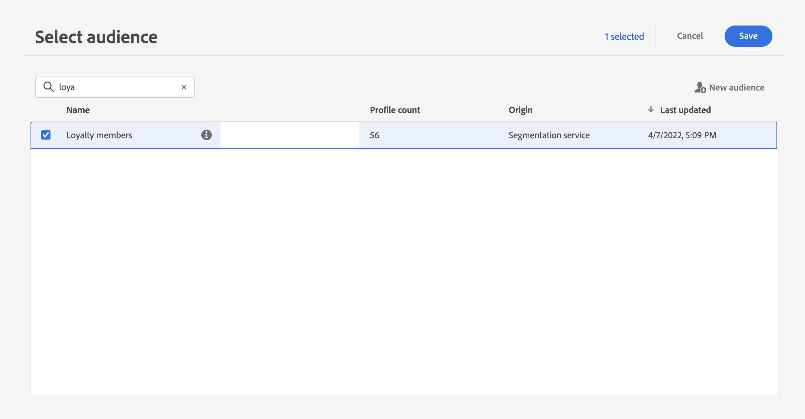

# Uso de segmentos en un recorrido {#segment-trigger-activity}

## Añadir una actividad Leer segmento {#about-segment-trigger-actvitiy}

>[!CONTEXTUALHELP]
>id="ajo_journey_read_segment"
>title="Actividad Leer segmento"
>abstract="La actividad Leer segmento permite hacer que todos los particulares que pertenecen a un segmento de Adobe Experience Platform participen en un recorrido. La entrada en un recorrido puede realizarse una vez o de forma regular."

Utilice el **Leer segmento** actividad para hacer que todas las personas de un segmento entren en el recorrido. La entrada en un recorrido puede realizarse una vez o de forma regular.

Veamos como ejemplo el segmento &quot;Apertura y cierre de compra de la aplicación de Luma&quot; creado en [Generar segmentos](../segment/about-segments.md) caso de uso. Con la actividad Leer segmento, puede hacer que todos los individuos que pertenecen a este segmento entren en un recorrido y los conviertan en recorridos individualizados que aprovecharán todas las funcionalidades del recorrido: condiciones, temporizadores, eventos, acciones.

>[!NOTE]
>
>Para los recorridos que utilizan una actividad Leer segmento, existe un número máximo de recorridos que pueden comenzar al mismo tiempo. El sistema realizará los reintentos, pero evite tener más de cinco recorridos (con Leer segmento, programados o que se inicien “lo antes posible”) que empiecen al mismo tiempo. Para ello, repártalos a lo largo del tiempo, por ejemplo, en intervalos de 5 y 10 minutos.
>
>Los grupos de campos de eventos de experiencia no se pueden utilizar en recorridos que comiencen por un segmento de lectura, una calificación de segmentos o una actividad de evento empresarial.

### Configuración de la actividad {#configuring-segment-trigger-activity}

Los pasos para configurar la actividad Leer segmento son los siguientes:

1. Despliegue el **[!UICONTROL Orquestación]** categoría y soltar una **[!UICONTROL Leer segmento]** actividad en el lienzo.

   La actividad debe colocarse como el primer paso de un recorrido.

1. Añadir un **[!UICONTROL Etiqueta]** a la actividad (opcional).

1. En el **[!UICONTROL Segmento]** , elija el segmento de Adobe Experience Platform que desea que entre en el recorrido y, a continuación, haga clic en **[!UICONTROL Guardar]**.

   Tenga en cuenta que puede personalizar las columnas mostradas en la lista y ordenarlas.

   >[!NOTE]
   >
   >Solo las personas con el **Realizado** y **Existente** los estados de participación en el segmento ingresarán al recorrido. Para obtener más información sobre cómo evaluar un segmento, consulte la [Documentación del Servicio de segmentación](https://experienceleague.adobe.com/docs/experience-platform/segmentation/tutorials/evaluate-a-segment.html#interpret-segment-results){target="_blank"}.

   

   Una vez agregado el segmento, la variable **[!UICONTROL Copiar]** permite copiar su nombre y su ID:

   `{"name":"Luma app opening and checkout",”id":"8597c5dc-70e3-4b05-8fb9-7e938f5c07a3"}`

   

1. En el **[!UICONTROL Área de nombres]** , elija el área de nombres que desea utilizar para identificar a los individuos. De forma predeterminada, el campo está rellenado previamente con el último área de nombres utilizado. [Más información sobre las Áreas de nombres](../event/about-creating.md#select-the-namespace).

   >[!NOTE]
   >
   >Las personas que pertenecen a un segmento que no tiene la identidad seleccionada (área de nombres) entre sus diferentes identidades no pueden entrar al recorrido. Solo puede seleccionar un área de nombres de identidad basada en personas. Si ha definido un área de nombres para una tabla de búsqueda (por ejemplo: área de nombres ProductID para una búsqueda Product), no estará disponible en la **Área de nombres** lista desplegable.

1. Configure las variables **[!UICONTROL Velocidad de limitación]** al límite de rendimiento de la actividad leer segmento.

   Este valor se almacena en la carga útil de la versión de recorrido. El valor predeterminado es de 5000 mensajes por segundo. Puede modificar este valor de 500 a 20 000 mensajes por segundo.

   >[!NOTE]
   >
   >La tasa de regulación general por zona protegida se establece en 20 000 mensajes por segundo. Por lo tanto, la tasa de regulación de todos los segmentos de lectura que se ejecutan simultáneamente en el mismo entorno limitado suman, como máximo, 20 000 mensajes por segundo. No puede modificar este límite.

1. El **[!UICONTROL Leer segmento]** La actividad de le permite especificar la hora a la que el segmento entrará en el recorrido. Para ello, haga clic en el **[!UICONTROL Editar programación de recorrido]** para acceder a las propiedades del recorrido y configurar el **[!UICONTROL Tipo de planificador]** field.

   

   De forma predeterminada, los segmentos entran en el recorrido **[!UICONTROL Lo antes posible]**. Si desea que el segmento introduzca el recorrido en una fecha/hora específica o de forma recurrente, seleccione el valor deseado en la lista.

   >[!NOTE]
   >
   >Tenga en cuenta que la variable **[!UICONTROL Programación]** La sección solo está disponible cuando **[!UICONTROL Leer segmento]** la actividad se ha eliminado del lienzo.

   

   Cuando un recorrido con un **Leer segmento** se ejecuta por primera vez, todos los perfiles del segmento entran en el recorrido. Utilice el **Lectura incremental** Opción para dirigirse, después de la primera aparición, solo a las personas que ingresaron al segmento desde la última ejecución del recorrido.

   Activación de la **Forzar reentrada en repetición** permite eliminar automáticamente todos los perfiles que estén actualmente en el recorrido durante la siguiente ejecución. Por ejemplo, si hay una espera de 2 días en un recorrido recurrente diario, al activar esta opción los perfiles se moverán de forma consistente a la siguiente ejecución de recorrido (al día siguiente), independientemente de si forman parte de la siguiente audiencia de ejecución. Sin embargo, si la duración de los perfiles en este recorrido puede superar la periodicidad, es aconsejable no habilitar esta opción para garantizar que los perfiles puedan completar su recorrido.

<!--

### Segment filters {#segment-filters}

[!CONTEXTUALHELP]
>id="jo_segment_filters"
>title="About segment filters"
>abstract="You can choose to target only the individuals who entered or exited a specific segment during a specific time window. For example, you can decide to only retrieve all the customers who entered the VIP segment since last week."

You can choose to target only the individuals who entered or exited a specific segment during a specific time window. For example, you can decide to only retrieve all the customers who entered the VIP segment since last week. Only the new VIP customers will be targeted. All the customers who were already part of the VIP segment before will be excluded.

To activate this mode, click the **Segment Filters** toggle. Two fields are displayed:

**Segment membership**: choose whether you want to listen to segment entrances or exits. 

**Lookback window**: define when you want to start to listen to entrances or exits. This lookback window is expressed in hours, starting from the moment the journey is triggered.  If you set this duration to 0, the journey will target all members of the segment. For recurring journeys, it will take into account all entrances/exits since the last time the journey was triggered.

-->

>[!NOTE]
>
>Los recorridos de segmentos de lectura de una sola toma pasan al estado Finalizado 30 días después de la ejecución del recorrido. Para segmentos de lectura programados, son 30 días después de la ejecución de la última ocurrencia.

### Prueba y publicación del recorrido {#testing-publishing}

El **[!UICONTROL Leer segmento]** La actividad de le permite probar el recorrido en un perfil unitario o en 100 perfiles de prueba aleatorios seleccionados entre los perfiles clasificados para el segmento.

Para ello, active la variable **modo de prueba**. A continuación, seleccione la opción que desee en el panel izquierdo.

A continuación, puede configurar y ejecutar el **modo de prueba** como siempre. [Obtenga información sobre cómo probar un recorrido](testing-the-journey.md).

Una vez que se esté ejecutando la prueba, el **[!UICONTROL Mostrar registros]** permite ver los resultados de la prueba según la opción de prueba seleccionada:

* **[!UICONTROL Perfil único a la vez]**: los registros de prueba muestran la misma información que al utilizar el modo de prueba unitario. Para obtener más información, consulte [esta sección](testing-the-journey.md#viewing_logs)

* **[!UICONTROL Hasta 100 perfiles a la vez]**: los registros de prueba permiten rastrear la progresión de la exportación de segmentos desde Adobe Experience Platform, así como el progreso individual de todas las personas que ingresaron al recorrido.

  Tenga en cuenta que probar el recorrido con hasta 100 perfiles a la vez no le permite rastrear el progreso de las personas en el recorrido mediante el flujo visual.

  

Una vez realizadas las pruebas correctamente, puede publicar el recorrido (consulte [Publicación del recorrido](publishing-the-journey.md)). Las personas que pertenezcan al segmento introducirán el recorrido en la fecha y hora especificadas en las propiedades del recorrido **[!UICONTROL Planificador]** sección.

>[!NOTE]
>
>En el caso de los recorridos recurrentes basados en segmentos, la recorrido se cerrará automáticamente una vez que se ejecute la última ocurrencia. Si no se ha especificado una fecha/hora de finalización, tendrá que cerrar el recorrido a las nuevas entradas manualmente para finalizarlo.

## Segmentación de audiencias en recorridos basados en segmentos

Los recorridos basados en segmentos siempre comienzan con una **Leer segmento** actividad para recuperar personas que pertenecen a un segmento de Adobe Experience Platform.

La audiencia que pertenece al segmento se recupera una vez o de forma regular.

Después de entrar en el recorrido, puede crear casos de uso de orquestación de audiencia, haciendo que las personas del segmento inicial fluyan a diferentes ramas del recorrido.

**Segmentación**

Puede utilizar condiciones para realizar la segmentación con el **Condición** actividad. VIP VIP Por ejemplo, puede hacer que las personas de la zona de trabajo tomen una ruta en particular y que no tengan un flujo de trabajo de la zona de trabajo de otra ruta de acceso que no sea de la zona de trabajo.

La segmentación se puede basar en:

* datos de fuente de datos
* el contexto de los eventos forma parte de los datos de recorrido, por ejemplo: ¿hizo una persona clic en el mensaje recibido hace una hora?
* una fecha, por ejemplo: ¿estamos en junio cuando una persona pasa por el recorrido?
* una hora, por ejemplo: ¿es por la mañana en la zona horaria de la persona?
* algoritmo que divide la audiencia que fluye en el recorrido en función de un porcentaje. Por ejemplo: 90 % - 10 % para excluir un grupo de control

**Exclusión**

Lo mismo **Condición** la actividad utilizada para la segmentación (ver arriba) también le permite excluir parte de la población. VIP Por ejemplo, puede excluir a las personas en cuestión haciendo que fluyan a una rama con un paso final justo después de la exclusión.

Esta exclusión podría producirse justo después de la recuperación del segmento, con fines de recuento de población o a lo largo de un recorrido de varios pasos.

**Union**

Los recorridos le permiten crear N ramas y unirlas después de una segmentación.

Como resultado, puede hacer que dos audiencias vuelvan a una experiencia común.

Por ejemplo, después de seguir una experiencia diferente durante diez días en un recorrido VIP VIP, los clientes que no sean de la categoría de cliente y los de la categoría de cliente, pueden volver a la misma ruta de acceso que los demás clientes.

Después de una unión, puede volver a dividir la audiencia realizando una segmentación o una exclusión.

