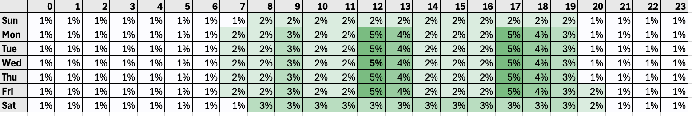

# Optimización del tiempo de envío{#send-time-optimization}

>[!BEGINSHADEBOX]

**En esta página:** Aprenda a habilitar la optimización del tiempo de envío para que la inteligencia artificial aplicada (IA) de Adobe prediga el mejor momento para enviar mensajes push y de correo electrónico en función del comportamiento histórico de apertura y clic de cada cliente.

>[!ENDSHADEBOX]

>[!CONTEXTUALHELP]
>id="jo_bestsendtime_disabled"
>title="Acerca de la optimización del tiempo de envío"
>abstract="La función de optimización del tiempo de envío de [!DNL Adobe Journey Optimizer], con tecnología de los servicios de IA de Adobe, puede predecir el mejor momento para enviar un mensaje push o de correo electrónico para maximizar la participación en función de las tasas históricas de apertura y clics."

>[!CONTEXTUALHELP]
>id="jo_bestsendtime_email"
>title="Activación de la optimización del tiempo de envío"
>abstract="Un botón de opción determina si se debe optimizar en las aperturas de correo electrónico o en las pulsaciones de correo electrónico. Los tiempos de envío utilizados por el sistema también pueden delimitarse con un valor para la opción Enviar dentro de la próxima opción."

>[!CONTEXTUALHELP]
>id="jo_bestsendtime_push"
>title="Activación de la optimización del tiempo de envío"
>abstract="Los mensajes push tienen por defecto la opción de apertura, ya que los clics no se aplican a la mensajería push. Los tiempos de envío utilizados por el sistema también pueden delimitarse con un valor para la opción Enviar dentro de la próxima opción."

La función de optimización del tiempo de envío de [!DNL Adobe Journey Optimizer], con tecnología de los servicios de IA de Recorrido de Adobe, elige la hora de envío óptima para los mensajes de correo electrónico y push para maximizar la participación de los clientes, en función de la apertura y el comportamiento de los clics históricos de sus clientes.

La optimización del tiempo de envío solo está disponible para los tipos de acción push y de correo electrónico integrados de Journey Optimizer, y no está disponible actualmente para los mensajes enviados mediante acciones personalizadas o para otros tipos de acción. La optimización del tiempo de envío solo está disponible para acciones push y de correo electrónico dentro de los Recorridos y, actualmente, no lo está para mensajes enviados a través de campañas.

>[!AVAILABILITY]
>
>* La característica Optimización del tiempo de envío está habilitada para [!DNL Adobe Journey Optimizer] clientes que la soliciten. Póngase en contacto con el Servicio de atención al cliente de Adobe o con su representante de Adobe para activar la función para su organización.
>
>* La optimización del tiempo de envío solo se aplica a los canales **Correo electrónico** y **Notificación push**.
>

## Utilizar optimización del tiempo de envío{#use-send-time-optimization}

Para habilitar y configurar la optimización del tiempo de envío en un correo electrónico o una acción push, siga los pasos a continuación.

Antes de empezar, considere qué mensajes encajan bien antes de activarlos. La optimización del tiempo de envío no debe utilizarse para mensajes operativos urgentes y urgentes, como una confirmación de pedido, una notificación de restablecimiento de contraseña o una notificación de cambio de puerta de vuelo. Funciona mejor para comunicaciones de marketing menos urgentes, como un anuncio semanal, información promocional sobre un nuevo producto o información sobre una venta de un mes.

1. En el Recorrido, abre el menú **[!UICONTROL Configurar acción]**.

   

1. Active el conmutador **[!UICONTROL Optimización del tiempo de envío]** en el menú Optimización del tiempo de envío.

   

1. En el caso de los mensajes de correo electrónico, seleccione la opción adecuada para optimizar las aperturas o las pulsaciones. Los mensajes push siempre están optimizados para las aperturas.

   Para obtener los mejores resultados, optimice la mayoría de los correos electrónicos para **Clics**. Elija **Aperturas** cuando el mensaje sea informativo y no esté pensado para dirigir una acción específica.

1. Para los mensajes de correo electrónico y push, establezca **[!UICONTROL Enviar en las próximas]** horas con el número máximo de horas (1-168) que el sistema esperará antes de enviar el mensaje.

   Para obtener los mejores resultados, elija un valor entre 6 y 24 horas. Un valor menor reduce el número de tiempos de envío disponibles y puede limitar el beneficio de la optimización del tiempo de envío. Un valor mayor puede significar que el mensaje está obsoleto o es menos relevante en el momento en que se envía.

   

1. En el caso de los mensajes de correo electrónico, elija cómo se configura el seguimiento de acciones. Puede rastrear las aperturas del correo electrónico y los clics en los vínculos y botones del correo electrónico.

Cuando el recorrido se activa y un cliente llega a la acción Enviar por correo electrónico o Push en el recorrido, la optimización del tiempo de envío elegirá el tiempo de envío mejor predicho disponible para cada usuario dentro de los límites especificados.

Para supervisar el rendimiento de su recorrido, consulte la [página de información general](../reports/channel-report-cja.md).

## Funcionamiento de la optimización del tiempo de envío {#how-send-time}

El modelo de optimización del tiempo de envío ingiere los datos de comportamiento de los clientes [!DNL Adobe Journey Optimizer] de su organización y examina los eventos abiertos a nivel de usuario y los eventos de clic para determinar cuándo es más probable que los clientes interactúen con la mensajería.

La optimización del tiempo de envío hace predicciones para cada hora de la semana, para cada usuario, en función de tres tipos de datos de comportamiento:

1. El comportamiento de los usuarios en general
1. El comportamiento de los usuarios similares en la misma zona horaria
1. El comportamiento de ese usuario individual

Estas predicciones se ponderan y combinan utilizando un enfoque bayesiano, lo que da como resultado un &quot;mapa de calor&quot; para cada métrica (aperturas de correo electrónico, clics de correo electrónico y aperturas push), para cada cliente, que indica las horas de la semana en las que es más probable que ponerse en contacto con ese usuario genere el resultado de participación deseado (apertura/clic), como se ilustra en el siguiente ejemplo de mapa de calor:

Si un usuario con las probabilidades predichas arriba está dirigido a un mensaje a las 9 a. m. del miércoles con la optimización del tiempo de envío activada y un tiempo de espera máximo de 7 horas, el tiempo de envío seleccionado para el mensaje será de 12 p. m.:

## Detalles de formación y puntuación del modelo de optimización del tiempo de envío  {#model-send-time}

Una vez habilitada la función Optimización del tiempo de envío para su organización, el modelo de IA de Recorrido recibe formación sobre los eventos de envío, apertura y clic en los correos electrónicos y push en todos los recorridos y acciones de la organización durante las últimas 16 semanas, independientemente de si esas acciones utilizan Optimización del tiempo de envío. Esto permite que la optimización del tiempo de envío se beneficie de todos los datos generados por sus clientes.

Los modelos se entrenan inicialmente y se puntúan semanalmente. Después de 16 semanas, los modelos se vuelven a entrenar y a anotar mensualmente. La puntuación de modelo incluye todos los perfiles de cliente, tanto los existentes como los nuevos desde la última ejecución de puntuación.

Los mensajes enviados por Optimización del tiempo de envío reciben un tiempo de envío de mensaje de &quot;exploración&quot; seleccionado para probar diferentes tiempos de envío y observar cómo responden los clientes, o un tiempo de envío de mensaje &quot;optimizado&quot; seleccionado para maximizar las tasas de clics/aperturas. El 5 % de los eventos de envío recibe un tiempo de envío de &quot;exploración&quot; y el 95 % de los eventos de envío están &quot;optimizados&quot;.

Los tiempos de envío de exploración se seleccionan al azar entre los tiempos de envío disponibles según el tiempo de espera máximo configurado. Por ejemplo, en el caso de que se seleccione un mensaje a las 9 a. m. del miércoles con la optimización del tiempo de envío activada y un tiempo de espera máximo de 3 horas, los tiempos de envío de la exploración para el mensaje se dividirán equitativamente entre las 9 a. m., las 10 a. m., las 11 a. m. y las 12 p. m.

## Preguntas frecuentes {#faq-send-time}

A continuación encontrará las preguntas más frecuentes sobre la optimización del tiempo de envío.

¿Necesita más información? Usa las opciones de comentarios de la parte inferior de esta página para plantear tu pregunta o conectar con la [[!DNL Adobe Journey Optimizer] comunidad](https://experienceleaguecommunities.adobe.com/t5/adobe-journey-optimizer/ct-p/journey-optimizer?profile.language=es){target="_blank"}.

+++¿Cuánto tiempo debo esperar antes de utilizar la optimización del tiempo de envío?

Su organización debe utilizar la acción Correo electrónico en Journey Optimizer durante un mínimo de 30 días antes de utilizar Optimización del tiempo de envío en Correo electrónico para permitir la recopilación de algunos eventos de envío, apertura y clic por correo electrónico.

Su organización debe utilizar la acción push dentro de Journey Optimizer durante un mínimo de 30 días antes de utilizar la optimización del tiempo de envío dentro de push para permitir la recopilación de algunos eventos de envío push y de apertura.

Si su organización ya ha estado utilizando los tipos de acción Correo electrónico o Push durante al menos 30 días, no es necesario que su organización espere más para utilizar la optimización del tiempo de envío después de que Adobe la haya habilitado. Los resultados seguirán mejorando a medida que su organización recopile datos durante un máximo de 16 semanas.

+++

+++¿Cómo puedo ver la hora de envío en la que un usuario en particular recibirá un mensaje?

Para minimizar el impacto del modelo en la riqueza de perfiles, las puntuaciones del modelo se almacenan comprimidas en 3 atributos de perfil almacenados en `_experience.intelligentServices.journeyAI.sendTimeOptimization` y no están diseñadas para ser legibles en lenguaje natural.

+++

+++¿Cuál es el beneficio promedio de la optimización del tiempo de envío?

La optimización del tiempo de envío puede aumentar la tasa de clics en los correos electrónicos y la tasa de apertura push en el rango de aproximadamente el 2 % al 10 % en todos los mensajes optimizados por una organización.

Por ejemplo, si una organización que envía correos electrónicos sin optimización del tiempo de envío tiene una tasa de clics del 5,0 % como promedio, el mismo conjunto de correos electrónicos con optimización del tiempo de envío podría generar una tasa de clics promedio de hasta el 5,5 % (5,0 % * (1+10 %) = 5,5 %).

Debido a la variabilidad dentro de los tamaños de muestra pequeños, es posible que no se pueda observar un beneficio de la optimización del tiempo de envío en los envíos de mensajes únicos.

Es más probable que las organizaciones obtengan mayores beneficios al utilizar la optimización del tiempo de envío cuando:

* Los recorridos existentes utilizan tiempos de envío fijos y no bien optimizados
* La variabilidad en el comportamiento del cliente (clics y aperturas) corresponde a la ubicación del cliente y a sus preferencias
* Las organizaciones utilizan la optimización del tiempo de envío en una fracción mayor de los mensajes push y de correo electrónico
* Las organizaciones eligen tiempos de espera máximos dentro del intervalo recomendado de 6 a 12 horas

+++

+++Siempre hago clic en correos electrónicos o mensajes push a las 12 p. m., ¿por qué el algoritmo no me envió un mensaje a las 12 p. m.?

Esto puede ocurrir por varias razones:

* El mensaje se ha seleccionado como un tiempo de envío de mensaje de &quot;Exploración&quot; en lugar de como un tiempo de envío de mensaje &quot;Optimizado&quot;.
* El comportamiento de los usuarios de similitud influyó en el modelo para recomendar otra hora de envío.

+++

+++¿Cómo conoce la optimización del tiempo de envío la zona horaria de un usuario?

La optimización del tiempo de envío usa el campo de perfil `timeZone` para determinar la zona horaria de un usuario. Si no está disponible para ese usuario, la optimización del tiempo de envío intenta deducir la zona horaria de un usuario de otra información geográfica en el perfil del usuario, como el país y el estado.

+++

+++¿La optimización del tiempo de envío enviará mensajes push a los usuarios durante la noche en su zona horaria local?

La optimización del tiempo de envío puede enviar mensajes push a los usuarios durante la noche en su zona horaria local en las siguientes circunstancias:

* Cuando los usuarios muestran un comportamiento que indica que es probable que interactúen con un mensaje enviado por la noche
* Cuando el modelo elija un tiempo de envío de &quot;Exploración&quot;

Para evitar el envío de mensajes push a los clientes durante la noche, programe los envíos de mensajes push por lotes para que se produzcan por la mañana o a primera hora de la tarde y elija una duración más corta para la optimización del tiempo de envío. (Por ejemplo, un tiempo de envío de 9 a. m. y un tiempo de espera máximo de 8 horas).

+++

+++ Referencia de conocimientos de AI

Esta sección contiene conocimientos estructurados destinados a apoyar la interpretación, la recuperación y la respuesta a preguntas relacionadas con este tema.

Para una comprensión completa, esta información debe combinarse con la documentación de esta página. Ninguna de las fuentes pretende ser independiente; la página describe la función, mientras que esta sección proporciona contexto adicional que ayuda a desambiguar la terminología, la intención, la aplicabilidad y las restricciones.

* **TL;DR:** En esta página se explica cómo configurar y utilizar la optimización del tiempo de envío en Adobe Journey Optimizer, una función con tecnología de IA que predice el mejor momento para enviar mensajes de correo electrónico o push a cada individuo a fin de maximizar la participación.

**Intenciones:**
* Habilitar la optimización del tiempo de envío en un correo electrónico o una acción push en un recorrido
* Elija si desea optimizar las aperturas o los clics en los mensajes de correo electrónico
* Establecer la ventana de espera máxima (Enviar en el siguiente) para el envío retrasado
* Comprender cómo el modelo de IA predice los tiempos de envío óptimos mediante datos de comportamiento
* Determine si la optimización del tiempo de envío es adecuada para un tipo de mensaje determinado

**Glosario:**
* **Optimización del tiempo de envío (STO)**: característica con tecnología de IA que retrasa la entrega de mensajes a cada perfil hasta la hora de participación óptima prevista dentro de un intervalo de tiempo configurado *(específico del producto)*
* **IA de Recorrido**: los servicios de IA de Adobe permiten la optimización del tiempo de envío en Journey Optimizer *(específico del producto)*
* **Tiempo de envío de exploración**: tiempo de envío seleccionado aleatoriamente (utilizado para el 5 % de los envíos) para probar diferentes tiempos y mejorar la precisión del modelo *(específico del producto)*
* **Tiempo de envío optimizado**: tiempo de envío predicho por el modelo seleccionado para maximizar las tasas de clics o de aperturas (utilizadas para el 95 % de los envíos) *(específico del producto)*
* **Enviar en el plazo de** siguientes: El número máximo de horas (1-168) que el sistema esperará antes de enviar el mensaje a un perfil determinado *(específico del producto)*

**Protecciones:**
* Adobe debe habilitar la optimización del tiempo de envío para la organización; póngase en contacto con el Servicio de atención al cliente de Adobe o con su representante de Adobe para activarla.
* La optimización del tiempo de envío solo se aplica a los canales de notificaciones push y de correo electrónico dentro de los Recorridos; no está disponible para campañas o acciones personalizadas.
* La organización debe haber utilizado acciones de correo electrónico o push en Journey Optimizer durante al menos 30 días antes de que la optimización del tiempo de envío produzca resultados significativos.
* No utilice Optimización del tiempo de envío para mensajes operativos urgentes o urgentes (por ejemplo, confirmaciones de pedidos, restablecimientos de contraseñas o cambios en las puertas de vuelo).
* El intervalo máximo de tiempo de espera es de 1 a 168 horas; el intervalo recomendado es de 6 a 24 horas para obtener los mejores resultados.
* Las puntuaciones de modelo se almacenan en atributos de perfil en `_experience.intelligentServices.journeyAI.sendTimeOptimization` y no son legibles en lenguaje natural.
* Los modelos se entrenan semanalmente inicialmente, luego se vuelven a entrenar y se vuelven a calificar mensualmente después de 16 semanas.

**Terminología:**
* Nombre canónico: Optimización del tiempo de envío — Acrónimo: STO — variantes: mejor tiempo de envío, inteligencia artificial aplicada al tiempo de envío, tiempo de envío inteligente
* Sinónimos: &quot;Optimización del tiempo de envío&quot; = &quot;tiempo de envío óptimo&quot; = &quot;tiempo de envío de IA&quot;
* No confunda: &quot;Tiempo de envío de exploración&quot; ≠ &quot;Tiempo de envío optimizado&quot; (la exploración es aleatoria para las pruebas de modelos; la optimización se predice según el modelo para la participación).

**PREGUNTAS MÁS FRECUENTES:**
* **Q: ¿Qué canales admiten la optimización del tiempo de envío?** — Solo los canales de correo electrónico y notificaciones push dentro de los Recorridos; no se admiten campañas y acciones personalizadas.
* **Q: ¿Debo optimizar para aperturas o clics en correos electrónicos?** — Optimizar para clics para la mayoría de los correos electrónicos. Elija Abre cuando el mensaje es informativo y no está pensado para dirigir una acción específica.
* **Q: ¿Cuánto tiempo debe esperar la organización antes de habilitar STO?** — Se necesitan al menos 30 días de uso de correo electrónico o push en Journey Optimizer para recopilar datos de comportamiento suficientes. Los resultados continúan mejorando hasta 16 semanas.
* **Q: ¿Puede STO enviar notificaciones push por la noche?** — Sí, si el comportamiento de un usuario sugiere una participación nocturna o si se selecciona una hora de envío de exploración. Para evitarlo, utilice un tiempo de envío matutino con una breve ventana de espera máxima.
* **Q: ¿Cuál es el beneficio esperado de la optimización del tiempo de envío?** — Mejora de aproximadamente el 2-10 % en la tasa de clics por correo electrónico o la tasa de apertura push en todos los mensajes optimizados, aunque los beneficios pueden no observarse en envíos de pequeño volumen individuales.

+++

