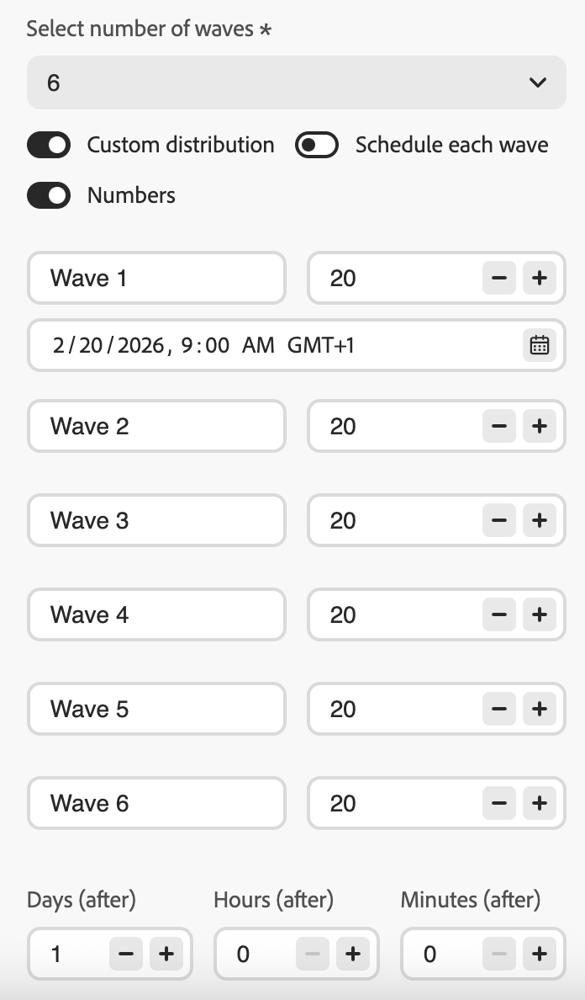

# Envío mediante olas en los recorridos {#send-using-waves-journeys}

>[!BEGINSHADEBOX]

**En esta página:** Aprenda a enviar mensajes salientes desde un recorrido de audiencia de lectura en lotes programados, llamados olas, para equilibrar la carga, proteger los sistemas descendentes y admitir la entrega.

>[!ENDSHADEBOX]

Puede enviar mensajes salientes desde un recorrido en lotes (olas) a lo largo del tiempo en lugar de todos a la vez. El envío de ondas ayuda a equilibrar la carga, evitar sistemas descendentes abrumadores (como centros de llamadas o páginas de aterrizaje) y admite la capacidad de envío y la reputación del remitente, especialmente para recorridos de audiencia de lectura de gran volumen.

<!--
>[!CAUTION]
>
>Wave sending is available for read audience journeys only and applies to **outbound** actions only (Email, SMS, Push, Direct mail).
-->

Puede configurarlo en el nivel de recorrido cuando define cómo entra la audiencia y cómo se programan las acciones. Se define el número de olas, su tamaño (como porcentaje de la audiencia o como números absolutos) y cuándo se ejecuta cada ola.

## Limitaciones y barreras {#limitations-guardrails}

* El envío de ondas solo está disponible para recorridos de audiencia de lectura con los tipos de programador **[!DNL As soon as possible]** y **[!UICONTROL Once]**. Más información sobre la [programación de recorrido](read-audience.md#schedule).
* El envío de ondas no está disponible para recorridos recurrentes, activados por eventos, de evento empresarial, de modo de prueba o de ejecución en seco.
* Debe definir al menos **2 olas** y puede agregar **10 ondas**.
* El intervalo mínimo entre el inicio de dos olas es de **30 minutos**.
* No se puede iniciar una ola antes del inicio del recorrido o en el pasado.
* Dividir la audiencia en olas puede tardar hasta 1 hora. Es posible que los perfiles no entren en el recorrido hasta entonces.
* Dentro de una sola versión de recorrido, dos olas nunca se ejecutan al mismo tiempo. La siguiente ola comienza solo después de que haya finalizado la anterior. Por ejemplo, si las olas se programan con una diferencia de 1 hora pero la primera ola se ejecuta durante 2 horas, la segunda ola se inicia cuando finaliza la primera ola, no a su hora programada.
* Los inicios de ola se pueden retrasar cuando la plataforma aplica límites de cuota o cuando la capacidad del sistema está bajo una carga pesada.

## Configuración del envío de ondas en un recorrido {#configure-wave-sending}

1. Inicie el recorrido con una actividad [Leer audiencia](read-audience.md).

1. Haga doble clic en la actividad **[!UICONTROL Leer audiencia]** para abrir sus propiedades y seleccione la opción **[!UICONTROL Enviar acción de recorrido en olas]**.

   {width="100%"}

1. Establezca el **número de olas** (por ejemplo, 4).

   {width="80%"}

   >[!NOTE]
   >
   >Se deben definir al menos 2 olas y se pueden añadir hasta 10.

1. Elija cómo definir el tamaño y el tiempo de la onda como se detalla a continuación.

### Olas iguales {#equal-waves}

De forma predeterminada, la audiencia se divide en olas de igual tamaño. Establezca un intervalo fijo entre el inicio de cada ola (por ejemplo, 2 horas).

{width="70%"}

>[!NOTE]
>
>El intervalo mínimo entre el inicio de dos olas es de **30 minutos**.

A continuación, el sistema programa automáticamente las olas siguientes (por ejemplo, la primera ola a las 9:00 AM, la segunda a las 11:00 AM, la tercera a las 1:00 PM y la cuarta a las 3:00 PM).

### Distribución personalizada {#custom-distribution}

Seleccione la opción **[!UICONTROL Distribución personalizada]** para definir el tamaño de cada ola como un porcentaje de la audiencia total (por ejemplo, 15%, 20%, 25%, 40%).

{width="70%"}

Seleccione **[!UICONTROL Números]** para definir el tamaño de cada ola como un número absoluto de perfiles (por ejemplo, 10 000; 50 000).

{width="70%"}

>[!NOTE]
>* Al utilizar porcentajes, todas las olas deben sumar el 100%. Si no es así, se muestra una advertencia.
>* Cuando se usan números, el sistema no valida la cobertura; asegúrese de que los tamaños de onda cubran la audiencia a la que va dirigida. [Más información](#faq)

### Programación personalizada {#custom-schedule}

Seleccione **[!UICONTROL Programar cada ola]** para definir una fecha y hora de inicio específicas para cada ola. Las olas no necesitan espaciarse uniformemente (por ejemplo, 9:00 a.m., 11:00 a.m., 5:00 p.m., 8:30 p.m.).

{width="70%"}

>[!NOTE]
>
>El intervalo mínimo entre el inicio de dos olas es de **30 minutos**.

## Casos de uso {#use-cases}

El envío de ondas le ayuda a controlar cuándo y cuántos mensajes se emiten, lo que puede mejorar la capacidad de envío, proteger la reputación del remitente y alinear los envíos con su capacidad operativa. Considere la posibilidad de utilizar olas en estos escenarios:

* **Centro de llamadas o administración de respuestas:** Limite la cantidad de mensajes que se emiten por día o por hora para que los equipos intermedios (por ejemplo, el Servicio de atención al cliente) puedan administrar las respuestas. Por ejemplo, envíe 20 mensajes al día para que coincidan con la capacidad del centro de llamadas.

  {width="55%"}

* **Alto volumen y capacidad de entrega:** Evite enviar un recorrido muy grande de una sola vez. Distribuya la entrega a lo largo del tiempo para ayudar a mantener la reputación del remitente y reducir el riesgo de ser marcado como correo no deseado.

  {width="55%"}

* **Aumento progresivo:** Al usar una nueva plataforma o IP, aumente progresivamente el volumen (por ejemplo, 10% en la primera ola, luego 15%, 20%, etc.) para generar reputación de forma gradual.

  {width="55%"}

## Preguntas frecuentes {#faq}

+++ ¿Qué sucede si la suma de los tamaños de onda no es igual a la audiencia total?

* Si la suma de los tamaños de ola **supera** la audiencia (por ejemplo, programa 100 000 en la primera ola para una audiencia de 100 000), la primera ola se enviará a la audiencia completa y las olas restantes no tendrán a nadie a quien enviar; no se ejecutarán.
* Si la suma **es menor que la audiencia (por ejemplo, si define cuatro olas que suman un total de 40 000 perfiles para una audiencia de 100 000), solo los perfiles incluidos en esas olas recibirán el mensaje.** El resto de la audiencia no recibirá la comunicación y no se volverá a intentar usarla en olas posteriores.

+++

+++ ¿Puedo asignar diferentes segmentos o criterios a olas individuales?

Solo se puede definir el tamaño y el tiempo de las olas. La misma audiencia fluye a través del recorrido; no se pueden asignar segmentos o criterios diferentes a olas individuales.

+++

## Consulte también {#see-also}

* [Usar una audiencia en un recorrido](read-audience.md): configure la actividad Leer audiencia.

+++ Referencia de conocimientos de AI

Esta sección contiene conocimientos estructurados destinados a apoyar la interpretación, la recuperación y la respuesta a preguntas relacionadas con este tema.

Para una comprensión completa, esta información debe combinarse con la documentación de esta página. Ninguna de las fuentes pretende ser independiente; la página describe la función, mientras que esta sección proporciona contexto adicional que ayuda a desambiguar la terminología, la intención, la aplicabilidad y las restricciones.

* **TL;DR:** En esta página se explica cómo configurar el envío de oleadas en recorridos de audiencia de lectura de Adobe Journey Optimizer para que entregue mensajes salientes en lotes controlados a lo largo del tiempo, lo que mejora la capacidad de envío y protege la reputación del remitente.

**Intenciones:**
* Habilite el envío de ondas en un recorrido Leer audiencia para enviar mensajes por lotes
* Configurar ondas iguales con un intervalo fijo entre cada ola
* Definir tamaños de onda personalizados como porcentajes o recuentos de perfiles absolutos
* Programe cada ola con una fecha y hora de inicio específicas mediante una programación personalizada
* Controle el volumen de entrega para proteger la reputación del remitente o alinearlo con la capacidad operativa

**Glosario:**
* **Envío de ondas**: Modo de envío que divide la audiencia de lectura en lotes (olas) y envía mensajes a cada lote a intervalos programados en lugar de a la vez *(específico del producto)*
* **Olas iguales**: Una configuración de ola en la que la audiencia se divide en partes de igual tamaño con un intervalo fijo entre inicios de ola *(específico del producto)*
* **Distribución personalizada**: una configuración de ola en la que el tamaño de cada ola se define manualmente como porcentaje o número absoluto de perfiles *(específicos del producto)*
* **Programación personalizada**: Una configuración de ola en la que cada ola tiene una fecha y hora de inicio específicas, lo que permite un espaciado no uniforme *(específico del producto)*

**Protecciones:**
* El envío de ondas solo está disponible para recorridos de audiencia de lectura con los tipos de programador &quot;Lo antes posible&quot; y &quot;Una vez&quot;; no está disponible para recorridos recurrentes, activados por eventos, de evento empresarial, de modo de prueba o de ejecución en seco.
* Deben definirse un mínimo de 2 olas y un máximo de 10.
* El intervalo mínimo entre el inicio de dos olas consecutivas es de 30 minutos.
* No se puede establecer un tiempo de inicio de ola antes del inicio del recorrido o en el pasado.
* Dividir la audiencia en olas puede tardar hasta 1 hora; es posible que los perfiles no entren hasta entonces.
* En una sola versión de recorrido, dos olas nunca se ejecutan simultáneamente; la siguiente ola comienza solo después de que la anterior finalice.
* Los inicios de ola se pueden retrasar por los límites de cuota de plataforma o por la carga pesada del sistema.
* Al utilizar la distribución personalizada basada en porcentajes, todas las olas deben sumar el 100 %.
* Cuando se utiliza la distribución personalizada basada en números, el sistema no valida la cobertura total; el usuario debe asegurarse de que los tamaños de ola cubran la audiencia deseada.
* Si el tamaño de las olas supera a la audiencia, la primera ola se envía a la audiencia completa y las olas restantes no se ejecutan.
* Si el tamaño de las olas es menor que la audiencia, solo los perfiles de las olas definidas reciben el mensaje; el resto no se vuelve a intentar.

**Terminología:**
* Nombre canónico: Envío de ondas — Acrónimo: none — variantes: envío por lotes, envío basado en ondas, envío por fases
* Sinónimos: &quot;waves&quot; = &quot;batches&quot; = &quot;delivery phases&quot;
* No confunda: &quot;Envío de ondas&quot; ≠ &quot;recorrido recurrente&quot; (el envío de ondas divide una sola audiencia leída en lotes cronometrados; los recorridos recurrentes vuelven a leer la audiencia según una programación).

**PREGUNTAS MÁS FRECUENTES:**
* **Q: ¿Se puede usar el envío de ondas en recorridos recurrentes?** — No; el envío de ondas solo está disponible para recorridos de audiencia de lectura con el tipo de programador &quot;Lo antes posible&quot; o &quot;Una vez&quot;.
* **Q: ¿Cuál es el tiempo mínimo entre dos olas?** — 30 minutos entre el inicio de dos olas consecutivas.
* **Q: ¿Qué sucede si el tamaño total de mis olas es superior al de la audiencia?** — La primera ola envía a la audiencia completa y las olas siguientes no tienen perfiles a los que enviar; no se ejecutan.
* **Q: ¿Puedo asignar contenido o segmentos diferentes a olas individuales?** — No; todas las olas utilizan la misma audiencia y el mismo contenido de recorrido. Solo se puede personalizar el tamaño y el tiempo por ola.
* **Q: ¿Cuántas olas puedo configurar?** — Entre 2 y 10 olas por recorrido.
* **Q: ¿Cuándo debo usar el envío de ondas?** — Utilícelo para proteger la reputación del remitente para envíos de gran volumen, alinear la entrega con la capacidad del equipo descendente (por ejemplo, centros de llamadas) o aumentar progresivamente el volumen en una nueva IP o plataforma.

+++
