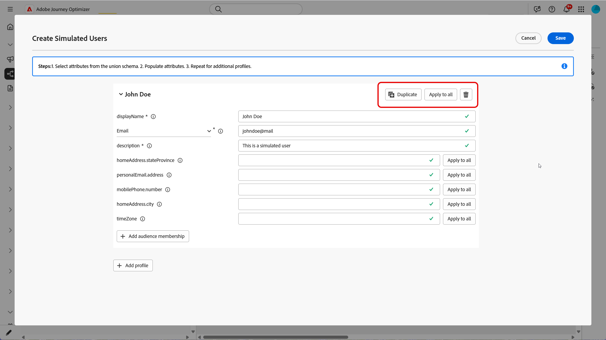
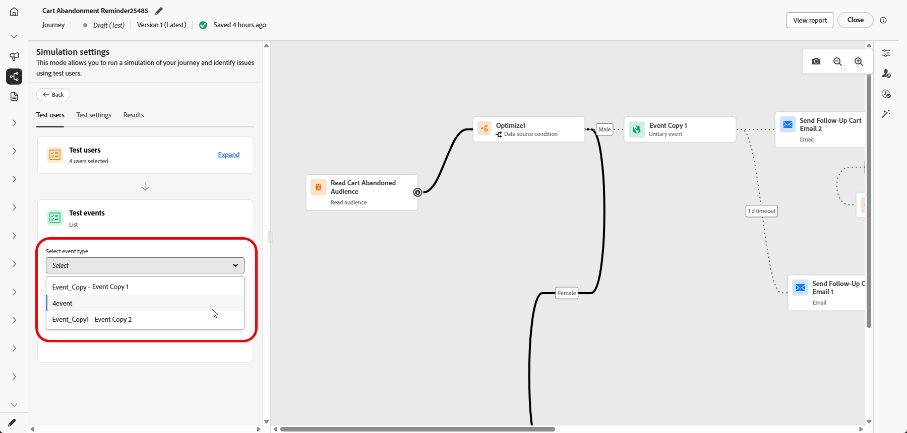

# Simulación del recorrido{#simulate-journey}

Use **[!UICONTROL Simulación]** para validar su recorrido con **usuarios simulados** antes de publicar. Esta página lo acompaña en **[!UICONTROL simulación rápida]** y **[!UICONTROL simulación manual]**, creando y enviando usuarios simulados, activando eventos unitarios cuando el recorrido los necesita y revisando el registro de **[!UICONTROL Resultados]**.

Para obtener información general por tipo de recorrido, consulte [Introducción a la simulación de Recorrido](simulate-journey-gs.md).

## Tipos de simulación {#simulation-types}

Después de la activación, los recorridos por lotes con la entrada de audiencia de lectura ofrecen dos formas de ejecutar una simulación:

* **[!UICONTROL Simulación rápida]** se ejecuta de extremo a extremo con usuarios generados y valores predeterminados. Tenga en cuenta que la simulación rápida no está disponible con recorridos unitarios.

* La **[!UICONTROL simulación manual]** le permite elegir usuarios, enviar pedidos, cargas útiles de eventos y anular las esperas paso a paso.

### Simulación rápida {#quick-simulation}

En un recorrido por lotes en **[!UICONTROL Simulación]**, **[!UICONTROL Simulación rápida]** ejecuta el recorrido con los usuarios generados y la configuración precargada.

1. Seleccione **[!UICONTROL Simulación rápida]**.

1. Revise los campos recopilados por Adobe Journey Optimizer para la ejecución. Haga clic en **[!UICONTROL Actualizar valores]** para cambiar la configuración de prueba o canal, o bien continúe sin cambios.

   

1. Si ha abierto **[!UICONTROL Actualizar valores]**, edite la configuración, por ejemplo, la dirección utilizada para las pruebas de mensajes, y confirme que desea iniciar la simulación.

   

1. Adobe Journey Optimizer genera usuarios simulados a partir de la definición del recorrido y almacena en déclencheur a cada usuario en el recorrido.

1. Cuando finalice la ejecución, haga clic en **[!UICONTROL Ver resultados]** para revisar las rutas, los errores y las ramas descubiertas. Ver [Ver resultados](#viewing-results).

   

### Simulación manual {#manual-simulation}

Elija **[!UICONTROL Simulación manual]** cuando necesite elegir cada usuario simulado, controlar el envío de pedidos, configurar las cargas de evento y anular las duraciones de **[!UICONTROL Espera]** durante la ejecución. Este flujo se aplica a los recorridos por lotes y unitarios.

Continúe con [Crear y administrar usuarios simulados](#test-users), [almacenar en Déclencheur sus eventos](#firing_events) y [Ver resultados](#viewing-results).

## Creación y administración de usuarios simulados {#test-users}

>[!IMPORTANT]
>
>Necesita al menos uno de los siguientes permisos para acceder a la función **[!UICONTROL Simulation]**: **Simular recorridos**, **Publicar recorridos** o **Aprobar y publicar recorridos**. [Más información](../administration/permissions.md)

Los usuarios simulados son entidades temporales similares a un perfil que usted define en **[!UICONTROL Configuración de simulación]**. En esta sección se explica cómo crearlos, guardarlos para reutilizarlos, ajustarlos o eliminarlos de la lista y enviarlos al recorrido.

1. Comience por rellenar la lista **[!UICONTROL Usuarios de prueba]**:

   +++ Generación de usuarios con IA

   Adobe Journey Optimizer genera un conjunto de usuarios simulados a partir de la definición del recorrido.

   En el caso de los recorridos con un nodo de correo electrónico o SMS, la API le solicita que confirme la dirección de correo electrónico o el número de teléfono que debe utilizar. Una vez finalizado, haga clic en **[!UICONTROL Generar]**.

   

   +++

   +++ Examinar inventario

   Elija **[!UICONTROL Examinar inventario]** para agregar usuarios simulados que ya guardó, por ejemplo, usuarios que creó a partir de un formulario o JSON, o usuarios que mantuvo después de que se ejecutara una generación de IA.

   

   +++

   +++ Crear desde formulario

   1. Escriba **[!UICONTROL Nombre para mostrar]** y **[!UICONTROL Descripción]** para identificar a este usuario simulado.

      

   1. A continuación, seleccione los atributos del esquema de unión que desee rellenar para este usuario.

   1. Haga clic en **[!UICONTROL Agregar pertenencia a audiencia]** para simular las pertenencias a segmentos.

   1. Haga clic en **[!UICONTROL Agregar perfil]** para crear varios usuarios simulados en una sola sesión.

   1. En el menú, use **[!UICONTROL Duplicar]** para copiar un usuario, **[!UICONTROL Aplicar a todos]** para copiar los atributos de un usuario a todos los demás usuarios de la sesión o **[!UICONTROL Eliminar]** para eliminar un usuario.

      

   1. Haga clic en **[!UICONTROL Guardar]** cuando termine de configurar usuarios en esta sesión.

   +++

   +++ Crear a partir de JSON

   Defina nuevos usuarios simulados actualizando los campos correspondientes con los datos de usuario simulados.

   

   +++

1. Los usuarios simulados que creó aparecen en la lista **[!UICONTROL Usuarios de prueba]**. Para cada entrada, seleccione una de las siguientes opciones:

   * : Actualice los detalles del usuario simulado.
   * : ejecute la simulación solo para este usuario simulado.
   * : Quitar al usuario de esta lista. El usuario simulado no se elimina y permanece disponible en la selección Usuarios simulados.

   

1. Para cambiar la lista después de su selección, haga clic en **[!UICONTROL Administrar usuarios]** para agregar más usuarios simulados, desde el inventario o creando nuevos usuarios. Para eliminar a todos los usuarios de la lista **[!UICONTROL Usuarios de prueba]** para esta ejecución, elija **[!UICONTROL Borrar todos los usuarios]**.

   

1. Si el recorrido incluye una actividad **[!UICONTROL Wait]**, abra la pestaña **[!UICONTROL Test settings]** para ajustar el tiempo de espera durante la simulación. Por ejemplo, si la actividad **[!UICONTROL Wait]** activa está configurada durante varios días, puede anularla a 10 segundos, de modo que el usuario simulado solo pase ese tiempo en el nodo antes de pasar a la siguiente actividad.

1. Haga clic en **[!UICONTROL Enviar todo]** para enviar a todos los usuarios simulados de la lista al recorrido, o haga clic en  en una fila para enviar solamente a ese usuario. Aparece un mensaje de confirmación `Simulated users have entered the journey successfully.` cuando los usuarios simulados entran correctamente en el recorrido.

   

1. Si el recorrido incluye eventos unitarios, debe seleccionar el evento que desea almacenar en déclencheur. Ver [Déclencheur tus eventos](#firing_events).

1. Acceda a la ficha **[!UICONTROL Resultados]** para abrir el registro de ejecución y revisar cómo se ejecutó cada paso. Para obtener más información, vea [Ver resultados](#viewing-results).

Después de validar el recorrido en **[!UICONTROL Simulation]**, revise el registro de **[!UICONTROL Results]**. Si aparecen errores, deje **[!UICONTROL Simulation]**, aplique los cambios necesarios al recorrido y ejecute **[!UICONTROL Simulation]** de nuevo hasta que la ejecución parezca correcta. A continuación, puede publicar el recorrido. Ver [Publicar tu recorrido](../building-journeys/publish-journey.md).

## Activación de eventos {#firing_events}

Si el recorrido incluye uno o más eventos unitarios, se almacenan en déclencheur mientras Simulación está activa.

1. En **[!UICONTROL Seleccionar tipo de evento]**, seleccione el evento que se activará para esta simulación.

   

1. Para aplicar el mismo cambio a todos los usuarios de la lista, usa la opción **[!UICONTROL Administrar eventos]** para lo siguiente:

   * **[!UICONTROL Generar valores de evento]** para permitir que Adobe Journey Optimizer genere la carga útil mediante IA. Cuando se generan los valores, el usuario se marca **[!UICONTROL Listo para enviar]**.
   * **[!UICONTROL Editar fecha del evento]** para cambiar la carga útil solo para ese usuario simulado.

   

1. Configure la carga útil de evento para cada usuario al hacer clic en  junto a un usuario para lo siguiente:

   * **[!UICONTROL Generar valores de evento]** para permitir que Adobe Journey Optimizer genere la carga útil mediante IA. Cuando se generan los valores, el usuario se marca **[!UICONTROL Listo para enviar]**.
   * **[!UICONTROL Editar fecha del evento]** para cambiar la carga útil solo para ese usuario simulado.

   

1. En **[!UICONTROL Eventos de prueba]**, seleccione **[!UICONTROL Enviar todo]** para enviar a todos los usuarios simulados enumerados en **[!UICONTROL Usuarios de prueba]** al recorrido, o seleccione  para que un solo usuario ejecute la simulación solo para ese usuario.

   

1. Una vez activados los eventos, el lienzo se actualiza para reflejar la progresión de cada usuario. Haga clic en cualquier fila de la lista **[!UICONTROL Usuarios de prueba]** para ver la nueva ruta que tomó el usuario a través del recorrido.

1. Acceda a la ficha **[!UICONTROL Resultados]** para abrir el registro de ejecución y revisar cómo se ejecutó cada paso. Para obtener más información, vea [Ver resultados](#viewing-results).

## Visualización de resultados {#viewing-results}

La pestaña **[!UICONTROL Results]** le permite ver los resultados de la prueba. En el menú desplegable **[!UICONTROL Usuario de prueba]**, seleccione el usuario simulado cuya ejecución desee inspeccionar.

Seleccione **[!UICONTROL Todos]** para ver los resultados agregados en todos los usuarios simulados de la ejecución. Esta vista le ayuda a analizar la simulación completa de un vistazo, las actividades, los resultados y los errores, sin necesidad de seleccionar primero un solo usuario simulado.

Para cada actividad, el &quot;log&quot; puede mostrar si el usuario que ha realizado la simulación ha entrado o salido del paso, así como los errores que se han producido durante la simulación.

Para las actividades **Wait**, el registro incluye dos valores relacionados con la duración:

* **Duración definida**: La duración especificada en la actividad **Esperar** para el recorrido publicado y aplicada una vez que el recorrido esté activo. El registro registra si la simulación aplica una anulación desde la configuración de la prueba, por ejemplo 10 segundos, en lugar de depender únicamente del valor definido en el recorrido.
* **Duración real**: El tiempo que el usuario simulado permaneció en la actividad **Esperar**. Este valor se establece desde la ficha **[!UICONTROL Configuración de pruebas]**.

Cuando aparezcan errores en el registro, deje **Simulation**, aplique los cambios necesarios al recorrido y ejecute **Simulation** de nuevo. Una vez completada la validación, publique el recorrido. Ver [Publicar tu recorrido](../building-journeys/publish-journey.md).
