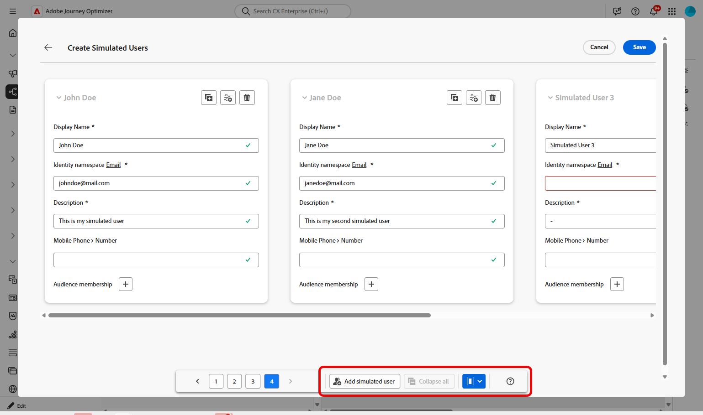
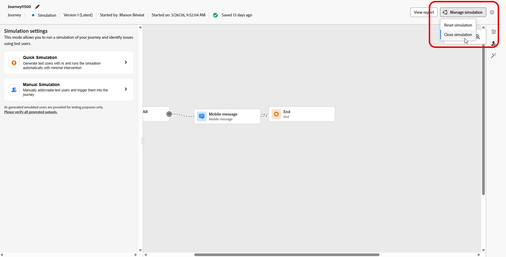

# Simulación del recorrido {#simulate-journey}

>[!BEGINSHADEBOX]

**En esta página:** Aprenda a ejecutar la simulación rápida y la simulación manual con usuarios simulados para validar las rutas de recorrido y revisar los resultados antes de publicar.

>[!ENDSHADEBOX]

>[!IMPORTANT]
>
>* Para usar **[!UICONTROL Simulation]**, asigne al menos un permiso de la funcionalidad **[!UICONTROL Recorrido]**: **Simular recorridos**, **Publicar recorridos** o **Aprobar y publicar recorridos**. Los mismos permisos le permiten crear y administrar usuarios simulados; los permisos de **[!UICONTROL Usuarios simulados]** no son necesarios. [Más información](../administration/permissions.md)
>
>* Para administrar usuarios simulados sin **[!UICONTROL Simulation]**, asigne a **Administrar usuarios simulados** o **Ver usuarios simulados** desde la funcionalidad **[!UICONTROL Simulated Users]**.
>
>* Para IA en simulación (**[!UICONTROL Simulación rápida]**, usuarios generados por IA, **[!UICONTROL Generar valores de evento]**), asigne **[!UICONTROL Generar contenido]** desde la capacidad **[!UICONTROL Asistente de IA]**.

Use **[!UICONTROL Simulación]** para validar su recorrido con **usuarios simulados** antes de publicar. Esta página lo acompaña en **[!UICONTROL simulación rápida]** y **[!UICONTROL simulación manual]**, creando y enviando usuarios simulados, activando eventos unitarios cuando el recorrido los necesita y revisando el registro de **[!UICONTROL Resultados]**.

Para obtener información general por tipo de recorrido, consulte [Introducción a la simulación de Recorrido](simulate-journey-gs.md).

## Tipos de simulación {#simulation-types}

Después de la activación, los recorridos por lotes con la entrada de audiencia de lectura ofrecen dos formas de ejecutar una simulación:

* **[!UICONTROL Simulación rápida]** se ejecuta de extremo a extremo con usuarios generados, valores de eventos generados y configuraciones de pruebas predeterminadas, con tecnología Journey Agent. Es una forma rápida de simular un recorrido de principio a fin con una intervención mínima. La simulación rápida se inicia en cuanto se selecciona esta opción.

* **[!UICONTROL La simulación manual]** le permite ejecutar una simulación paso a paso, manualmente. Cree usuarios simulados (manualmente o con Journey Agent), déclencheur en el recorrido, defina cargas útiles de evento (manualmente o con Journey Agent) y anule las esperas.

### Simulación rápida {#quick-simulation}

En cualquier recorrido de **[!UICONTROL Simulación]**, **[!UICONTROL Simulación rápida]** ejecuta el recorrido con usuarios generados, valores de eventos y configuraciones prerrellenadas.

1. Seleccione **[!UICONTROL Simulación rápida]**.

1. Revise los campos recopilados por Adobe Journey Optimizer para la ejecución. Haga clic en **[!UICONTROL Actualizar valores]** para cambiar la configuración de la prueba y las direcciones de ejecución, o bien continúe sin cambios.

   Este paso solo aparece si el recorrido utiliza Esperas o Canales. Puede ajustar todas las duraciones de espera y las direcciones de ejecución para los usuarios simulados; por ejemplo, utilice su propio correo electrónico para que los mensajes de la ejecución vayan a la bandeja de entrada.

   

1. Si ha abierto **[!UICONTROL Actualizar valores]**, edite la configuración, por ejemplo, la dirección utilizada para las pruebas de mensajes, y confirme que desea iniciar la simulación.

   >[!NOTE]
   >
   >Los campos de correo electrónico y teléfono de la ejecución precargada proceden de la dirección de correo electrónico y el número de teléfono del perfil de usuario de Adobe IMS.

   

1. Journey Agent genera un conjunto de usuarios simulados a partir de la definición del recorrido.

   En el caso de los recorridos con un nodo de correo electrónico, SMS o push, el agente le solicita que confirme la dirección de correo electrónico, el número de teléfono o el token push que debe utilizar. Los usuarios simulados se generan utilizando esos valores. Una vez finalizado, haga clic en **[!UICONTROL Generar]**.

1. Cuando finalice la ejecución, haga clic en **[!UICONTROL Ver resultados]** para revisar las rutas, los errores y las ramas descubiertas. Ver [Ver resultados](#viewing-results).

   

La simulación rápida también admite recorridos activados por eventos y recorridos que incluyen actividades de evento. Los valores de evento se establecen y activan automáticamente para cada usuario simulado generado. Una vez que un usuario introduce el recorrido, cada evento se activa en cuanto alcanza la espera correspondiente.

### Simulación manual {#manual-simulation}

Elija **[!UICONTROL Simulación manual]** cuando necesite elegir cada usuario simulado, controlar el envío de pedidos, configurar las cargas de evento y anular las duraciones de **[!UICONTROL Espera]** durante la ejecución.

Continúe con [Crear y administrar usuarios simulados](#test-users), [almacenar en Déclencheur sus eventos](#firing-events) y [Ver resultados](#viewing-results).

## Creación y administración de usuarios simulados {#test-users}

Los usuarios simulados son entidades temporales similares a un perfil que usted define en **[!UICONTROL Configuración de simulación]**. En esta sección se explica cómo crearlos, guardarlos para reutilizarlos, ajustarlos o eliminarlos de la lista y enviarlos al recorrido.

1. Comience por rellenar la lista **[!UICONTROL Usuarios de prueba]**:

   +++ Generación de usuarios con IA

   Adobe Journey Optimizer genera un conjunto de usuarios simulados a partir de la definición del recorrido.

   En el caso de los recorridos con un nodo de correo electrónico, push o SMS, la API le solicita que confirme la dirección de correo electrónico o el número de teléfono que debe utilizar. Los usuarios simulados se generarán utilizando esos valores definidos. Una vez finalizado, haga clic en **[!UICONTROL Generar]**.

   >[!NOTE]
   >
   >Los campos de correo electrónico y teléfono están rellenados previamente desde el perfil de usuario de Adobe IMS.

   

   +++

   +++ Examinar inventario

   Elija **[!UICONTROL Examinar inventario]** para agregar usuarios simulados que ya guardó, por ejemplo, usuarios que creó a partir de un formulario o JSON, o usuarios que mantuvo después de que se ejecutara una generación de IA.

   

   +++

   +++ Crear desde formulario

   1. Escriba un **[!UICONTROL nombre para mostrar]**, **[!UICONTROL espacio de nombres de identidad]** y **[!UICONTROL descripción]** para identificar a este usuario simulado.

      

   1. A continuación, seleccione los atributos del esquema de unión que desee rellenar para este usuario.

   1. Haga clic en **[!UICONTROL Agregar pertenencia a audiencia]** para simular las pertenencias a segmentos.

   1. En la ventana **[!UICONTROL Crear usuarios simulados]**, haga clic en **[!UICONTROL Agregar usuario simulado]** para definir varios usuarios simulados en una sesión.

      Puede cambiar la forma en que se muestran los usuarios en la lista, contraer cada tarjeta en la vista apilada o abrir los metadatos de atributos de un usuario.

      

   1. En el menú de usuario simulado, use **[!UICONTROL Duplicate]** para copiar un usuario, **[!UICONTROL Aplicar todos los atributos a otros usuarios]** para copiar los atributos de un usuario a todos los demás usuarios de la sesión o **[!UICONTROL Delete]** para eliminar un usuario.

      

   1. Haga clic en **[!UICONTROL Guardar]** cuando termine de configurar usuarios en esta sesión.

   +++

   +++ Crear a partir de JSON

   En **[!UICONTROL Crear usuarios simulados]**, edite la plantilla JSON para definir usuarios, luego haga clic en **[!UICONTROL Formato JSON]** y **[!UICONTROL Guardar]**.

   

   Para reutilizar valores de atributo de un perfil o [perfil de prueba](../audience/creating-test-profiles.md) en [!DNL Adobe Experience Platform]:

   1. Busque el perfil que desee utilizar como referencia. En la página de detalles del perfil, haga clic en **[!UICONTROL Ver JSON]**. [Más información](../audience/get-started-profiles.md)

      

   1. Copie el JSON del visor.

   1. En el recorrido, abre **[!UICONTROL Ajustes de simulación]**, inicia **[!UICONTROL Crear usuarios simulados]** y elige **Crear a partir de JSON**.

   1. Pegue el JSON en la parte coincidente de la plantilla de usuario simulada (por ejemplo, el bloque de atributos para un usuario). Haga clic en **[!UICONTROL Formato JSON]** para validar la estructura.

      

   1. Quite las propiedades que existan en el perfil [!DNL Adobe Experience Platform] solo vinculadas al perfil de origen, como mergePolicyId o lastModifiedAt.

   1. Establezca los campos requeridos por la plantilla de usuario simulada: **[!UICONTROL Nombre para mostrar]**, **[!UICONTROL Área de nombres de identidad]**, valor de identidad y direcciones de ejecución de canal.

   1. Haga clic en **[!UICONTROL Save]**. Use  en el usuario simulado guardado para revisar los datos antes de ejecutar **[!UICONTROL Simulación]**.

      

      >[!WARNING]
      >
      >Si pega el JSON del perfil, elimine o reemplace todos los identificadores de producción y puntos de contacto (correo electrónico, teléfono, ECID, token push y similares). La simulación enviará mensajes con los datos proporcionados.

   +++

1. Los usuarios simulados que creó aparecen en la lista **[!UICONTROL Usuarios de prueba]**. Para cada entrada, seleccione una de las siguientes opciones:

   * : Actualice los detalles del usuario simulado.
   * : ejecute la simulación solo para este usuario simulado.

     Esta opción no está disponible para recorridos que comiencen por un Evento, ya que la entrada del usuario simulada se activa por el evento que se envía. [Más información](#firing-events)

   * : Quitar al usuario de esta lista. El usuario simulado no se elimina y permanece disponible en la selección Usuarios simulados.

   

1. Para cambiar la lista después de su selección, haga clic en **[!UICONTROL Administrar usuarios]** para agregar más usuarios simulados, desde el inventario o creando nuevos usuarios. Para eliminar a todos los usuarios de la lista **[!UICONTROL Usuarios de prueba]** para esta ejecución, elija **[!UICONTROL Borrar todos los usuarios]**.

   

1. Si el recorrido incluye una actividad **[!UICONTROL Wait]**, abra la pestaña **[!UICONTROL Test settings]** para ajustar el tiempo de espera durante la simulación. Por ejemplo, si la actividad **[!UICONTROL Wait]** activa está configurada durante varios días, puede anularla a 10 segundos, de modo que el usuario simulado solo pase ese tiempo en el nodo antes de pasar a la siguiente actividad.

1. Haga clic en **[!UICONTROL Enviar todo]** para enviar a todos los usuarios simulados de la lista al recorrido, o haga clic en  en una fila para enviar solamente a ese usuario. Aparece un mensaje de confirmación `Simulated users have entered the journey successfully.` cuando los usuarios simulados entran correctamente en el recorrido.

   

1. Si el recorrido incluye eventos unitarios, debe seleccionar el evento que desea almacenar en déclencheur. Ver [Déclencheur tus eventos](#firing-events).

1. Acceda a la ficha **[!UICONTROL Resultados]** para abrir el registro de ejecución y revisar cómo se ejecutó cada paso. Para obtener más información, vea [Ver resultados](#viewing-results).

1. Cuando termine de probar, abra el menú **[!UICONTROL Administrar simulación]**:

   * **[!UICONTROL Cierre la simulación]** para salir de la sesión de simulación actual.
   * **[!UICONTROL Restablecer simulación]** para borrar todos los datos de la ejecución actual, los usuarios simulados seleccionados, los valores de eventos definidos y otros ajustes de prueba, de modo que pueda iniciar una nueva simulación desde cero.

     

Después de validar el recorrido en **[!UICONTROL Simulation]**, revise el registro de **[!UICONTROL Results]**. Si aparecen errores, deje **[!UICONTROL Simulation]**, aplique los cambios necesarios al recorrido y ejecute **[!UICONTROL Simulation]** de nuevo hasta que la ejecución parezca correcta. A continuación, puede publicar el recorrido. Ver [Publicar tu recorrido](../building-journeys/publish-journey.md).

## Activación de eventos {#firing-events}

Si el recorrido incluye uno o más eventos unitarios, puede almacenarlos en déclencheur mientras Simulación está activa. En el caso de los recorridos que no comienzan desde un Evento sino que contienen uno, esta sección no será visible hasta que un usuario simulado entre en el recorrido.

1. En **[!UICONTROL Seleccionar tipo de evento]**, seleccione el evento que se activará para esta simulación.

   

1. Para aplicar el mismo cambio a todos los usuarios de la lista, usa la opción **[!UICONTROL Administrar eventos]** para lo siguiente:

   * **[!UICONTROL Generar valores de eventos]** para permitir que Journey Agent genere todas las cargas útiles mediante IA. Cuando se generan los valores, el usuario se marca **[!UICONTROL Listo para enviar]**.
   * **[!UICONTROL Editar datos de evento]** para cambiar la carga útil de cada usuario simulado en la lista.

   

1. Configure la carga útil de evento para cada usuario al hacer clic en  junto a un usuario para lo siguiente:

   * **[!UICONTROL Generar valores de evento]** para permitir que Journey Agent genere la carga útil mediante IA. Cuando se generan los valores, el usuario se marca **[!UICONTROL Listo para enviar]**.
   * **[!UICONTROL Editar datos de evento]** para cambiar la carga útil solo para ese usuario simulado.

   

1. En **[!UICONTROL Eventos de prueba]**, seleccione **[!UICONTROL Enviar todo]** para enviar este evento para todos los usuarios simulados enumerados en **[!UICONTROL Usuarios de prueba]**, o seleccione  para activar un solo evento para ese usuario solamente.

   

1. Una vez activados los eventos, el lienzo se actualiza para reflejar la progresión de cada usuario.

1. Acceda a la ficha **[!UICONTROL Resultados]** para abrir el registro de ejecución y revisar cómo se ejecutó cada paso. Para obtener más información, vea [Ver resultados](#viewing-results).

1. Cuando termine de probar, abra el menú **[!UICONTROL Administrar simulación]**:

   * **[!UICONTROL Cierre la simulación]** para salir de la sesión de simulación actual.
   * **[!UICONTROL Restablecer simulación]** para borrar todos los datos de la ejecución actual, los usuarios simulados seleccionados, los valores de eventos definidos y otros ajustes de prueba, de modo que pueda iniciar una nueva simulación desde cero.

     

## Visualización de resultados {#viewing-results}

La pestaña **[!UICONTROL Results]** le permite ver los resultados de la prueba. En el menú desplegable **[!UICONTROL Usuario de prueba]**, seleccione el usuario simulado cuya ejecución desee inspeccionar. Al seleccionar un solo usuario simulado, el lienzo resalta la ruta exacta que el usuario siguió a través del recorrido para que pueda confirmar que entró en la rama esperada.

Seleccione **[!UICONTROL Todos]** para ver los resultados agregados en todos los usuarios simulados de la ejecución. A continuación, el lienzo muestra todas las rutas incluidas en la ejecución, lo que le ayuda a comparar la cobertura entre perfiles y analizar la simulación completa de un vistazo, incluidas las actividades, los resultados y los errores, sin seleccionar primero un solo usuario simulado.

Para cada actividad, el registro puede mostrar si el usuario que realiza la simulación ha entrado o salido del paso, las marcas de tiempo y las decisiones de ramas de cada paso, y los errores que se han producido durante la simulación.

Para las actividades **Wait**, el registro incluye dos valores relacionados con la duración:

* **Duración definida**: La duración especificada en la actividad **Esperar** para el recorrido publicado y aplicada una vez que el recorrido esté activo. El registro registra si la simulación aplica una anulación desde la configuración de la prueba, por ejemplo 10 segundos, en lugar de depender únicamente del valor definido en el recorrido.
* **Duración real**: El tiempo que el usuario simulado permaneció en la actividad **Esperar**. Este valor se establece desde la ficha **[!UICONTROL Configuración de pruebas]**.

Cuando aparezcan errores en el registro, deje **Simulation**, aplique los cambios necesarios al recorrido y ejecute **Simulation** de nuevo. Una vez completada la validación, publique el recorrido. Ver [Publicar tu recorrido](../building-journeys/publish-journey.md).
