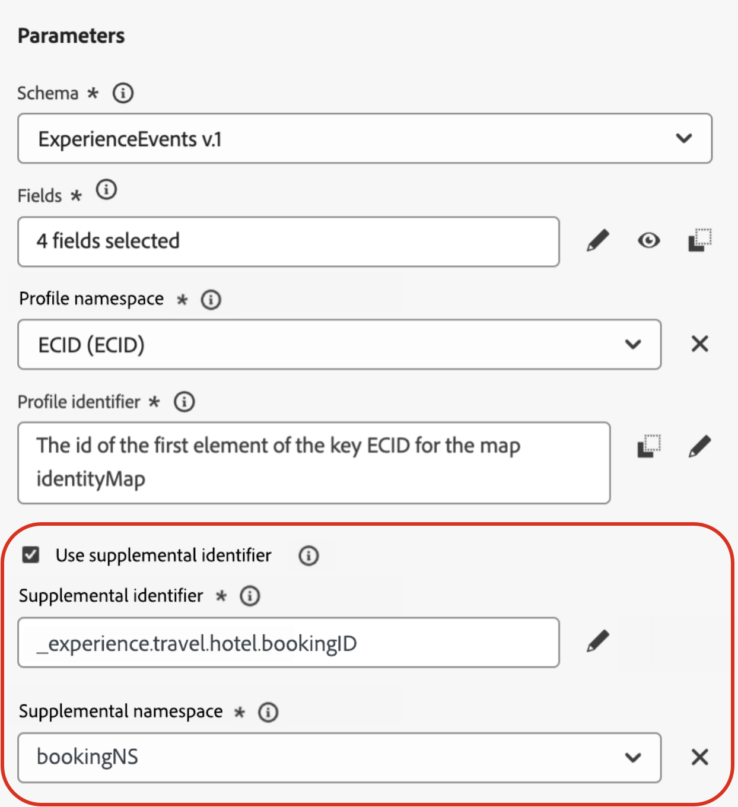
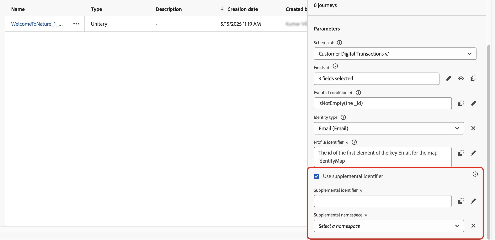
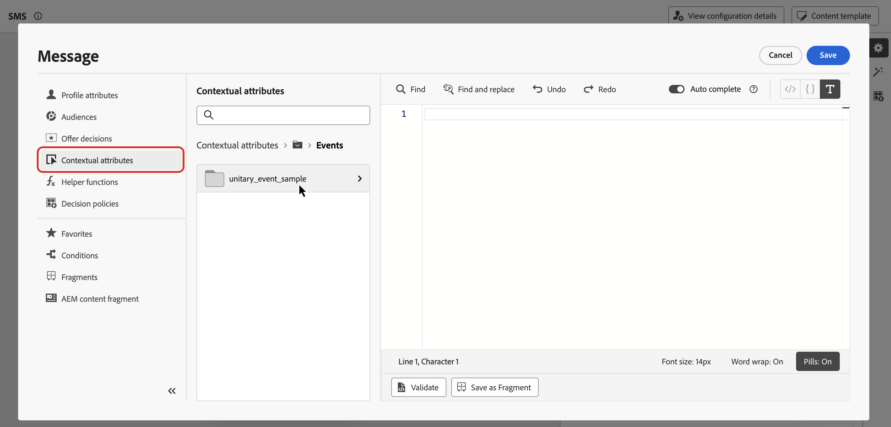

# Uso de identificadores suplementarios en recorridos {#supplemental-id}

>[!BEGINSHADEBOX]

**En esta página:** Aprenda a utilizar identificadores suplementarios (identificadores secundarios como un identificador de pedido o de reserva) para ejecutar una instancia de recorrido independiente por identificador y personalizar mensajes con sus atributos.

>[!ENDSHADEBOX]

>[!CONTEXTUALHELP]
>id="ajo_journey_parameters_supplemental_identifier"
>title="Usar identificador adicional"
>abstract="El identificador adicional es un identificador secundario que proporciona contexto adicional para la ejecución de un recorrido. Para definirlo, seleccione cualquier atributo de no identidad (o identidad de no persona) de la audiencia o el evento que desee utilizar como identificador suplementario."

<table style="border-collapse: collapse; width: 100%;">
  <tr>
    <td style="vertical-align: top; padding-right: 20px; border: none;">
      <p>De forma predeterminada, los recorridos se ejecutan en el contexto de un <b>ID de perfil</b>. Esto significa que, siempre y cuando el perfil esté activo en un recorrido determinado, no podrá volver a entrar en otro recorrido. Para evitarlo, Journey Optimizer le permite capturar un <b>identificador adicional</b>, como un ID de pedido, un ID de suscripción o un ID de prescripción, además del ID de perfil.  
      <p>En este ejemplo, hemos agregado un <b>ID de reserva</b> como identificador suplementario.</p>
      <p>Al hacerlo, los recorridos se ejecutan en el contexto del ID de perfil asociado al identificador suplementario (en este caso, el ID de reserva). Se ejecuta una instancia del recorrido para cada iteración del identificador suplementario. Esto permite varias entradas del mismo ID de perfil en recorridos si han realizado reservas diferentes.</p>
      <p>Además, Journey Optimizer le permite aprovechar los atributos del identificador suplementario (por ejemplo, número de reserva, fecha de renovación de la prescripción, tipo de producto) para la personalización de mensajes, lo que garantiza comunicaciones muy relevantes.</p>
    </td>
    <td style="vertical-align: top; border: none; text-align: center; width: 40%;">
      
    </td>
  </tr>
</table>

➡️ [Descubra esta funcionalidad en vídeo](#video)

## Protecciones y limitaciones {#guardrails}

* **recorridos admitidos**: se admiten identificadores adicionales para los recorridos **activados por eventos** y **Leer audiencia**. No son **compatibles** con los recorridos de calificación de audiencia (es decir, recorridos que comiencen con una actividad de calificación de audiencia).

* **Acciones entrantes**: actualmente no se admiten identificadores adicionales para las acciones entrantes, como las acciones en la aplicación y web.

* **Límites de instancias simultáneas**: los perfiles no pueden tener más de 10 instancias de recorrido simultáneas.

* **Tipo de datos y estructura de esquema**: el identificador suplementario debe ser del tipo `string`. Puede ser un atributo de cadena independiente o puede ser un atributo de cadena dentro de una matriz de objetos. El atributo de cadena independiente generará una única instancia de recorrido, mientras que el atributo de cadena dentro de una matriz de objetos generará una instancia de recorrido única por iteración de la matriz de objetos. No se admiten matrices de cadenas ni mapas.

* **reentrada al Recorrido**

  El recorrido del comportamiento de reentrada con identificadores suplementarios sigue la política de reentrada existente:

   * Si el recorrido no es de reentrada, la misma combinación de ID de perfil + ID suplementario no puede volver a entrar en el recorrido.
   * Si el recorrido es de reentrada con una ventana de tiempo, la misma combinación de ID de perfil + ID suplementario puede volver a introducirse después de la ventana de tiempo definida.

* **Etiquetado y aplicación del uso de datos (Data Use Labeling and Enforcement, DULE)**: no se realizan comprobaciones de validación DULE en el ID suplementario. Esto significa que este atributo no se tendrá en cuenta cuando el recorrido busque infracciones de directivas de gobernanza de datos.

* **Configuración de eventos descendentes**

  Si está utilizando otro evento descendente en la recorrido, debe utilizar el mismo ID suplementario y tener el mismo área de nombres de ID.

* **Leer recorridos de audiencia**

   * **Eventos empresariales**: el Id. suplementario se deshabilita si usa un evento empresarial.
   * **Campos de contexto y evento**: El identificador suplementario no debe proceder de un campo de contexto de evento o recorrido.
   * **Selección de atributos**: cualquier atributo que no sea de identidad (o identidad que no sea de persona) puede usarse como ID suplementario para todos los tipos de audiencia (servicio de perfil unificado, importación de CSV y composición de audiencias federadas). No se permiten los atributos de identidad basados en personas. Para audiencias externas, vea [Identificadores adicionales con audiencias externas](#external-audiences) para patrones de datos compatibles y requisitos de configuración.
   * **Tasa de lectura**: Para los recorridos de audiencia de lectura que usan un campo de ID suplementario de tipo matriz, la tasa de lectura de la actividad Leer audiencia está limitada a un máximo de 500 perfiles por segundo.

## Comportamiento de criterios de salida con ID suplementarios {#exit-criteria}

Condición previa: Recorrido habilitado para ID suplementario (a través de actividades de evento unitario o lectura de audiencia)

En la tabla siguiente se explica el comportamiento de los perfiles en un recorrido suplementario habilitado para ID cuando se configuran los criterios de salida:

| Configuración de criterios de salida | Comportamiento cuando se cumplen los criterios de salida |
| ---------------------------- | ---------------------------------- |
| Basado en un evento de ID no suplementario | Se abandonan todas las instancias del perfil correspondiente en ese recorrido. |
| Basado en un evento de ID suplementario <br/>*Nota: el área de nombres de ID suplementario debe coincidir con el del nodo inicial.* | Solo se sale del perfil coincidente + instancia de ID suplementario. |
| Basado en una audiencia | Se abandonan todas las instancias del perfil correspondiente en ese recorrido. |

## Añadir un identificador suplementario y aprovecharlo en un recorrido {#add}

>[!BEGINTABS]

>[!TAB recorrido activado por eventos]

Para utilizar un identificador suplementario en un recorrido activado por evento, siga estos pasos:

1. **Agregar el identificador suplementario al evento**

   1. Cree o edite el evento deseado. [Aprenda a configurar un evento unitario](../event/about-creating.md)

   1. En la pantalla de configuración del evento, marque la opción **[!UICONTROL Usar identificador suplementario]**.

      

   1. Utilice el editor de expresiones para seleccionar el campo que desea utilizar como ID suplementario (por ejemplo, ID de reserva, ID de suscripción).

      >[!NOTE]
      >
      >Asegúrese de utilizar el editor de expresiones en **[!UICONTROL Modo avanzado]** para seleccionar el atributo.

1. **Agregar el evento al recorrido**

   Arrastre el evento configurado al lienzo de recorrido. Almacenará en déclencheur la entrada de recorrido en función tanto del ID de perfil como del ID suplementario.

   

>[!TAB Leer recorrido de audiencia]

Para utilizar un identificador suplementario en un recorrido Leer audiencia, siga estos pasos:

1. **Agregar y configurar una actividad Leer audiencia en el recorrido**

   1. Arrastre una actividad **[!UICONTROL Leer audiencia]** a su recorrido.

   1. En el panel de propiedades de la actividad, active la opción **[!UICONTROL Usar identificador suplementario]**.

      

   1. En el campo **[!UICONTROL Identificador suplementario]**, use el editor de expresiones para seleccionar el atributo de identificador suplementario.

   Para las audiencias [importadas desde un archivo CSV](https://experienceleague.adobe.com/docs/experience-platform/segmentation/ui/overview.html#import-audience){target="_blank"}, si la audiencia CSV contiene varias filas por ID de perfil, asegúrese de que la activación rápida esté habilitada primero; consulte [Identificadores adicionales con audiencias externas](#external-audiences).

       >[!NOTE]
       >
       >Asegúrese de usar el editor de expresiones en **[!UICONTROL Modo avanzado]** para seleccionar el atributo.
   
>[!ENDTABS]

## Aprovechamiento de atributos de ID suplementarios

Utilice el editor de expresiones y el editor de personalización para hacer referencia a los atributos del identificador suplementario para la personalización o la lógica condicional. Se puede acceder a los atributos desde el menú **[!UICONTROL Atributos contextuales]**.



Para los recorridos activados por eventos si trabaja con matrices (por ejemplo, varias prescripciones o directivas), utilice una fórmula para extraer elementos específicos.

+++ Ver ejemplos

En una matriz de objetos con el Id. suplementario como `bookingNum` y un atributo en el mismo nivel denominado `bookingCountry`, el recorrido se iterará a través del objeto de matriz basado en bookingNum y creará una instancia de recorrido para cada objeto.

* La siguiente expresión en la actividad de condición iterará a través de la matriz de objetos y comprobará si el valor de `bookingCountry` es igual a &quot;FR&quot;:

  ```
  @event{<event_name>.<object_path>.<object_array_name>.all(currentEventField.<attribute_path>.bookingNum==${supplementalId}).at(0).<attribute_path>.bookingCountry}=="FR"
  ```

* La siguiente expresión en el editor de personalización de correo electrónico se iterará a través de la matriz de objetos, extraerá el `bookingCountry` aplicable a la instancia de recorrido actual y lo mostrará en el contenido:

  ```
  {{#each context.journey.events.<event_ID>.<object_path>.<object_array_name> as |l|}} 
  
   {{l.<attribute_path>.bookingCountry}}  
  
  {{/each}}
  ```

* Ejemplo del evento utilizado para almacenar en déclencheur el recorrido:

  ```
  "bookingList": [
        {
            "bookingInfo": {
                "bookingNum": "x1",
                      "bookingCountry": "US"
            }
        },
        {
            "bookingInfo": {
                "bookingNum": "x2",
                "bookingCountry": "FR"
            }
        }
    ]
  ```

+++

## Arbitraje de recorrido e ID suplementario {#arbitration}

La mediación de recorridos (incluidos los límites de concurrencia y el recuento de entradas dentro de los conjuntos de reglas) funciona en el nivel de ID de perfil, no en el nivel de par (ID de perfil, ID suplementario). Esto significa que un límite de concurrencia de 1 puede bloquear una segunda instancia de recorrido para el mismo perfil incluso cuando lleva un valor de ID suplementario diferente.

Póngase en contacto con su representante de Adobe para obtener instrucciones sobre el comportamiento de mediación antes de depender de la configuración de mediación específica en producción.

**Documentación relacionada:**

* [Límite y arbitraje de recorrido](../conflict-prioritization/journey-capping.md)
* [Trabajar con conjuntos de reglas](../conflict-prioritization/rule-sets.md)
* [Administración de conflictos y priorización](../conflict-prioritization/gs-conflict-prioritization.md)

## Identificadores adicionales con audiencias externas {#external-audiences}

Se admite un ID suplementario para audiencias externas, incluidas las audiencias [importadas de un archivo CSV](https://experienceleague.adobe.com/docs/experience-platform/segmentation/ui/overview.html#import-audience){target="_blank"} y las creadas con [Composición de audiencias federada](../audience/get-started-audience-orchestration.md). Al configurar un recorrido que lee desde una audiencia CSV o de Composición de audiencia federada, puede designar cualquier atributo que no sea de identidad en esa audiencia como ID suplementario. A continuación, Journey Optimizer crea una instancia de recorrido independiente por cada combinación de perfil único + ID suplementario.

* Caso de uso 1: Una fila por perfil único + par de ID suplementario

  Este es el caso de uso principal para las audiencias de Composición de audiencias federadas y CSV. La audiencia contiene varias filas en las que cada fila representa una combinación única de un perfil (por ejemplo, un cliente) y un ID suplementario (por ejemplo, una cuenta o un ID de pedido). Cada fila se trata como un registro de activación independiente.

  | profile_id | account_id *(Id. suplementario)* | other_attributes |
  | --- | --- | --- |
  | customer_001 | ACC-1001 | ... |
  | customer_001 | ACC-1002 | ... |
  | customer_002 | ACC-2001 | ... |

  En este ejemplo, `customer_001` tiene dos cuentas. Journey Optimizer crea una instancia de recorrido independiente para cada par de perfil único + `account_id`.

* Caso de uso 2: Una fila por perfil con una matriz de ID suplementarios

  Este caso de uso está disponible para tipos de audiencia que admiten matrices. Una sola fila de la audiencia contiene un perfil con un atributo de matriz que contiene varios valores de ID suplementarios. Journey Optimizer crea una instancia de recorrido por valor en la matriz.

  | profile_id | account_ids *(matriz, ID suplementario)* | other_attributes |
  | --- | --- | --- |
  | customer_001 | [ACC-1001, ACC-1002] | ... |
  | customer_002 | [ACC-2001] | ... |

  En este ejemplo, Journey Optimizer genera dos instancias de recorrido para `customer_001` (una por identificador de cuenta) y otra para `customer_002`. Esto se comporta de forma coherente con el funcionamiento del ID suplementario para las audiencias del servicio de perfil unificado.

### Cómo se configura {#external-configuration}

Para audiencias CSV con el Caso de uso 1 (donde la audiencia contiene intencionadamente varias filas para el mismo ID de perfil), debe habilitar la activación rápida antes de configurar la recorrido. Consulte el requisito previo a continuación. Para el resto de los casos, configure el recorrido directamente.

+++ Requisito previo: Habilitar la activación rápida en las audiencias CSV a través de la API

>[!IMPORTANT]
>
>Este requisito previo se aplica solo a las audiencias CSV donde la audiencia contiene intencionadamente varias filas para el mismo ID de perfil (Caso de uso 1). Las audiencias de Composición de audiencia federada tienen habilitada la activación rápida de forma predeterminada y no requieren este paso. La interfaz de usuario de Audience Portal no admite la configuración `expressActivation`; debe utilizar la API de Audiencia externa.

Debe habilitar `expressActivation` en la audiencia en el momento de la creación. Esto indica a Journey Optimizer que active cada registro de forma independiente, sin anulación de duplicación por ID de perfil. Este indicador no se puede cambiar una vez creada la audiencia.

Utilice la siguiente llamada de API al crear la audiencia:

Punto final:

```http
POST https://platform.adobe.io/data/core/ais/external-audience
```

Encabezados obligatorios:

```http
Authorization: Bearer {ACCESS_TOKEN}
Content-Type: application/json
x-api-key: {API_KEY}
x-gw-ims-org-id: {IMS_ORG}
x-sandbox-name: {SANDBOX_NAME}
```

Cuerpo de la solicitud (conjunto `expressActivation: true`):

```json
{
  "name": "my_audience_name",
  "fields": [ ... ],
  "sourceSpec": { ... },
  "audienceType": "people",
  "namespace": "CustomerAudienceUpload",
  "expressActivation": true
}
```

>[!NOTE]
>
>`expressActivation` toma como valor predeterminado `false`. Debe configurarse en el momento de la creación de la audiencia y no se puede cambiar después de la creación. Todas las audiencias de Composición de audiencia federada tienen la activación rápida habilitada de forma predeterminada y no requieren este indicador.

Consulte la [documentación de la API de creación de audiencias externas](https://experienceleague.adobe.com/en/docs/experience-platform/segmentation/tutorials/create-external-audience#create){target="_blank"} para obtener toda la información.

+++

Para configurar el recorrido:

1. Abra o cree un recorrido con un nodo **[!UICONTROL Leer audiencia]**.
1. En la configuración del nodo **[!UICONTROL Leer audiencia]**, seleccione su audiencia CSV o de Composición de audiencia federada.
1. Active la opción **[!UICONTROL Usar identificador suplementario]** y, a continuación, en el campo **[!UICONTROL Identificador suplementario]**, use el editor de expresiones en **[!UICONTROL Modo avanzado]** para elegir el atributo que desee usar como identificador secundario (por ejemplo, `account_id`, `order_number`).
1. El atributo seleccionado se trata como el ID suplementario para el recorrido; no se requiere registro de identidad.

### Comportamiento de deduplicación {#external-dedup}

Cuando una audiencia tiene habilitada la activación rápida (siempre es true para la composición de audiencias federada; debe establecerse explícitamente para CSV), Journey Optimizer administra la anulación de duplicación en función de cómo se configure el recorrido:

| Situación | Ejemplo de filas de audiencia | Comportamiento |
| --- | --- | --- |
| **Recorrido con ID suplementario — no hay pares duplicados (ID de perfil, ID suplementario)** | (P1, S1), (P1, S2) | Caso de uso previsto. Journey Optimizer crea una instancia de recorrido independiente por cada combinación de perfil único + ID suplementario. Se admiten todas las filas. |
| **Existen pares de Recorrido con ID suplementario — duplicado (ID de perfil, ID suplementario)** | (P1, S1), (P1, S1), (P1, S2) | Las filas que comparten la misma combinación (ID de perfil, ID suplementario) se filtran mediante la lógica de reentrada de recorrido normal. Solo se admite la primera fila coincidente por combinación única. |
| **Recorrido sin ID suplementario configurado** | (P1, S1), (P1, S2) | Sin un ID suplementario, Journey Optimizer trata todas las filas para el mismo ID de perfil como el mismo perfil. Solo se admite una instancia de recorrido por ID de perfil; se descartan las filas adicionales para el mismo perfil. |

## Casos de uso de ejemplo

Estos ejemplos muestran cómo los identificadores suplementarios admiten varios registros relacionados.

### **Notificaciones de renovación de directivas**

* **Escenario**: un proveedor de seguros envía recordatorios de renovación por cada póliza activa que posea un cliente.
* **Ejecución**:
   * Perfil: &quot;John&quot;.
   * Identificadores suplementarios: `"AutoPolicy123", "HomePolicy456"`.
   * El recorrido se ejecuta por separado para cada póliza, con fechas de renovación personalizadas, detalles de cobertura e información sobre primas.

### **Administración de suscripciones**

* **Escenario**: un servicio de suscripción envía mensajes personalizados para cada suscripción cuando se activa un evento para esa suscripción.
* **Ejecución**:
   * Perfil: &quot;Jane&quot;.
   * Identificadores suplementarios: `"Luma Yoga Program ", "Luma Fitness Program"`.
   * Cada evento incluye un ID de suscripción y detalles sobre dicha suscripción. El recorrido se ejecuta por separado para cada evento/suscripción, lo que permite ofertas de renovación personalizadas por suscripción.

### **Recomendaciones de productos**

* **Escenario**: una plataforma de comercio electrónico envía recomendaciones basadas en productos específicos comprados por un cliente.
* **Ejecución**:
   * Perfil: &quot;Alex&quot;.
   * Identificadores suplementarios: `"productID1234", "productID5678"`.
   * El recorrido se ejecuta por separado para cada producto, con oportunidades de ampliación de venta personalizadas.

## Vídeo práctico {#video}

Obtenga información sobre cómo habilitar y aplicar un identificador suplementario en [!DNL Adobe Journey Optimizer].

>[!VIDEO](https://video.tv.adobe.com/v/3464792?quality=12)

+++ Referencia de conocimientos de AI

Esta sección contiene conocimientos estructurados destinados a apoyar la interpretación, la recuperación y la respuesta a preguntas relacionadas con este tema.

Para una comprensión completa, esta información debe combinarse con la documentación de esta página. Ninguna de las fuentes pretende ser independiente; la página describe la función, mientras que esta sección proporciona contexto adicional que ayuda a desambiguar la terminología, la intención, la aplicabilidad y las restricciones.

* **TL;DR:** En esta página se explica cómo usar identificadores suplementarios en Adobe Journey Optimizer recorrido para permitir que un único perfil tenga varias instancias de recorrido simultáneas, cada una con un ámbito de un ID secundario distinto, como una reserva, una suscripción o un ID de directiva.

**Intenciones:**
* Comprenda cuándo y por qué utilizar un identificador suplementario en lugar de depender únicamente de un ID de perfil
* Configure un identificador suplementario en un recorrido activado por evento marcando un atributo como una identidad en el esquema de evento
* Configure un identificador suplementario en un recorrido Leer audiencia activando la opción en la actividad Leer audiencia
* Atributos de identificador suplementarios de referencia para la personalización de mensajes y la lógica condicional mediante el editor de expresiones
* Aplique la sintaxis de expresión correcta para iterar en matrices de objetos marcadas por un ID suplementario
* Identificar barreras y limitaciones antes de implementar identificadores suplementarios en un recorrido

**Glosario:**
* **Identificador suplementario**: Un identificador secundario (por ejemplo, ID de pedido, ID de reserva, ID de suscripción) utilizado junto con el ID de perfil para asignar un ámbito de una instancia de recorrido a un registro específico, lo que permite varias instancias simultáneas por perfil *(específico del producto)*
* **Id. de perfil**: El identificador principal usado de forma predeterminada para ejecutar recorridos; un perfil activo en un recorrido no puede volver a entrar en otro recorrido sin un Id. suplementario
* **Área de nombres de identificador de no persona**: Área de nombres de identidad que no representa a una persona (necesaria para los identificadores suplementarios); debe ser distinta del área de nombres de identidad principal
* **espacio de nombres joai**: no aplicable a esta página (consulte solución de problemas de acciones entrantes)
* **DULE**: etiquetado y aplicación de uso de datos: el marco de validación de la directiva de gobernanza de datos en Adobe Experience Platform; los ID suplementarios no están sujetos a las comprobaciones DULE

**Protecciones:**
* Los identificadores adicionales solo son compatibles con recorridos de audiencia activados por eventos y de lectura; no son compatibles con los recorridos de calificación de audiencias
* Un perfil no puede tener más de 10 instancias de recorrido simultáneas
* Cada instancia de recorrido cuenta para la restricción de frecuencia incluso cuando se crea mediante identificadores suplementarios
* El identificador suplementario debe ser del tipo `string`; no se admiten matrices de cadenas ni mapas
* El atributo de ID suplementario no debe marcarse como Identidad principal en el esquema
* El área de nombres utilizada para el ID suplementario debe ser un área de nombres de identificador no personal
* Después de aplicar el área de nombres de identidad no personal a un esquema, se debe crear un nuevo evento o grupo de campos; las entidades existentes no se pueden actualizar
* Para recorridos de audiencia de lectura con ID suplementarios: la tasa de lectura está limitada a 500 perfiles por segundo por recorrido; solo se admiten audiencias del servicio de perfil unificado; el ID suplementario debe ser un campo de perfil (no un campo de evento/contexto)
* Los eventos descendentes del mismo recorrido deben utilizar el mismo ID suplementario y área de nombres
* El ID suplementario está deshabilitado para los recorridos de audiencia de lectura que utilizan un evento empresarial

**Terminología:**
* Nombre canónico: Identificador suplementario — Acrónimo: none — variantes: ID suplementario, identificador secundario
* Sinónimos: &quot;identificador suplementario&quot; = &quot;ID suplementario&quot; (utilizado indistintamente en la interfaz de usuario y la documentación)
* No confunda: &quot;identificador suplementario&quot; ≠ &quot;identidad principal&quot;: el ID suplementario nunca debe marcarse como identidad principal en el esquema

**PREGUNTAS MÁS FRECUENTES:**
* **Q: ¿Para qué se utiliza un identificador suplementario?** — Permite que un solo perfil introduzca y ejecute un recorrido varias veces simultáneamente, con cada instancia asignada a un registro secundario diferente, como una reserva, suscripción o ID de política.
* **Q: ¿Qué tipos de recorrido admiten identificadores suplementarios?** — recorridos activados por eventos y recorridos de lectura de audiencia. Los recorridos de cualificación de audiencia no admiten identificadores suplementarios.
* **Q: ¿Cuántas instancias de recorrido simultáneas puede tener un perfil con identificadores suplementarios?** — Un máximo de 10 instancias de recorrido simultáneas por perfil.
* **Q: ¿Puedo usar los atributos de ID suplementarios para la personalización de mensajes?** — Sí. Puede hacer referencia a ellos mediante el menú Context attributes en el editor de expresiones o en el editor de personalización.
* **Q: ¿Es necesario marcar el ID suplementario como identidad principal en el esquema?** — No. Debe marcarse como identidad, pero no como identidad principal.
* **Q: ¿Se aplican directivas de gobernanza DULE al identificador suplementario?** — No. Las comprobaciones de validación DULE no se realizan en el ID suplementario.

+++
