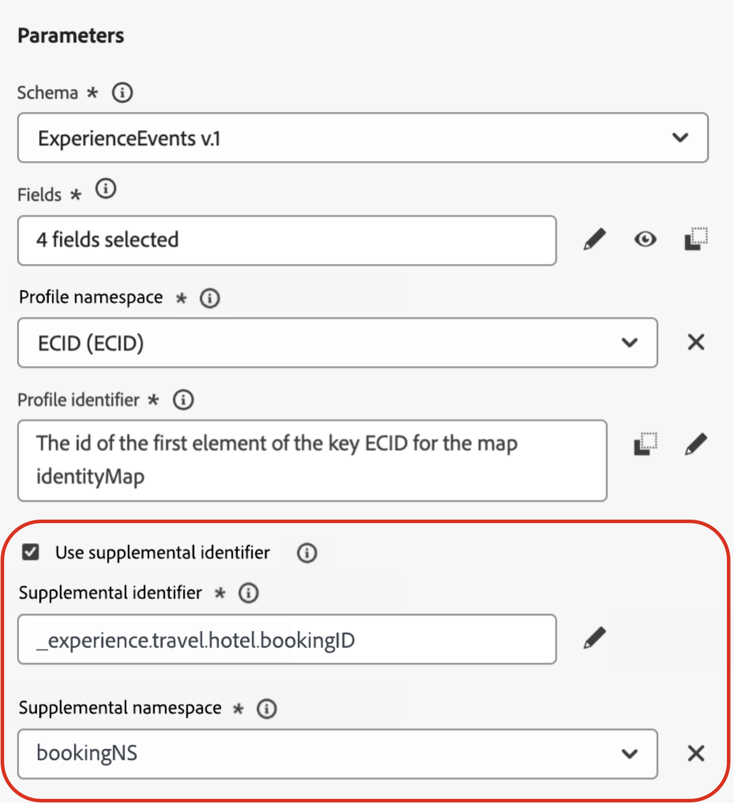
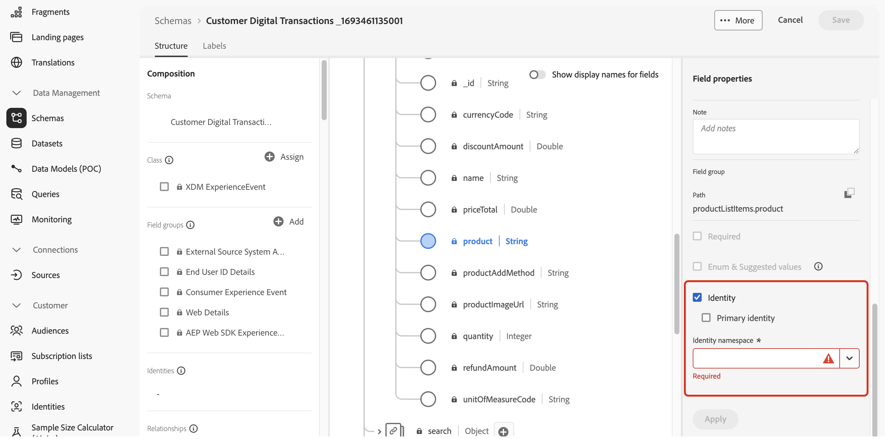

# Identificador suplementario en recorridos activados por eventos {#supplemental-id}

>[!CONTEXTUALHELP]
>id="ajo_journey_parameters_supplemental_identifier"
>title="Usar identificador suplementario"
>abstract="El identificador suplementario es un identificador secundario que proporciona contexto adicional para la ejecución de un recorrido. Para definirlo, seleccione el campo que desea utilizar como identificador suplementario y elija un espacio de nombres al que asociarlo."

>[!AVAILABILITY]
>
>Esta versión solo está disponible para un conjunto de organizaciones (disponibilidad limitada). Para obtener acceso, póngase en contacto con su representante de Adobe.

De manera predeterminada, los recorridos activados por eventos se ejecutan en el contexto de un **ID de perfil**. Esto significa que, siempre y cuando el perfil esté activo en un recorrido determinado, no podrá volver a entrar en otro recorrido. Para evitarlo, Journey Optimizer le permite capturar un **identificador suplementario** en sus eventos, como un ID de pedido, un ID de suscripción o un ID de prescripción, además del ID de perfil.
En este ejemplo, se ha añadido un ID de reserva como identificador suplementario.

{width=40% zoomable}

Al hacerlo, los recorridos activados por el evento se ejecutan en el contexto del ID de perfil asociado al identificador suplementario (en este caso, el ID de reserva). Se ejecuta una instancia del recorrido para cada iteración del identificador suplementario. Esto permite varias entradas del mismo ID de perfil en recorridos si han realizado reservas diferentes.

Además, Journey Optimizer le permite aprovechar los atributos del identificador suplementario (por ejemplo, número de reserva, fecha de renovación de la prescripción, tipo de producto) para la personalización de mensajes, lo que garantiza comunicaciones muy relevantes. <!--Example: A healthcare provider can send renewal reminders for each prescription in a patient's profile.-->

## Mecanismos de protección y limitaciones

* **Límites de instancias simultáneas**: los perfiles no pueden tener más de 10 instancias de recorrido simultáneas.

<!--* **Array depth**: Supplemental identifier objects can have a maximum depth of 3 levels (2 levels of nesting).

    +++Example

    ```
    [
    (level 1) "Atorvastatin" : {
    "description" : "used to lower cholesterol",
    "renewal_date" : "11/20/25",
    "dosage" : "10mg"
    (level 2) "ingredients" : [
    (level 3) "Atorvastatin calcium",
    "lactose monohydrate",
    "microcrystalline cellulose",
    "other" ]
    }
    ]
    ```

    +++
-->
* **Criterios de salida**: Si se activan los criterios de salida, se cerrarán todas las instancias del perfil que se encuentren en el recorrido en ese momento. No sería contextual para la combinación de ID de perfil + identificador suplementario.

* **Reglas de frecuencia**: Cada instancia de recorrido creada a partir del uso de identificadores suplementarios se contabiliza en el límite de frecuencia, incluso si un solo evento resulta en varias instancias de recorrido.

* **Tipo de datos y estructura de esquema**: el identificador suplementario debe ser del tipo `string`. Puede ser un atributo de cadena independiente o puede ser un atributo de cadena dentro de una matriz de objetos. El atributo de cadena independiente generará una única instancia de recorrido, mientras que el atributo de cadena dentro de una matriz de objetos generará una instancia de recorrido única por iteración de la matriz de objetos. No se admiten matrices de cadenas ni mapas.

## Añadir un identificador suplementario y aprovecharlo en un recorrido

Para utilizar un identificador suplementario en un recorrido, siga estos pasos:

1. **Marcar el atributo como identificador en el esquema de eventos**

   1. Acceda al esquema de eventos y busque el atributo que desee utilizar como identificador suplementario (por ejemplo, ID de reserva, ID de suscripción) y márquelo como ID. [Aprenda a trabajar con esquemas](../data/get-started-schemas.md)

   1. Marca el identificador como **[!UICONTROL identidad]**.

      

      >[!IMPORTANT]
      >
      >Asegúrese de no marcar el atributo como **Identidad principal**.

   1. Seleccione el área de nombres que se asociará al ID suplementario. Debe ser un área de nombres de identificador de persona.

1. **Agregar el identificador suplementario al evento**

   1. Cree o edite el evento deseado. [Aprenda a configurar un evento unitario](../event/about-creating.md)

   1. En la pantalla de configuración del evento, marque la opción **[!UICONTROL Usar identificador suplementario]**.

      

   1. Utilice el editor de expresiones para seleccionar el atributo marcado como ID suplementario.

   1. Después de seleccionar el ID suplementario, el área de nombres asociado se muestra en la pantalla de configuración de evento como de solo lectura.

1. **Agregar el evento al recorrido**

   Arrastre el evento configurado al lienzo de recorrido. Almacenará en déclencheur la entrada de recorrido en función tanto del ID de perfil como del ID suplementario.

   

1. **Aprovechar atributos de ID suplementarios**

   Utilice el editor de expresiones y el editor de personalización para hacer referencia a los atributos del identificador suplementario para la personalización o la lógica condicional. Se puede acceder a los atributos desde el menú **[!UICONTROL Atributos contextuales]**.

   

   >[!NOTE]
   >
   >Si está trabajando con matrices (por ejemplo, varias prescripciones o directivas), utilice una fórmula para extraer elementos específicos.

+++ Ver ejemplos

   En una matriz de objetos con el Id. suplementario como `bookingNum` y un atributo en el mismo nivel denominado `bookingCountry`, el recorrido se iterará a través del objeto de matriz basado en bookingNum y creará una instancia de recorrido para cada objeto.

   * La siguiente expresión en la actividad de condición iterará a través de la matriz de objetos y comprobará si el valor de `bookingCountry` es igual a &quot;FR&quot;:

     ```
     @event{<event_name>.<object_path>.<object_array_name>.all(currentEventField.<attribute_path>.bookingNum==${supplementalId}).at(0).<attribute_path>.bookingCountry}=="FR"
     ```

   * La siguiente expresión en el editor de personalización de correo electrónico se iterará a través de la matriz de objetos, extraerá el `bookingCountry` aplicable a la instancia de recorrido actual y lo mostrará en el contenido:

     ```
     {{#each context.journey.events.<event_ID>.<object_path>.<object_array_name> as |l|}} 
     
      {{l.<attribute_path>.bookingCountry}}  
     
     {{/each}}
     ```

   * Ejemplo del evento utilizado para almacenar en déclencheur el recorrido:

     ```
     "bookingList": [
           {
               "bookingInfo": {
                   "bookingNum": "x1",
                         "bookingCountry": "US"
               }
           },
           {
               "bookingInfo": {
                   "bookingNum": "x2",
                   "bookingCountry": "FR"
               }
           }
       ]
     ```

+++

1. **Publicar el recorrido**

   Una vez configurada, publique la recorrido para empezar a utilizar varias entradas simultáneas en función de identificadores suplementarios.

## Casos de uso de ejemplo

### **Notificaciones de renovación de directivas**

* **Escenario**: un proveedor de seguros envía recordatorios de renovación por cada póliza activa que posea un cliente.
* **Ejecución**:
   * Perfil: &quot;John&quot;.
   * Identificadores suplementarios: `"AutoPolicy123", "HomePolicy456"`.
   * El recorrido se ejecuta por separado para cada póliza, con fechas de renovación personalizadas, detalles de cobertura e información sobre primas.

### **Administración de suscripciones**

* **Escenario**: un servicio de suscripción envía mensajes personalizados para cada suscripción cuando se activa un evento para esa suscripción.
* **Ejecución**:
   * Perfil: &quot;Jane&quot;.
   * Identificadores suplementarios: `"Luma Yoga Program ", "Luma Fitness Program"`.
   * Cada evento incluye un ID de suscripción y detalles sobre dicha suscripción. El recorrido se ejecuta por separado para cada evento/suscripción, lo que permite ofertas de renovación personalizadas por suscripción.

### **Recomendaciones de productos**

* **Escenario**: una plataforma de comercio electrónico envía recomendaciones basadas en productos específicos comprados por un cliente.
* **Ejecución**:
   * Perfil: &quot;Alex&quot;.
   * Identificadores suplementarios: `"productID1234", "productID5678"`.
   * El recorrido se ejecuta por separado para cada producto, con oportunidades de ampliación de venta personalizadas.
