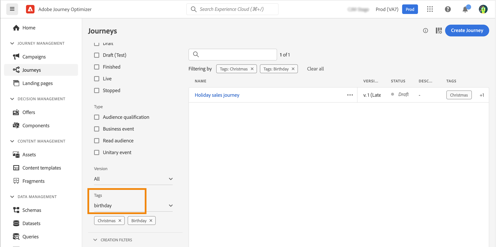

# Administración de etiquetas en recorrido {#journey_tags}

Como profesional de Journey Optimizer, puede organizar sus recorridos mediante etiquetas. Las etiquetas son una forma rápida y sencilla de clasificar objetos para mejorar la búsqueda.

## Adición de etiquetas a un recorrido

El campo **Etiquetas**, en las propiedades del recorrido, le permite definir etiquetas para el recorrido. Puede seleccionar una etiqueta existente o crear una nueva. Empiece a escribir el nombre de la etiqueta deseada y selecciónela en la lista. Si no está disponible, haz clic en **Crear** para crear uno nuevo y agregarlo al recorrido. Puede definir tantas etiquetas como sea necesario.

La lista de etiquetas definidas se muestra debajo del campo **Etiquetas** campo.

>[!NOTE]
>
> Las etiquetas distinguen entre mayúsculas y minúsculas
> 
> Si duplica o crea una nueva versión de un recorrido, las etiquetas se conservan.

## Filtrar por etiquetas

La lista de Recorridos muestra una columna específica para que pueda visualizar fácilmente las etiquetas.

También hay un filtro disponible para mostrar solo los recorridos con determinadas etiquetas.

Puede añadir o quitar recorridos de cualquier tipo (activo, borrador, etc.). Haga clic en el icono **Más acciones** que está junto al recorrido y seleccione **Editar etiquetas**.

## Administrar etiquetas

Los administradores pueden eliminar etiquetas y organizarlas por categorías utilizando la variable **Etiquetas** en **ADMINISTRACIÓN**. Consulte esta [documentación](https://experienceleague.adobe.com/docs/experience-platform/administrative-tags/overview.html?lang=es).

>[!NOTE]
>
> Las etiquetas definidas en recorridos se añaden a la categoría &quot;Sin categoría&quot; integrada.
