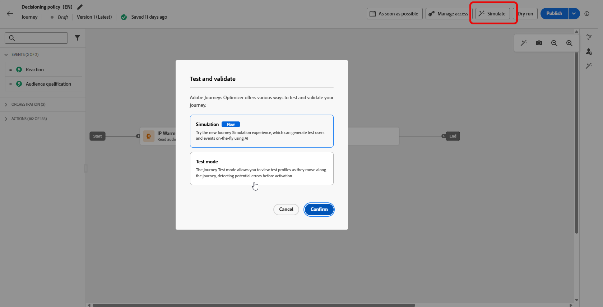
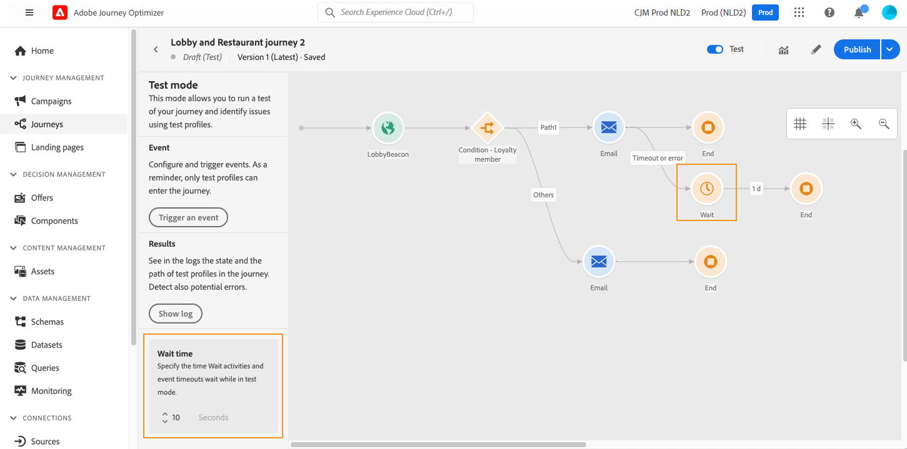
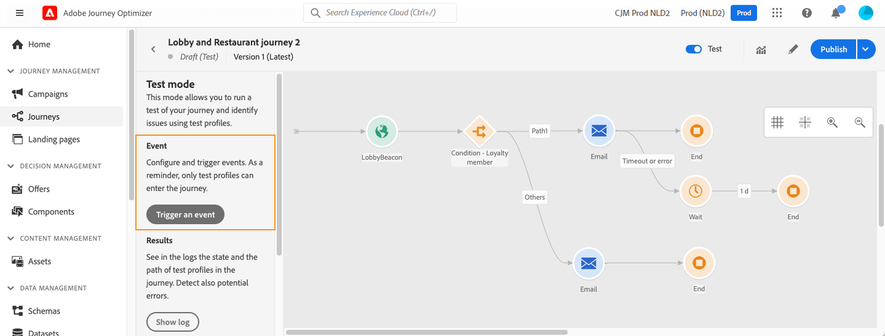
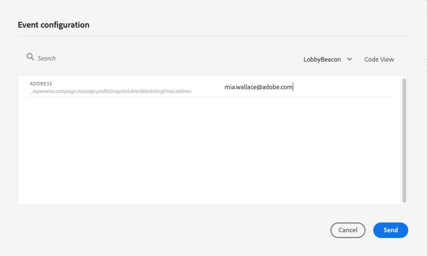
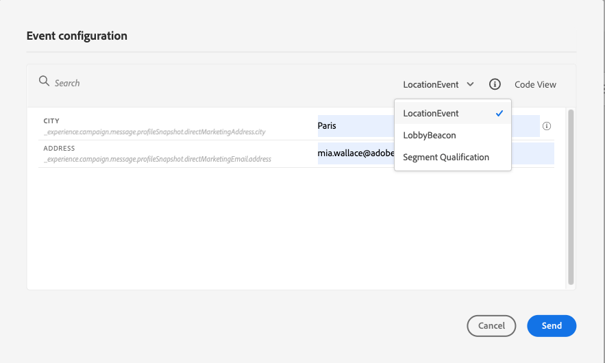
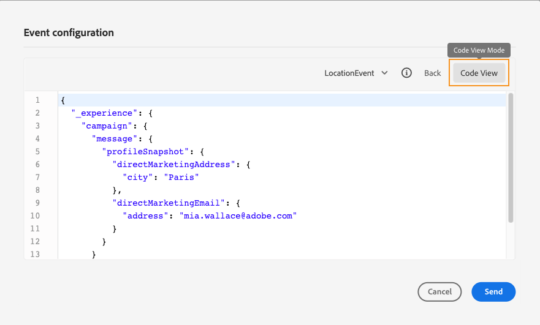
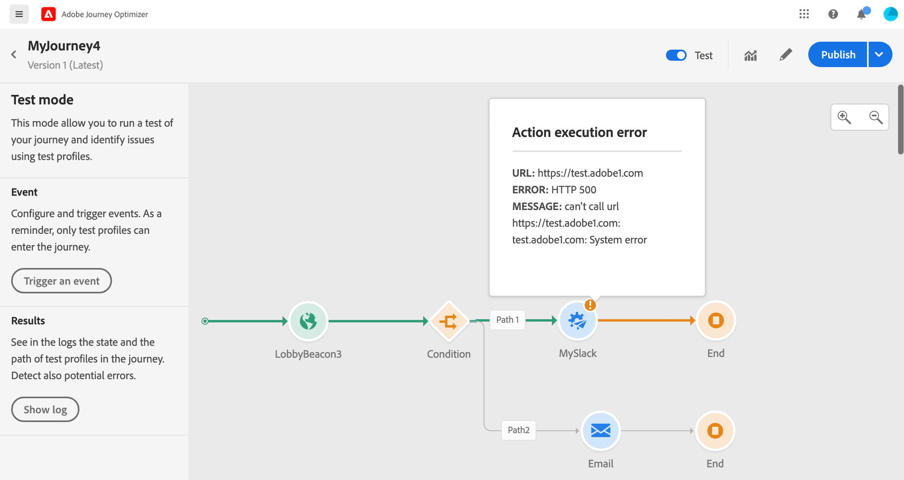

# Prueba del recorrido{#testing_the_journey}

>[!BEGINSHADEBOX]

**En esta página:** Aprenda a validar el recorrido antes de publicar mediante simulación con usuarios simulados o modo de prueba con perfiles de prueba para detectar errores de forma temprana.

>[!ENDSHADEBOX]

>[!CONTEXTUALHELP]
>id="ajo_journey_test"
>title="Prueba del recorrido"
>abstract="Los perfiles de prueba permiten probar el recorrido antes de publicarlo. Esto permite analizar el flujo de los particulares en el recorrido y solucionar los problemas antes de la publicación."
>additional-url="https://experienceleague.adobe.com/es/docs/journey-optimizer/using/orchestrate-journeys/create-journey/journey-dry-run" text="Ensayo del recorrido"

Una vez creado el recorrido, puede probarlo antes de publicarlo. [!DNL Adobe Journey Optimizer] ofrece el &quot;Modo de prueba&quot; como una forma de ver los perfiles de prueba a medida que se mueven por el recorrido, detectando posibles errores antes de la activación. La ejecución de pruebas rápidas le permite comprobar que los recorridos funcionan correctamente para que pueda publicarlos con confianza.

Solo los perfiles de prueba pueden introducir un recorrido en el modo de prueba. Puede crear nuevos perfiles de prueba o convertir los perfiles existentes en perfiles de prueba. Obtenga más información acerca de los perfiles de prueba en [esta sección](../audience/creating-test-profiles.md).

Adobe Recorrido Optimizer ofrece dos formas de probar y validar el recorrido:

* **[Simulation](simulate-journey.md#test-users)**: establezca el recorrido en **[!UICONTROL Simulation]** y utilice usuarios simulados (perfiles temporales que cree o genere sobre la marcha sin perfiles creados previamente en Adobe Experience Platform).

* **[Modo de prueba](#test-profiles)**: los perfiles persistentes se han marcado explícitamente como perfiles de prueba en Adobe Experience Platform. Se pueden reutilizar en varias sesiones de prueba. Se recomienda este método para realizar pruebas con datos de perfil coherentes y predefinidos. [Aprenda a crear perfiles de prueba](../audience/creating-test-profiles.md).

>[!NOTE]
>
>Antes de probar el recorrido, debe resolver todos los errores. Aprenda a comprobar errores antes de probar en [esta sección](../building-journeys/troubleshooting.md). Si los perfiles de prueba no progresan en el modo de prueba, consulte [solución de problemas con las transiciones del modo de prueba](troubleshooting-execution.md#troubleshooting-test-transitions).

## Notas importantes {#important_notes}

Revise estas notas antes de ejecutar pruebas en el recorrido.

### Limitaciones generales

* **Solo perfiles de prueba**: solo los individuos marcados como &quot;perfiles de prueba&quot; en el servicio Perfil del cliente en tiempo real pueden entrar en un recorrido en modo de prueba. [Aprenda a crear perfiles de prueba](../audience/creating-test-profiles.md).
* **Requisito de área de nombres**: el modo de prueba solo está disponible para los recorridos de borrador que utilizan un área de nombres. El modo de prueba necesita comprobar si una persona que entra en el recorrido es un perfil de prueba o no y, por lo tanto, debe poder llegar a [!DNL Adobe Experience Platform].
* **Límite de perfiles**: un máximo de 100 perfiles de prueba pueden entrar en un recorrido durante una sola sesión de prueba.
* **Activación de eventos**: los eventos solo se pueden activar desde la interfaz. Los eventos no se pueden activar desde sistemas externos mediante una API.
* **Audiencias de carga personalizadas**: el modo de prueba de Recorrido no admite [audiencia de carga personalizada](../audience/custom-upload.md) enriquecimiento de atributos.

### Comportamiento durante y después de las pruebas

* **Deshabilitando el modo de prueba**: cuando deshabilita el modo de prueba, se quitan todos los perfiles que estén actualmente en la recorrido o que hayan entrado anteriormente en ella y se borran los informes.
* **Flexibilidad de reactivación**: puede habilitar y deshabilitar el modo de prueba tantas veces como sea necesario.
* **Desactivación automática**: los Recorridos que permanecen inactivos en modo de prueba durante **más de una semana** salen automáticamente del modo de prueba y vuelven al estado Borrador. No se pierde contenido del recorrido; solo finaliza la sesión del modo de prueba.
* **Edición y publicación**: mientras el modo de prueba esté activo, no puede modificar el recorrido. Sin embargo, puede publicar directamente el recorrido, sin necesidad de desactivar el modo de prueba antes.
* **Envío de mensajes**: en el modo de prueba, los mensajes se envían a las bandejas de entrada reales de los perfiles de prueba utilizando la misma canalización de envío que la producción. Esto difiere de [Ejecución en seco del Recorrido](journey-dry-run.md), que simula la ejecución del recorrido sin enviar mensajes ni activar acciones del canal real. Ninguno de los métodos duplica todos los aspectos de un envío en directo; utilice un entorno de ensayo para la validación completa de extremo a extremo.

### Ejecución

* **Comportamiento de división**: cuando el recorrido alcanza una división, la rama superior siempre se selecciona en modo de prueba. Esto no refleja la ruta seleccionada estadísticamente durante la ejecución en directo. Reordene las ramas si desea probar una ruta diferente.
* **Programación de eventos**: si el recorrido incluye varios eventos, almacene en déclencheur cada evento en secuencia. Si se envía un evento demasiado pronto (antes de que termine el primer nodo de espera) o demasiado tarde (después del tiempo de espera configurado), se descartará el evento. A continuación, el perfil se envía a una ruta de tiempo de espera. Confirme siempre que las referencias a los campos de carga útil de evento sigan siendo válidas enviando la carga útil dentro de la ventana definida.
* **Ventana de fecha activa**. Asegúrese de que la ventana [fechas/hora de inicio y finalización](journey-properties.md#dates) configurada en el recorrido incluya la hora actual al iniciar el modo de prueba. De lo contrario, los eventos de prueba desencadenados se descartan silenciosamente con el mensaje de registro `DISPATCHER DISCARD #16 — unqualified on journey version enablements`. Para evitarlo durante la prueba, establezca temporalmente la fecha de inicio de la recorrido a una hora anterior al momento actual y, a continuación, restáurela antes de publicarla. Obtenga más información acerca de la solución de problemas de este problema [en esta página](troubleshooting-execution.md#troubleshooting-test-transitions).
* **Eventos de reacción**: para los eventos de reacción con tiempo de espera, el tiempo de espera mínimo y predeterminado es de 40 segundos.
* **Conjuntos de datos de prueba**: los eventos activados en el modo de prueba se almacenan en conjuntos de datos dedicados etiquetados de la siguiente manera: `JOtestmode - <schema of your event>`
* **Infraestructura compartida**: el modo de prueba se ejecuta en la misma infraestructura que la producción. Durante los períodos de alto tráfico, es posible que observe retrasos en los envíos de correo electrónico o en el procesamiento de eventos. En este caso, compruebe los paneles de tráfico de la plataforma o vuelva a intentar las pruebas durante las horas de menor actividad.

<!--
* Fields from related entities are hidden from the test mode.
-->

## Activar el modo de prueba

Utilice el método **[!UICONTROL Modo de prueba]** cuando quiera probar su recorrido con perfiles de prueba preexistentes que ya ha creado en Adobe Experience Platform.

1. Para activar el modo de prueba, haga clic en el botón **[!UICONTROL Simular]** y seleccione **[!UICONTROL Modo de prueba]**.

   

1. Si el recorrido tiene al menos una actividad **Wait**, establezca el parámetro **[!UICONTROL Wait time]** para definir el tiempo que cada actividad de espera y el tiempo de espera del evento durarán en el modo de prueba. El tiempo predeterminado es 10 segundos para esperas y tiempos de espera de evento. Esto garantizará que obtenga los resultados de la prueba rápidamente.

   

   >[!NOTE]
   >
   >Cuando se utiliza un evento de reacción con un tiempo de espera en un recorrido, el tiempo de espera predeterminado y el valor mínimo son 40 segundos. Consulte [esta sección](../building-journeys/reaction-events.md).

1. Use el botón **[!UICONTROL Déclencheur un evento]** para configurar y enviar eventos al recorrido.

   

1. Configure los diferentes campos esperados. En el campo **Identificador de perfil**, escriba el valor del campo usado para identificar el perfil de prueba. Puede ser la dirección de correo electrónico, por ejemplo. Asegúrese de enviar eventos relacionados con los perfiles de prueba. Consulte [esta sección](#firing_events).

   

1. Una vez recibidos los eventos, haga clic en el botón **[!UICONTROL Mostrar registro]** para ver el resultado de la prueba y verificarlo. Consulte [esta sección](#viewing_logs).

   

1. Si hay algún error, desactive el modo de prueba, modifique el recorrido y pruebe de nuevo. Una vez realizadas las pruebas, puede publicar el recorrido. Consulte [esta página](../building-journeys/publish-journey.md).

## Ejemplo trabajado: validar un recorrido simple {#test-walkthrough}

El siguiente ejemplo muestra cómo probar un recorrido que comienza con un evento unitario, envía un correo electrónico, espera 10 minutos y, a continuación, envía una notificación push.

Para validar el recorrido de extremo a extremo:

1. Active el modo de prueba haciendo clic en **[!UICONTROL Modo de prueba]** en la esquina superior derecha. El lienzo cambia al modo de prueba y aparece un botón **[!UICONTROL Déclencheur y evento]**.
1. Establezca **[!UICONTROL Tiempo de espera]** en **10 segundos** para que el nodo de espera se complete rápidamente durante la prueba.
1. Haga clic en **[!UICONTROL Déclencheur un evento]**, seleccione el evento e introduzca un identificador de perfil de prueba (por ejemplo, la dirección de correo electrónico de un perfil marcado como perfil de prueba en Adobe Experience Platform).
1. Haga clic en **[!UICONTROL Enviar]**. El flujo visual aparece en el lienzo y se vuelve verde a medida que el perfil progresa en cada paso.
1. Haga clic en **[!UICONTROL Mostrar registro]** y confirme lo siguiente en la salida JSON:
   * `currentstep` coincide con la actividad en la que espera que esté el perfil.
   * `phase` muestra `running` mientras el perfil se encuentra en un nodo de espera y `finished` cuando llega al final.
   * No hay `actionExecutionErrors` entradas presentes.
1. Después de 10 segundos, actualice el registro. El perfil debería haber avanzado más allá del nodo de espera y haber activado la acción push.
1. Cuando todos los pasos muestren `finished` y no se registren errores, desactive el modo de prueba y publique el recorrido.

>[!TIP]
>
>Si el perfil no aparece en el registro, compruebe lo siguiente:
>* El identificador de perfil que especificó está marcado como perfil de prueba en [!DNL Adobe Experience Platform].
>* Las fechas de inicio y finalización configuradas del recorrido incluyen la hora actual. Los eventos activados fuera de esta ventana se descartan de forma silenciosa. [Más información](troubleshooting-execution.md#troubleshooting-test-transitions).

## Solucionar problemas del modo de prueba {#troubleshoot-test-mode}

Utilice esta tabla para autodiagnosticar errores comunes del modo de prueba antes de abrir un ticket de asistencia.

| Síntoma | Causa probable | Resolución |
| --- | --- | --- |
| El evento se envía correctamente, pero el perfil nunca aparece en el registro de recorrido | El área de nombres no coincide en el identificador de perfil: el valor del área de nombres no coincide con el área de nombres definido en el esquema de evento | Compruebe el formato del identificador: `@{<EventName>.identityMap.entry('<NamespaceName>').first().id}`. `<NamespaceName>` debe coincidir exactamente con el esquema de eventos (distingue mayúsculas de minúsculas). Consulte [Requisitos previos](#trigger-events-prerequisites). |
| Eventos aceptados (200 respuestas) pero el recorrido nunca genera déclencheur; el registro muestra `DISPATCHER DISCARD #16 — unqualified on journey version enablements` | La fecha de inicio del recorrido se establece en el futuro; los eventos de prueba se descartan silenciosamente fuera de la ventana de fecha activa | Establezca temporalmente la fecha de inicio del recorrido en antes de la hora actual. Restaure antes de publicar. Ver [fechas de recorrido](journey-properties.md#dates). |
| Leer recorrido de audiencia muestra un registro de evaluación de segmentos por lotes, pero ninguna entrada de perfil | La evaluación de segmentos por lotes se registra por separado para cada entrada de perfil; el registro de lotes no confirma que los perfiles hayan entrado en el recorrido | Espere a que finalice la ventana de procesamiento por lotes. Para obtener comentarios de registro en tiempo real, realice pruebas con un recorrido de eventos unitarios. |
| No se puede habilitar el modo de prueba; error `ERR_MODEL_RULES_16` | El evento no incluye un área de nombres de identidad, necesario cuando el recorrido utiliza una acción de canal | Agregue un [área de nombres de identidad](../audience/get-started-identity.md) a la configuración del evento. |

## Activación de eventos {#firing_events}

>[!CONTEXTUALHELP]
>id="ajo_journey_test_configuration"
>title="Configurar el modo de prueba"
>abstract="Si un recorrido contiene varios eventos, la lista desplegable se utiliza para seleccionar un evento. Para cada evento, se configuran los campos pasados y la ejecución del envío del evento."

Use el botón **[!UICONTROL Déclencheur un evento]** para configurar un evento que hará que una persona entre en el recorrido.

### Requisitos previos {#trigger-events-prerequisites}

Como requisito previo, debe saber qué perfiles están marcados como perfiles de prueba en [!DNL Adobe Experience Platform]. De hecho, el modo de prueba solo permite estos perfiles en el recorrido.

El evento debe contener un ID. El ID esperado depende de la configuración del evento. Puede ser un ECID o una dirección de correo electrónico, por ejemplo. El valor de esta clave debe agregarse en el campo **Identificador de perfil**.

El valor **Identificador de perfil** debe coincidir exactamente con la identidad almacenada en el esquema de eventos. El formato utilizado para hacer referencia a una identidad en la carga útil de evento es el siguiente:

`@{<EventName>.identityMap.entry('<NamespaceName>').first().id}`

Reemplace `<NamespaceName>` con el área de nombres exactamente como se define en el esquema de evento (por ejemplo, `Email` o `Phone`). Una falta de coincidencia de área de nombres provoca una **caída silenciosa**: el evento se acepta y devuelve una respuesta correcta, pero el perfil nunca entra en el recorrido y no aparece ningún error en la interfaz de usuario. Si un perfil no aparece en los registros de prueba después de activar un evento, compruebe que el área de nombres del **Identificador de perfil** coincida exactamente con el área de nombres del esquema de evento.

Si el recorrido no puede habilitar el modo de prueba con el error `ERR_MODEL_RULES_16`, asegúrese de que el evento usado incluya un [área de nombres de identidad](../audience/get-started-identity.md) al usar una acción de canal.

El área de nombres de identidad se utiliza para identificar los perfiles de prueba de forma exclusiva. Por ejemplo, si se usa el correo electrónico para identificar los perfiles de prueba, se debe seleccionar el área de nombres de identidad **Correo electrónico**. Si el identificador único es el número de teléfono, se debe seleccionar el área de nombres de identidad **Teléfono**.

>[!NOTE]
>
>* Cuando se almacena en déclencheur un evento en modo de prueba, se genera un evento real, lo que significa que también se producirá en otros recorridos que escuchen este evento.
>
>* Asegúrese de que cada evento en el modo de prueba se active en el orden correcto y dentro de la ventana de espera configurada. Por ejemplo, si hay una espera de 60 segundos, el segundo evento debe activarse solo después de que haya transcurrido esa espera de 60 segundos y antes de que caduque el límite de tiempo de espera.
>

### Configuración de evento {#trigger-events-configuration}

Si el recorrido contiene varios eventos, utilice el menú desplegable para seleccionar un evento. A continuación, configure para cada evento los campos pasados y la ejecución del envío del evento. La interfaz le ayuda a pasar la información correcta en la carga útil de evento y garantiza que el tipo de información sea correcto. El modo de prueba guarda los últimos parámetros utilizados en una sesión de prueba para su uso posterior.

La interfaz de le permite pasar parámetros de evento simples. Si desea pasar colecciones u otros objetos avanzados en el evento, puede seleccionar **[!UICONTROL Vista de código]** para ver el código completo de la carga útil y modificarlo. Por ejemplo, puede copiar y pegar información de evento preparada por un usuario técnico.

Un usuario técnico también puede utilizar esta interfaz para componer cargas útiles de eventos y eventos de déclencheur sin tener que utilizar una herramienta de terceros.

Al hacer clic en el botón **[!UICONTROL Enviar]**, comienza la prueba. La progresión del individuo en el recorrido se representa mediante un flujo visual. El camino se vuelve verde progresivamente a medida que el individuo se mueve a través del recorrido. Si se produce un error, se muestra un símbolo de advertencia en el paso correspondiente. Puede colocar el cursor sobre él para mostrar más información sobre el error y acceder a los detalles completos (cuando estén disponibles).

Cuando se selecciona un perfil de prueba diferente en la pantalla de configuración de evento y se vuelve a ejecutar la prueba, el flujo visual se borra y muestra la ruta del nuevo individuo.

Al abrir un recorrido en prueba, la ruta mostrada corresponde a la última prueba ejecutada.

## Modo de prueba para recorridos basados en reglas {#test-rule-based}

El modo de prueba también está disponible para recorridos que utilizan un evento basado en reglas. Para obtener más información sobre los eventos basados en reglas, consulte [esta página](../event/about-events.md).

Al activar un evento, la pantalla **Configuración de evento** le permite definir los parámetros de evento que se pasarán en la prueba. Para ver la condición de ID de evento, haga clic en el icono de información de objeto en la esquina superior derecha. También hay disponible información del objeto junto a cada campo que forma parte de la evaluación de reglas.

## Modo de prueba para eventos empresariales {#test-business}

Cuando use [evento empresarial](../event/about-events.md), use el modo de prueba para almacenar en déclencheur una sola entrada de perfil de prueba en la recorrido, simular el evento y pasar el id. de perfil correcto. Debe pasar los parámetros de evento y el identificador del perfil de prueba que va a introducir el recorrido en la prueba. En el modo de prueba, no hay ningún modo de &quot;Vista de código&quot; disponible para los recorridos basados en eventos empresariales.

Tenga en cuenta que cuando se déclencheur un evento empresarial por primera vez, no se puede cambiar la definición de evento empresarial en la misma sesión de prueba. Solo puede hacer que la misma persona o una persona diferente entren en el recorrido pasando el mismo identificador u otro. Si desea cambiar los parámetros de evento empresarial, debe detener e iniciar de nuevo el modo de prueba.

## Ver registros {#viewing_logs}

>[!CONTEXTUALHELP]
>id="ajo_journey_test_logs"
>title="Registros del modo de prueba"
>abstract="El botón **Mostrar registro** muestra los resultados de las pruebas en formato JSON. Estos resultados muestran el número de particulares dentro del recorrido y su estado."

El botón **[!UICONTROL Mostrar registro]** le permite ver los resultados de la prueba. Esta página muestra la información actual del recorrido en formato JSON. Un botón permite copiar nodos completos. Debe actualizar manualmente la página para actualizar los resultados de la prueba del recorrido.

>[!NOTE]
>
>En los registros de prueba, en caso de error al llamar a un sistema de terceros (fuente de datos o acción), se muestran el código de error y la respuesta de error.

Se muestra el número de individuos (técnicamente denominados instancias) que están actualmente dentro del recorrido. Se muestra la siguiente información para cada individuo:

* _Id_: el ID interno del individuo en la recorrido. Se puede utilizar con fines de depuración.
* _currentstep_: el paso en el que se encuentra el individuo en el recorrido. Recomendamos añadir etiquetas a las actividades para identificarlas más fácilmente.
* _currentstep_ > phase: el estado del recorrido del individuo (en ejecución, finalizado, error o tiempo de espera agotado). Consulte a continuación para obtener más información.
* _currentstep_ > _extraInfo_: descripción del error y otra información contextual.
* _currentstep_ > _fetchErrors_: información sobre errores de datos de recuperación que se produjeron durante este paso.
* _externalKeys_: el valor de la fórmula clave definida en el evento.
* _richData_: los datos que el recorrido ha recuperado si el recorrido usa orígenes de datos.
* _transitionHistory_: la lista de pasos que siguió el individuo. Para los eventos, se muestra la carga útil.
* _actionExecutionErrors_ : información sobre los errores que se produjeron.

>[!NOTE]
>
>El registro de prueba solo muestra entradas para **eventos de entrada de perfil unitario**. Si está probando un recorrido Leer audiencia, el registro de evaluación de segmentos por lotes es independiente del registro de entrada de perfil individual. Un segmento por lotes que se está evaluando no confirma que los perfiles individuales hayan progresado a través de los pasos de recorrido. Si no aparece ninguna entrada de perfil después de activar un recorrido Leer audiencia, espere a que se complete la ventana de procesamiento por lotes antes de extraer conclusiones.

Estos son los diferentes estados del recorrido de un individuo:

* _En ejecución_: el individuo se encuentra actualmente en el recorrido.
* _Finalizado_: el individuo se encuentra al final del recorrido.
* _Error_: el individuo se detuvo en el recorrido debido a un error.
* _Se agotó el tiempo de espera_: el individuo se detuvo en el recorrido debido a un paso que tomó demasiado tiempo.

Cuando se activa un evento con el modo de prueba, se genera automáticamente un conjunto de datos con el nombre del origen.

El modo de prueba crea automáticamente un Evento de experiencia y lo envía a [!DNL Adobe Experience Platform]. El nombre de la fuente para este evento de experiencia es &quot;Eventos de prueba de Journey Orchestration&quot;.

+++ Referencia de conocimientos de AI

Esta sección contiene conocimientos estructurados destinados a apoyar la interpretación, la recuperación y la respuesta a preguntas relacionadas con este tema.

Para una comprensión completa, esta información debe combinarse con la documentación de esta página. Ninguna de las fuentes pretende ser independiente; la página describe la función, mientras que esta sección proporciona contexto adicional que ayuda a desambiguar la terminología, la intención, la aplicabilidad y las restricciones.

* **TL;DR:** En esta página se explica cómo usar el modo de prueba en Adobe Journey Optimizer para validar un recorrido con perfiles de prueba persistentes antes de la publicación, lo que incluye la activación del modo de prueba, la activación de eventos, la lectura de registros y la administración de eventos empresariales y basados en reglas.

**Intenciones:**
* Active el modo de prueba en un recorrido de borrador para validarlo con perfiles de prueba de AEP preexistentes
* Configuración y déclencheur de eventos para perfiles de prueba mediante la interfaz de Déclencheur y evento
* Anular las duraciones de la actividad de espera en el modo de prueba para acelerar la progresión del recorrido
* Lea e interprete la salida de Mostrar registro JSON para verificar la progresión del perfil e identificar errores
* Probar recorridos basados en reglas y recorridos de eventos empresariales en el modo de prueba
* Comprenda las limitaciones y diferencias de comportamiento del modo de prueba en comparación con la simulación

**Glosario:**
* **Modo de prueba**: Un estado de validación de recorrido que permite que los perfiles de prueba persistentes de AEP atraviesen un recorrido de borrador antes de publicarse *(específico del producto)*
* **Perfiles de prueba**: los perfiles se han marcado explícitamente como perfiles de prueba en el servicio Perfil del cliente en tiempo real de Adobe Experience Platform; el único tipo de perfil que permite introducir un recorrido en el modo de prueba *(específico del producto)*
* **Flujo visual**: la representación de lienzo que se vuelve verde para mostrar la ruta que ha seguido un perfil de prueba a través del recorrido
* **Mostrar registro**: característica de modo de prueba que muestra el estado de ejecución del recorrido en formato JSON para cada instancia de perfil de prueba *(específica del producto)*
* **Eventos de prueba de Journey Orchestration**: El nombre de origen en el que se almacenan los eventos de experiencia del modo de prueba en Adobe Experience Platform.

**Protecciones:**
* Solo los perfiles marcados como perfiles de prueba en AEP pueden introducir un recorrido en el modo de prueba
* El modo de prueba requiere que el recorrido utilice un área de nombres para comprobar la identidad del perfil de prueba
* Máximo de 100 perfiles de prueba por sesión de prueba única
* Los eventos solo se pueden activar desde la interfaz de usuario del modo de prueba; no se admite la activación de API externa
* El enriquecimiento de atributos de audiencia de carga personalizada no se admite en el modo de prueba
* Los eventos activados en el modo de prueba generan eventos de experiencia real que también pueden almacenar en déclencheur otros recorridos que escuchen el mismo evento
* En el modo de prueba, las actividades de espera y la mayoría de los tiempos de espera de evento tienen un valor predeterminado de 10 segundos; los tiempos de espera de evento de reacción tienen un valor predeterminado de al menos 40 segundos
* Desactivación automática: los Recorridos que permanecen inactivos en el modo de prueba durante más de una semana abandonan automáticamente el modo de prueba y vuelven al estado Borrador. No se pierde contenido del recorrido; solo finaliza la sesión del modo de prueba.
* Las ediciones de recorrido se bloquean mientras el modo de prueba está activo, pero se permite la publicación directa
* En una división, la rama superior siempre está seleccionada; reordene las ramas para probar diferentes rutas
* Tiempo de espera mínimo del evento de reacción y el tiempo de espera predeterminado es de 40 segundos
* Los eventos enviados fuera de la ventana de fecha de inicio y finalización configurada del recorrido se descartan de forma silenciosa
* Al desactivar el modo de prueba, se eliminan todos los perfiles de la recorrido y se borra la creación de informes

**Terminología:**
* Nombre canónico: Modo de prueba — Acrónimo: none — variantes: modo de prueba, modo de prueba recorrido
* Nombre canónico: Perfiles de prueba — Acrónimo: none — variantes: usuarios de prueba (solo etiqueta de IU de simulación)
* Sinónimos: &quot;Mostrar registro&quot; = registro de resultados de la prueba; &quot;flujo visual&quot; = visualización de la ruta del lienzo
* No confunda: &quot;Modo de prueba&quot; ≠ &quot;Simulación&quot;. El modo de prueba utiliza perfiles de prueba AEP persistentes; la simulación utiliza usuarios simulados temporales generados sobre la marcha

**PREGUNTAS MÁS FRECUENTES:**
* **Q: ¿Quién puede introducir un recorrido en modo de prueba?** — Solo perfiles marcados explícitamente como perfiles de prueba en el servicio Perfil del cliente en tiempo real de Adobe Experience Platform.
* **Q: ¿Cuántos perfiles de prueba se pueden ejecutar en una sola sesión de prueba?** — Un máximo de 100 perfiles de prueba por sesión de prueba.
* **Q: ¿Qué sucede cuando deshabilito el modo de prueba?** — Se eliminan todos los perfiles actualmente en la recorrido o introducidos anteriormente en ella y se borra la creación de informes.
* **Q: ¿Puedo editar un recorrido mientras el modo de prueba está activo?** — No. El recorrido no se puede modificar mientras el modo de prueba esté activo, pero puede publicarlo directamente sin desactivar primero el modo de prueba.
* **Q: ¿Por qué se descartan silenciosamente mis eventos de prueba?** — Los eventos activados fuera de la ventana de fecha/hora activa configurada para el recorrido se descartan de forma silenciosa. Compruebe que las fechas de inicio y finalización del recorrido incluyen la hora actual.
* **Q: ¿Qué indica el campo de fase del registro de prueba?** — Muestra el estado actual del perfil: en ejecución (activo en el recorrido), terminado (llegado al final), error (detenido debido al error) o agotado (detenido debido al tiempo de espera).

+++
