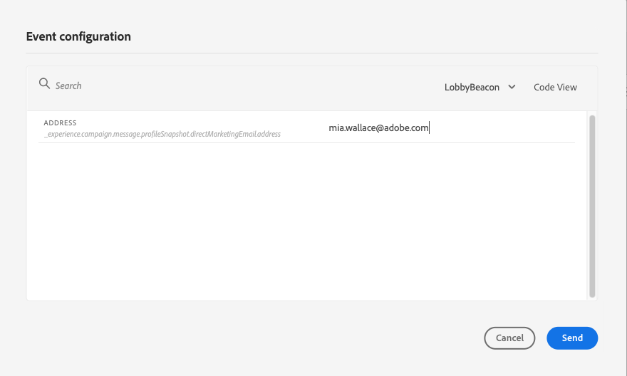

# Prueba del recorrido{#testing_the_journey}

>[!CONTEXTUALHELP]
>id="ajo_journey_test"
>title="Prueba del recorrido"
>abstract="Utilice perfiles de prueba para probar el recorrido antes de publicarlo. Esto permite analizar el flujo de los particulares en el recorrido y solucionar los problemas antes de la publicación."

Utilice perfiles de prueba para probar el recorrido antes de publicarlo. Este modo le permite ejecutar una prueba del recorrido e identificar los problemas mediante perfiles de prueba.

Solo los perfiles de prueba pueden introducir un recorrido en el modo de prueba. Puede crear nuevos perfiles de prueba o convertir perfiles existentes en perfiles de prueba. Obtenga más información sobre los perfiles de prueba en [esta sección](../segment/creating-test-profiles.md).

>[!NOTE]
>
>Antes de probar el recorrido, debe resolver todos los errores si los hay. Obtenga información sobre cómo comprobar errores antes de probar en [esta sección](../building-journeys/troubleshooting.md#checking-for-errors-before-testing).

Para utilizar el modo de prueba, siga estos pasos:

1. Para activar el modo de prueba, active la variable **[!UICONTROL Prueba]** alternar, situado en la esquina superior derecha.

   

1. Si el recorrido tiene al menos uno **Espera** actividad , establezca la variable **[!UICONTROL Tiempo de espera]** para definir el tiempo que cada actividad de espera y el tiempo de espera del evento durarán en el modo de prueba. El tiempo predeterminado es de 10 segundos para las esperas y los tiempos de espera de los eventos. Esto garantizará que los resultados de la prueba se obtengan rápidamente.

   

   >[!NOTE]
   >
   >Cuando se utiliza un evento de reacción con tiempo de espera en un recorrido, el valor predeterminado del tiempo de espera y el valor mínimo son 40 segundos. Consulte [esta sección](../building-journeys/reaction-events.md).

1. Utilice la variable **[!UICONTROL Déclencheur de un evento]** para configurar y enviar eventos al recorrido.

   

1. Configure los diferentes campos esperados. En el **Identificador de perfil** , introduzca el valor del campo utilizado para identificar el perfil de prueba. Puede ser la dirección de correo electrónico, por ejemplo. Asegúrese de enviar eventos relacionados con perfiles de prueba. Consulte [esta sección](#firing_events).

   

1. Una vez recibidos los eventos, haga clic en el botón **[!UICONTROL Mostrar registro]** para ver el resultado de la prueba y verificarlo. Consulte [esta sección](#viewing_logs).

   

1. Si hay algún error, desactive el modo de prueba, modifique el recorrido y pruebe de nuevo. Una vez realizadas las pruebas, puede publicar el recorrido. Consulte [esta página](../building-journeys/publishing-the-journey.md).

## Notas importantes {#important_notes}

* En el modo de prueba, puede activar eventos mediante la interfaz .
* Solo las personas marcadas como &quot;perfiles de prueba&quot; en el servicio Perfil del cliente en tiempo real podrán entrar en el recorrido probado. Consulte esta [sección](../segment/creating-test-profiles.md).
* El modo de prueba solo está disponible en recorridos de borrador que utilizan un área de nombres. El modo de prueba debe comprobar si una persona que entra en el recorrido es un perfil de prueba o no y, por lo tanto, debe poder llegar a Adobe Experience Platform.
* El número máximo de perfiles de prueba que pueden introducir un recorrido durante una sesión de prueba es de 100.
* Al desactivar el modo de prueba, se vacían los recorridos de todas las personas que lo hayan introducido en el pasado o que estén actualmente en él. También borra los informes.
* Puede habilitar/deshabilitar el modo de prueba tantas veces como sea necesario.
* No puede modificar el recorrido cuando se activa el modo de prueba. En el modo de prueba, puede publicar directamente el recorrido; no es necesario desactivar el modo de prueba antes.
* Al llegar a una división, siempre se elige la rama superior. Puede reorganizar la posición de las ramas divididas si desea que la prueba elija una ruta diferente.
* Para optimizar el rendimiento y evitar el uso obsoleto de recursos, todos los recorridos en modo de prueba que no se hayan activado durante una semana volverán a la función **Borrador** estado.

## Déclencheur de los eventos {#firing_events}

>[!CONTEXTUALHELP]
>id="ajo_journey_test_configuration"
>title="Configurar el modo de prueba"
>abstract="Si el recorrido contiene varios eventos, utilice el menú desplegable para seleccionar un evento. A continuación, configure para cada evento los campos pasados y la ejecución del envío del evento."

Utilice la variable **[!UICONTROL Déclencheur de un evento]** para configurar un evento que haga que una persona introduzca el recorrido.

>[!NOTE]
>
>Cuando se déclencheur un evento en el modo de prueba, se genera un evento real, lo que significa que también afectará a otros recorridos que estén escuchando este evento.

Como requisito previo, debe saber qué perfiles se marcan como perfiles de prueba en Adobe Experience Platform. De hecho, el modo de prueba solo permite estos perfiles en el recorrido y el evento debe contener un ID. El ID esperado depende de la configuración del evento. Puede ser un ECID o una dirección de correo electrónico, por ejemplo. El valor de esta clave debe agregarse en la variable **Identificador de perfil** campo .

Si el recorrido contiene varios eventos, utilice el menú desplegable para seleccionar un evento. A continuación, configure para cada evento los campos pasados y la ejecución del envío del evento. La interfaz le ayuda a pasar la información correcta en la carga útil de evento y a asegurarse de que el tipo de información es correcto. El modo de prueba guarda los últimos parámetros utilizados en una sesión de prueba para su uso posterior.

La interfaz le permite pasar parámetros de evento simples. Si desea pasar colecciones u otros objetos avanzados en el evento, puede hacer clic en **[!UICONTROL Vista de código]** para ver el código completo de la carga útil y modificarlo. Por ejemplo, puede copiar y pegar la información de evento preparada por un usuario técnico.

Un usuario técnico también puede utilizar esta interfaz para componer cargas útiles de evento y eventos de déclencheur sin tener que utilizar una herramienta de terceros.

Al hacer clic en el botón **[!UICONTROL Enviar]** , la prueba comienza. La progresión del individuo en el recorrido se representa mediante un flujo visual. La ruta se vuelve progresivamente verde a medida que el individuo se mueve por el recorrido. Si se produce un error, se muestra un símbolo de advertencia en el paso correspondiente. Puede colocar el cursor en él para mostrar más información sobre el error y acceder a todos los detalles (cuando esté disponible).

Cuando selecciona un perfil de prueba diferente en la pantalla de configuración de evento y vuelve a ejecutar la prueba, el flujo visual se borra y muestra la ruta del nuevo individuo.

Al abrir un recorrido en la prueba, la ruta mostrada corresponde a la última prueba ejecutada.

## Modo de prueba para recorridos basados en reglas {#test-rule-based}

El modo de prueba también está disponible para los recorridos que utilizan un evento basado en reglas. Para obtener más información sobre los eventos basados en reglas, consulte [esta página](../event/about-events.md).

Al activar un evento, la variable **Configuración de eventos** permite definir los parámetros de evento que se van a pasar en la prueba. Para ver la condición de ID de evento, haga clic en el icono de información de objeto en la esquina superior derecha. También hay disponible información sobre herramientas junto a cada campo que forma parte de la evaluación de reglas.

## Modo de prueba para eventos empresariales {#test-business}

Al usar un [evento empresarial](../event/about-events.md), utilice el modo de prueba para almacenar en déclencheur una sola entrada de perfil de prueba en el recorrido, simular el evento y pasar el ID de perfil correcto. Debe pasar los parámetros de evento y el identificador del perfil de prueba que va a introducir el recorrido en la prueba. No puede usar la variable **[!UICONTROL Hasta 100 perfiles a la vez]** que existe para otros recorridos basados en segmentos. En el modo de prueba, no hay ningún modo &quot;Vista de código&quot; disponible para los recorridos en función de los eventos empresariales.

Tenga en cuenta que cuando se déclencheur por primera vez un evento empresarial, no se puede cambiar la definición del evento empresarial en la misma sesión de prueba. Solo se puede hacer que la misma persona o una persona diferente introduzca el recorrido que pasa el mismo identificador u otro. Si desea cambiar los parámetros de evento empresarial, debe detener y volver a iniciar el modo de prueba.

## Ver registros {#viewing_logs}

>[!CONTEXTUALHELP]
>id="ajo_journey_test_logs"
>title="Registros del modo de prueba"
>abstract="El botón Mostrar registro muestra los resultados de las pruebas en formato JSON. Estos resultados muestran el número de particulares dentro del recorrido y su estado."

La variable **[!UICONTROL Mostrar registro]** permite ver los resultados de la prueba. Esta página muestra la información actual del recorrido en formato JSON. Un botón permite copiar nodos completos. Debe actualizar manualmente la página para actualizar los resultados de prueba del recorrido.

>[!NOTE]
>
>En los registros de prueba, en caso de error al llamar a un sistema de terceros (fuente de datos o acción), se muestran el código de error y la respuesta de error.

Se muestra el número de personas (técnicamente, se denominan instancias) que están actualmente dentro del recorrido. A continuación se muestra información útil que se muestra para cada individuo:

* _Id_: el ID interno de la persona en el recorrido. Esto se puede utilizar con fines de depuración.
* _currentstep_: el paso en el que se encuentra el individuo en el recorrido. Recomendamos añadir etiquetas a las actividades para identificarlas con mayor facilidad.
* _currentstep_ > fase: el estado del recorrido del individuo (en ejecución, terminado, error o tiempo de espera agotado). Para obtener más información, vaya más abajo.
* _currentstep_ > _extraInfo_: descripción del error y otra información contextual.
* _currentstep_ > _fetchErrors_: información sobre los errores de recuperación de datos que se produjeron durante este paso.
* _externalKeys_: el valor de la fórmula clave definida en el evento.
* _enrichData_: los datos que el recorrido ha recuperado si el recorrido utiliza fuentes de datos.
* _transitionHistory_: la lista de pasos que siguió el individuo. En el caso de los eventos, se muestra la carga útil .
* _actionExecutionErrors_ : información sobre los errores que se han producido.

Estos son los diferentes estados del recorrido de un individuo:

* _Ejecución_: la persona está actualmente en el recorrido.
* _Finalizado_: el individuo está al final del recorrido.
* _Error_: el individuo se detiene en el recorrido debido a un error.
* _Tiempo de espera agotado_: el individuo es detenido en el recorrido debido a un paso que tomó demasiado tiempo.

Cuando se activa un evento mediante el modo de prueba, se genera automáticamente un conjunto de datos con el nombre del origen.

El modo de prueba crea automáticamente un evento de experiencia y lo envía a Adobe Experience Platform. El nombre de la fuente para este evento de experiencia es &quot;Eventos de prueba de Journey Orchestration&quot;.

