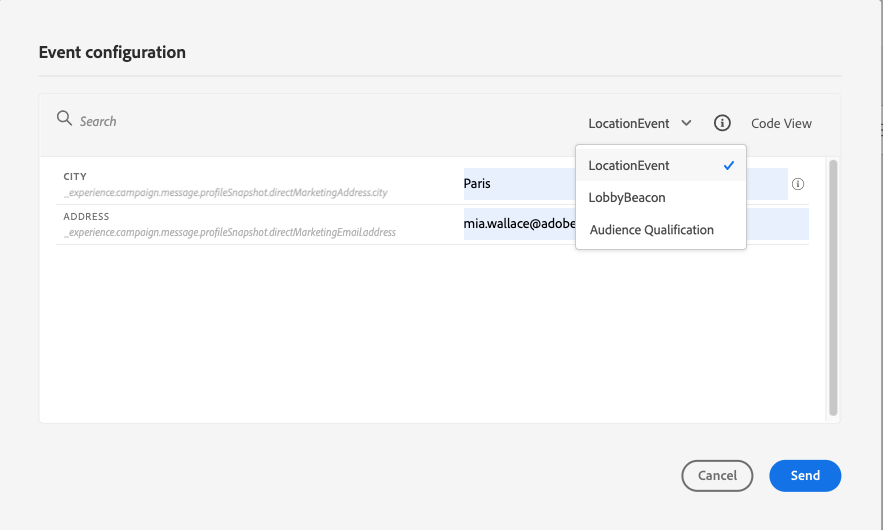

# Prueba del recorrido{#testing_the_journey}

>[!CONTEXTUALHELP]
>id="ajo_journey_test"
>title="Prueba del recorrido"
>abstract="Utilice perfiles de prueba para probar el recorrido antes de publicarlo. Esto permite analizar el flujo de los particulares en el recorrido y solucionar los problemas antes de la publicación."

Una vez creado el recorrido, puede probarlo antes de publicarlo. Journey Optimizer ofrece el &quot;Modo de prueba&quot; como una forma de ver los perfiles de prueba a medida que se mueven por el recorrido, detectando posibles errores antes de la activación. La ejecución de pruebas rápidas le permite comprobar que los recorridos funcionan correctamente para que pueda publicarlos con confianza.

Solo los perfiles de prueba pueden introducir un recorrido en el modo de prueba. Puede crear nuevos perfiles de prueba o convertir los perfiles existentes en perfiles de prueba. Obtenga más información acerca de los perfiles de prueba en [esta sección](../audience/creating-test-profiles.md).

>[!NOTE]
>
>Antes de probar el recorrido, debe resolver todos los errores. Aprenda a comprobar errores antes de probar en [esta sección](../building-journeys/troubleshooting.md).

## Notas importantes {#important_notes}

### Limitaciones generales

* **Solo perfiles de prueba**: solo los individuos marcados como &quot;perfiles de prueba&quot; en el servicio Perfil del cliente en tiempo real pueden entrar en un recorrido en modo de prueba. [Aprenda a crear perfiles de prueba](../audience/creating-test-profiles.md).
* **Requisito de área de nombres**: el modo de prueba solo está disponible para los recorridos de borrador que utilizan un área de nombres. El modo de prueba debe comprobar si una persona que entra en el recorrido es un perfil de prueba o no y, por lo tanto, debe poder acceder a Adobe Experience Platform.
* **Límite de perfiles**: un máximo de 100 perfiles de prueba pueden entrar en un recorrido durante una sola sesión de prueba.
* **Activación de eventos**: los eventos solo se pueden activar desde la interfaz. Los eventos no se pueden activar desde sistemas externos mediante una API.
* **Audiencias de carga personalizadas**: el modo de prueba de Recorrido no admite [audiencia de carga personalizada](../audience/custom-upload.md) enriquecimiento de atributos.

### Comportamiento durante y después de las pruebas

* **Deshabilitando el modo de prueba**: cuando deshabilita el modo de prueba, se quitan todos los perfiles que estén actualmente en la recorrido o que hayan entrado anteriormente en ella y se borran los informes.
* **Flexibilidad de reactivación**: puede habilitar y deshabilitar el modo de prueba tantas veces como sea necesario.
* **Desactivación automática**: los Recorridos que permanecen inactivos en modo de prueba durante **más de una semana** vuelven automáticamente al estado Borrador para optimizar el rendimiento y evitar el uso de recursos obsoletos.
* **Edición y publicación**: mientras el modo de prueba esté activo, no puede modificar el recorrido. Sin embargo, puede publicar directamente el recorrido, sin necesidad de desactivar el modo de prueba antes.

### Ejecución

* **Comportamiento de división**: cuando el recorrido alcanza una división, siempre se selecciona la rama superior. Reordene las ramas si desea probar una ruta diferente.
* **Tiempo de espera del evento**: si el recorrido incluye*varios eventos, almacene en déclencheur cada evento en secuencias. Si se envía un evento demasiado pronto (antes de que finalice el primer nodo de espera) o demasiado tarde (después del tiempo de espera configurado), se descartará el evento y se enviará el perfil a una ruta de tiempo de espera. Confirme siempre que las referencias a los campos de carga útil de evento sigan siendo válidas enviando la carga útil dentro de la ventana definida
* **Ventana de fecha activa**. Asegúrese de que la ventana del recorrido que ha configurado para elegir [fechas/hora de inicio y finalización](journey-properties.md#dates) incluya la hora actual al iniciar el modo de prueba. De lo contrario, los eventos de prueba activados se descartan silenciosamente.
* **Eventos de reacción**: para los eventos de reacción con tiempo de espera, el tiempo de espera mínimo y predeterminado es de 40 segundos.
* **Conjuntos de datos de prueba**: los eventos activados en el modo de prueba se almacenan en conjuntos de datos dedicados etiquetados de la siguiente manera: `JOtestmode - <schema of your event>`

<!--
* Fields from related entities are hidden from the test mode.
-->

## Activar el modo de prueba

Para utilizar el modo de prueba, siga estos pasos:

1. Para activar el modo de prueba, haga clic en el botón **[!UICONTROL Modo de prueba]** ubicado en la esquina superior derecha.

   

   >[!NOTE]
   >
   >Después de habilitar el modo de prueba, espere aproximadamente 1-2 minutos antes de activar una entrada de perfil. Esto permite que el paquete de decisión se propague completamente a través del sistema de toma de decisiones. Si se activa la entrada de un perfil inmediatamente después de activar el modo de prueba, es posible que el recorrido falle ocasionalmente.

1. Si el recorrido tiene al menos una actividad **Wait**, establezca el parámetro **[!UICONTROL Wait time]** para definir el tiempo que cada actividad de espera y el tiempo de espera del evento durarán en el modo de prueba. El tiempo predeterminado es 10 segundos para esperas y tiempos de espera de evento. Esto garantizará que obtenga los resultados de la prueba rápidamente.

   

   >[!NOTE]
   >
   >Cuando se utiliza un evento de reacción con un tiempo de espera en un recorrido, el tiempo de espera predeterminado y el valor mínimo son 40 segundos. Consulte [esta sección](../building-journeys/reaction-events.md).

1. Use el botón **[!UICONTROL Déclencheur un evento]** para configurar y enviar eventos al recorrido.

   

1. Configure los diferentes campos esperados. En el campo **Identificador de perfil**, escriba el valor del campo usado para identificar el perfil de prueba. Puede ser la dirección de correo electrónico, por ejemplo. Asegúrese de enviar eventos relacionados con los perfiles de prueba. Consulte [esta sección](#firing_events).

   

1. Una vez recibidos los eventos, haga clic en el botón **[!UICONTROL Mostrar registro]** para ver el resultado de la prueba y verificarlo. Consulte [esta sección](#viewing_logs).

   

1. Si hay algún error, desactive el modo de prueba, modifique el recorrido y pruebe de nuevo. Una vez realizadas las pruebas, puede publicar el recorrido. Consulte [esta página](../building-journeys/publishing-the-journey.md).

## Activación de eventos {#firing_events}

>[!CONTEXTUALHELP]
>id="ajo_journey_test_configuration"
>title="Configurar el modo de prueba"
>abstract="Si el recorrido contiene varios eventos, utilice el menú desplegable para seleccionar un evento. A continuación, configure para cada evento los campos pasados y la ejecución del envío del evento."

Use el botón **[!UICONTROL Déclencheur un evento]** para configurar un evento que hará que una persona entre en el recorrido.

### Requisitos previos {#trigger-events-prerequisites}

Como requisito previo, debe saber qué perfiles están marcados como perfiles de prueba en Adobe Experience Platform. De hecho, el modo de prueba solo permite estos perfiles en el recorrido.

El evento debe contener un ID. El ID esperado depende de la configuración del evento. Puede ser un ECID o una dirección de correo electrónico, por ejemplo. El valor de esta clave debe agregarse en el campo **Identificador de perfil**.

Si el recorrido no puede habilitar el modo de prueba con el error `ERR_MODEL_RULES_16`, asegúrese de que el evento usado incluya un [área de nombres de identidad](../audience/get-started-identity.md) al usar una acción de canal.

El área de nombres de identidad se utiliza para identificar los perfiles de prueba de forma exclusiva. Por ejemplo, si se usa el correo electrónico para identificar los perfiles de prueba, se debe seleccionar el área de nombres de identidad **Correo electrónico**. Si el identificador único es el número de teléfono, se debe seleccionar el área de nombres de identidad **Teléfono**.

>[!NOTE]
>
>* Cuando se almacena en déclencheur un evento en modo de prueba, se genera un evento real, lo que significa que también se producirá un recorrido que escuche este evento.
>
>* Asegúrese de que cada evento en el modo de prueba se active en el orden correcto y dentro de la ventana de espera configurada. Por ejemplo, si hay una espera de 60 segundos, el segundo evento debe activarse solo después de que haya transcurrido esa espera de 60 segundos y antes de que caduque el límite de tiempo de espera.
>

### Configuración de eventos {#trigger-events-configuration}

Si el recorrido contiene varios eventos, utilice el menú desplegable para seleccionar un evento. A continuación, para cada evento, configure los campos pasados y la ejecución del envío del evento. La interfaz de le ayuda a pasar la información correcta en la carga útil de evento y a asegurarse de que el tipo de información es correcto. El modo de prueba guarda los últimos parámetros utilizados en una sesión de prueba para su uso posterior.

La interfaz de le permite pasar parámetros de evento simples. Si desea pasar colecciones u otros objetos avanzados en el evento, puede seleccionar **[!UICONTROL Vista de código]** para ver el código completo de la carga útil y modificarlo. Por ejemplo, puede copiar y pegar información de evento preparada por un usuario técnico.

Un usuario técnico también puede utilizar esta interfaz para componer cargas útiles de eventos y eventos de déclencheur sin tener que utilizar una herramienta de terceros.

Al hacer clic en el botón **[!UICONTROL Enviar]**, comienza la prueba. La progresión del individuo en el recorrido se representa mediante un flujo visual. El camino se vuelve verde progresivamente a medida que el individuo se mueve a través del recorrido. Si se produce un error, se muestra un símbolo de advertencia en el paso correspondiente. Puede colocar el cursor sobre él para mostrar más información sobre el error y acceder a los detalles completos (cuando estén disponibles).

Cuando se selecciona un perfil de prueba diferente en la pantalla de configuración de evento y se vuelve a ejecutar la prueba, el flujo visual se borra y muestra la ruta del nuevo individuo.

Al abrir un recorrido en prueba, la ruta mostrada corresponde a la última prueba ejecutada.

## Modo de prueba para recorridos basados en reglas {#test-rule-based}

El modo de prueba también está disponible para recorridos que utilizan un evento basado en reglas. Para obtener más información sobre los eventos basados en reglas, consulte [esta página](../event/about-events.md).

Al activar un evento, la pantalla **Configuración de evento** le permite definir los parámetros de evento que se pasarán en la prueba. Para ver la condición de ID de evento, haga clic en el icono de información de objeto en la esquina superior derecha. También hay disponible información del objeto junto a cada campo que forma parte de la evaluación de reglas.

## Modo de prueba para eventos empresariales {#test-business}

Cuando use [evento empresarial](../event/about-events.md), use el modo de prueba para almacenar en déclencheur una sola entrada de perfil de prueba en la recorrido, simular el evento y pasar el id. de perfil correcto. Debe pasar los parámetros de evento y el identificador del perfil de prueba que va a introducir el recorrido en la prueba. En el modo de prueba, no hay ningún modo de &quot;Vista de código&quot; disponible para los recorridos basados en eventos empresariales.

Tenga en cuenta que cuando se déclencheur un evento empresarial por primera vez, no se puede cambiar la definición de evento empresarial en la misma sesión de prueba. Solo puede hacer que la misma persona o una persona diferente entren en el recorrido pasando el mismo identificador u otro. Si desea cambiar los parámetros de evento empresarial, debe detener e iniciar de nuevo el modo de prueba.

## Ver registros {#viewing_logs}

>[!CONTEXTUALHELP]
>id="ajo_journey_test_logs"
>title="Registros del modo de prueba"
>abstract="El botón **Mostrar registro** muestra los resultados de las pruebas en formato JSON. Estos resultados muestran el número de particulares dentro del recorrido y su estado."

El botón **[!UICONTROL Mostrar registro]** le permite ver los resultados de la prueba. Esta página muestra la información actual del recorrido en formato JSON. Un botón permite copiar nodos completos. Debe actualizar manualmente la página para actualizar los resultados de la prueba del recorrido.

>[!NOTE]
>
>En los registros de prueba, en caso de error al llamar a un sistema de terceros (fuente de datos o acción), se muestran el código de error y la respuesta de error.

Se muestra el número de individuos (técnicamente, se denominan instancias) que están actualmente dentro del recorrido. Esta es una información útil que se muestra para cada individuo:

* _Id_: el ID interno del individuo en la recorrido. Se puede utilizar con fines de depuración.
* _currentstep_: el paso en el que se encuentra el individuo en el recorrido. Recomendamos añadir etiquetas a las actividades para identificarlas más fácilmente.
* _currentstep_ > phase: el estado del recorrido del individuo (en ejecución, finalizado, error o tiempo de espera agotado). Consulte a continuación para obtener más información.
* _currentstep_ > _extraInfo_: descripción del error y otra información contextual.
* _currentstep_ > _fetchErrors_: información sobre errores de datos de recuperación que se produjeron durante este paso.
* _externalKeys_: el valor de la fórmula clave definida en el evento.
* _richData_: los datos que el recorrido ha recuperado si el recorrido usa orígenes de datos.
* _transitionHistory_: la lista de pasos que siguió el individuo. Para los eventos, se muestra la carga útil.
* _actionExecutionErrors_ : información sobre los errores que se produjeron.

Estos son los diferentes estados del recorrido de un individuo:

* _En ejecución_: el individuo se encuentra actualmente en el recorrido.
* _Finalizado_: el individuo se encuentra al final del recorrido.
* _Error_: el individuo se detuvo en el recorrido debido a un error.
* _Se agotó el tiempo de espera_: el individuo se detuvo en el recorrido debido a un paso que tomó demasiado tiempo.

Cuando se activa un evento con el modo de prueba, se genera automáticamente un conjunto de datos con el nombre del origen.

El modo de prueba crea automáticamente un Evento de experiencia y lo envía a Adobe Experience Platform. El nombre de la fuente para este evento de experiencia es &quot;Eventos de prueba de Journey Orchestration&quot;.

