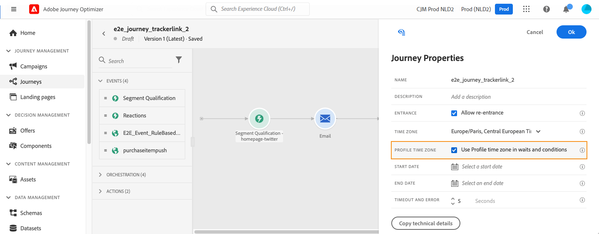

# Administración de husos horarios {#timezone_management}

>[!CONTEXTUALHELP]
>id="ajo_journey_properties_time_zone"
>title="Zona horaria"
>abstract="Seleccione la zona horaria del recorrido. Cuando se utiliza una zona horaria fija, es la misma para todas las personas que entran en el recorrido."

Puede definir una zona horaria en las [propiedades](../building-journeys/journey-properties.md#timezone) de su recorrido.

Para acceder a las propiedades del recorrido, seleccione el icono de lápiz en la parte superior derecha de la pantalla.

Esta zona horaria se utilizará para cada actividad del recorrido que contenga un elemento de hora como:

* [Condición de tiempo](../building-journeys/condition-activity.md#time_condition)
* [Condición de fecha](../building-journeys/condition-activity.md#date_condition)
* [Espera personalizada](../building-journeys/wait-activity.md#custom)

<!--
* [Fixed date wait](../building-journeys/wait-activity.md#fixed_date)
-->

Puede seleccionar una [zona horaria fija](#fixed-timezone) o elegir usar la zona horaria [definida en el perfil de usuario](#timezone-from-profiles).

## Definir una zona horaria fija {#fixed-timezone}

La zona horaria puede ser fija. Borre la zona horaria predefinida y elija una en la lista desplegable. Si utiliza una zona horaria fija, será la misma para todas las personas que entren en el recorrido.

Para ello, en el panel **[!UICONTROL Propiedades del Recorrido]**, seleccione una zona horaria.

## Usar zona horaria de perfiles {#timezone-from-profiles}

>[!CONTEXTUALHELP]
>id="ajo_journey_properties_profile_time_zone"
>title="Usar zona horaria del perfil"
>abstract="Marque el cuadro para utilizar la zona horaria del perfil en tiempo real en las actividades de espera y condición. Si se ha definido una zona horaria para un perfil, el recorrido la recuperará y la utilizará. De lo contrario, la zona horaria será la definida en el campo de zona horaria anterior."

Si el evento de entrada del recorrido tiene un área de nombres, lo que significa que el recorrido puede llegar al servicio Perfil del cliente en tiempo real de [!DNL Adobe Experience Platform], puede que desee utilizar la zona horaria definida en el nivel de perfil. Para ello, en **Properties**, marque **Usar zona horaria del perfil en esperas y condiciones**. Esta opción no está activada de forma predeterminada.

Si se ha definido una zona horaria para un perfil, el recorrido la recuperará y la utilizará. Si no es así, la zona horaria utilizada será la definida en el campo timezone.

>[!NOTE]
>
>La zona horaria del perfil funciona con el campo **timeZone** existente en el grupo de campos **Detalles de preferencia**.

## Uso de zonas horarias en expresiones {#timezone-in-expressions}

Las fechas de inicio y finalización de un recorrido no se pueden vincular a una zona horaria específica. Se asocian automáticamente al huso horario de la instancia.
