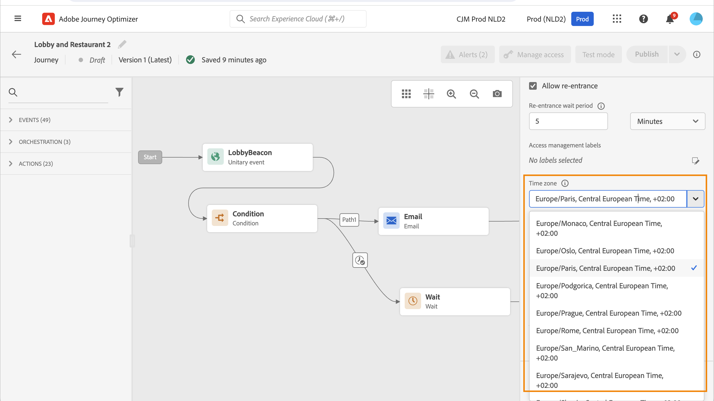

# Administración de husos horarios {#timezone_management}

Puede definir una zona horaria en [propiedades](../building-journeys/journey-properties.md#timezone) de tu recorrido.

Para acceder a Propiedades del Recorrido, haga clic en el icono de lápiz en la parte superior derecha de la pantalla.

Esta zona horaria se utilizará para cada actividad del recorrido que contenga un elemento de hora como:

* [Condición de tiempo](../building-journeys/condition-activity.md#time_condition)
* [Condición de fecha](../building-journeys/condition-activity.md#date_condition)
* [Espera personalizada](../building-journeys/wait-activity.md#custom)

<!--
* [Fixed date wait](../building-journeys/wait-activity.md#fixed_date)
-->

Puede seleccionar una [zona horaria fija](#fixed-timezone) o elija utilizar la zona horaria [definido en el perfil de usuario](#timezone-from-profiles).

## Definir una zona horaria fija {#fixed-timezone}

La zona horaria también puede ser fija. Borre la zona horaria predefinida y elija una en la lista desplegable. Si utiliza una zona horaria fija, será la misma para todas las personas que entren en el recorrido.

Para ello, en la variable **[!UICONTROL Propiedades de recorrido]** , seleccione una zona horaria.

## Uso de perfiles para definir el huso horario del recorrido {#timezone-from-profiles}

Si el evento de entrada del recorrido tiene un área de nombres, lo que significa que el recorrido puede llegar al servicio Perfil del cliente en tiempo real de Adobe Experience Platform, es posible que desee utilizar la zona horaria definida en el nivel de perfil. Para ello, en **Propiedades**, marque **Usar zona horaria del perfil en esperas y condiciones**. Esta opción no está activada de forma predeterminada.

Si se ha definido una zona horaria para un perfil, el recorrido la recuperará y la utilizará. Si no es así, la zona horaria utilizada será la definida en el campo timezone.

>[!NOTE]
>
>La zona horaria del perfil funciona con **timeZone** campo existente en **Detalles de preferencia** grupo de campos.

## Uso de zonas horarias en expresiones {#timezone-in-expressions}

Las fechas de inicio y finalización de un recorrido no se pueden vincular a una zona horaria específica. Se asocian automáticamente al huso horario de la instancia.
