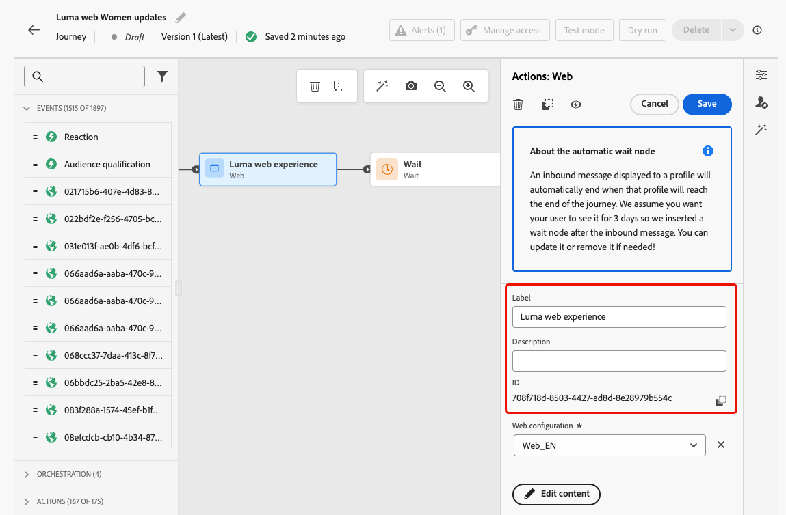
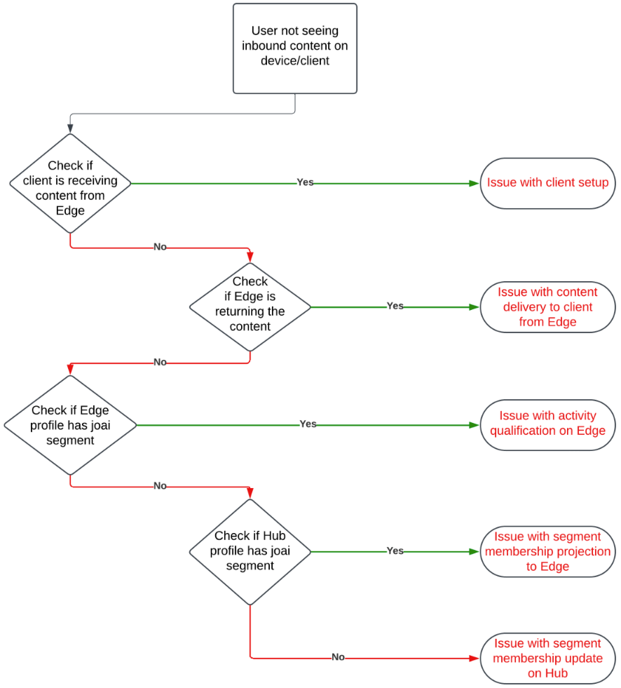

# Solución de problemas de acciones de entrada en recorridos {#troubleshooting-inbound-actions}

Las acciones entrantes, como las experiencias en la aplicación, web y basadas en código, son componentes esenciales de [!DNL Journey Optimizer], ya que permiten la participación personalizada con los usuarios durante su recorrido. Sin embargo, se pueden producir comportamientos inesperados, como la falta de contenido entrante o la continuación de la entrega después de que un perfil salga del recorrido.

Esta guía proporciona un proceso paso a paso para depurar los problemas relacionados con las acciones entrantes de un recorrido para ayudarle a identificarlos y resolverlos de forma independiente antes de ponerse en contacto con el servicio de asistencia.

<!--This guide addresses the two most common scenarios with inbound actions in a journey. They are as follows:

* A profile enters the inbound step, but the user does not receive the expected inbound content.
* A user continues to receive inbound content even after the profile exits the journey.
-->

## Requisitos previos {#prerequisites}

Antes de iniciar la localización de averías, asegúrese de lo siguiente:

1. Configurar una sesión de **Assurance**. Obtenga más información en la [documentación de Adobe Experience Platform Assurance](https://experienceleague.adobe.com/en/docs/experience-platform/assurance/tutorials/using-assurance){target="_blank"}.

1. Vaya al recorrido que contiene la acción entrante para recuperar el nombre del recorrido y el ID de versión.

   >[!NOTE]
   >
   >El identificador de la versión del recorrido se encuentra en la dirección URL después de &quot;recorrido/&quot; (por ejemplo: *86232fb1-2932-4036-8198-55dfec606fd7*).

   

1. Haga clic en la acción entrante para ver sus detalles. Recupere la etiqueta de acción entrante y el ID.

   

1. Obtenga el área de nombres y el ID del perfil para identificar los problemas que encuentra el perfil. En función de su configuración, el área de nombres puede ser ECID, correo electrónico o ID de cliente, por ejemplo. Obtenga información sobre cómo buscar un perfil en la [documentación de Experience Platform](https://experienceleague.adobe.com/en/docs/experience-platform/profile/ui/user-guide#browse-identity){target="_blank"}.

## Escenario 1: el usuario no ha recibido el contenido entrante {#scenario-1}

En esta situación, un perfil ha introducido la acción entrante en el recorrido, pero incluso después de 30 minutos, el contenido entrante correspondiente no se muestra en el dispositivo o cliente en el paso del déclencheur de configuración.

### Comprobaciones previas {#pre-checks}

1. **El conjunto de datos de entrada de Recorrido está habilitado para la ingesta de perfiles**

   La acción de entrada utiliza el conjunto de datos **Recorrido de entrada** para las actualizaciones de perfil durante la ejecución. Asegúrese de que el conjunto de datos esté habilitado para Perfiles en la zona protegida actual. [Más información sobre conjuntos de datos](../data/get-started-datasets.md)

2. Identidad **&#39;joai&#39; definida en identidades de plataforma**

   La acción de entrada usa el espacio de nombres **joai** en el perfil `segmentMembership` para activar el perfil para el paso de entrada. Asegúrese de que se haya definido en Identidades de la plataforma para la zona protegida. Más información sobre [Servicio de identidad de Experience Platform](https://experienceleague.adobe.com/en/docs/experience-platform/identity/home){target="_blank"}

### Pasos de depuración {#debugging-steps}

El gráfico siguiente muestra la secuencia de pasos de depuración que puede seguir:

{width="70%" align="center"}

### Paso 1: Compruebe si el dispositivo o cliente recibe el contenido de Edge Network {#step-1}

Comience por comprobar si el dispositivo o cliente obtiene el contenido esperado.

>[!BEGINTABS]

>[!TAB Canal en la aplicación]

1. Vaya a la sesión [Assurance](https://experienceleague.adobe.com/en/docs/experience-platform/assurance/tutorials/using-assurance){target="_blank"} y seleccione la sección **[!UICONTROL Mensajería en la aplicación]** del panel izquierdo.

1. En la ficha **[!UICONTROL Mensajes del dispositivo]**, haga clic en la lista desplegable **[!UICONTROL Mensajes]**.

   {width="80%"}

1. Busque un mensaje con el nombre del recorrido seguido de &quot;- Mensaje en la aplicación&quot;. Si está presente, significa que el mensaje en la aplicación está presente en el dispositivo o cliente y el problema podría estar relacionado con el déclencheur en la aplicación.

1. Si no se encuentra el mensaje, el dispositivo o cliente no recibió el mensaje en la aplicación. <!--Go to the [next step](#step-2) for further debugging.-->

>[!TAB Canal web]

Visite la página e inspeccione la pestaña de red o compruebe la carga de respuesta de Edge en la sección **[!UICONTROL Edge Delivery]** de la sesión [Assurance](https://experienceleague.adobe.com/en/docs/experience-platform/assurance/tutorials/using-assurance){target="_blank"}.

>[!TAB Canal de experiencia basado en código]

Realice una solicitud de flexión utilizando la API de [Adobe](https://developer.adobe.com/data-collection-apis/docs/api/) y compruebe la carga de respuesta de Edge en la sección **[!UICONTROL Edge Delivery]** de la sesión [Assurance](https://experienceleague.adobe.com/en/docs/experience-platform/assurance/tutorials/using-assurance){target="_blank"}.

>[!ENDTABS]

### Paso 2: Compruebe si Edge Network devuelve el contenido {#step-2}

Este paso es para asegurarse de que Edge Network devuelve el contenido entrante esperado que se procesará en el dispositivo o cliente.

Cuando un perfil introduce una acción entrante en un recorrido, se califica automáticamente en un segmento de audiencia especial (en el área de nombres **joai**) correspondiente a la acción de recorrido entrante.

Cuando un cliente realiza una solicitud a Edge Network para un perfil y una superficie determinados, el perfil cumple los requisitos para recibir contenido para las acciones de recorrido de entrada dirigidas a esa superficie, solo si el perfil es actualmente miembro del segmento **joai** correspondiente.

Para depurar el comportamiento de Edge Network, siga los pasos a continuación.

1. Abra la vista **[!UICONTROL Edge Delivery]** en la sesión de Assurance. Esta vista proporciona información sobre la ejecución de la acción entrante en el servidor de Edge Network. Obtenga más información en la [documentación de Experience Platform](https://experienceleague.adobe.com/es/docs/experience-platform/assurance/view/edge-delivery){target="_blank"}.

1. Compruebe si la actividad de Edge correspondiente a la acción entrante está incluida en las secciones **[!UICONTROL Actividades calificadas]** o **[!UICONTROL Actividades no calificadas]**.

   

   * Si se encuentra en la sección **Actividades calificadas**, el perfil cumple los requisitos para la acción de recorrido entrante y el contenido debería devolverse.
   * Si en la sección **Actividades no calificadas**, el perfil no calificó para la acción de recorrido entrante. Consulte los motivos de exclusión para obtener más información.
   * Si en **ninguna de las secciones** hubo un problema al publicar la acción de recorrido entrante en Edge Network o el URI de superficie solicitado no coincide con los valores de configuración de canal para la acción entrante.

   >[!NOTE]
   >
   >Para encontrar tu actividad de Edge en la sesión **Assurance**, busca la actividad donde **[!UICONTROL audienceNamespace]** es **joai** y **[!UICONTROL audienceSegmentId]** es &lt;*JourneyVersionID*>_&lt;*JourneyActionID*> (por ejemplo: *86232fb1-2932-4036-8198-55dfec606fd7_708f718d-8503-4427-ad8d-8e28979b554c*).

   {width="70%"}

1. Si su actividad se encuentra en la sección **[!UICONTROL Actividades no calificadas]** y el motivo de exclusión es *&#39;El segmento no está activo&#39;*, significa que el servidor de entrega de Edge Network no cree que el perfil forme parte del segmento de audiencia **joai** relevante.

   Puede comprobar si el segmento **joai** está presente en la vista del perfil del servidor de entrega de Edge Network abriendo el elemento **segmentsMap** de la sección Perfil y buscando la presencia del ID de segmento **joai**.

1. Si el servidor de entrega de Edge Network no ve el perfil como si estuviera en el segmento **joai** relevante, vaya al paso siguiente.<!--use the Platform Profile viewer UI to check if the expected **joai** segment is in a realized state in the Edge profile. Learn more in the [Experience Platform Profile UI documentation](https://experienceleague.adobe.com/en/docs/experience-platform/profile/ui/user-guide){target="_blank"}-->

### Paso 3: Compruebe si la pertenencia a la audiencia &quot;joai&quot; se ha propagado a Edge Network {#step-3}

Este paso sirve para comprobar que el perfil de Edge se actualizó correctamente cuando el perfil entró en la acción de recorrido entrante y que el perfil se calificó para el segmento **joai** correspondiente.

Cuando un perfil se clasifica en un segmento **joai**, el perfil se actualiza primero en el concentrador y, a continuación, la pertenencia al segmento se proyecta al perfil de Edge para que lo utilice el servidor de entrega de Edge Network.

>[!NOTE]
>
>La propagación desde Hub a Edge puede tardar entre 15 y 30 minutos desde el momento en que el perfil se actualiza en Hub.

Para comprobar la presencia del segmento **joai** en el atributo `segmentMembership` del perfil de Edge, siga los pasos a continuación.

1. Vaya al menú **[!UICONTROL Cliente]** > **[!UICONTROL Perfiles]** en el panel de navegación izquierdo de [!DNL Journey Optimizer] y busque el perfil usando el área de nombres y el ID. Más información sobre [Perfiles de clientes en tiempo real](../audience/get-started-profiles.md)

1. Seleccione la ficha **[!UICONTROL Atributos]** y elija la vista **[!UICONTROL Edge]**.

1. Haga clic en **[!UICONTROL Ver JSON]** para abrir la vista JSON del perfil.

   {width="80%"}

1. Vaya al atributo `segmentMembership` y compruebe si el ID de segmento &lt;*JourneyVersionID>*_&lt;*JourneyActionID*> está presente en el área de nombres **joai** y si está en estado **[!UICONTROL realizado]** <!--or existing?-->.

   {width="90%"}

   * Si está presente, el segmento **joai** correspondiente a la acción de recorrido entrante se propagó correctamente al perfil de Edge.

   * Si no se muestra en la vista del perfil del servidor de entrega de Edge Network, puede haber un problema con la forma en que el servidor de entrega carga el perfil de Edge.

1. Si el ID de segmento **joai** no está presente o está en estado **[!UICONTROL exit]**, significa que (aún) no se ha propagado a Edge.

   Espere de 15 a 30 minutos para que los valores de `segmentMembership` se propaguen desde el concentrador a Edge. Si sigue sin estar presente, vaya al paso siguiente.

<!--The next step is to check whether the audience segment is present in the profile on the Hub.-->

### Paso 4: Compruebe si la pertenencia a la audiencia &quot;joai&quot; está presente en el perfil en el concentrador {#step-4}

Este paso sirve para comprobar que el perfil Hub se actualizó correctamente cuando el perfil entró en la acción de recorrido entrante y que el perfil se calificó para el segmento **joai** correspondiente.

>[!NOTE]
>
>La ingesta de la pertenencia al segmento **joai** en el perfil del concentrador puede tardar entre 15 y 30 minutos desde el momento en que el perfil entró en la acción de recorrido entrante.

Para comprobar la presencia del segmento **joai** en el atributo `segmentMembership` del perfil del concentrador, siga los pasos a continuación.

1. Vaya al menú **[!UICONTROL Cliente]** > **[!UICONTROL Perfiles]** en el panel de navegación izquierdo de [!DNL Journey Optimizer] y busque el perfil usando el área de nombres y el ID. Más información sobre [Perfiles de clientes en tiempo real](../audience/get-started-profiles.md)

1. Seleccione la ficha **[!UICONTROL Atributos]** y elija la vista **[!UICONTROL Hub]**.

1. Haga clic en **[!UICONTROL Ver JSON]** para abrir la vista JSON del perfil.

1. Vaya al atributo **[!UICONTROL segmentMembership]** y compruebe si el ID de segmento &lt;*JourneyVersionID>*_&lt;*JourneyActionID*> está presente en el área de nombres **joai** y si está en estado **[!UICONTROL realizado]** <!--or existing?-->.

   * Si está presente, el segmento **joai** correspondiente a la acción de recorrido entrante se ingirió correctamente en el perfil del concentrador.

   * Si no se encuentra en el perfil de Edge después de al menos 30 minutos, es posible que haya un problema con el sistema de proyección de Edge.

1. Si el ID del segmento **joai** no está presente o está en el estado **[!UICONTROL saliente]**, significa que el perfil (aún) no se calificó correctamente en el segmento de audiencia especial **joai** al entrar en la acción de recorrido entrante correspondiente.

   Espere de 15 a 30 minutos para que los valores de `segmentMembership` se ingieran en el perfil en el concentrador. Si sigue sin estar presente, vaya al paso siguiente.

### Paso 5: Si el cliente/dispositivo sigue sin obtener el contenido esperado {#step-5}

Si ha seguido todos los pasos anteriores y no ve el comportamiento esperado después de esperar de 30 a 60 minutos para que la pertenencia al segmento se propague a Edge Network, póngase en contacto con el Servicio de atención al cliente de Adobe o con su representante de Adobe.

Incluya todos los detalles que pueda de los pasos de depuración, como:

* el paso en el que se ve el comportamiento inesperado;
* el ID de la versión del recorrido;
* el ID de acción de recorrido;
* el seguimiento completo de Assurance;
* la vista JSON del perfil de Edge;
* la vista JSON del perfil del concentrador;
* etc.

## Escenario 2: el usuario sigue recibiendo el contenido entrante {#scenario-2}

Este escenario es el inverso de [Escenario 1](#scenario-1): el perfil ha salido del recorrido, pero el usuario sigue recibiendo el contenido entrante.

Sin embargo, cuando un perfil sale de un recorrido, ya no debería cumplir los requisitos para los segmentos de audiencia **joai** correspondientes a las acciones entrantes del recorrido.

Siga los mismos pasos de depuración que para [Scenario 1](#debugging-steps) para comprobar si el perfil Hub, el perfil Edge y el servidor de entrega Edge Network reflejan correctamente el estado de pertenencia al segmento del segmento **joai** relevante, y si el cliente ya no recibe el contenido entrante.

<!--

## Reference Section {#reference-section}

- [Assurance Setup Guide](https://experienceleague.adobe.com/en/docs/experience-platform/assurance/tutorials/using-assurance)
- [Adobe Experience Platform Documentation](https://experienceleague.adobe.com/docs/experience-platform/home.html)
- [Streaming Ingestion APIs Troubleshooting](https://experienceleague.adobe.com/docs/experience-platform/ingestion/streaming/troubleshooting.html)

-->
