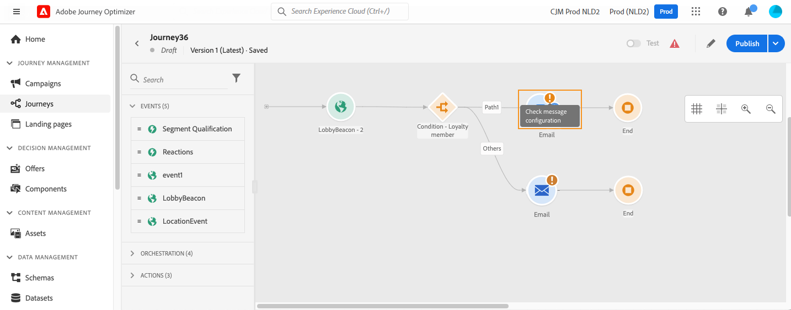

# Solucionar errores antes de probar el recorrido {#troubleshooting}

>[!BEGINSHADEBOX]

**En esta página:** Aprenda a buscar y corregir errores de configuración de recorrido y actividad antes de realizar la prueba o la publicación, para que la recorrido se pueda ejecutar sin problemas.

>[!ENDSHADEBOX]

En esta sección, aprenderá a solucionar problemas de recorridos antes de realizar pruebas o publicar. Todas las comprobaciones que se indican a continuación se pueden realizar cuando el recorrido está en modo de prueba o cuando el recorrido está activo. La recomendación es realizar todas las comprobaciones siguientes en el modo de prueba y luego proceder a la publicación. Obtenga más información acerca del modo de prueba en [esta página](../building-journeys/testing-the-journey.md).

Obtenga información sobre cómo solucionar problemas de eventos de recorrido, comprobar si los perfiles ingresaron al recorrido, cómo navegan por él y si los mensajes se envían [en esta página](troubleshooting-execution.md). Si ningún perfil entra en su recorrido basado en eventos a pesar de los eventos que se están ingiriendo, asegúrese de que los tipos de datos de condición de evento [coincidan con el esquema de evento](troubleshooting-execution.md#verify-event-identity-and-rule-data-types).

Si usa acciones entrantes, aprenda a solucionarlas [en esta página](troubleshooting-inbound.md).

## Errores en las actividades {#activity-errors}

Antes de probar y publicar el recorrido, compruebe que todas las actividades estén correctamente configuradas. No puede realizar pruebas ni publicaciones si el sistema sigue detectando errores.

Los errores aparecen con un símbolo de advertencia en las mismas actividades del lienzo. Coloque el cursor en el signo de exclamación para mostrar el mensaje de error. Si selecciona la actividad, debería ver la línea por error con una advertencia. Por ejemplo:

* si un campo obligatorio está vacío, se mostrará un error

  

* en el lienzo, cuando se desconectan dos actividades, se muestra una advertencia

  

## Errores en el recorrido {#canvas-errors}

Los errores también se pueden ver desde el botón **[!UICONTROL Alertas]** situado sobre el lienzo. Este botón permite ver los errores detectados por el sistema y que impiden la activación del modo de prueba o la publicación del recorrido.

El sistema detecta dos tipos de problemas: **errores** y **advertencias**. Los errores bloquean la publicación y la activación de prueba. Las advertencias indican posibles problemas que no bloquean la activación o publicación de pruebas. Verá una descripción de la publicación y un ID de registro de la publicación del tipo ERR_XXX_XXX. Esto puede ayudar a identificar el problema.

<!--Most of the time, errors detected by the system are linked to errors visible on the activities but they can also relate to other issues. In all cases, check alerts and resolve the issue using to the error description. If you cannot identify the issue, use the **[!UICONTROL Copy details]** button to store the alerts, and send them to your administrator.-->

Los errores y las advertencias que son globales para el recorrido aparecen primero en la lista. Los errores y las advertencias relacionados con actividades específicas se enumeran después, por orden de actividad o por su apariencia en el recorrido de izquierda a derecha. En la parte inferior de la lista de alertas, el botón **[!UICONTROL Copiar detalles]** le permite copiar información técnica sobre el recorrido que resulta útil para solucionar los problemas. Para obtener la lista de campos copiados (incluida la información de pausa y reanudación), consulte [Copiar detalles técnicos](journey-properties.md#access-properties) en las propiedades del recorrido.

## Añadir una ruta alternativa {#canvas-add-path}

Puede definir una acción de reserva en caso de error en las siguientes actividades de recorrido: **[!UICONTROL Optimizar]** y **[!UICONTROL Acción]**.

Cuando se produce un error en una acción o condición, se detiene el recorrido de un individuo. La única manera de continuar es resolver el problema. Para evitar interrumpir el recorrido, también puede marcar la opción **[!UICONTROL Agregar una ruta alternativa en caso de tiempo de espera o error]** en las propiedades de la actividad. Obtenga más información en [esta sección](../building-journeys/using-the-journey-designer.md#paths).

+++ Referencia de conocimientos de AI

Esta sección contiene conocimientos estructurados destinados a apoyar la interpretación, la recuperación y la respuesta a preguntas relacionadas con este tema.

Para una comprensión completa, esta información debe combinarse con la documentación de esta página. Ninguna de las fuentes pretende ser independiente; la página describe la función, mientras que esta sección proporciona contexto adicional que ayuda a desambiguar la terminología, la intención, la aplicabilidad y las restricciones.

* **TL;DR:** En esta página se explica cómo identificar y resolver errores y advertencias de configuración en un recorrido antes de entrar en modo de prueba o publicar.

**Intenciones:**

* Identificar los errores de configuración de nivel de actividad antes de probar o publicar un recorrido
* Distinguir entre errores de bloqueo y advertencias sin bloqueo en el panel Alertas
* Utilice el ID del registro de errores (formato ERR_XXX_XXX) para diagnosticar problemas de recorrido
* Copie los detalles técnicos del recorrido para compartirlos con los administradores y solucionar problemas
* Añada una ruta alternativa para evitar que los recorridos individuales se detengan por error o por tiempo de espera

**Glosario:**

* **Botón Alertas**: Control de lienzo que muestra todos los errores y advertencias detectados por el sistema que bloquean la publicación o la activación de prueba *(específica del producto)*
* **ERR_XXX_XXX**: formato de ID de registro de problemas asignado a cada problema detectado, utilizado para identificar y comunicar errores *(específicos del producto)*
* **Ruta alternativa**: Se agregó una rama de reserva a una actividad de acción o condición que continúa el recorrido cuando se produce un error o se agota el tiempo de espera *(específico del producto)*

**Protecciones:**

* No puede activar el modo de prueba ni publicar un recorrido si los errores de bloqueo siguen sin resolverse.
* Las advertencias no bloquean la publicación ni la activación de pruebas, pero indican posibles problemas.
* Las rutas alternativas solo están disponibles para las actividades Optimizar y Acción.

**Terminología:**

* Nombre canónico: Alertas — Acrónimo: none — variantes: Panel Alertas, botón Alertas
* Sinónimos: &quot;errores&quot; = &quot;problemas de bloqueo&quot;; &quot;advertencias&quot; = &quot;problemas sin bloqueo&quot;
* No confundir: &quot;errores&quot; (publicación en bloque) ≠ &quot;advertencias&quot; (no bloquear publicación)

**PREGUNTAS MÁS FRECUENTES:**

* **Q: ¿Cuál es la diferencia entre un error y una advertencia en Journey Optimizer?** — Los errores bloquean la activación del modo de prueba y la publicación del recorrido; las advertencias indican posibles problemas, pero no impiden la prueba o publicación.
* **Q: ¿Dónde puedo ver todos los errores que afectan a mi recorrido?** — haga clic en el botón Alertas situado encima del lienzo para ver una lista consolidada de todos los errores y advertencias detectados por el sistema.
* **Q: ¿Qué debo hacer si no puedo identificar un problema a partir de la descripción del error?** : utilice el botón Copiar detalles situado en la parte inferior de la lista Alertas para capturar información técnica y enviarla al administrador.
* **Q: ¿Puedo mantener un recorrido en ejecución para personas aunque una acción encuentre un error?** — Sí, habilite la opción &quot;Añadir una ruta alternativa en caso de tiempo de espera o error&quot; en las propiedades de la actividad para definir una ruta de reserva.
* **Q: ¿Cuándo debo realizar estas comprobaciones de solución de problemas?** — Todas las comprobaciones se pueden realizar en el modo de prueba o cuando el recorrido está activo; se recomienda resolver todos los problemas en el modo de prueba antes de publicar.

+++
