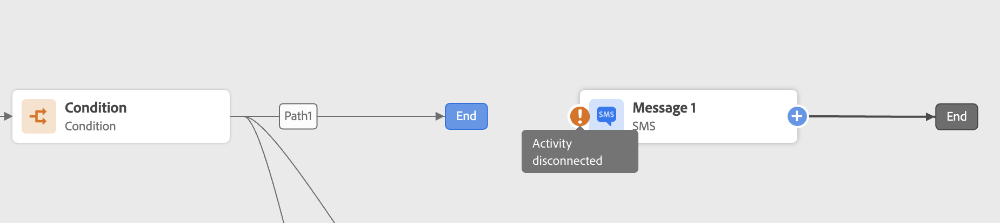

# Resolución de problemas del recorrido {#troubleshooting}

En esta sección, aprenderá a solucionar problemas de recorridos antes de realizar pruebas o publicar. Todas las comprobaciones que se indican a continuación se pueden realizar cuando el recorrido está en modo de prueba o cuando el recorrido está activo. La recomendación es realizar todas las comprobaciones siguientes en el modo de prueba y luego proceder a la publicación. Obtenga más información acerca del modo de prueba en [esta página](../building-journeys/testing-the-journey.md).

Como administrador, también puede probar las configuraciones de acciones personalizadas realizando llamadas de API reales directamente desde la interfaz de usuario. Obtenga más información en [esta página](../action/troubleshoot-custom-action.md).

## Compruebe si hay errores antes de probar {#checking-for-errors-before-testing}

Antes de probar y publicar el recorrido, compruebe que todas las actividades estén correctamente configuradas. No puede realizar pruebas ni publicaciones si el sistema sigue detectando errores.


### Errores en las actividades {#activity-errors}

Los errores aparecen con un símbolo de advertencia en las mismas actividades del lienzo. Coloque el cursor en el signo de exclamación para mostrar el mensaje de error. Si hace clic en la actividad, debería ver la línea por error con una advertencia. Por ejemplo:

* si un campo obligatorio está vacío, se mostrará un error

  

* en el lienzo, cuando se desconectan dos actividades, se muestra una advertencia

  

### Errores en el recorrido {#canvas-errors}

Los errores también se pueden ver desde el botón **[!UICONTROL Alertas]** situado sobre el lienzo. Este botón permite ver los errores detectados por el sistema y que impiden la activación del modo de prueba o la publicación del recorrido.

El sistema detecta dos tipos de problemas: **errores** y **advertencias**. Los errores bloquean la publicación y la activación de prueba. Las advertencias indican posibles problemas que no bloquean la activación o publicación de pruebas. Verá una descripción de la publicación y un ID de registro de la publicación del tipo ERR_XXX_XXX. Esto puede ayudar a identificar el problema.


<!--Most of the time, errors detected by the system are linked to errors visible on the activities but they can also relate to other issues. In all cases, check alerts and resolve the issue using to the error description. If you cannot identify the issue, use the **[!UICONTROL Copy details]** button to store the alerts, and send them to your administrator.-->

Los errores y las advertencias que son globales para el recorrido aparecen primero en la lista. Los errores y las advertencias relacionados con actividades específicas se enumeran después, por orden de actividad o por su apariencia en el recorrido de izquierda a derecha. En la parte inferior de la lista de alertas, el botón **[!UICONTROL Copiar detalles]** le permite copiar información técnica sobre el recorrido que resulta útil para solucionar los problemas.

### Añadir una ruta alternativa {#canvas-add-path}

Puede definir una acción de reserva en caso de error en las siguientes actividades de recorrido: **[!UICONTROL Condición]** y **[!UICONTROL Acción]**.

Cuando se produce un error en una acción o condición, se detiene el recorrido de un individuo. La única manera de continuar es resolver el problema. Para evitar interrumpir el recorrido, también puede marcar la opción **[!UICONTROL Agregar una ruta alternativa en caso de tiempo de espera o error]** en las propiedades de la actividad. Obtenga más información en [esta sección](../building-journeys/using-the-journey-designer.md#paths).


## Compruebe que los eventos se envían correctamente {#checking-that-events-are-properly-sent}

El punto de partida de un recorrido es siempre un evento. Puede hacer pruebas con herramientas como Postman.

Puede comprobar si la llamada API que envía a través de estas herramientas se envía correctamente o no. Si vuelve a recibir un error, significa que la llamada tiene un problema. Vuelva a comprobar la carga útil, el encabezado (y especialmente el ID de organización) y la dirección URL de destino. Puede preguntar a su administrador cuál es la dirección URL correcta para visitar.

Los eventos no se insertan directamente del origen a los recorridos. De hecho, los recorridos dependen de las API de ingesta de transmisión de Adobe Experience Platform. Como resultado, en caso de problemas relacionados con el evento, puede consultar [Documentación de Adobe Experience Platform](https://experienceleague.adobe.com/docs/experience-platform/ingestion/streaming/troubleshooting.html?lang=es){target="_blank"} para la solución de problemas de las API de ingesta de transmisión.

Si el recorrido no puede habilitar el modo de prueba con el error `ERR_MODEL_RULES_16`, asegúrese de que el evento usado incluya un [área de nombres de identidad](../audience/get-started-identity.md) al usar una acción de canal.

El área de nombres de identidad se utiliza para identificar los perfiles de prueba de forma exclusiva. Por ejemplo, si se usa el correo electrónico para identificar los perfiles de prueba, se debe seleccionar el área de nombres de identidad **Correo electrónico**. Si el identificador único es el número de teléfono, se debe seleccionar el área de nombres de identidad **Teléfono**.

## Comprobar si las personas entran en el recorrido {#checking-if-people-enter-the-journey}

El informe de recorridos mide las entradas de la gente en un recorrido en tiempo real.

Si se consigue enviar el evento pero no se ve ninguna entrada en el recorrido, hay un problema entre el envío del evento y la recepción del evento en el recorrido.

Puede comenzar la resolución de problemas con las preguntas siguientes:

* ¿Seguro que el recorrido en el que espera el evento entrante está en modo de prueba o activo?
* ¿Ha guardado el evento antes de copiar la carga útil de la previsualización de carga útil?
* ¿Su carga útil de evento contiene un ID de evento?
* ¿Ha marcado la dirección URL correcta?
* ¿Ha seguido la estructura de carga útil de las API de ingesta de flujo, utilizando la previsualización de estructura de carga útil del panel de configuración de evento? Consulte [esta página](../event/about-creating.md#preview-the-payload).
* ¿Utilizó los pares clave-valor correctos en el encabezado del evento?

  ```
  X-gw-ims-org-id - your organization's ID
  Content-type - application/json
  ```

## Comprobar cómo navegan las personas por el recorrido {#checking-how-people-navigate-through-the-journey}

La creación de informes de recorrido mide el progreso de las personas dentro de un recorrido. Es fácil identificar dónde y por qué detuvieron a una persona.

A continuación se presentan algunas cosas para comprobar:

* ¿Se debe a una condición que excluye a la persona? Por ejemplo, la condición es &quot;género = hombre&quot; y la persona es mujer. Esta comprobación puede realizarla un usuario empresarial si la condición no es demasiado compleja.
* ¿Se debe a que una llamada a una fuente de datos no responde? Cuando el recorrido está en prueba, esta información se puede ver en los registros del modo de prueba. Cuando el recorrido está activo, un administrador puede probar las llamadas directas a la fuente de datos y comprobar la respuesta recibida. Un administrador también puede realizar el duplicado del recorrido y probarlo.

## Comprobar que los mensajes se envíen correctamente {#checking-that-messages-are-sent-successfully}

Si las personas recorren el recorrido correctamente pero no reciben mensajes que deberían recibir, puede comprobar lo siguiente:

* [!DNL Journey Optimizer] ha tenido en cuenta correctamente la solicitud para enviar el mensaje. Los usuarios empresariales pueden acceder al mensaje que se supone que se debe enviar y comprobar si la hora de la última ejecución corresponde al tiempo de ejecución de su recorrido. También pueden consultar las últimas llamadas o eventos de API recibidas.
* [!DNL Journey Optimizer] ha enviado correctamente el mensaje. Compruebe los informes de recorrido para asegurarse de que no hay errores.

En el caso de un mensaje enviado mediante una acción personalizada, lo único que se puede comprobar durante la prueba de recorrido es el hecho de que la llamada del sistema de la acción personalizada produce un error o no. Si la llamada al sistema externo asociada con la acción personalizada no genera un error pero no conduce al envío de un mensaje, algunas investigaciones deben realizarse en el sistema externo.
