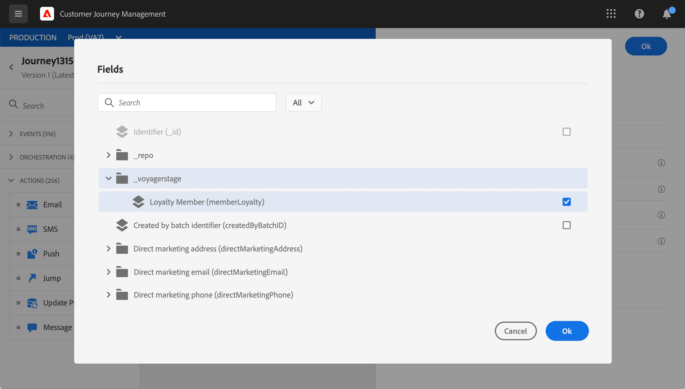
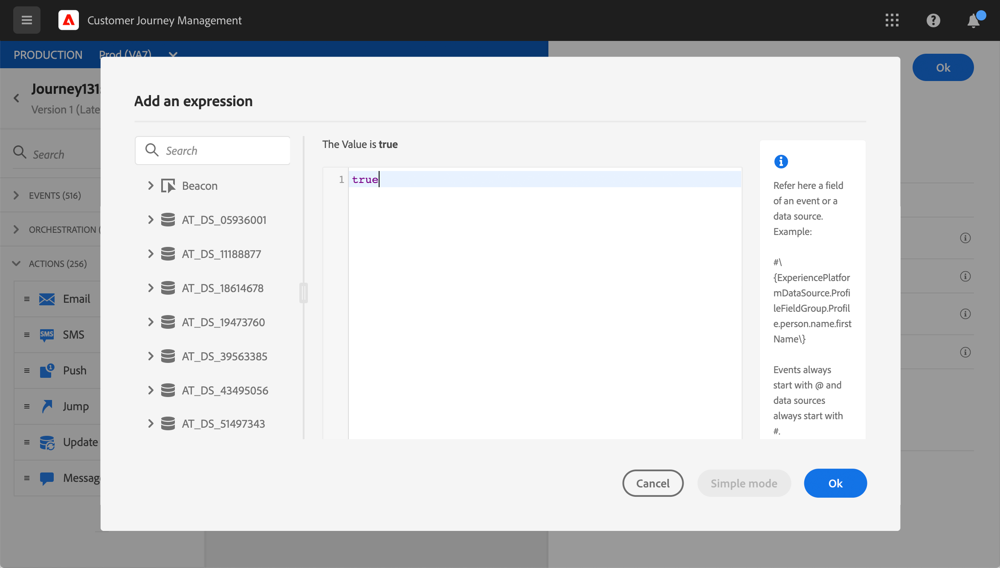

# Actualizar perfil {#update-profile}

La actividad de acción **[!UICONTROL Update Profile]** le permite actualizar un perfil de Adobe Experience Platform existente con información proveniente del evento, una fuente de datos o con un valor específico.

## Notas importantes

* La acción **Actualizar perfil** solo se puede usar en recorridos que comiencen con un evento que tenga un área de nombres.
* La acción solo actualiza los campos existentes, no crea campos de perfil nuevos.
* No puede utilizar la acción **Actualizar perfil** para generar eventos de experiencia, por ejemplo una compra.
* Al igual que cualquier otra acción, puede definir una ruta alternativa en caso de error o de tiempo de espera y no puede colocar dos acciones en paralelo.
* La solicitud de actualización enviada a Platform será rápida, pero no inmediata/en un segundo. Se tardará normalmente unos segundos, pero a veces más sin garantía. Como resultado, por ejemplo, si una acción utiliza el &quot;campo 1&quot; actualizado por una acción Actualizar perfil colocada justo antes, no debería esperar que el &quot;campo 1&quot; se actualice en la acción .
* Las fuentes de datos tienen una noción de duración de la caché, a nivel de grupo de campos. Si espera aprovechar, en un recorrido, un campo de perfil actualizado recientemente, asegúrese de definir una duración de caché muy corta.

## Uso del modo de prueba {#using-the-test-mode}

En el modo de prueba, la actualización de perfil no se simulará. La actualización se realizará en el perfil de prueba.

Solo los perfiles de prueba pueden introducir un recorrido en el modo de prueba. Puede crear un nuevo perfil de prueba o convertir un perfil existente en un perfil de prueba. En Adobe Experience Platform, puede actualizar los atributos de perfil a través de una importación de archivos csv o llamadas API. Un método más sencillo es utilizar una actividad de acción **Actualizar perfil** y cambiar el campo booleano del perfil de prueba de falso a verdadero.

Para obtener más información sobre cómo convertir un perfil existente en un perfil de prueba, consulte esta [sección](../building-journeys/creating-test-profiles.md#create-test-profiles-csv).

## Uso de la actualización de perfil

1. Diseñe el recorrido empezando por un evento . Consulte esta [sección](../building-journeys/journey.md).

1. En la sección **Action** de la paleta, suelte la actividad **Update Profile** en el lienzo.

   

1. Seleccione un esquema de la lista.

1. Haga clic en **Field** para seleccionar el campo que desea actualizar. Solo se puede seleccionar un campo.

   

1. Seleccione un conjunto de datos de la lista.

   >[!NOTE]
   >
   >La acción **Actualizar perfil** actualiza los datos del perfil en tiempo real, pero no actualiza los conjuntos de datos. La selección del conjunto de datos es necesaria, ya que el perfil es un registro relacionado con un conjunto de datos.

1. Haga clic en el campo **Value** para definir el valor que desee utilizar:

   * Con el editor de expresiones simple, se puede seleccionar un campo de un origen de datos o del evento entrante.

      

   * Si desea definir un valor específico o aprovechar las funciones avanzadas, haga clic en **Advanced mode**.

      

El **perfil de actualización** ya está configurado.

