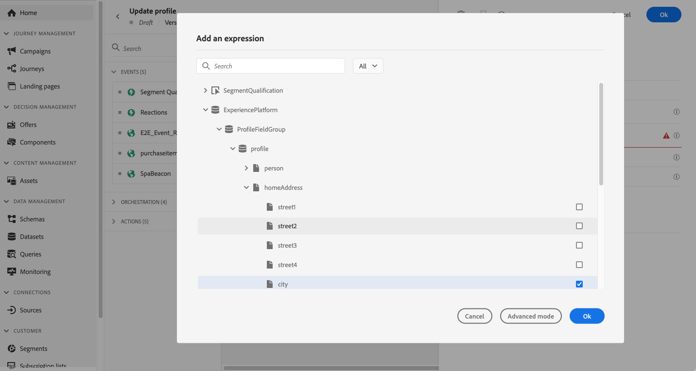

# Actualización de perfil {#update-profile}

>[!BEGINSHADEBOX]

**En esta página:** Aprenda a utilizar la actividad de acción Actualizar perfil para enriquecer o corregir un perfil de Adobe Experience Platform existente a medida que un cliente progresa a través de un recorrido.

>[!ENDSHADEBOX]

>[!CONTEXTUALHELP]
>id="ajo_journey_update_profiles"
>title="Actividad Actualizar perfil"
>abstract="La actividad de la acción Actualizar perfil permite actualizar un perfil de [!DNL Adobe Experience Platform] existente con información proveniente del evento, una fuente de datos o con un valor específico."

Utilice la actividad de acción **[!UICONTROL Actualizar perfil]** para enriquecer o corregir un perfil [!DNL Adobe Experience Platform] existente a medida que un cliente progresa a través de un recorrido. Puede establecer valores de campo procedentes de un evento de recorrido, una fuente de datos configurada o un valor estático, lo que permite mantener los datos de perfil precisos y procesables sin salir del lienzo de recorrido. Antes de configurar esta actividad, revise las [limitaciones y protecciones](#guardrails) que se aplican.

## Selección de conjuntos de datos {#dataset-selection}

La actividad **[!UICONTROL Actualizar perfil]** requiere un conjunto de datos dedicado para almacenar actualizaciones. Dado que esta actividad solo actualiza el [Almacén de perfiles](https://experienceleague.adobe.com/docs/experience-platform/profile/home.html?lang=es#profile-data-store){target="_blank"} (no el lago de datos), todas las actualizaciones deben guardarse en un [conjunto de datos con perfil habilitado](https://experienceleague.adobe.com/es/docs/experience-platform/catalog/datasets/user-guide#enable-profile){target="_blank"} designado específicamente para **[!UICONTROL Actualizar perfil]** acciones.

>[!CAUTION]
>
>No utilice un conjunto de datos que también se utilice para la ingesta por lotes o de flujo continuo. Otras ejecuciones de ingesta sobrescribirán los cambios realizados por la acción **[!UICONTROL Actualizar perfil]**, lo que hará que los atributos de perfil desaparezcan o vuelvan a sus valores anteriores. Si observa este comportamiento, compruebe en Adobe Experience Platform que ninguna otra ingesta esté escribiendo en el mismo conjunto de datos. Para ver los pasos de solución de problemas, consulte [Resolver errores de actualización de perfiles en Adobe Journey Optimizer](https://experienceleague.adobe.com/es/docs/experience-cloud-kcs/kbarticles/ka-26352){target="_blank"}.

Además, la configuración de la actividad **[!UICONTROL Actualizar perfil]** no requiere un [área de nombres de identidad](https://experienceleague.adobe.com/es/docs/experience-platform/identity/features/namespaces){target="_blank"}. De este modo, asegúrese de que el conjunto de datos seleccionado utilice el mismo **[!UICONTROL área de nombres de identidad]** que utilizó la acción que inició el recorrido, ya que es este área de nombres que utilizarán estas actualizaciones. El conjunto de datos seleccionado también puede utilizar el mapa de identidad. Si no se selecciona un conjunto de datos con el área de nombres de identidad correcta o uno que usa el mapa de identidad, la actividad **[!UICONTROL Actualizar perfil]** fallará.

## Configuración de la actividad de actualización de perfil {#use-profile-update}

Siga los pasos a continuación para configurar la actividad **[!UICONTROL Actualizar perfil]** en su recorrido.

1. Empiece a diseñar el recorrido. Más información en [Crea tu primer recorrido](../building-journeys/journey-gs.md).

1. En la sección **[!UICONTROL Acción]** de la paleta, suelte la actividad **[!UICONTROL Actualizar perfil]** en el lienzo.

   

1. Seleccione un esquema de la lista.

   >[!NOTE]
   >
   >Solo se pueden seleccionar los campos que ya existen en el esquema de perfil XDM seleccionado. Si el campo que necesita no aparece en la lista, agréguelo primero al esquema en Adobe Experience Platform.

1. Haga clic en **[!UICONTROL Campo]** para seleccionar el campo que desea actualizar.

   

1. Seleccione un conjunto de datos de la lista.

   >[!NOTE]
   >
   >La acción **[!UICONTROL Actualizar perfil]** actualiza los datos del perfil en tiempo real, pero no actualiza los conjuntos de datos. La selección del conjunto de datos es necesaria, ya que el perfil es un registro relacionado con un conjunto de datos.

1. Haga clic en el campo **[!UICONTROL Valor]** para definir el valor que desea utilizar:

   * Con el editor de expresiones simple, puede seleccionar un campo de una fuente de datos o del evento entrante.

     

   * Si desea definir un valor específico o aprovechar funciones avanzadas, seleccione [**[!UICONTROL Modo avanzado]**](expression/expressionadvanced.md).

     

1. Para actualizar atributos de perfil adicionales en la misma acción, haga clic en **[!UICONTROL Actualizar otro campo]** y repita la selección de campo y valor. Puede agregar hasta cinco pares de campo/valor en una sola acción **[!UICONTROL Actualizar perfil]**. Ver [Protecciones y limitaciones](#guardrails).

La actividad **[!UICONTROL Actualizar perfil]** ya está configurada.

## Prueba de la actualización de perfiles {#using-the-test-mode}

Tenga en cuenta que en [modo de prueba](testing-the-journey.md), las actualizaciones de perfil surten efecto inmediatamente en el perfil de prueba y no se simulan.

Solo los perfiles de prueba pueden introducir un recorrido en el modo de prueba. Puede crear un perfil de prueba nuevo o convertir un perfil existente en uno nuevo. En [!DNL Adobe Experience Platform], los atributos de perfil se pueden actualizar a través de una importación de archivo CSV o llamadas API. Una alternativa más rápida es usar una actividad **[!UICONTROL Actualizar perfil]** dentro del propio recorrido para establecer el campo booleano del perfil de prueba en verdadero.

Para obtener más información sobre cómo convertir un perfil existente en un perfil de prueba, consulte esta [sección](../audience/creating-test-profiles.md#create-test-profiles-csv).

## Mecanismos de protección y limitaciones {#guardrails}

* La acción **[!UICONTROL Actualizar perfil]** solo se puede usar en recorridos que tengan un [área de nombres](../event/about-creating.md#select-the-namespace).
* La acción solo actualiza los campos existentes, no crea nuevos campos de perfil.
* La acción solo admite tipos de campo simples (cadena, número, booleano). No se admiten campos XDM definidos como enumeraciones, valores sugeridos, matrices de objetos o colecciones complejas (por ejemplo, listas de productos).
* No puede usar la acción **[!UICONTROL Actualizar perfil]** para generar [eventos de experiencia](../event/about-events.md), como una compra.
* Como cualquier otra acción, puede definir una ruta [alternativa en caso de error o tiempo de espera](using-the-journey-designer.md#paths). Dos acciones no se pueden colocar en paralelo.
* No se garantiza que las actualizaciones de perfil estén disponibles inmediatamente después en el mismo recorrido. Evite colocar una acción que lea un campo directamente después de la acción **[!UICONTROL Actualizar perfil]** que lo escribe, ya que es posible que el valor actualizado aún no se refleje.
* La actividad **[!UICONTROL Actualizar perfil]** solo actualiza el [Almacén de perfiles](https://experienceleague.adobe.com/docs/experience-platform/profile/home.html?lang=es#profile-data-store){target="_blank"}, no el lago de datos.
* Se pueden actualizar hasta cinco pares de campo/valor en una sola acción **[!UICONTROL Actualizar perfil]**. Use el botón **[!UICONTROL Actualizar otro campo]** para agregar más pares.
* Para obtener un mejor rendimiento, agrupe varias actualizaciones de atributos en una sola acción **[!UICONTROL Actualizar perfil]** en lugar de usar una acción por atributo.

+++ Referencia de conocimientos de AI

Esta sección contiene conocimientos estructurados destinados a apoyar la interpretación, la recuperación y la respuesta a preguntas relacionadas con este tema.

Para una comprensión completa, esta información debe combinarse con la documentación de esta página. Ninguna de las fuentes pretende ser independiente; la página describe la función, mientras que esta sección proporciona contexto adicional que ayuda a desambiguar la terminología, la intención, la aplicabilidad y las restricciones.

* **TL;DR:** En esta página se explica cómo configurar la actividad Actualizar perfil para enriquecer o corregir un perfil de Adobe Experience Platform existente con datos de eventos de recorrido, fuentes de datos o valores estáticos a medida que un cliente avanza por un recorrido.

**Intenciones:**

* Configure la actividad Actualizar perfil para modificar los atributos de perfil existentes durante un recorrido
* Seleccione un conjunto de datos con perfil habilitado dedicado a las acciones de actualización de perfil
* Asignar valores de campo de eventos de recorrido, fuentes de datos o valores estáticos a atributos de perfil
* Actualización de varios atributos de perfil (hasta cinco) en una sola actividad
* Probar actualizaciones de perfil en el modo de prueba de recorrido

**Glosario:**

* **Actualizar actividad de perfil**: una actividad de acción que escribe nuevos valores en campos existentes en un perfil de Adobe Experience Platform en tiempo real a medida que un perfil se mueve a través de un recorrido *(específico del producto)*
* **Almacén de perfiles**: Almacén de Adobe Experience Platform que contiene datos de perfil del cliente en tiempo real, distinto del lago de datos *(específico del producto)*
* **Área de nombres de identidad**: Una etiqueta que distingue los contextos de identidad (por ejemplo, correo electrónico, ID de CRM) utilizados para coincidir con el perfil que se está actualizando *(específico del producto)*
* **Conjunto de datos con perfil habilitado**: Un conjunto de datos de Adobe Experience Platform configurado para aportar registros al perfil unificado *(específico del producto)*

**Protecciones:**

* La acción Actualizar perfil solo se puede utilizar en recorridos que tengan un área de nombres definida.
* La acción solo actualiza los campos XDM existentes; no puede crear nuevos campos de perfil.
* Solo se admiten tipos de campo simples (cadena, número, booleano); no se admiten enumeraciones, matrices de objetos y colecciones complejas.
* La acción no puede generar eventos de experiencia como compras.
* Se pueden actualizar hasta cinco pares de campo/valor en una sola acción de actualización de perfil.
* No comparta el conjunto de datos dedicado con procesos de ingesta por lotes o de flujo continuo, ya que otras ejecuciones de ingesta sobrescribirán los cambios de Actualizar perfil.
* Es posible que las actualizaciones de perfil no estén disponibles de forma inmediata en la misma ejecución de recorrido.
* La actividad solo actualiza el almacén de perfiles, no el lago de datos.

**Terminología:**

* Nombre canónico: Actualizar perfil — Acrónimo: none — variantes: Actualizar actividad de perfil, Actualizar acción de perfil
* Sinónimos: &quot;Almacenamiento de perfiles&quot; = &quot;Almacén de perfiles del cliente en tiempo real&quot;
* No confunda: &quot;Almacenamiento de perfiles&quot; (actualizado por esta actividad) ≠ &quot;Lago de datos&quot; (no actualizado por esta actividad)

**PREGUNTAS MÁS FRECUENTES:**

* **Q: ¿Puede la actividad Actualizar perfil crear nuevos campos de perfil?** — No, solo puede actualizar los campos que ya existen en el esquema de perfil XDM seleccionado.
* **Q: ¿Por qué debería usar un conjunto de datos dedicado para las acciones de Actualizar perfil?** — Compartir el conjunto de datos con la ingesta por lotes o de flujo continuo puede hacer que otras ejecuciones de ingesta sobrescriban los cambios realizados por la actividad Actualizar perfil.
* **Q: ¿Las actualizaciones de perfil son visibles inmediatamente para las actividades descendentes en el mismo recorrido?** — No, es posible que los valores actualizados aún no se reflejen si una acción lee el mismo campo inmediatamente después de que la actividad Actualizar perfil lo escriba.
* **Q: ¿Cuántos campos puedo actualizar en una sola acción Actualizar perfil?** — Se pueden configurar hasta cinco pares de campo/valor en una sola actividad utilizando el botón &quot;Actualizar otro campo&quot;.
* **Q: ¿Se aplican las actualizaciones de perfil en el modo de prueba?** — Sí, en el modo de prueba las actualizaciones surten efecto inmediatamente en el perfil de prueba y no se simulan.

+++
