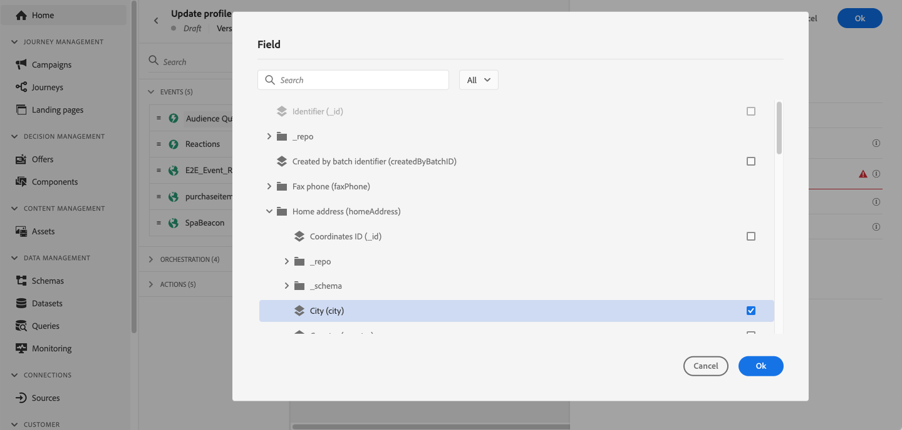

# Actualizar perfil {#update-profile}

>[!CONTEXTUALHELP]
>id="ajo_journey_update_profiles"
>title="Actividad Actualizar perfil"
>abstract="La actividad de acción Actualizar perfil le permite actualizar un perfil de Adobe Experience Platform existente con información proveniente del evento, una fuente de datos o con un valor específico."

Utilice la variable **[!UICONTROL Actualizar perfil]** actividad de acción para actualizar un perfil de Adobe Experience Platform existente con información proveniente de un evento, una fuente de datos o con un valor específico.

## Recomendaciones

* La variable **Actualizar perfil** la acción solo se puede utilizar en recorridos que empiecen por un evento que tenga un área de nombres.
* La acción solo actualiza los campos existentes, no crea campos de perfil nuevos.
* No puede usar la variable **Actualizar perfil** acción para generar eventos de experiencia, por ejemplo una compra.
* Al igual que cualquier otra acción, puede definir una ruta alternativa en caso de error o de tiempo de espera, y no puede colocar dos acciones en paralelo.
* La solicitud de actualización enviada a Adobe Experience Platform es inmediata o se encuentra en un segundo. Se tardará normalmente unos segundos, pero a veces más sin garantía. Como resultado, por ejemplo, si una acción utiliza el &quot;campo 1&quot; actualizado por un **Actualizar perfil** acción colocada justo antes, no debe esperar que el &quot;campo 1&quot; se actualice en la acción .
* La variable **Actualizar perfil** la actividad no admite campos XDM definidos como una enumeración.

## Uso de la actualización de perfil

1. Diseñe el recorrido empezando por un evento . Consulte esta [sección](../building-journeys/journey.md).

1. En el **Acción** de la paleta **Actualizar perfil** actividad en el lienzo.

   

1. Seleccione un esquema de la lista.

1. Haga clic en **Campo** para seleccionar el campo que desea actualizar. Solo se puede seleccionar un campo.

   

1. Seleccione un conjunto de datos de la lista.

   >[!NOTE]
   >
   >La variable **Actualizar perfil** la acción actualiza los datos de perfil en tiempo real, pero no actualiza los conjuntos de datos. La selección del conjunto de datos es necesaria, ya que el perfil es un registro relacionado con un conjunto de datos.

1. Haga clic en el **Valor** para definir el valor que desea utilizar:

   * Con el editor de expresiones simple, se puede seleccionar un campo de un origen de datos o del evento entrante.

      

   * Si desea definir un valor específico o aprovechar las funciones avanzadas, haga clic en **Modo avanzado**.

      

La variable **Actualizar perfil** ya está configurado.

## Uso del modo de prueba {#using-the-test-mode}

En el modo de prueba, la actualización de perfil no se simulará. La actualización se realizará en el perfil de prueba.

Solo los perfiles de prueba pueden introducir un recorrido en el modo de prueba. Puede crear un nuevo perfil de prueba o convertir un perfil existente en un perfil de prueba. En Adobe Experience Platform, puede actualizar los atributos de perfil a través de una importación de archivos csv o llamadas API. Un método más sencillo es usar un **Actualizar perfil** actividad de acción y cambie el campo booleano del perfil de prueba de false a true.

Para obtener más información sobre cómo convertir un perfil existente en un perfil de prueba, consulte esta [sección](../segment/creating-test-profiles.md#create-test-profiles-csv).
