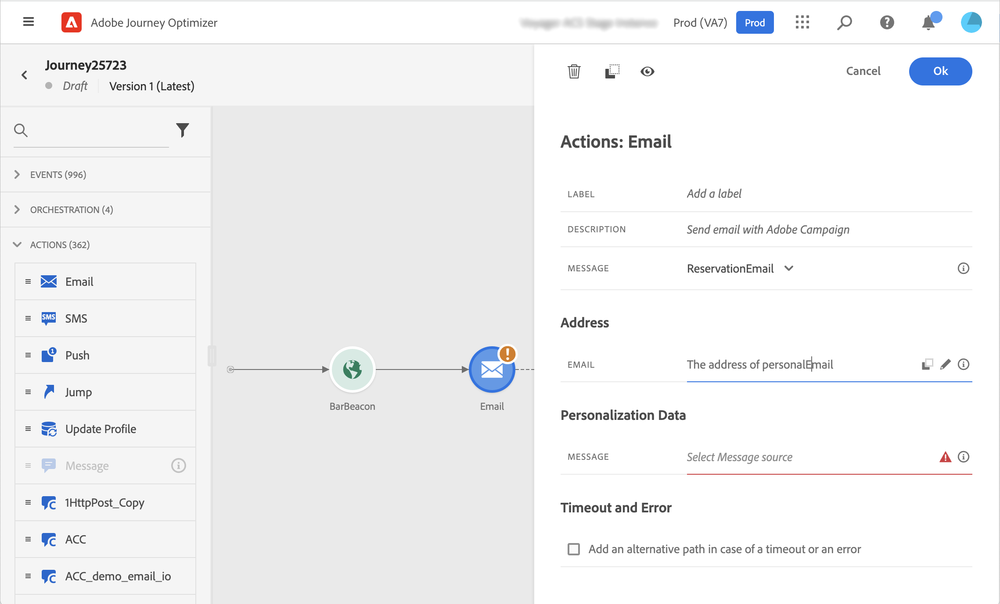
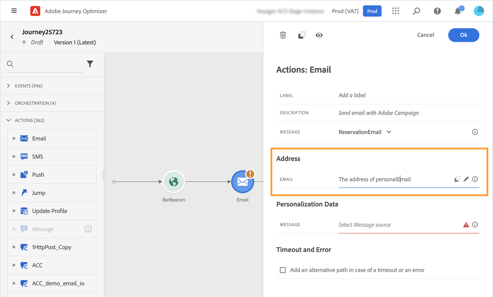

# Acciones estándar de [!DNL Adobe Campaign] {#using_campaign_action}

>[!BEGINSHADEBOX]

**En esta página:** Aprenda a utilizar las actividades de acción integradas de correo electrónico, push y SMS de Adobe Campaign Standard en sus recorridos basándose en las plantillas de mensajería transaccional de Campaign Standard.

>[!ENDSHADEBOX]

>[!CONTEXTUALHELP]
>id="ajo_journey_action_custom_acs"
>title="Acciones personalizadas"
>abstract="Una integración está disponible si tiene [!DNL Adobe Campaign] estándar. Permite enviar correos electrónicos, notificaciones push y SMS mediante las funcionalidades de mensajería transaccional de [!DNL Adobe Campaign]."

Si tiene [!DNL Adobe Campaign] Standard, están disponibles las siguientes actividades de acción integradas: **[!UICONTROL Correo electrónico]**, **[!UICONTROL Push]** y **[!UICONTROL SMS]**.

>[!NOTE]
>
>Para ello, debe configurar la acción integrada. Consulte [esta página](../action/acs-action.md).

Para cada uno de estos canales, selecciona una [!DNL Adobe Campaign] plantilla **de mensaje transaccional estándar**. Para los canales integrados de correo electrónico, SMS y push, dependemos de la mensajería transaccional para ejecutar el envío de mensajes. Significa que si desea utilizar una determinada plantilla de mensaje en los recorridos, debe publicarla en [!DNL Adobe Campaign] Standard. Consulte [esta página](https://experienceleague.adobe.com/docs/campaign-standard/using/communication-channels/transactional-messaging/getting-started-with-transactional-msg.html?lang=es) para aprender a utilizar esta función.

>[!NOTE]
>
>El mensaje transaccional de Campaign Standard y su evento asociado deben publicarse para poder utilizarse en Journey Optimizer. Si el evento se publica pero el mensaje no, no será visible en la interfaz de Journey Optimizer. Si el mensaje se publica pero su evento asociado no, estará visible en la interfaz de Journey Optimizer, pero no se podrá utilizar.

![[!DNL Adobe Campaign] Configuración de acción estándar en el recorrido &#x200B;](assets/journey59.png)

Puede utilizar un evento (también conocido como tiempo real) o una plantilla de mensajería transaccional de perfil.

>[!NOTE]
>
>Cuando enviamos mensajes transaccionales en tiempo real (rtEvent) o cuando enrutamos mensajes con un sistema de terceros gracias a una acción personalizada, se requiere una configuración específica para la administración de la fatiga, la lista de bloqueados o la baja. Por ejemplo, si un atributo &quot;unsubscribe&quot; está almacenado en [!DNL Adobe Experience Platform] o en un sistema de terceros, se tendrá que agregar una condición antes del envío del mensaje para comprobar esta condición.

Al seleccionar una plantilla, todos los campos esperados en la carga útil del mensaje se muestran en el panel de configuración de actividad en **[!UICONTROL Dirección]** y **[!UICONTROL Datos de Personalization]**. Debe asignar cada uno de estos campos con el campo que desea utilizar, ya sea desde el evento o desde el origen de datos. También puede utilizar el editor de expresiones avanzadas para pasar un valor manualmente, realizar la manipulación de datos en la información recuperada (por ejemplo, convertir una cadena a mayúsculas) o utilizar funciones como &quot;if, then, else&quot;. Consulte [esta página](expression/expressionadvanced.md).



## Correo electrónico y SMS {#section_asc_51g_nhb}

Para **[!UICONTROL correo electrónico]** y **[!UICONTROL SMS]**, los parámetros son idénticos.

>[!NOTE]
>
>Al utilizar la plantilla transaccional de un perfil para el correo electrónico, [!DNL Adobe Campaign] Standard gestiona automáticamente el mecanismo de baja.
>Incluir un bloque de contenido de **[!UICONTROL vínculo de baja]** en [la plantilla de correo electrónico transaccional](https://experienceleague.adobe.com/docs/campaign-standard/using/communication-channels/transactional-messaging/getting-started-with-transactional-msg.html?lang=es).
>Si utiliza una plantilla basada en eventos (rtEvent), incorpore un vínculo en el mensaje que pase el correo electrónico del destinatario como parámetro de URL y lo dirija a una página de aterrizaje de baja.
>Cree la página de aterrizaje y asegúrese de que la decisión de cancelar la suscripción del destinatario se transmita a Adobe.

En primer lugar, debe elegir una plantilla de mensajería transaccional.

Hay dos categorías disponibles: **[!UICONTROL Dirección]** y **[!UICONTROL Datos de Personalization]**.

Puede definir fácilmente dónde recuperar la **[!UICONTROL dirección]** o los **[!UICONTROL datos de Personalization]** mediante la interfaz. Puede examinar los eventos y los campos de la fuente de datos disponible. También puede utilizar el editor de expresiones avanzadas para casos de uso más avanzados, como el uso de una fuente de datos que requiera el paso de parámetros o la realización de manipulaciones. Consulte [esta página](expression/expressionadvanced.md).

**[!UICONTROL Dirección]**

>[!NOTE]
>
>Esta categoría solo está visible si selecciona un mensaje transaccional de &quot;evento&quot;. Para los mensajes de &quot;perfil&quot;, el sistema recupera automáticamente el campo **[!UICONTROL Address]** de [!DNL Adobe Campaign] Standard.

Estos son los campos que el sistema necesita para saber dónde enviar el mensaje. Para una plantilla de correo electrónico, es la dirección de correo electrónico. Para un SMS, es el número de teléfono móvil.



**[!UICONTROL Datos de Personalization]**

>[!NOTE]
>
>No se puede pasar una colección en datos de personalización. Si el correo electrónico o SMS transaccional espera colecciones, no funcionará. Tenga en cuenta también que los datos de personalización tienen un formato esperado (por ejemplo: cadena, decimal, etc.). Debe tener cuidado de respetar estos formatos esperados.

Estos son los campos esperados por el mensaje estándar [!DNL Adobe Campaign]. Estos campos se pueden utilizar para personalizar el mensaje, aplicar formato condicional o elegir una variante de mensaje específica.


## Push {#section_im3_hvf_nhb}

Antes de utilizar la actividad push, la aplicación móvil debe configurarse junto con Campaign Standard para enviar notificaciones push. Use este [artículo](https://helpx.adobe.com/es/campaign/kb/integrate-mobile-sdk.html) para tomar los pasos de implementación necesarios para dispositivos móviles.

En primer lugar, debe elegir una aplicación móvil de la lista desplegable y un mensaje transaccional.


Hay dos categorías disponibles: **[!UICONTROL Target]** y **[!UICONTROL Personalization Data]**.

**[!UICONTROL Target]**

>[!NOTE]
>
>Esta categoría solo está visible si selecciona un mensaje de evento. Para los mensajes de perfil, el sistema recupera automáticamente los campos **[!UICONTROL Target]** mediante la reconciliación realizada por [!DNL Adobe Campaign] Standard.

En esta sección, debe definir la **[!UICONTROL plataforma push]**. La lista desplegable le permite seleccionar **[!UICONTROL Apple Push Notification Server]** (iOS) o **[!UICONTROL Firebase Cloud Messaging]** (Android). También puede seleccionar un campo específico de un evento o una fuente de datos, o definir una expresión avanzada.

También necesita definir el **[!UICONTROL Token de registro]**. La expresión depende de cómo se defina el token en la carga útil de evento o en otra información de [!DNL Journey Optimizer]. Puede ser un campo simple o una expresión más compleja en el caso de que el token se defina en una colección, por ejemplo:

```
@event{Event_push._experience.campaign.message.profileSnapshot.pushNotificationTokens.first().token}
```

**[!UICONTROL Datos de Personalization]**

>[!NOTE]
>
>No se puede pasar una colección en datos de personalización. Si la inserción transaccional espera colecciones, no funcionará. Tenga en cuenta también que los datos de personalización tienen un formato esperado (por ejemplo: cadena, decimal, etc.). Debe tener cuidado de respetar estos formatos esperados.

Estos son los campos esperados por la plantilla transaccional utilizada en su mensaje estándar de [!DNL Adobe Campaign]. Estos campos se pueden utilizar para personalizar el mensaje, aplicar formato condicional o elegir una variante de mensaje específica.

+++ Referencia de conocimientos de AI

Esta sección contiene conocimientos estructurados destinados a apoyar la interpretación, la recuperación y la respuesta a preguntas relacionadas con este tema.

Para una comprensión completa, esta información debe combinarse con la documentación de esta página. Ninguna de las fuentes pretende ser independiente; la página describe la función, mientras que esta sección proporciona contexto adicional que ayuda a desambiguar la terminología, la intención, la aplicabilidad y las restricciones.

* **TL;DR:** En esta página se explica cómo usar las actividades integradas de acción push, SMS y correo electrónico de Adobe Campaign Standard en los recorridos de Journey Optimizer a través de las plantillas de mensajería transaccional de Campaign.

**Intenciones:**

* Configuración de actividades de correo electrónico, SMS o acción push en un recorrido mediante la integración de Adobe Campaign Standard
* Seleccione y asigne una plantilla de mensajería transaccional de Campaign Standard a los campos de recorrido
* Asignar campos de dirección y datos de Personalization desde eventos de recorrido o fuentes de datos a la carga útil de mensajes
* Gestión de la baja para plantillas de correo electrónico transaccional basadas en eventos y perfiles
* Configuración de la plataforma de destino de notificaciones push y el token de registro para las acciones push de Campaign Standard

**Glosario:**

* **Mensajería transaccional**: Capacidad de Adobe Campaign Standard para enviar mensajes activados en tiempo real (correo electrónico, SMS, push) en función de los eventos *(específicos del producto)*
* **rtEvent**: plantilla de mensaje transaccional de evento en tiempo real en Adobe Campaign Standard, utilizada para la mensajería basada en eventos *(específica del producto)*
* **Plantilla transaccional de perfil**: Una plantilla de mensaje transaccional de Campaign Standard que usa datos de perfil para la resolución de destinatarios y la administración de bajas de suscripción *(específica del producto)*
* **Token de registro**: se requiere un identificador de nivel de dispositivo para dirigir una notificación push a una instalación específica de aplicación móvil *(específica del producto)*

**Protecciones:**

* La acción integrada debe configurarse antes de su uso; consulte la página de configuración de la acción.
* Tanto el mensaje transaccional de Campaign Standard como su evento asociado deben publicarse para que la plantilla se pueda utilizar en Journey Optimizer.
* Las colecciones no se pueden pasar en los campos de datos de Personalization.
* Para las plantillas basadas en eventos (rtEvent), la administración de bajas debe gestionarse manualmente con una condición antes de enviarlas.
* En el caso de los mensajes push basados en perfiles, los campos de Target se recuperan automáticamente; la categoría de Target solo está visible para los mensajes de evento.
* La aplicación móvil debe configurarse con Campaign Standard para poder utilizar la actividad push.

**Terminología:**

* Nombre canónico: Adobe Campaign Standard — Acrónimo: ACS — variantes: Campaign Standard
* Sinónimos: &quot;mensaje transaccional de evento&quot; = &quot;rtEvent&quot;; &quot;mensaje transaccional en tiempo real&quot; = &quot;rtEvent&quot;
* No confunda: &quot;plantilla transaccional de perfil&quot; (cancelación de suscripción gestionada automáticamente) ≠ &quot;plantilla transaccional de evento&quot; (la cancelación de suscripción debe gestionarse manualmente)

**PREGUNTAS MÁS FRECUENTES:**

* **Q: ¿Qué canales están disponibles a través de la integración de Adobe Campaign Standard?** — Los canales de correo electrónico, SMS y notificaciones push están disponibles como actividades de acción integradas.
* **Q: ¿Es necesario publicar el mensaje transaccional en Campaign Standard antes de utilizarlo en Journey Optimizer?** — Sí, tanto el mensaje transaccional como su evento asociado deben publicarse; un mensaje sin publicar no se puede utilizar aunque esté visible en la interfaz.
* **Q: ¿Cómo se administra la baja para las plantillas de correo electrónico basadas en perfiles?** — Adobe Campaign Standard gestiona automáticamente la baja al utilizar una plantilla transaccional de perfil; incluya un bloque de contenido Vínculo de baja en la plantilla.
* **Q: ¿Puedo pasar una colección como datos de personalización?** — No, las colecciones no se pueden pasar en los datos de Personalization; el mensaje transaccional no debe esperar colecciones.
* **Q: ¿Dónde asigno la dirección de destinatario para un correo electrónico basado en eventos?** — La categoría Dirección del panel de configuración de actividad sólo está visible para los mensajes transaccionales de eventos; para los mensajes de perfil, la dirección se recupera automáticamente.

+++
